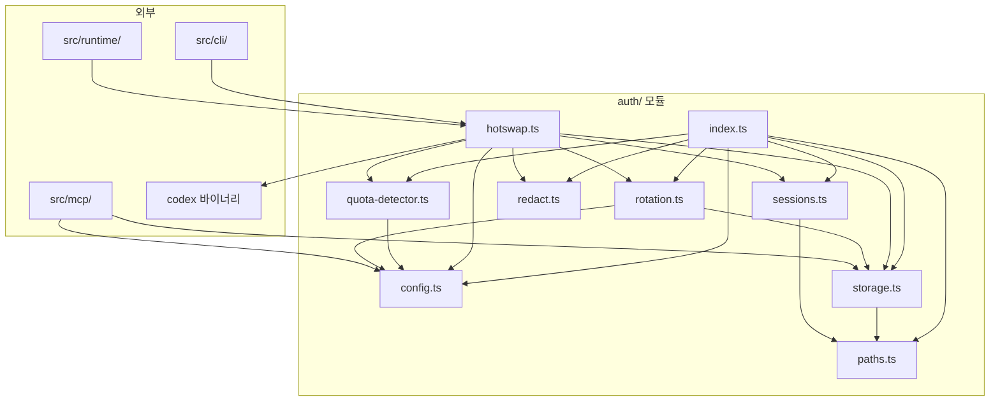
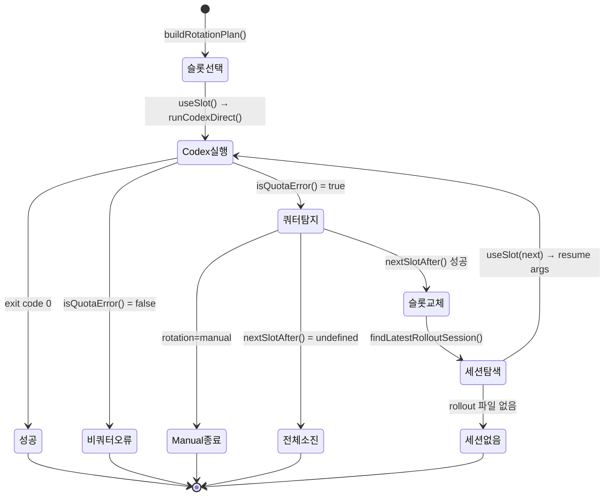

# src/auth 모듈 분석

## 폴더 구조

```
src/auth/
├── index.ts           # 전체 re-export 진입점
├── config.ts          # TOML 설정 파일 파싱 (rotation 모드·우선순위·쿼터 패턴)
├── paths.ts           # 경로 해석·보안 검증 유틸 (슬롯명 검증, 심링크 차단)
├── storage.ts         # 슬롯 CRUD·원자적 파일 쓰기·메타데이터 관리
├── rotation.ts        # 슬롯 로테이션 계획 생성·다음 슬롯 선택
├── quota-detector.ts  # Codex 종료 신호에서 쿼터/레이트리밋 오류 탐지
├── redact.ts          # 로그·에러 메시지에서 인증 비밀 정보 마스킹
├── sessions.ts        # 최신 Codex rollout 세션 탐색 (핫스왑 재개용)
├── hotswap.ts         # 핫스왑 오케스트레이터 — 쿼터 탐지·슬롯 교체·세션 재개
└── __tests__/         # 단위 테스트
```

---

## 시스템 개요

`src/auth/`는 **OMX가 여러 Codex 인증 슬롯을 관리하고, 쿼터 소진 시 자동으로 다른 슬롯으로 전환(핫스왑)하여 세션을 재개**하는 서브시스템이다.

```
[사용자: omx --hotswap ...]
        ↓
hotswap.ts ─── readAuthConfig()   → config.ts  (rotation 모드 로딩)
           ─── listSlots()        → storage.ts (슬롯 목록)
           ─── buildRotationPlan()→ rotation.ts (슬롯 순서 결정)
           ─── useSlot()          → storage.ts (슬롯 auth.json → Codex home)
           ─── runCodexDirect()   (codex 프로세스 실행)
           ↓ [쿼터 오류 발생]
           ─── isQuotaError()     → quota-detector.ts (쿼터 탐지)
           ─── markSlotQuota()    → storage.ts (소진 기록)
           ─── findLatestRolloutSession() → sessions.ts (재개 세션 ID)
           ─── nextSlotAfter()    → rotation.ts (다음 슬롯 선택)
           ─── buildResumeArgs()  (codex resume 명령 조립)
           ─── useSlot()          (새 슬롯 적용)
           ─── [재실행 루프]

오류 출력 경유: redact.ts (secrets 마스킹)
```

### 모듈 계층 구조

| 계층 | 파일 | 역할 |
|------|------|------|
| **오케스트레이터** | `hotswap.ts` | 핫스왑 전체 루프 제어 |
| **설정** | `config.ts` | TOML 설정 읽기·병합 |
| **경로/보안** | `paths.ts` | 경로 해석, 슬롯명 검증, 심링크 차단 |
| **저장소** | `storage.ts` | 슬롯 파일 CRUD, 원자적 쓰기, 메타데이터 |
| **로테이션** | `rotation.ts` | 슬롯 순서 계획, 다음 슬롯 선택 |
| **탐지** | `quota-detector.ts` | 쿼터/레이트리밋 오류 탐지 |
| **보안** | `redact.ts` | 로그 내 인증 비밀 마스킹 |
| **세션** | `sessions.ts` | Codex rollout 세션 파일 탐색 |

---

## 파일별 상세 분석

---

### `config.ts` — 인증 설정 파싱

#### 설정 우선순위 (cascade)

```
1. {cwd}/.omx/config.toml
2. {cwd}/omx.toml
3. {home}/.omx/config.toml
```

먼저 발견된 값이 우선한다 (`seen` 플래그로 중복 적용 방지).

#### 타입

```typescript
type AuthRotationMode = "round-robin" | "priority" | "manual";

interface AuthConfig {
  rotation: AuthRotationMode;  // 기본: "round-robin"
  priority: string[];          // rotation=priority 시 우선 슬롯 목록
  quotaPatterns: string[];     // 추가 쿼터 탐지 정규식
  sources: string[];           // 실제로 로딩된 설정 파일 경로
}
```

#### `readAuthConfig(cwd?, home?)`

```toml
# config.toml 에서 읽는 경로
[omx.auth]
rotation = "priority"
priority = ["slot-a", "slot-b"]
quota_patterns = ["billing.*error"]
```

- `[omx.auth]` 섹션에서만 값을 추출한다
- 파싱 오류 발생 시 해당 파일을 조용히 건너뛴다
- `quota_patterns` / `quotaPatterns` 둘 다 허용 (snake_case 호환)

---

### `paths.ts` — 경로 유틸·보안 검증

#### 슬롯 파일 레이아웃

```
{home}/.omx/auth/
├── slots.json        # AuthMetadata (현재 슬롯·슬롯 목록)
├── {slot}.json       # 각 슬롯의 Codex auth.json 복사본
└── ...
```

#### 주요 함수

```typescript
// ~/.omx/auth
resolveOmxAuthDir(home?)

// ~/.omx/auth/slots.json
resolveAuthMetadataPath(home?)

// ~/.omx/auth/{slot}.json — path traversal 방지 포함
resolveSlotPath(slot, home?)

// CODEX_HOME 또는 {cwd}/.codex, {home}/.codex
resolveLiveAuthPath(cwd?, env?, home?)
```

#### `validateSlotName(slot)` — 슬롯명 보안 검증

```
정규식: /^[A-Za-z0-9][A-Za-z0-9._-]{0,63}$/
- 길이: 1~64자
- 시작: 영숫자
- 허용: 영숫자, '.', '_', '-'
- 차단: '.', '..', path traversal (basename 검사)
```

#### 파일 시스템 보안 함수

| 함수 | 검사 내용 |
|------|----------|
| `ensurePrivateDir(dir)` | `mkdir(mode=0o700)` + 심링크 거부 + non-win32에서 `chmod 700` |
| `assertReadableFile(path, label)` | 파일 존재·읽기 가능 확인 |
| `assertNoSymlink(path, label)` | 심링크이면 예외 (ENOENT는 허용) |

권한 상수: `AUTH_DIR_MODE = 0o700`, `AUTH_FILE_MODE = 0o600`

---

### `storage.ts` — 슬롯 CRUD·원자적 파일 쓰기

#### 타입

```typescript
interface AuthSlotRecord {
  slot: string;
  createdAt: string;
  updatedAt: string;
  lastUsedAt?: string;    // useSlot() 호출 시 갱신
  lastQuotaAt?: string;   // markSlotQuota() 호출 시 갱신
  exhaustedAt?: string;   // markSlotQuota() 호출 시 기록
}

interface AuthMetadata {
  version: 1;
  currentSlot?: string;   // 마지막으로 useSlot()된 슬롯
  slots: AuthSlotRecord[]; // 알파벳 정렬
}
```

#### `atomicWriteFile(targetPath, data, options?)`

```
1. ensurePrivateDir(dir)     — 디렉터리 생성·권한 검증
2. assertNoSymlink(target)   — 심링크 차단
3. tempPath = {target}.tmp-{pid}-{timestamp}-{4바이트난수}
4. writeFile(temp, mode=0o600)
5. chmod(temp, 0o600)        — non-win32
6. beforeRename?(temp)       — 커스텀 훅
7. rename(temp → target)     — 원자적 이동
8. chmod(target, 0o600)      — non-win32
9. 실패 시 rm(temp, force)
```

#### 핵심 함수

```typescript
// 슬롯 목록 조회 (파일 존재 확인 포함)
listSlots(home?)

// live auth.json → ~/.omx/auth/{slot}.json 복사 후 메타데이터 갱신
addSlotFromAuthFile(slot, liveAuthPath, home?, now?)

// ~/.omx/auth/{slot}.json → live auth.json 복사 후 currentSlot 갱신
useSlot(slot, liveAuthPath, home?, now?)

// lastQuotaAt·exhaustedAt 기록
markSlotQuota(slot, home?, now?)

// exhaustedAt 제거
clearSlotExhaustion(slot, home?)
```

`upsertSlotRecord`: 존재하면 `updatedAt` 갱신, 없으면 생성 후 알파벳 정렬.

---

### `rotation.ts` — 슬롯 로테이션 계획

#### `buildRotationPlan(slots, config, currentSlot?)`

| `config.rotation` | 동작 |
|-------------------|------|
| `"manual"` | 현재 슬롯 하나만 반환 |
| `"priority"` | `config.priority` 순서 우선, 나머지 알파벳 |
| `"round-robin"` | 현재 슬롯부터 순환 배열 |

```typescript
interface RotationPlan {
  mode: AuthConfig["rotation"];
  order: string[];  // 시도할 슬롯 순서
}
```

**round-robin 예시** (슬롯: [a, b, c], currentSlot: b):
```
order = [b, c, a]  // 현재 슬롯부터 래핑
```

#### `nextSlotAfter(order, current, exhausted)`

`exhausted` Set에 없는 슬롯 중 `current` 다음을 반환. 순환 탐색으로 `order.length`번 시도 후 없으면 `undefined`.

---

### `quota-detector.ts` — 쿼터 오류 탐지

#### `isQuotaError(signal, config?)`

검사 대상 텍스트 = `structuredError + stderr + stdout` 합산

**기본 탐지 패턴:**

| 패턴 | 설명 |
|------|------|
| `/\b429\b/i` | HTTP 429 |
| `/\bquota\b/i` | 쿼터 언급 |
| `/rate\s*limit(?:ed|s)?/i` | 레이트리밋 |
| `/too\s+many\s+requests/i` | Too Many Requests |

**커스텀 패턴**: `config.quotaPatterns`의 각 문자열을 정규식으로 컴파일 시도, 실패하면 `includes(toLowerCase())` 폴백.

`structuredError` 객체인 경우 `status`, `type`, `message` 등을 공백 연결해서 텍스트로 변환.

---

### `redact.ts` — 인증 비밀 마스킹

#### 탐지 패턴

| 패턴 | 대상 | 변환 |
|------|------|------|
| `"access_token": "..."` | JSON OAuth 토큰 필드 | `"access_token": "[REDACTED]"` |
| `access_token: value` | 일반 토큰 할당 | `access_token: [REDACTED]` |
| `Bearer eyJ...` | Authorization 헤더 | `Bearer [REDACTED]` |
| `sk-xxxxxxxx` | OpenAI/Anthropic API 키 | `[REDACTED]` |
| `session_token: ...` | 세션·인증·API 토큰 | `[REDACTED]` |

#### `redactAuthSecrets(value)`

`Error` 인스턴스이면 `value.message`를, 그 외는 `String(value)` 변환 후 각 패턴을 순서대로 적용한다.

`hotswap.ts`에서 **모든 stderr 출력 및 에러 메시지**를 이 함수로 통과시켜 비밀 유출을 방지한다.

---

### `sessions.ts` — Codex 롤아웃 세션 탐색

#### 목적

쿼터 소진 후 새 슬롯으로 핫스왑할 때, Codex `resume <sessionId>` 명령으로 세션을 재개해야 한다. 이 파일은 **가장 최근 rollout 파일을 찾아 세션 ID를 추출**한다.

#### Codex 세션 파일 위치

```
{CODEX_HOME}/sessions/
└── YYYY/
    └── MM/
        └── DD/
            └── rollout-{sessionId}.jsonl
```

#### `findLatestRolloutSession(codexHome, fallbackHome?)`

1. `{codexHome}/sessions/` + `{fallbackHome}/.codex/sessions/` 재귀 탐색
2. `rollout-*.jsonl` 파일 수집
3. `mtime` 기준 최신 파일 선택
4. `extractRolloutSessionId()` — 파일명 → 첫 줄 JSON → basename 순서로 ID 추출

---

### `hotswap.ts` — 핫스왑 오케스트레이터

#### 핫스왑 루프 (`runAuthHotswap`)

```
초기화:
  rawArgs = argv에서 --hotswap 제거
  config = readAuthConfig()
  slots  = listSlots()
  plan   = buildRotationPlan(slots, config, metadata.currentSlot)

첫 슬롯 설정:
  useSlot(plan.order[0], liveAuthPath)
  lifecycle.preLaunch(...)

루프 (최대 plan.order.length번):
  result = runCodexDirect(codex, args, env)
  if result.status == 0 → 성공 종료

  if !isQuotaError(result) → 비쿼터 오류, 그대로 종료

  markSlotQuota(currentSlot)
  exhausted.add(currentSlot)

  if plan.mode == "manual" → 오류 출력 후 종료

  next = nextSlotAfter(plan.order, currentSlot, exhausted)
  if !next → "all slots exhausted" 후 종료

  latest = findLatestRolloutSession(codexHome)
  if !latest → rollout 없음 오류 후 종료

  useSlot(next, liveAuthPath)
  resumeArgs = buildResumeArgsWithPreservedFlags(originalArgs, latest.id)
  currentSlot = next

finally:
  lifecycle.postLaunch(...)
  lifecycle.cleanupRuntimeCodexHome(...)
```

#### `buildResumeArgsWithPreservedFlags(originalArgs, sessionId)`

원본 args에서 `["resume", sessionId, ...preserved]` 조립. 보존되는 플래그:
- `-c` / `--config[=...]`
- `--model` / `-m[=...]`
- `--dangerously-bypass-approvals-and-sandbox`

#### `HotswapLifecycle` 인터페이스

```typescript
interface HotswapLifecycle {
  prepareCodexHomeForLaunch(...)   // 임시 CODEX_HOME 준비
  preLaunch(...)                   // 세션 시작 전 훅
  postLaunch(...)                  // 세션 종료 후 훅
  cleanupRuntimeCodexHome(...)     // 임시 디렉터리 정리
  normalizeCodexLaunchArgs(...)    // args 정규화
  injectModelInstructionsBypassArgs(...)
  sessionModelInstructionsPath(...)
  resolveOmxRootForLaunch(...)
  resolveNotifyTempContract(...)
}
```

런타임 생명주기를 추상화하여 `hotswap.ts`가 Codex 프로세스 관리와 OMX 런타임 훅 양쪽에 의존하지 않도록 분리.

---

## 파일 간 의존관계

```
index.ts
  ├── config.ts
  ├── paths.ts
  ├── quota-detector.ts
  ├── redact.ts
  ├── rotation.ts
  ├── sessions.ts
  └── storage.ts

hotswap.ts
  ├── config.ts          readAuthConfig()
  ├── quota-detector.ts  isQuotaError()
  ├── redact.ts          redactAuthSecrets()
  ├── rotation.ts        buildRotationPlan(), nextSlotAfter()
  ├── sessions.ts        findLatestRolloutSession()
  └── storage.ts         listSlots(), useSlot(), markSlotQuota(), readAuthMetadata()

storage.ts
  └── paths.ts           모든 경로·보안 유틸

rotation.ts
  ├── config.ts          AuthConfig (타입만)
  └── storage.ts         AuthSlotRecord (타입만)

sessions.ts
  └── paths.ts           resolveDefaultCodexHome()

quota-detector.ts
  └── config.ts          AuthConfig (타입만)
```

### 외부 소비자

```
src/cli/              ← hotswap.ts (omx --hotswap 진입점)
src/mcp/              ← storage.ts, config.ts (MCP 인증 도구 노출)
src/runtime/          ← hotswap.ts (런타임 시작 훅)
```

---

## 호출 관계 다이어그램



---

## 핫스왑 상태 다이어그램



---

## 파일 시스템 레이아웃 (런타임)

```
{home}/
└── .omx/auth/
    ├── slots.json           # AuthMetadata { version, currentSlot, slots[] }
    ├── work.json            # 슬롯 "work"의 auth.json 복사본
    ├── personal.json        # 슬롯 "personal"의 auth.json 복사본
    └── ...

{CODEX_HOME}/               # 기본: {home}/.codex
├── auth.json               # 현재 활성 슬롯 (useSlot이 덮어씀)
└── sessions/
    └── YYYY/MM/DD/
        └── rollout-{id}.jsonl  # Codex 세션 이력
```

---

## 설계 원칙

### 1. 원자적 파일 쓰기 — TOCTOU 방지

`atomicWriteFile`은 임시 파일(`{target}.tmp-{pid}-{ts}-{random}`) 쓰기 후 `rename`으로 교체한다. PID·타임스탬프·난수를 조합해 임시 파일명 충돌을 방지하며, 실패 시 임시 파일을 강제 삭제한다.

### 2. 심링크 차단 — 파일 탈취 방지

디렉터리(`ensurePrivateDir`)와 타겟 파일(`assertNoSymlink`) 양쪽에서 심링크를 거부한다. auth.json이 심링크로 다른 경로를 가리키는 방식의 자격증명 탈취를 막는다.

### 3. 슬롯명 검증 — Path Traversal 방지

`validateSlotName`은 정규식과 `basename` 비교로 `../etc/passwd` 형태의 경로 탈출을 차단한다.

### 4. 비밀 정보 마스킹 — 로그 유출 방지

`redactAuthSecrets`가 `hotswap.ts`의 모든 stderr 출력과 에러 메시지를 통과하므로 토큰·API 키가 터미널에 출력되지 않는다.

### 5. 설정 Cascade — 로컬 우선 병합

`config.ts`는 `cwd/.omx/config.toml` → `cwd/omx.toml` → `home/.omx/config.toml` 순서로 탐색하며, `seen` 플래그로 각 항목을 처음 발견한 값으로 고정한다.

### 6. `HotswapLifecycle` 추상화 — 의존성 역전

`hotswap.ts`는 OMX 런타임의 구체적 구현(`preLaunch`, `postLaunch` 등)을 `HotswapLifecycle` 인터페이스로 주입받아 런타임 코어와 독립적으로 테스트·교체 가능하다.

### 7. 재개 일관성 — 세션 연속성 보장

쿼터 교체 시 Codex `resume <sessionId>` 명령을 생성하고 원본 플래그(`--model`, `--config` 등)만 보존하여 세션 컨텍스트를 최대한 유지한다.
