# oh-my-codex-js 의존성 & 표면 분석 지도
이 문서는 `oh-my-codex-js`의 소스, 프롬프트, 스킬, 플러그인, MCP 연결을 한 눈에 추적할 수 있는 정적 분석 지도를 남기는 것을 목표로 한다.

사전 준비 작업 : 이 문서 하단의 기술용어 목록과 MCP 공식 규격 섹션을 먼저 읽는 것을 권장한다. 

소스 위치: `d:\workspace\ite-ai-codex-js\`

분석 기준:
- `package.json`
- `src/index.ts`
- `src/cli/index.ts`
- `src/catalog/manifest.json`
- `prompts/` 역할 프롬프트 목록
- `skills/` 루트 스킬 카탈로그
- `plugins/oh-my-codex/` 플러그인 번들
- `plugins/oh-my-codex/.codex-plugin/plugin.json`
- `plugins/oh-my-codex/.mcp.json`
- 대표 `SKILL.md` 파일들(`doctor`, `team`, `autopilot`, `visual-ralph`, `wiki`, `deep-interview`)

> 목적: `oh-my-codex-js`의 소스, 프롬프트, 스킬, 플러그인, MCP 연결을 한 눈에 추적할 수 있는 정적 분석 지도를 남기는 것.

## 문서 경계 (2026-05 최신화)

- 이 문서는 **Codex/OMX 실행 계층**(CLI, hooks, AGENTS 오버레이, MCP, team runtime)을 다룬다.
- Desktop 앱의 `llm_gateway_invoke` 경로에서 동작하는 **ChatGPT/OpenAI provider**는 별도 문서로 분리한다.
- 분리 문서: `한글해석-분석본/설명문서/dependency-map-desktop-chatgpt-openai.md`
- Codex 전용 상세 문서: `한글해석-분석본/설명문서/dependency-map-use-codex.md`

### 빠른 구분

| 구분 | 주 책임 | 대표 경로 |
|---|---|---|
| Codex/OMX 계층 | setup, config.toml, hooks, team worker launch, goal sync | `src/cli/*`, `src/config/*`, `src/hooks/*`, `src/team/*`, `src/goal-workflows/*` |
| Desktop LLM 계층 | renderer free-text → ipc → llm gateway provider(openai/chatgpt/mock-*) | `desktop/renderer/*`, `desktop/ipc/commands.ts`, `desktop/main/index.ts` |

## 전체목차

- [oh-my-codex-js 의존성 \& 표면 분석 지도](#oh-my-codex-js-의존성--표면-분석-지도)
  - [문서 경계 (2026-05 최신화)](#문서-경계-2026-05-최신화)
    - [빠른 구분](#빠른-구분)
  - [전체목차](#전체목차)
  - [1. 개요](#1-개요)
    - [1.1 MCP 공식 규격 기준](#11-mcp-공식-규격-기준)
  - [2. 최상위 구조](#2-최상위-구조)
    - [2.1 MCP 구성요소와 실행 흐름](#21-mcp-구성요소와-실행-흐름)
    - [2.2 Resources](#22-resources)
    - [2.3 Prompts](#23-prompts)
    - [2.4 Tools](#24-tools)
      - [2.4.1 initialize / capability 협상](#241-initialize--capability-협상)
      - [2.4.2 list 계열](#242-list-계열)
      - [2.4.3 call / read / get 계열](#243-call--read--get-계열)
      - [2.4.4 progress / logging](#244-progress--logging)
    - [2.5 이 저장소에 붙는 해석](#25-이-저장소에-붙는-해석)
  - [3. 패키지 수준 의존성](#3-패키지-수준-의존성)
    - [3.1 진입점](#31-진입점)
    - [3.2 주요 스크립트](#32-주요-스크립트)
    - [3.3 의존성 특징](#33-의존성-특징)
  - [4. `src/` 전체 구조](#4-src-전체-구조)
  - [5. CLI 표면 분석](#5-cli-표면-분석)
    - [5.1 메인 디스패처](#51-메인-디스패처)
    - [5.2 CLI의 결합축](#52-cli의-결합축)
    - [5.3 CLI가 의미하는 것](#53-cli가-의미하는-것)
    - [5.4 CLI 의존성 요약표](#54-cli-의존성-요약표)
      - [CLI 재분석 요점](#cli-재분석-요점)
    - [5.5 CLI 운영 3축표 (입력/상태/부작용)](#55-cli-운영-3축표-입력상태부작용)
      - [3축 해석 가이드](#3축-해석-가이드)
  - [6. 프롬프트 표면 분석 (`prompts/`)](#6-프롬프트-표면-분석-prompts)
    - [6.1 구조](#61-구조)
    - [6.2 역할 분류](#62-역할-분류)
    - [6.3 로드/라우팅 의미](#63-로드라우팅-의미)
    - [6.4 관찰 포인트](#64-관찰-포인트)
  - [7. `skills/` 루트 카탈로그 분석](#7-skills-루트-카탈로그-분석)
    - [7.1 구조](#71-구조)
    - [7.2 manifest 관점의 상태](#72-manifest-관점의-상태)
    - [7.3 카테고리 요약](#73-카테고리-요약)
      - [execution](#execution)
      - [planning](#planning)
      - [shortcut / review / utility / domain](#shortcut--review--utility--domain)
      - [build / product / coordination / research](#build--product--coordination--research)
    - [7.4 중요한 관찰](#74-중요한-관찰)
  - [8. 플러그인 표면 분석 (`plugins/oh-my-codex/`)](#8-플러그인-표면-분석-pluginsoh-my-codex)
    - [8.1 플러그인 매니페스트](#81-플러그인-매니페스트)
      - [`plugin.json`의 의미](#pluginjson의-의미)
    - [8.2 플러그인 MCP 서버](#82-플러그인-mcp-서버)
    - [8.3 플러그인 스킬 번들](#83-플러그인-스킬-번들)
    - [8.4 플러그인 번들의 역할](#84-플러그인-번들의-역할)
    - [8.5 플러그인 파일 단위 의존성 표](#85-플러그인-파일-단위-의존성-표)
      - [플러그인 재분석 요점](#플러그인-재분석-요점)
    - [8.6 스킬 의존성 요약표 (26개)](#86-스킬-의존성-요약표-26개)
      - [스킬 표준화 규칙](#스킬-표준화-규칙)
    - [8.7 스킬 호출 트리 (26개, Mermaid)](#87-스킬-호출-트리-26개-mermaid)
      - [1) ai-slop-cleaner](#1-ai-slop-cleaner)
      - [2) analyze](#2-analyze)
      - [3) ask](#3-ask)
      - [4) autopilot](#4-autopilot)
      - [5) autoresearch](#5-autoresearch)
      - [6) autoresearch-goal](#6-autoresearch-goal)
      - [7) cancel](#7-cancel)
      - [8) code-review](#8-code-review)
      - [9) configure-notifications](#9-configure-notifications)
      - [10) deep-interview](#10-deep-interview)
      - [11) doctor](#11-doctor)
      - [12) hud](#12-hud)
      - [13) omx-setup](#13-omx-setup)
      - [14) performance-goal](#14-performance-goal)
      - [15) pipeline](#15-pipeline)
      - [16) plan](#16-plan)
      - [17) ralph](#17-ralph)
      - [18) ralplan](#18-ralplan)
      - [19) skill](#19-skill)
      - [20) team](#20-team)
      - [21) ultragoal](#21-ultragoal)
      - [22) ultraqa](#22-ultraqa)
      - [23) ultrawork](#23-ultrawork)
      - [24) visual-ralph](#24-visual-ralph)
      - [25) wiki](#25-wiki)
      - [26) worker](#26-worker)
  - [9. `src/catalog/`와 `plugins/oh-my-codex/skills/`의 관계](#9-srccatalog와-pluginsoh-my-codexskills의-관계)
    - [의미](#의미)
    - [핵심 위험](#핵심-위험)
  - [10. 런타임 흐름도](#10-런타임-흐름도)
    - [10.1 설치 / 부트스트랩](#101-설치--부트스트랩)
    - [10.2 세션 시작](#102-세션-시작)
    - [10.3 스킬/프롬프트 라우팅](#103-스킬프롬프트-라우팅)
    - [10.4 팀 실행 흐름](#104-팀-실행-흐름)
    - [10.5 goal 워크플로우 흐름](#105-goal-워크플로우-흐름)
  - [11. 핵심 결합점](#11-핵심-결합점)
    - [11.1 CLI ↔ hooks ↔ prompts](#111-cli--hooks--prompts)
    - [11.2 CLI ↔ config ↔ MCP](#112-cli--config--mcp)
    - [11.3 team ↔ state ↔ MCP](#113-team--state--mcp)
    - [11.4 catalog ↔ plugin mirror](#114-catalog--plugin-mirror)
    - [11.5 docs ↔ runtime contract](#115-docs--runtime-contract)
  - [12. 위험/주의 사항](#12-위험주의-사항)
    - [12.1 이중 표면 문제](#121-이중-표면-문제)
    - [12.2 미러 불일치](#122-미러-불일치)
    - [12.3 설치 모드 분기](#123-설치-모드-분기)
    - [12.4 role-file overload](#124-role-file-overload)
  - [13. 실무적으로 중요한 파일들](#13-실무적으로-중요한-파일들)
  - [14. 결론](#14-결론)
  - [15. 한국어 용어 정리](#15-한국어-용어-정리)
    - [읽기 기준](#읽기-기준)
  - [16. 기술용어정리](#16-기술용어정리)
    - [빠른 읽기 팁](#빠른-읽기-팁)


## 1. 개요

`oh-my-codex-js`는 OpenAI Codex CLI를 위한 멀티 에이전트 오케스트레이션 레이어다. 핵심은 다음 4개다.

- CLI 런타임: `omx` 명령으로 setup, doctor, team, ralph, ultragoal, autoresearch, mcp-serve 등을 조율
- 프롬프트 표면: `prompts/*.md`와 `prompts/*-ko.md`로 역할 프롬프트를 제공
- 스킬 표면: `skills/`와 `plugins/oh-my-codex/skills/`에 skill-based workflow surface 제공
- 상태/연계 표면: MCP 서버, Codex hooks, 팀 런타임, 카탈로그/매니페스트 동기화


### 1.1 MCP 공식 규격 기준

Anthropic MCP의 최소 흐름은 `initialize`와 capability 협상, `initialized` 이후의 기능 사용 가능 상태 전환, 그리고 `tools/list`, `resources/list`, `prompts/list`로 카탈로그를 확보한 뒤 `tools/call`, `resources/read`, `prompts/get`으로 실제 작업을 수행하는 순서다.

이 저장소에서는 이 규약을 `src/mcp/*`, `src/cli/mcp-serve.ts`, `plugins/oh-my-codex/.mcp.json`가 받치고 있으며, tools/resources/prompts를 분리된 표면으로 유지해 Host가 필요한 순간에만 읽도록 맞춘다.

## 2. 최상위 구조

| 경로 | 역할 | 해석 |
|---|---|---|
| `package.json` | 패키지 메타/스크립트/배포 파일 목록 | CLI, Rust, plugin sync, test/verify가 하나의 패키지에 함께 묶여 있음 |
| `src/` | TypeScript 소스 본체 | 실행 로직, 설정 생성, 상태 관리, hooks, MCP, team, runtime, verification |
| `prompts/` | 역할 프롬프트 | Codex 역할별 페르소나/오케스트레이션 안내문 |
| `skills/` | 루트 스킬 카탈로그 | 활성/비활성/alias/merged/deprecated 스킬의 소스 표면 |
| `plugins/oh-my-codex/` | 배포용 플러그인 번들 | Codex plugin metadata, MCP registry, packaged skills |
| `templates/` | 설치/가이드 템플릿 | AGENTS, prompt guidance, docs scaffold |
| `docs/` | 사용자/개발 문서 | contracts, guide schema, release notes, feature docs |
| `crates/` | Rust 네이티브 컴포넌트 | explore/mux/runtime/sparkshell 계열의 native harness |

### 2.1 MCP 구성요소와 실행 흐름

이 저장소에서 MCP는 단순한 서버 목록이 아니라, 카탈로그 확보, 실행, 복구를 나누는 표준 연결면이다.

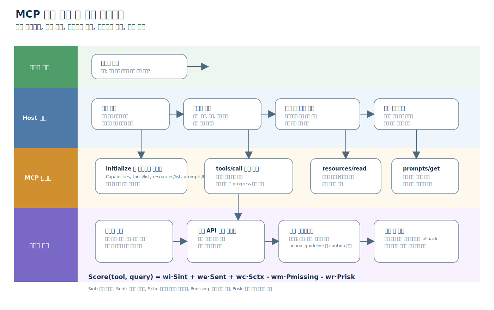

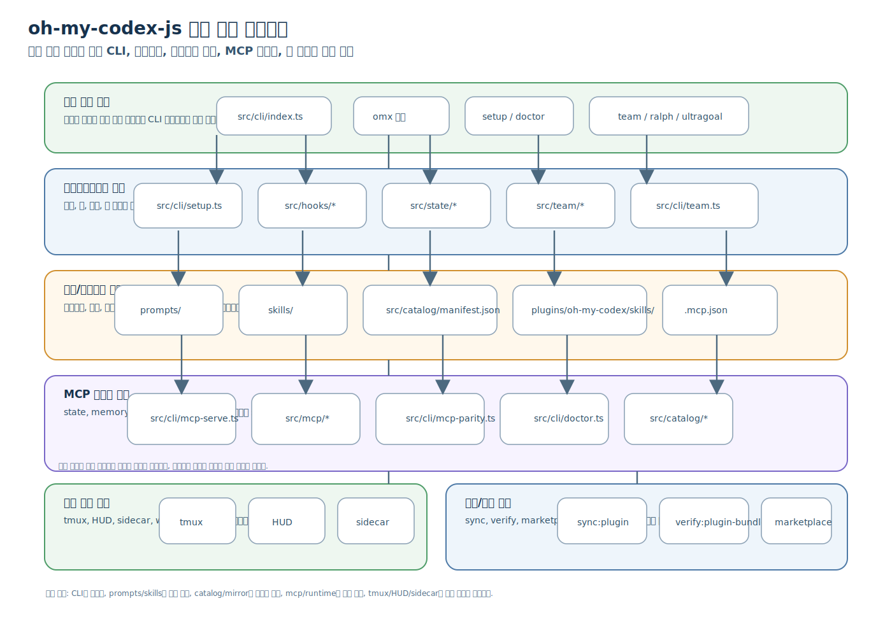

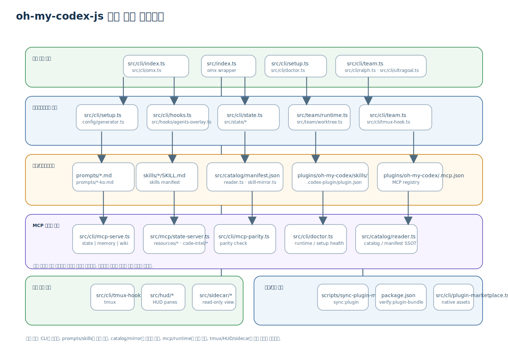

| MCP 구성요소 | 의미 | 이 저장소의 연결점 |
|---|---|---|
| `initialize` / capability 협상 | 서버가 어떤 기능을 제공하는지 먼저 합의함 | `src/cli/mcp-serve.ts`, `src/mcp/*` |
| `tools/list` | 사용할 도구 카탈로그를 노출함 | `plugins/oh-my-codex/.mcp.json`, `src/catalog/*` |
| `resources/list` | 읽기 전용/동적 리소스를 나열함 | `src/mcp/resources/*`, `src/state/*` |
| `prompts/list` | 재사용 가능한 프롬프트 템플릿을 노출함 | `prompts/`, `plugins/oh-my-codex/skills/` |
| `tools/call` | 실제 실행 작업을 수행함 | `src/cli/mcp-serve.ts`, `src/cli/mcp-parity.ts` |
| `resources/read` | 필요한 근거 자료를 읽음 | `src/mcp/resources/*`, `docs/` |
| `prompts/get` | 상황 맞춤 지시 템플릿을 가져옴 | `prompts/*.md` |
| progress / logging | 장기 실행 상태를 사용자에게 알려줌 | `src/runtime/*`, `src/hooks/*` |

### 2.2 Resources

Resources는 LLM이 필요할 때 읽는 정적 또는 동적 참고 데이터다. 이 저장소에서는 기준 문서, 상태 파일, 보고서 같은 읽기 전용 표면을 여기에 대응시켜 이해하면 된다.

| 항목 | 문서에서의 의미 | 이 저장소의 해석 |
|---|---|---|
| Resources | 읽기 전용 또는 동적 참고 데이터 | 자주 읽는 기준 자료, 보고서, 경로별 상태 |
| Roots | 허용된 작업 범위 | 서버가 접근 가능한 로컬/분석 경로 |
| Sampling | Host를 통한 재추론 요청 | 긴 요약, 비교 설명, 재서술 |

### 2.3 Prompts

Prompts는 반복 태스크를 위한 서버 제공 템플릿이다. 이 저장소에서는 역할 프롬프트와 복구용 안내문, 설명 생성용 템플릿으로 읽으면 된다.

| 항목 | 문서에서의 의미 | 이 저장소의 해석 |
|---|---|---|
| Prompts | 반복 태스크용 템플릿 | 역할 프롬프트, 복구 대화, 설명 생성 |
| Logging | 구조화된 실행 기록 | 호출 성공/실패, 지연, fallback 이유 |
| Progress | 장기 작업 상태 전달 | 배치 작업, 대기형 계산, 다단계 호출 |

### 2.4 Tools

Tools는 실제 외부 API 호출 또는 프로그램 실행을 담당하는 동적 엔티티다. 이 저장소에서는 `mcp-serve`와 `mcp-parity`를 포함한 실행 경로와 연결해 보면 이해가 쉽다.

#### 2.4.1 initialize / capability 협상

| 항목 | 문서에서의 의미 | 이 저장소의 해석 |
|---|---|---|
| `initialize` / capability 협상 | 서버가 어떤 기능을 제공하는지 먼저 합의함 | `src/cli/mcp-serve.ts`, `src/mcp/*` |

#### 2.4.2 list 계열

| 항목 | 문서에서의 의미 | 이 저장소의 해석 |
|---|---|---|
| `tools/list` | 사용할 도구 카탈로그를 노출함 | `plugins/oh-my-codex/.mcp.json`, `src/catalog/*` |
| `resources/list` | 읽기 전용/동적 리소스를 나열함 | `src/mcp/resources/*`, `src/state/*` |
| `prompts/list` | 재사용 가능한 프롬프트 템플릿을 노출함 | `prompts/`, `plugins/oh-my-codex/skills/` |

#### 2.4.3 call / read / get 계열

| 항목 | 문서에서의 의미 | 이 저장소의 해석 |
|---|---|---|
| `tools/call` | 실제 실행 작업을 수행함 | `src/cli/mcp-serve.ts`, `src/cli/mcp-parity.ts` |
| `resources/read` | 필요한 근거 자료를 읽음 | `src/mcp/resources/*`, `docs/` |
| `prompts/get` | 상황 맞춤 지시 템플릿을 가져옴 | `prompts/*.md` |

#### 2.4.4 progress / logging

| 항목 | 문서에서의 의미 | 이 저장소의 해석 |
|---|---|---|
| progress / logging | 장기 실행 상태를 사용자에게 알려줌 | `src/runtime/*`, `src/hooks/*` |


### 2.5 이 저장소에 붙는 해석

| 해석 대상 | 연결 파일 | 한 줄 설명 |
|---|---|---|
| MCP 서버 노출 | `src/cli/mcp-serve.ts` | `omx mcp-serve`로 stdio 서버를 연다 |
| MCP 준비 상태 | `src/cli/doctor.ts` | 설치와 런타임 상태를 확인한다 |
| MCP 등록 원본 | `plugins/oh-my-codex/.mcp.json` | 플러그인 단위 서버 레지스트리다 |
| 카탈로그 기준 | `src/catalog/manifest.json` | 스킬/에이전트의 SSOT 역할을 한다 |
| 도구 파이프라인 | `src/mcp/*` | state, memory, wiki, trace 같은 서버 구현을 담는다 |
| 실행 보조 | `src/hooks/*`, `src/runtime/*` | 로깅, progress, 복구 흐름을 받친다 |


## 3. 패키지 수준 의존성

### 3.1 진입점

| 진입점 | 파일 | 의미 |
|---|---|---|
| CLI binary | `bin.omx -> dist/cli/omx.js` | 외부에서 실행하는 핵심 명령 진입점 |
| library export | `main -> dist/index.js` | setup/doctor/config merge/agent metadata/hud export |

### 3.2 주요 스크립트

`package.json` 기준으로 이 저장소는 빌드·검증·동기화가 분리되어 있다.

- `build`: TypeScript compile 후 실행 파일 권한 조정
- `build:full`: TS build + Rust explore harness + sparkshell build
- `sync:plugin`: 루트 카탈로그를 plugin bundle로 미러링
- `verify:plugin-bundle`: plugin bundle과 catalog SSOT 정합성 검증
- `verify:native-agents`: native agent TOML 검증
- `prompt:inventory`: 프롬프트/역할 인벤토리 출력

### 3.3 의존성 특징

- JS/TS 런타임: Node.js 20+
- 타입/검증: TypeScript, Zod, `@modelcontextprotocol/sdk`
- 포맷/린트: Biome
- 네이티브 보조: Rust workspace + Cargo


## 4. `src/` 전체 구조

`src/`는 기능 기준으로 잘 분해되어 있다. 아래 표는 현재 트리의 큰 경계만 보여준다.

| 하위 폴더 | 핵심 책임 | 결합점 |
|---|---|---|
| `src/cli/` | 모든 `omx` 하위 명령 디스패치 | `setup`, `doctor`, `team`, `ralph`, `ultragoal`, `question`, `ask`, `mcp-serve` |
| `src/agents/` | native agent 정의 및 TOML 생성 | `AGENT_DEFINITIONS`, `native-config.ts` |
| `src/team/` | **tmux** 기반 worker orchestration, task/state/role routing | team state, worker bootstrap, DAG/role policy |
| `src/hooks/` | Codex hook, prompt guidance, keyword detection | session overlays, hook events, triage |
| `src/mcp/` | state/memory/code-intel/trace/wiki MCP 서버 | `.mcp.json`와 직접 연결 |
| `src/catalog/` | skill/agent catalog SSOT와 mirror sync | `manifest.json`, `reader.ts`, `skill-mirror.ts` |
| `src/config/` | codex hooks, MCP registry, config synthesis | `setup.ts`가 가장 강하게 의존 |
| `src/state/` | skill-active / workflow transition / mode context | runtime state machine |
| `src/runtime/` | run-loop / outcome / bridge / process tree | Codex 실행 프레임 |
| `src/question/` | 질문/인터뷰 UI 및 상태 | deep-interview, question flow |
| `src/ralph/`, `src/ralplan/` | 장기 실행 루프 / 계획 루프 | autopilot/ralph/workflow control |
| `src/ultragoal/` | goal handoff/summary artifacts | durable multi-goal planning |
| `src/autoresearch/` | research mission scaffolding | intake/spec artifact flow |
| `src/performance-goal/` | 성능 목표/검증 흐름 | evaluator-backed goaling |
| `src/adapt/` | 외부 대상 적응/계약 정의 | adapter scaffolding |
| `src/sidecar/` | read-only visualization / tmux sidecar | team visualization |
| `src/hud/` | HUD / status line 렌더링 | tmux HUD panes |
| `src/session-history/` | transcript 검색 | `session search` |
| `src/scripts/` | build/verify/sync automation | plugin mirror, native agents, release checks |
| `src/verification/` | release/compat/feature gating 검증 | CI/contract tests |
| `src/utils/` | 공통 경로/패키지/프로세스 도우미 | 거의 모든 상위 모듈에서 재사용 |
| `src/wiki/` | repo wiki persistence/search/lint | `omx wiki` |
| `src/visual/` | visual verdict / rendering support | visual workflows |
| `src/exec/` | follow-up command execution | injected continuation flows |
| `src/notifications/` | temporary notification contracts | Slack/Discord/Telegram routing |
| `src/imagegen/` | continuation / image-generation orchestration | visual/continuation flows |
| `src/modes/` | mode management | runtime state overlays |
| `src/planning/` | planning artifacts | PRD/test-spec style handoffs |
| `src/pipeline/` | pipeline orchestration | staged workflows |
| `src/subagents/` | subagent tracking | internal task tracking |
| `src/compat/` | legacy/compat layers | migration safety |

*tmux* : tmux는 'Terminal Multiplexer'(터미널 멀티플렉서)의 약자로, 하나의 터미널 창(또는 SSH 세션) 안에서 여러 개의 독립된 터미널 세션을 생성하고 관리할 수 있게 해주는 도구입니다. `oh-my-codex-js`에서는 tmux를 활용하여 여러 에이전트(worker)가 동시에 실행될 수 있는 환경을 구축하고, 각 에이전트가 자신의 작업을 수행할 수 있도록 지원합니다. 쉽게 비유하자면, 터미널을 위한 '가상 데스크톱'이나 '브라우저 탭' 같은 것이다.


## 5. CLI 표면 분석

### 5.1 메인 디스패처

`src/cli/index.ts`는 런타임의 중심이다.

- `setup`, `doctor`, `version`, `agents`, `hooks`, `hud`, `sidecar`, `team`, `ralph`, `ultragoal`, `performance-goal`, `autoresearch-goal`
- `ask`, `question`, `state`, `cleanup`, `explore`, `sparkshell`, `session`, `mcp-serve`, `mcp-parity`
- `adapt`, `list`, `uninstall`, `update`

이 파일은 단순한 명령 모음이 아니라 다음을 모두 다룬다.

- Codex launch 경로
- tmux / HUD / sidecar 연동
- 설치 모드 선택(legacy vs plugin)
- team/session/goal state file 관리
- hooks 및 prompt guidance 준비

### 5.2 CLI의 결합축

- `setup.ts` -> `config/generator.ts`, `config/codex-hooks.ts`, `mcp-registry.ts`
- `team.ts` -> `team/runtime.ts`, `team/tmux-session.ts`, `team/worktree.ts`, `team/state/*`
- `hooks.ts` / `tmux-hook.ts` -> Codex hook event 처리
- `doctor.ts` -> 설치/런타임/스킬/AGENTS 상태 진단

### 5.3 CLI가 의미하는 것

이 저장소에서 CLI는 “사용자 명령”만이 아니라 “런타임 상태 전환기”다. 즉:

1. 설정을 만들고
2. hook과 MCP를 등록하고
3. 역할 프롬프트를 주입하고
4. 팀/goal/state/trace 흐름을 이어주는

운영 계층이다.

### 5.4 CLI 의존성 요약표

아래 표는 `src/cli/`에서 실제로 런타임 경계를 만드는 파일들을 중심으로 정리한 것이다. 단순 진입점이 아니라, 설정·팀 실행·프롬프트·MCP·내장 바이너리 경로가 서로 맞물린다.

| 파일 | 핵심 역할 | 주요 의존 파일/모듈 | 비고 |
|---|---|---|---|
| `src/cli/index.ts` | 메인 디스패처와 실행 정책 조율 | `setup.ts`, `team.ts`, `hooks.ts`, `state.ts`, `mcp-serve.ts`, `explore.ts`, `sparkshell.ts`, `agents.ts`, `cleanup.ts`, `update.ts`, `uninstall.ts` | `omx`의 최상위 진입점 |
| `src/cli/setup.ts` | 설치/동기화/스코프 생성 | `../config/generator.ts`, `../config/mcp-registry.ts`, `../agents/native-config.ts`, `./setup-preferences.ts`, `./plugin-marketplace.ts`, `../catalog/reader.ts` | skills/prompts/AGENTS/플러그인 설치를 함께 다룸 |
| `src/cli/team.ts` | tmux 기반 팀 실행 | `../team/runtime.ts`, `../team/worktree.ts`, `../team/state/*`, `../team/role-router.ts`, `../planning/artifacts.ts`, `../hooks/task-size-detector.ts` | worker pane, task decomposition, follow-up 정책 결합 |
| `src/cli/hooks.ts` | Codex hook 플러그인 상태/검증 | `../hooks/extensibility/*`, `../hooks/agents-overlay.ts` | hook 라우팅 계약의 CLI 표면 |
| `src/cli/tmux-hook.ts` | tmux 우회/보정 훅 | `../team/tmux-session.ts`, `../hooks/extensibility/*` | prompt injection workaround |
| `src/cli/doctor.ts` | 설치/환경/런타임 진단 | `../config/*`, `../mcp/*`, `../hooks/*`, `./explore.ts`, `./sparkshell.ts` | health check 중심 |
| `src/cli/explore.ts` | 읽기 전용 탐색/하네스 선택 | `./sparkshell.ts`, `../wiki/*`, `../utils/*`, `../config/*` | native harness / repo-built harness 분기 |
| `src/cli/sparkshell.ts` | native sparkshell 경로 결의 | `../utils/paths.js`, `./native-assets.ts`, `../config/models.js` | 플랫폼별 바이너리 경로가 핵심 |
| `src/cli/mcp-serve.ts` | MCP stdio 서버 노출 | `../mcp/*`, `../catalog/*`, `../state/*` | plugin/runtime 둘 다에서 사용 |
| `src/cli/agents.ts` | native agent TOML/정책 | `../agents/*`, `../catalog/*`, `./catalog-contract.ts` | agents-init와 함께 사용 |
| `src/cli/agents-init.ts` | AGENTS.md 부트스트랩 | `./setup.ts`, `../utils/agents-md.js`, `../catalog/reader.js` | 경로 재작성 포함 |
| `src/cli/ask.ts` | 로컬 provider 질의 | `./question.ts`, `../planning/artifacts.ts`, `../utils/*` | 질문/응답 아티팩트 생성 |
| `src/cli/question.ts` | blocking question UI | `../question/*`, `../hooks/*` | agent-invoked user question |
| `src/cli/ralph.ts` | 지속형 ralph 실행 | `../ralph/*`, `../state/*`, `../hooks/*` | persistence mode 진입점 |
| `src/cli/ultragoal.ts` | 장기 goal workflow | `../ultragoal/*`, `../planning/artifacts.ts` | durable goal artifacts |
| `src/cli/performance-goal.ts` | evaluator-backed goal | `../performance-goal/*`, `../verification/*` | 성능 검증 경로 |
| `src/cli/autoresearch.ts` | deprecated research 런처 | `../autoresearch/*`, `./autoresearch-guided.ts` | 하위 호환/경고 표면 |
| `src/cli/autoresearch-goal.ts` | research goal handoff | `../autoresearch/*`, `../planning/artifacts.ts` | 새로운 연구 goal 표면 |
| `src/cli/autoresearch-guided.ts` | deep interview prompt builder | `./autoresearch-intake.ts`, `./question.ts`, `../prompts/*` | 안내형 연구 플로우 |
| `src/cli/autoresearch-intake.ts` | 연구 아티팩트 구성 | `../planning/artifacts.ts`, `../question/*` | mission/spec draft 생성 |
| `src/cli/session-search.ts` | 세션 transcript 검색 | `../session-history/*`, `../utils/*` | 과거 세션 탐색 |
| `src/cli/state.ts` | 모드 state 읽기/쓰기 | `../modes/base.ts`, `../mcp/state-paths.ts` | persisted state 중심 |
| `src/cli/list.ts` | packaged skill/agent 목록 | `../catalog/*`, `./catalog-contract.ts` | inventory surface |
| `src/cli/update.ts` | npm/update refresh | `./setup.ts`, `./version.ts`, `../utils/*` | 설치 갱신/재설정 |
| `src/cli/uninstall.ts` | 제거/정리 | `../config/*`, `../utils/*`, `./cleanup.ts` | legacy/plugin 정리 |
| `src/cli/cleanup.ts` | 고아(Orphan) MCP 프로세스 정리(Garbage Collection) | `../utils/platform-command.ts`, `../mcp/*` | 프로세스 트리 정리 |
| `src/cli/version.ts` | 버전 출력 | `../utils/package.js` | 최소 기능 진입점 |
| `src/cli/plugin-marketplace.ts` | local marketplace 등록 | `../config/generator.ts`, `../utils/paths.js` | plugin setup과 결합 |
| `src/cli/catalog-contract.ts` | 카탈로그 기대치 요약 | `../catalog/reader.ts`, `../catalog/manifest.json` | sync/verify 기준 |
| `src/cli/native-assets.ts` | native binary 해석 | `../utils/package.js`, `../utils/paths.js` | explore/sparkshell 경로 결정 |
| `src/cli/adapt.ts` | 외부 대상 적응 워크플로우 진입점 | `../adapt/*`, `../planning/artifacts.ts` | adapter scaffold 표면 |
| `src/cli/omx.ts` | CLI 래퍼/엔트리 레이어 | `./index.ts`, `../utils/*` | 실행 파일 바인딩 축 |
| `src/cli/constants.ts` | 공통 플래그 상수 | `index.ts`, `setup.ts`, `team.ts` | 플래그 해석의 단일 기준 |
| `src/cli/codex-home.ts` | codex home/config 경로 결의 | `./setup-preferences.ts`, `../utils/paths.js` | launch 경로 안정화 |
| `src/cli/mcp-parity.ts` | MCP parity CLI 브리지 | `./mcp-serve.ts`, `../mcp/*` | parity check 표면 |
| `src/cli/setup-preferences.ts` | setup scope/mode 영속 설정 | `setup.ts`, `index.ts`, `codex-home.ts` | user/project, legacy/plugin 기준 |
| `src/cli/star-prompt.ts` | GitHub star 프롬프트 제어 | `index.ts`, `update.ts` | UX/프로모션 보조 흐름 |

#### CLI 재분석 요점

- `index.ts`는 단순 switch가 아니라, 설치 모드/세션 상태/launch policy를 함께 정하는 오케스트레이터다.
- `setup.ts`는 `skills`, `prompts`, `AGENTS.md`, `MCP`, `plugin marketplace`를 동시에 맞추는 가장 강한 결합점이다.
- `team.ts`는 텍스트 처리보다 `tmux`, `state`, `role routing`, `approved execution`까지 포함하는 실행 엔진이다.
- `explore.ts`와 `sparkshell.ts`는 native harness를 둘러싼 경로 선택 계층으로, repo checkout 여부와 플랫폼 차이를 흡수한다.

### 5.5 CLI 운영 3축표 (입력/상태/부작용)

아래 표는 `src/cli` 전 파일(테스트 디렉터리 제외)을 대상으로, 실제 운영 관점에서 필요한 3축을 통일 형식으로 정리한 것이다.

| 파일 | 입력 인자(대표) | 상태 파일/저장 경로 | 부작용 |
|---|---|---|---|
| `src/cli/index.ts` | `omx <command> [flags]` | `.omx/session*`, `.omx/state*` | 하위 명령 디스패치, 프로세스 실행, 세션 시작/종료 기록 |
| `src/cli/setup.ts` | `setup [--scope] [--install-mode] [--force]` | `.codex/config.toml`, `.codex/agents/*`, `.codex/prompts/*`, `.codex/skills/*`, `.omx/*` | 설정/프롬프트/스킬/에이전트 파일 생성·갱신 |
| `src/cli/setup-preferences.ts` | `scope`, `installMode` | `.omx/setup-scope.json` 계열(읽기) | 선호값 로드/파싱, 필요 시 경고 출력(파일 쓰기 없음) |
| `src/cli/uninstall.ts` | `uninstall [--scope] [--dry-run]` | `.codex/*`, `.omx/*` | 설치 자산 제거, 정리 로그 출력 |
| `src/cli/update.ts` | `update [--yes]` | 설치 버전 체크 캐시, setup 선호값 | npm 업데이트 실행, 후속 setup refresh |
| `src/cli/version.ts` | `version` | 없음 | 버전/환경 정보 출력 |
| `src/cli/doctor.ts` | `doctor [--team] [--json]` | 읽기 중심(`.codex/*`, `.omx/*`) | 진단 리포트 출력(필요 시 정정 가이드) |
| `src/cli/list.ts` | `list [--json]` | 읽기 중심(`catalog`) | 스킬/에이전트 인벤토리 출력 |
| `src/cli/state.ts` | `state <get, set, list> ...` | `.omx/state/*`, `.omx/session*` | 상태 조회/기록 |
| `src/cli/team.ts` | `team <task> [--workers] [--name] [--agent]` | `.omx/team/*`, `.omx/state/team*.json` | tmux 세션/워커 실행, 팀 상태 영속화 |
| `src/cli/tmux-hook.ts` | `tmux-hook <init, status, test>` | tmux 훅 설정, `.omx/team/*` 일부 | tmux 훅 등록/해제/검증 |
| `src/cli/hooks.ts` | `hooks <init, status, validate, test>` | `.codex/hooks.json`, hook plugin 상태 | hook 플러그인 등록/검증 |
| `src/cli/agents.ts` | `agents <list, install, remove, sync>` | `.codex/agents/*.md`, native TOML 경로 | 에이전트 파일 생성/갱신/삭제 |
| `src/cli/agents-init.ts` | `agents-init [path]` | `<path>/AGENTS.md` | AGENTS 부트스트랩 작성 |
| `src/cli/ask.ts` | `ask --provider --prompt ...` | `.omx/artifacts/*`(응답 산출물) | 외부 provider 호출, 응답/아티팩트 저장 |
| `src/cli/question.ts` | `question ...` | `.omx/question/*` 계열 | 블로킹 질문 UI, 응답 상태 기록 |
| `src/cli/explore.ts` | `explore <prompt>` | 읽기 중심, 일부 `.omx/session*` | 탐색 프롬프트 실행, sparkshell 라우팅 |
| `src/cli/sparkshell.ts` | `sparkshell <cmd>` | 캐시 바이너리 경로(`.omx/native-cache` 계열) | native 하네스 실행 |
| `src/cli/native-assets.ts` | 내부 함수 인자(플랫폼/아키텍처) | `.omx/native-cache/*` | 바이너리 탐색/선택, 경로 계산 |
| `src/cli/mcp-serve.ts` | `mcp-serve <state, memory, ...>` | 서버별 `.omx/*` 상태 저장소 | stdio MCP 서버 프로세스 실행 |
| `src/cli/mcp-parity.ts` | `mcp-parity ...` | 읽기 중심 | 결과 출력, 실패 시 `process.exitCode` 설정, 선택 도구 실행에 따른 간접 부작용 가능 |
| `src/cli/session-search.ts` | `session [query] [--limit]` | session transcript/히스토리 경로 | 검색 결과 출력 |
| `src/cli/ralph.ts` | `ralph [task]` | `.omx/ralph/*`, mode state | ralph 모드 시작/갱신 |
| `src/cli/ultragoal.ts` | `ultragoal ...` | `.omx/ultragoal/*`, goal artifact | goal 생성/재개/체크포인트 |
| `src/cli/performance-goal.ts` | `performance-goal ...` | `.omx/performance-goal/*` | 성능 목표 아티팩트 생성/검증 루프 |
| `src/cli/autoresearch.ts` | `autoresearch ...` (deprecated) | 연구 아티팩트 경로(읽기/유지) | deprecated 안내 및 호환 라우팅 |
| `src/cli/autoresearch-goal.ts` | `autoresearch-goal ...` | `.omx/autoresearch-goal/*` | 연구 goal 생성/진행 |
| `src/cli/autoresearch-guided.ts` | guided init 인자 | `.omx/autoresearch/*` draft | 인터뷰 프롬프트/초안 구성 |
| `src/cli/autoresearch-intake.ts` | topic/evaluator/keep-policy | `.omx/specs/*`, `.omx/artifacts/*` | mission/sandbox/draft 아티팩트 생성 |
| `src/cli/adapt.ts` | `adapt ...` | `.omx/adapt/*` | adapter scaffold 생성 |
| `src/cli/cleanup.ts` | `cleanup [--dry-run]` | `/tmp/omx-*`, 고아 프로세스 목록 | 고아 MCP 프로세스 종료, 임시 디렉터리 정리 |
| `src/cli/plugin-marketplace.ts` | marketplace 관련 내부 인자 | `.codex/config.toml` marketplace 블록 | 로컬 플러그인 등록/갱신 |
| `src/cli/catalog-contract.ts` | 내부 조회 인자 | `src/catalog/manifest.json`(읽기) | 카탈로그 기대치 계산 |
| `src/cli/codex-home.ts` | cwd/env 인자 | `.codex/*` 경로 결의 결과 | codex home/config 경로 계산 |
| `src/cli/constants.ts` | 없음(상수) | 없음 | 플래그 상수 제공(부작용 없음) |
| `src/cli/omx.ts` | 엔트리 인자 전달 | 없음(인자 전달 계층) | index 진입으로 위임 |
| `src/cli/star-prompt.ts` | 프롬프트 상태 내부 인자 | star prompt 상태 파일 | GitHub star 제안 표시/기록 |

#### 3축 해석 가이드

- 입력 인자는 “사용자 CLI 인자 + 내부 라우팅 인자”를 함께 본다.
- 상태 파일은 “직접 쓰기 경로”를 우선 기재하고, 읽기 전용 파일은 명시적으로 구분한다.
- 부작용은 프로세스 실행/파일 생성·수정/세션 상태 변화만 기록한다.


## 6. 프롬프트 표면 분석 (`prompts/`)

### 6.1 구조

현재 `prompts/`는 역할별 prompt 파일 집합이다.

- 각 역할은 일반적으로 `role.md`와 `role-ko.md` 형태로 존재
- 파일 목록은 역할 중심이며, 실제 런타임에서 Codex session overlay로 사용됨
- 파일명 자체가 routing contract의 일부로 작동함

### 6.2 역할 분류

현재 트리에서 보이는 역할들은 대체로 아래로 묶인다.

| 분류 | 예시 역할 |
|---|---|
| 계획/요구 정제 | `planner`, `deep-interview`, `designer`, `architect`, `information-architect`, `product-analyst`, `product-manager`, `ux-researcher`, `researcher` |
| 구현 | `executor`, `team-executor`, `build-fixer`, `code-simplifier` |
| 리뷰/분석 | `analyst`, `code-reviewer`, `security-reviewer`, `quality-reviewer`, `style-reviewer`, `performance-reviewer`, `critic`, `api-reviewer` |
| 디버깅/도메인 | `debugger`, `dependency-expert`, `test-engineer`, `writer`, `verifier`, `git-master` |
| 오케스트레이션 | `team-orchestrator`, `team-executor` |
| 워크플로/고급 기능 | `ralplan`, `ralph`, `ultragoal`, `sisyphus-lite`, `vision`, `quality-strategist`, `explore-harness` |

### 6.3 로드/라우팅 의미

`prompts/`는 단순한 설명문이 아니라 런타임 라우팅 입력이다.

- `hooks/agents-overlay.ts`가 session model instructions를 생성
- `src/hooks/keyword-detector.ts`와 triage 로직이 역할 선택을 보조
- `AGENTS.md`는 상위 contract이고, `prompts/*.md`는 narrower execution surface다

### 6.4 관찰 포인트

- 이 디렉터리에는 한국어 번역 파일(`*-ko.md`)이 함께 존재
- 동일 역할에 대한 EN/KO 페어를 유지하는 것이 특징
- 문서가 곧 실행 표면이므로, wording drift가 런타임 behavior drift로 이어질 수 있음


## 7. `skills/` 루트 카탈로그 분석

### 7.1 구조

루트 `skills/`는 현재 소스의 skill 카탈로그이다. 현재 tree snapshot 기준으로 43개 디렉터리가 보인다.

이 표면은 `src/catalog/manifest.json`의 상태 정의와 연결된다.

### 7.2 manifest 관점의 상태

`src/catalog/manifest.json`은 skills/agents의 SSOT다.

- `status: active` — 현재 사용 가능
- `status: merged` — canonical skill로 합쳐진 별칭
- `status: deprecated` — 더 이상 권장하지 않는 별도 skill
- `status: alias` — 별칭 진입점
- `status: internal` — 내부 전용

### 7.3 카테고리 요약

#### execution
- `autopilot`, `ralph`, `ultrawork`, `team`, `ultraqa`, `autoresearch`, `autoresearch-goal`, `performance-goal`, `pipeline`, `ultragoal`

#### planning
- `plan`, `ralplan`, `deep-interview`

#### shortcut / review / utility / domain
- `analyze`, `ai-slop-cleaner`, `code-review`, `visual-ralph`, `ask`, `cancel`, `doctor`, `skill`, `hud`, `omx-setup`, `configure-notifications`, `worker`

#### build / product / coordination / research
- `explore`, `analyst`, `planner`, `architect`, `debugger`, `executor`, `verifier`, `dependency-expert`, `test-engineer`, `designer`, `writer`, `git-master`, `researcher`, `critic`, `vision`

### 7.4 중요한 관찰

- `skills/`에는 현재 active + deprecated + alias가 섞여 있다.
- 사용자는 단일 skill 이름만 보더라도, manifest는 canonical target으로 정규화해야 한다.
- `prompt:inventory` / `src/catalog/` / `scripts/sync-plugin-mirror.ts`는 이 정규화 흐름의 핵심이다.


## 8. 플러그인 표면 분석 (`plugins/oh-my-codex/`)

### 8.1 플러그인 매니페스트

플러그인 루트는 다음 3개가 핵심이다.

- `.codex-plugin/plugin.json`
- `.mcp.json`
- `.app.json`

#### `plugin.json`의 의미

- `name: oh-my-codex`
- `skills: ./skills/`
- `mcpServers: ./.mcp.json`
- `interface.displayName: oh-my-codex`
- `interface.shortDescription` / `longDescription`가 plugin의 runtime story를 설명

### 8.2 플러그인 MCP 서버

`plugins/oh-my-codex/.mcp.json`에는 5개 서버가 등록돼 있다.

| 서버 | 실행 | 역할 |
|---|---|---|
| `omx_state` | `omx mcp-serve state` | persistent state |
| `omx_memory` | `omx mcp-serve memory` | session memory |
| `omx_code_intel` | `omx mcp-serve code-intel` | code symbol/structure intel |
| `omx_trace` | `omx mcp-serve trace` | trace collection |
| `omx_wiki` | `omx mcp-serve wiki` | project wiki |

### 8.3 플러그인 스킬 번들

`plugins/oh-my-codex/skills/`는 배포용 번들이다. 현재 보이는 skill 디렉터리는 26개다.

대표 범주:

- execution: `autopilot`, `ralph`, `ultrawork`, `team`, `ultragoal`, `autoresearch`, `autoresearch-goal`, `performance-goal`, `pipeline`, `ultraqa`
- planning: `ralplan`, `deep-interview`, `plan`
- review: `code-review`, `cancel`, `doctor`
- utility/setup: `omx-setup`, `configure-notifications`, `skill`, `hud`
- content/analysis: `analyze`, `ai-slop-cleaner`, `ask`, `wiki`, `worker`, `visual-ralph`

### 8.4 플러그인 번들의 역할

플러그인 번들은 루트 `skills/`의 단순 복사본이 아니다.

- Codex plugin discovery용 패키지 표면
- MCP 서버/앱 companion metadata와 함께 배포됨
- `src/catalog/`의 카탈로그 SSOT와 동기화 대상

### 8.5 플러그인 파일 단위 의존성 표

플러그인 번들은 설치/배포 표면이므로, 매니페스트·MCP·스킬 번들이 서로 다른 책임을 갖는다.

| 파일/디렉터리 | 핵심 역할 | 주요 의존 파일/모듈 | 비고 |
|---|---|---|---|
| `plugins/oh-my-codex/.codex-plugin/plugin.json` | Codex plugin discovery 메타데이터 | `skills/`, `.mcp.json`, `.app.json` | plugin bundle의 기준점 |
| `plugins/oh-my-codex/.mcp.json` | plugin-scoped MCP 서버 레지스트리 | `omx mcp-serve state|memory|code-intel|trace|wiki` | runtime/server 매핑의 SSOT |
| `plugins/oh-my-codex/.app.json` | 앱/도구 companion metadata | plugin runtime, marketplace flow | 설치 보조 메타데이터 |
| `plugins/oh-my-codex/skills/autopilot/SKILL.md` | 자동 실행 파이프라인 | `ralplan`, `ralph`, `code-review`, `team` | 가장 복합적인 실행 skill |
| `plugins/oh-my-codex/skills/team/SKILL.md` | tmux 팀 워크플로우 | `worker`, `pipeline`, `hud`, `state` | 팀 런타임과 직접 결합 |
| `plugins/oh-my-codex/skills/visual-ralph/SKILL.md` | 시각 기반 실행/검증 | `vision`, `verifier`, `wiki` | visual loop surface |
| `plugins/oh-my-codex/skills/wiki/SKILL.md` | 지식 저장/검색 | `omx wiki`, `state`, `catalog` | persistent knowledge base |
| `plugins/oh-my-codex/skills/doctor/SKILL.md` | 설치/상태 진단 | `setup`, `cleanup`, `mcp-serve` | bundle health check |
| `plugins/oh-my-codex/skills/omx-setup/SKILL.md` | 설치/부트스트랩 | `setup.ts`, `config/generator.ts`, `plugin-marketplace.ts` | setup 안내 skill |
| `plugins/oh-my-codex/skills/plan/SKILL.md` | 계획 수립 | `ralplan`, `deep-interview` | planning surface |
| `plugins/oh-my-codex/skills/ralplan/SKILL.md` | ralph용 plan 생성 | `ralph`, `ultragoal` | goal planning helper |
| `plugins/oh-my-codex/skills/ultragoal/SKILL.md` | 장기 goal 관리 | `state`, `pipeline`, `team` | durable planning |
| `plugins/oh-my-codex/skills/ultraqa/SKILL.md` | 품질 보증 | `verifier`, `code-review`, `test-engineer` | QA workflow |
| `plugins/oh-my-codex/skills/pipeline/SKILL.md` | 단계형 파이프라인 | `team`, `worker`, `hud` | orchestration helper |
| `plugins/oh-my-codex/skills/analyze/SKILL.md` | 분석/조사 | `explore`, `researcher`, `wiki` | content analysis surface |

#### 플러그인 재분석 요점

- `plugin.json`은 “무엇을 제공하는가”를, `.mcp.json`은 “어떤 런타임에 연결되는가”를 설명한다.
- `skills/`는 실행 절차의 집합이고, `src/catalog/manifest.json`은 그 절차의 canonical 상태를 제공한다.
- 즉, 플러그인은 단순 패키지가 아니라 “배포용 workflow mirror”다.

### 8.6 스킬 의존성 요약표 (26개)

아래 표는 `plugins/oh-my-codex/skills/` 전 스킬(26개)을 동일 형식으로 정리한 것이다. 의존 관계는 `manifest`의 분류와 스킬 설명의 결합축을 기준으로 정규화했다.

| 스킬 | 분류 | 핵심 목적 | 주요 연계 스킬 | 런타임 결합점 |
|---|---|---|---|---|
| `ai-slop-cleaner` | review/utility | 저품질 산출 정리 | `code-review`, `ultraqa`, `writer` | prompt overlay, review 루프 |
| `analyze` | analysis | 코드/문서/흐름 분석 | `explore`, `researcher`, `wiki` | explore harness, artifact 정리 |
| `ask` | utility | 질의/응답 보조 | `question`, `deep-interview`, `writer` | question 상태, artifact 생성 |
| `autopilot` | execution | plan→execute→review 자동 루프 | `ralplan`, `ralph`, `code-review`, `team` | team runtime, state 전이 |
| `autoresearch` | execution/research | 조사 자동화(legacy 포함) | `autoresearch-goal`, `deep-interview`, `analyze` | research artifact, goal 상태 |
| `autoresearch-goal` | execution/research | 목표 기반 연구 워크플로우 | `autoresearch`, `plan`, `ultragoal` | durable goal state |
| `cancel` | utility | 실행 중단/정리 | `team`, `ralph`, `ultragoal` | state cleanup, process control |
| `code-review` | review | 코드 품질 검토 | `ultraqa`, `ai-slop-cleaner`, `verifier` | review 체크리스트, verdict 산출 |
| `configure-notifications` | setup/utility | 알림 채널 구성 | `omx-setup`, `team`, `worker` | temp contract, notifier hook |
| `deep-interview` | planning | 요구/문제 정밀 질문 | `plan`, `ask`, `question` | interview prompt, artifact drafting |
| `doctor` | setup/review | 설치/상태 진단 | `omx-setup`, `cleanup`, `mcp-serve` | health check, environment 진단 |
| `hud` | utility | HUD 가시화 조정 | `team`, `pipeline`, `worker` | tmux HUD, sidecar 표면 |
| `omx-setup` | setup | 초기 설치/정렬 | `doctor`, `configure-notifications`, `skill` | setup generator, registry 반영 |
| `performance-goal` | execution/quality | 성능 목표 관리 | `ultragoal`, `ultraqa`, `verifier` | evaluator 연계, goal artifact |
| `pipeline` | orchestration | 단계형 실행 파이프라인 | `team`, `worker`, `plan` | staged workflow, state handoff |
| `plan` | planning | 실행 계획 수립 | `deep-interview`, `ralplan`, `ultragoal` | planning artifact, prompt routing |
| `ralph` | execution | 장기 실행/수정 루프 | `ralplan`, `autopilot`, `code-review` | persistence mode, state 기록 |
| `ralplan` | planning | ralph용 계획 특화 | `plan`, `ralph`, `ultragoal` | plan artifact, handoff 계약 |
| `skill` | utility/setup | 스킬 탐색/선택 안내 | `plan`, `ask`, `doctor` | catalog lookup, guidance 출력 |
| `team` | orchestration | 멀티 워커 팀 실행 | `worker`, `pipeline`, `hud`, `autopilot` | tmux/runtime/state 핵심 결합 |
| `ultragoal` | execution/planning | 다중 장기 목표 관리 | `plan`, `ralplan`, `performance-goal` | durable goals, checkpoint |
| `ultraqa` | quality | 품질 게이트/검증 | `code-review`, `test-engineer`, `verifier` | verification pipeline |
| `ultrawork` | execution | 일반 실행 가속 루프 | `team`, `worker`, `pipeline` | worker orchestration |
| `visual-ralph` | execution/visual | 시각 기반 구현/검증 | `ralph`, `vision`, `ultraqa` | visual verdict, continuation |
| `wiki` | utility/knowledge | 지식 저장/검색/정리 | `analyze`, `researcher`, `ask` | wiki MCP, persistent notes |
| `worker` | orchestration | 하위 실행 단위 | `team`, `pipeline`, `hud` | worker pane/task state |

#### 스킬 표준화 규칙

- 분류는 `execution`, `planning`, `review/quality`, `setup/utility`, `orchestration` 축으로 고정한다.
- 연계 스킬은 “직접 연계 2~4개”만 표시해 과도한 연결 확산을 막는다.
- 런타임 결합점은 `team runtime`, `state`, `MCP`, `prompt overlay`, `artifact` 중 어디에 붙는지 명시한다.

### 8.7 스킬 호출 트리 (26개, Mermaid)

#### 1) ai-slop-cleaner
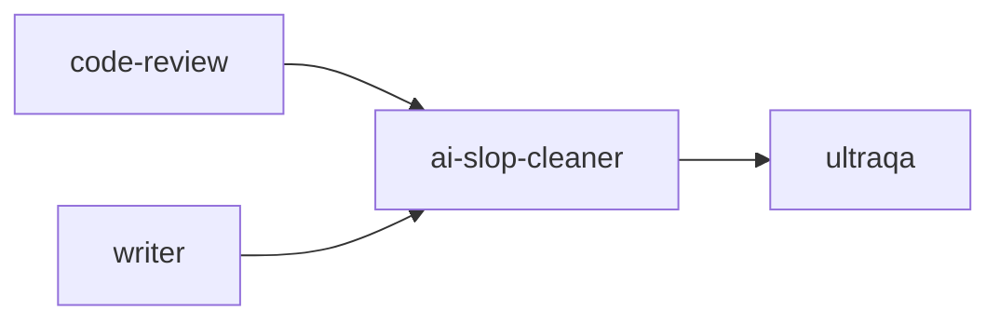

#### 2) analyze
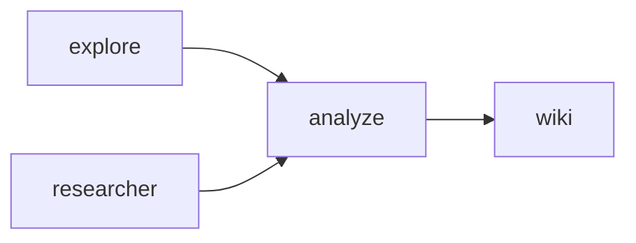

#### 3) ask
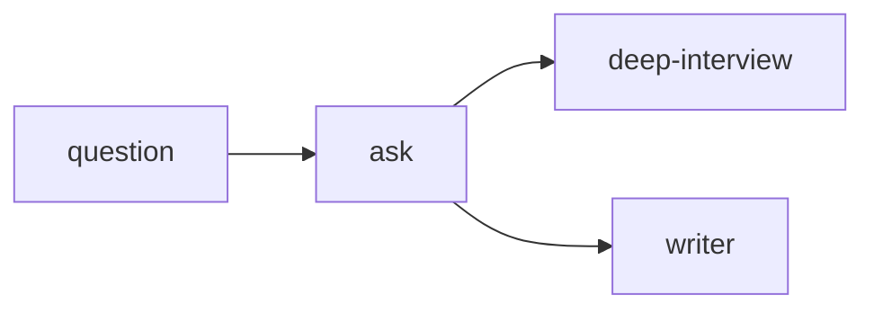

#### 4) autopilot
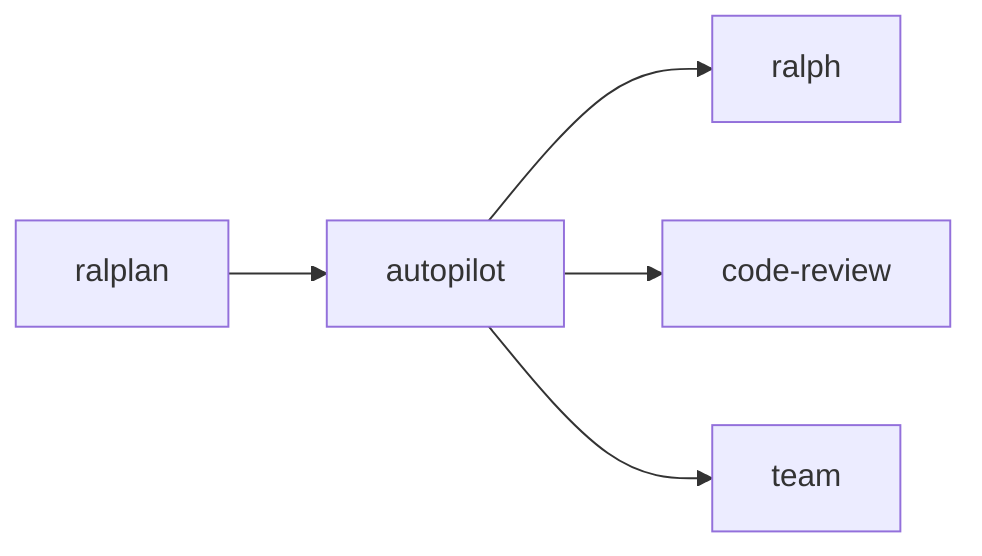

#### 5) autoresearch
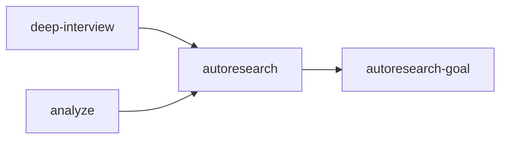

#### 6) autoresearch-goal
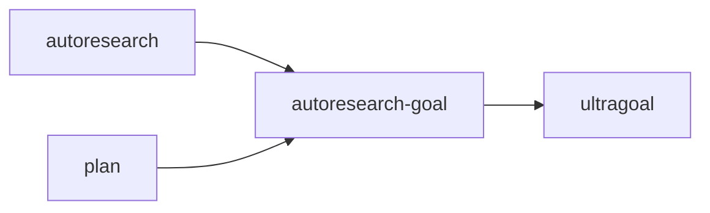

#### 7) cancel
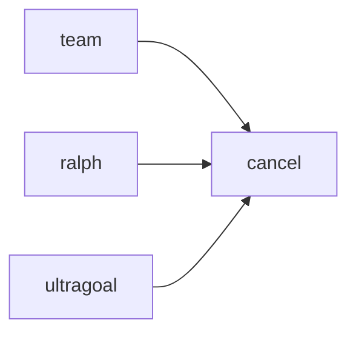

#### 8) code-review
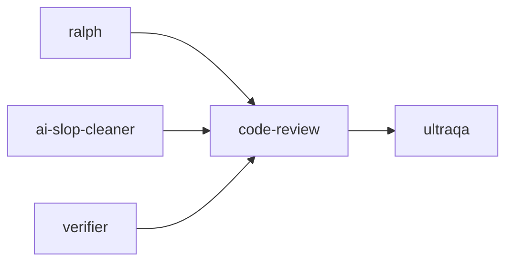

#### 9) configure-notifications
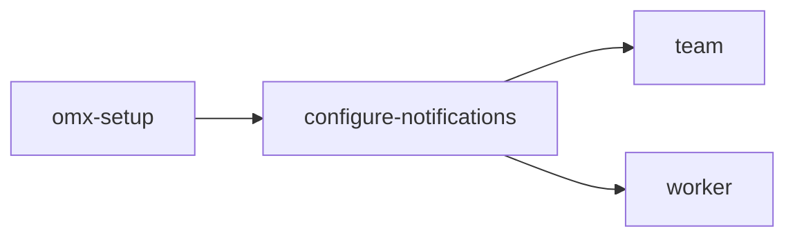

#### 10) deep-interview
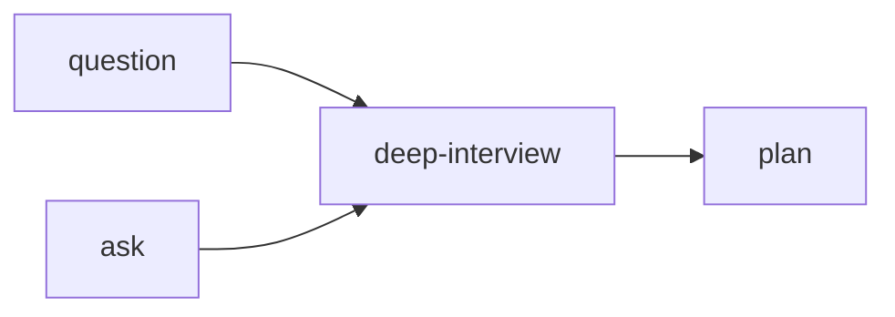

#### 11) doctor
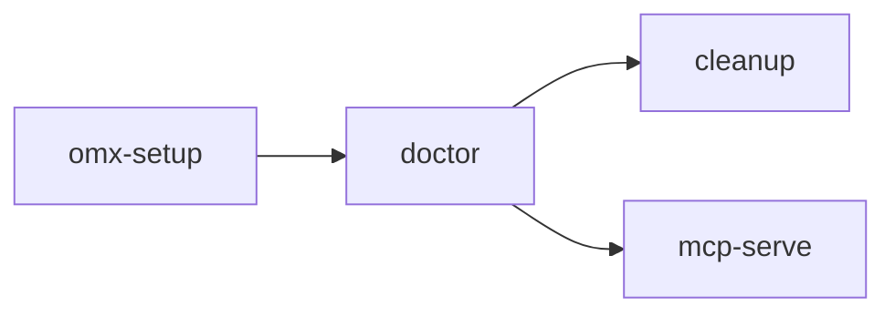

#### 12) hud
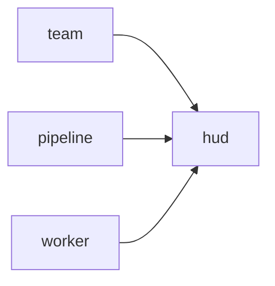

#### 13) omx-setup
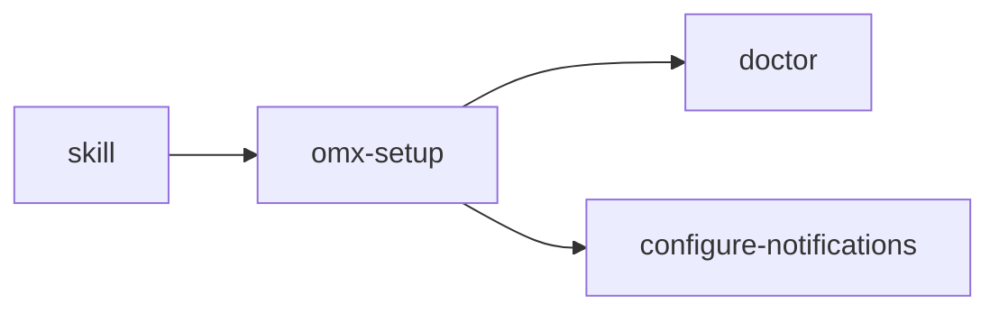

#### 14) performance-goal
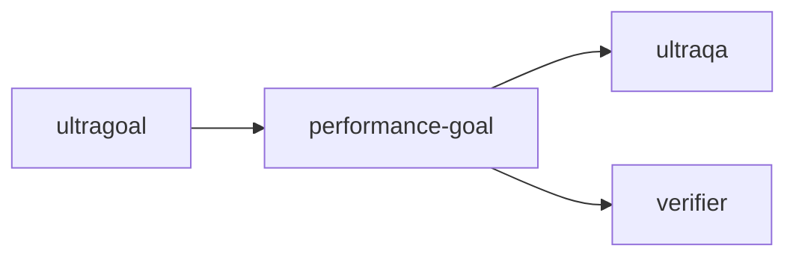

#### 15) pipeline
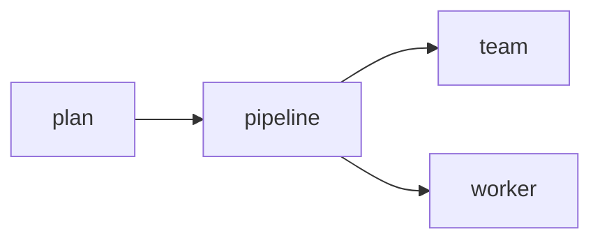

#### 16) plan
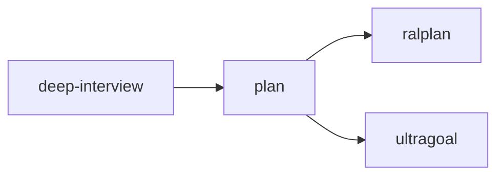

#### 17) ralph
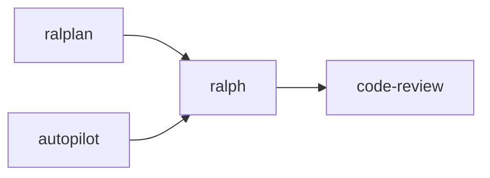

#### 18) ralplan
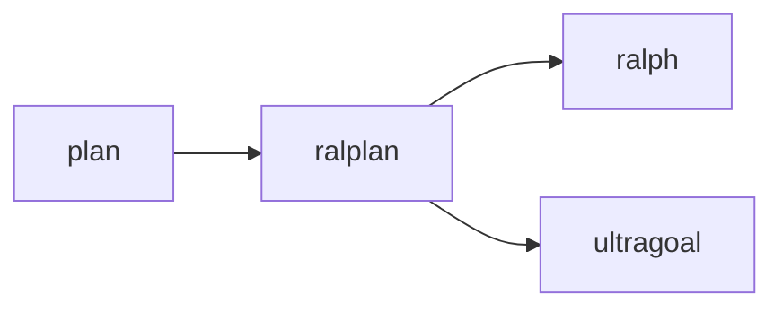

#### 19) skill
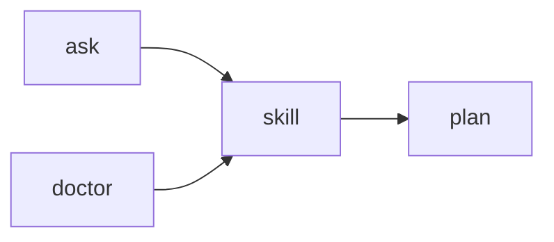

#### 20) team
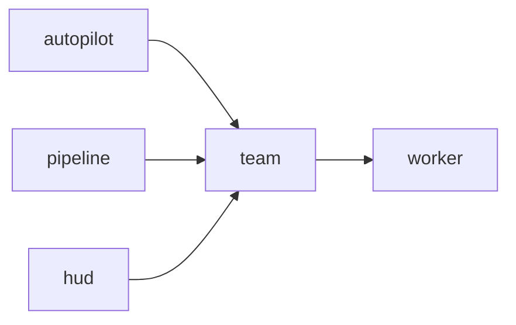

#### 21) ultragoal
```mermaid
flowchart LR
  PL[plan] --> UG[ultragoal] --> PG[performance-goal]
  RP[ralplan] --> UG
```

#### 22) ultraqa
```mermaid
flowchart LR
  CR[code-review] --> UQ[ultraqa] --> V[verifier]
  TE[test-engineer] --> UQ
```

#### 23) ultrawork
```mermaid
flowchart LR
  T[team] --> UW[ultrawork] --> W[worker]
  P[pipeline] --> UW
```

#### 24) visual-ralph
```mermaid
flowchart LR
  R[ralph] --> VR[visual-ralph] --> UQ[ultraqa]
  VI[vision] --> VR
```

#### 25) wiki
```mermaid
flowchart LR
  AN[analyze] --> WK[wiki]
  RS[researcher] --> WK
  ASK[ask] --> WK
```

#### 26) worker
```mermaid
flowchart LR
  T[team] --> W[worker] --> H[hud]
  P[pipeline] --> W
```


## 9. `src/catalog/`와 `plugins/oh-my-codex/skills/`의 관계

이 프로젝트에서 가장 중요한 결합점 중 하나다.

```
src/catalog/manifest.json (SSOT)
  ├─ reader.ts / schema.ts / installable.ts
  ├─ skill-mirror.ts
  └─ scripts/sync-plugin-mirror.ts
        ↓
plugins/oh-my-codex/skills/
```

### 의미

- `src/catalog/manifest.json`이 canonical source
- plugin bundle은 배포용 mirror
- sync/verify 스크립트가 drift를 막음
- 테스트는 mirror와 SSOT가 어긋나지 않는지 보장

### 핵심 위험

1. SSOT와 mirror가 별개로 진화할 수 있음
2. deprecation/alias 상태가 불일치하면 사용자 routing이 흔들림
3. plugin bundle이 실제 runtime discovery와 다르면 설치 경험이 깨짐


## 10. 런타임 흐름도

### 10.1 설치 / 부트스트랩

```
npm install
  └─ postinstall.ts
      └─ config/bootstrap + native asset/skill prep
          └─ codex hooks / AGENTS / MCP registry 준비
```

### 10.2 세션 시작

```
omx (CLI)
  └─ cli/index.ts
      ├─ remember launch context
      ├─ resolve codex home/config
      ├─ load setup preferences
      ├─ sync skill state
      ├─ generate session overlay
      └─ write session start metrics
```

### 10.3 스킬/프롬프트 라우팅

```
keyword detection / triage
  └─ role prompt selection
      └─ prompts/{role}.md + prompts/{role}-ko.md
          └─ session overlay / model instructions
```

### 10.4 팀 실행 흐름

```
team command
  └─ tmux session + worker panes
      ├─ worker task/state files
      ├─ MCP state server persistence
      ├─ role router / delegation policy
      └─ HUD / sidecar / notifications
```

### 10.5 goal 워크플로우 흐름

```
ralph / ultragoal / autoresearch-goal / performance-goal
  └─ durable artifacts
      ├─ .omx/goal / .omx/specs / .omx/ultragoal
      └─ resumable runtime state
```


## 11. 핵심 결합점

### 11.1 CLI ↔ hooks ↔ prompts

- `src/cli/index.ts`가 실행을 시작
- `src/hooks/agents-overlay.ts`가 model/session overlay를 씌움
- `prompts/*.md`가 role instructions를 공급
- `src/hooks/keyword-detector.ts`와 triage가 router 역할

### 11.2 CLI ↔ config ↔ MCP

- `src/cli/setup.ts`는 hook/MCP/AGENTS 배치를 생성
- `src/config/generator.ts`는 구성 synthesis의 중심
- `src/mcp/*`가 실제 server implementation을 제공

### 11.3 team ↔ state ↔ MCP

- `src/team/*`는 task claim, worker heartbeat, persistence를 다룸
- `src/mcp/state-server.ts`가 상태 저장소 역할
- `src/state/*`가 workflow transition과 skill-active state를 유지

### 11.4 catalog ↔ plugin mirror

- `src/catalog/manifest.json`이 SSOT
- `scripts/sync-plugin-mirror.ts`가 `plugins/oh-my-codex/skills/`를 갱신
- `verify:plugin-bundle`이 drift를 검증

### 11.5 docs ↔ runtime contract

- `docs/prompt-guidance-contract.md`
- `docs/interop-team-mutation-contract.md`
- `docs/guidance-schema.md`
- `docs/contracts/`

이 문서들은 실제 runtime contract를 설명하는 보강 레이어다.


## 12. 위험/주의 사항

### 12.1 이중 표면 문제

- `prompts/`와 `skills/`는 둘 다 실행 표면이다.
- 하나는 role prompt, 다른 하나는 skill workflow다.
- 둘 다 번역/동기화 드리프트에 취약하다.

### 12.2 미러 불일치

- `src/catalog/`와 `plugins/oh-my-codex/skills/`가 어긋날 수 있음
- `sync:plugin`과 `verify:plugin-bundle`이 핵심 안전장치

### 12.3 설치 모드 분기

- legacy setup과 plugin setup은 동일 설치 체계 안에서 섞어 쓰기 어렵다.
- `setup.ts`와 docs의 guidance contract를 함께 봐야 한다.

### 12.4 role-file overload

- `prompts/`는 파일 수가 많아 유지보수 부담이 크다.
- `*-ko.md` 페어와 role routing이 어긋나면 사용자 경험이 흔들린다.


## 13. 실무적으로 중요한 파일들

| 파일 | 이유 |
|---|---|
| `package.json` | build/test/sync/verify 전체 contract |
| `src/index.ts` | public API export surface |
| `src/cli/index.ts` | command dispatcher 및 런타임 진입점 |
| `src/catalog/manifest.json` | skill/agent SSOT |
| `src/config/generator.ts` | setup/config synthesis 중심 |
| `src/hooks/agents-overlay.ts` | prompt overlay의 핵심 |
| `src/team/runtime.ts` | tmux team orchestration |
| `src/mcp/state-server.ts` | durable state 저장소 |
| `plugins/oh-my-codex/.codex-plugin/plugin.json` | plugin discovery metadata |
| `plugins/oh-my-codex/.mcp.json` | plugin MCP registry |
| `plugins/oh-my-codex/skills/*/SKILL.md` | packaged workflow skills |
| `prompts/*.md` | role routing prompt surface |


## 14. 결론

`oh-my-codex-js`는 단순 CLI가 아니라 다음이 합쳐진 시스템이다.

1. Codex CLI의 런타임/설치/진단 계층
2. Role prompt와 skill catalog의 라우팅 계층
3. tmux team, state, MCP, hooks를 묶는 orchestration 계층
4. plugin bundle과 SSOT를 sync/verify로 유지하는 배포 계층

이 저장소를 이해할 때 가장 중요한 의존성 축은 아래 3개다.

- `src/cli/` ↔ `src/hooks/` ↔ `prompts/`
- `src/catalog/` ↔ `skills/` ↔ `plugins/oh-my-codex/skills/`
- `src/team/` ↔ `src/mcp/` ↔ `.omx/` / `.mcp.json`

즉, 이 프로젝트의 핵심은 “명령어 코드”가 아니라 “역할/스킬/상태/플러그인/훅을 서로 일치시키는 정합성 유지 장치”다.


## 15. 한국어 용어 정리

아래 표는 문서를 더 읽기 쉽게 만들기 위한 용어 기준이다. 영어 용어는 유지하되, 해석 축은 한국어로 고정한다.

| 영어 용어 | 권장 한국어 표현 | 문서 내 의미 |
|---|---|---|
| orchestration | 조율 / 오케스트레이션 | 여러 명령·스킬·상태를 이어 실행하는 계층 |
| dispatcher | 디스패처 / 분기기 | 입력 명령을 적절한 하위 명령으로 보내는 모듈 |
| workflow | 워크플로우 / 작업 흐름 | 단계가 연결된 실행 절차 |
| skill | 스킬 / 실행 절차 | 특정 목적을 가진 프롬프트·절차 단위 |
| prompt surface | 프롬프트 표면 | 런타임이 직접 읽는 역할 문서 집합 |
| runtime state | 런타임 상태 | 세션/팀/goal의 지속 상태 |
| mirror | 미러 / 복제본 | SSOT를 배포용으로 복제한 표면 |
| registry | 레지스트리 / 등록표 | 서버·도구·스킬 연결 목록 |
| overlay | 오버레이 / 덧씌움 | session instructions에 추가로 주입되는 계층 |
| hook | 훅 | 이벤트 시점에 끼워 넣는 로직 |
| harness | 하네스 / 실행 하네스 | native 또는 packaged 실행 경로 |
| policy | 정책 | 실행/설치/분기 기준 규칙 |
| contract | 계약 / 정합성 기준 | 문서와 런타임이 지켜야 하는 약속 |

### 읽기 기준

- `CLI`:
  이 문서에서 CLI는 단순히 명령을 받는 화면이 아니라, 설정/상태/실행 흐름을 바꾸는 "제어층"이라는 뜻이다.
  예: `omx team`은 화면 출력만 하는 게 아니라 tmux 세션과 상태 파일을 함께 바꾼다.

- `skills`:
  스킬 파일은 설명 문서가 아니라 실제 작업 순서를 담은 "실행 절차"로 본다.
  예: `autopilot` 스킬은 계획→실행→리뷰 흐름을 유도하는 동작 계약이다.

- `plugins/oh-my-codex`:
  이 경로는 원본을 복사해 둔 폴더가 아니라, 배포 시 실제로 사용되는 "배포용 미러"라는 뜻이다.
  예: 루트 카탈로그가 바뀌면 sync 단계로 플러그인 번들도 같이 맞춰야 한다.

- `manifest.json`:
  단순 파일 목록이 아니라 이름/상태/별칭을 통일하는 "정규화 기준"으로 본다.
  예: 어떤 스킬이 alias나 deprecated인지 해석할 때 최종 판단 기준이 된다.


## 16. 기술용어정리

아래는 이 문서를 읽을 때 자주 나오는 기술 용어를 "처음 보는 사람 기준"으로 풀어쓴 표다.

| 용어 | 쉬운 뜻 | 이 문서에서의 의미 |
|---|---|---|
| tmux | 터미널 화면을 여러 칸으로 나눠 동시에 작업하는 도구 | `team` 실행 시 리더/워커를 여러 pane으로 띄워 병렬 작업을 운영함 |
| pane | tmux 안의 개별 작업 창(분할 화면 한 칸) | 워커별 작업 상태를 분리해 실행할 때 사용 |
| team | 멀티 워커 실행 오케스트레이션 | 여러 에이전트를 tmux 기반으로 조율해 실제 작업을 실행·추적하는 운영 계층 |
| doctor | 설치/환경 진단 명령 또는 스킬 | setup 상태, MCP 연결, 런타임 이상 여부를 점검하는 헬스체크 진입점 |
| code-review | 코드 품질 검토 워크플로우/스킬 | 변경 코드의 품질, 리스크, 회귀 가능성을 점검하고 개선 포인트를 도출하는 리뷰 흐름 |
| autopilot | 계획-실행-검토 자동 루프 | `ralplan`, `team`, `code-review`를 묶어 반복 실행 흐름을 자동화하는 실행 스킬 |
| visual-ralph | 시각 기반 실행/검증 루프 | `ralph` 실행에 시각 검증 단계를 결합해 결과를 확인하는 워크플로우 |
| wiki | 프로젝트 지식 저장/검색 표면 | MCP wiki 서버와 연결되어 메모/지식 베이스를 누적·조회하는 기능 |
| deep-interview | 요구사항 정밀 질문 워크플로우 | 실행 전에 질문을 통해 맥락을 수집하고 plan 초안을 만드는 planning 스킬 |
| SSOT (Single Source of Truth) | "정답 원본" 역할을 하는 단일 기준 데이터 | `src/catalog/manifest.json`이 스킬/에이전트 상태의 기준점 |
| HUD | Head-Up Display. 핵심 상태를 한 줄로 빠르게 보여주는 UI | 팀/세션 상태, 진행도, 실행 맥락을 즉시 확인하는 표시 계층 |
| Ralph | OMX의 지속 실행 모드 이름 | 계획→실행→검토를 끊지 않고 이어가는 장기 실행 루프 |
| Ralplan | Ralph 실행 전에 계획을 정리하는 단계/스킬 | Ralph가 흔들리지 않도록 사전 계획(작업 경로)을 고정 |
| Ultragoal | 다중 장기 목표를 관리하는 워크플로우 | 목표 생성, 재개, 체크포인트를 통해 긴 작업을 이어감 |
| UltraQA | 품질 게이트 역할 스킬 | 코드 리뷰·검증 결과를 품질 기준으로 통과/보완 판단 |
| MCP | Model Context Protocol. 도구/서버와 모델을 잇는 인터페이스 규약 | `mcp-serve`로 state/memory/wiki 등 서버를 표준 방식으로 연결 |
| MCP 서버 | MCP 규약으로 동작하는 실제 실행 프로세스 | `omx mcp-serve state` 같은 명령으로 실행되는 백엔드 |
| 오버레이 (overlay) | 기존 지시문 위에 덧씌우는 추가 지시 계층 | 세션마다 모델 지시를 동적으로 조정할 때 사용 |
| 훅 (hook) | 특정 시점에 자동으로 끼워 넣는 처리 | 실행 전/후 상태 갱신, 지시 주입, 정리 작업 등에 사용 |
| 미러 (mirror) | 원본 기준을 배포용으로 복제해 둔 구조 | 루트 카탈로그와 `plugins/oh-my-codex/skills` 동기화 관계 |
| 레지스트리 (registry) | 서버/도구 목록을 등록해 둔 표 | `.mcp.json`처럼 어떤 서버를 붙일지 선언하는 파일 |
| 하네스 (harness) | 실행을 감싸서 제어/검증해 주는 실행 틀 | `explore`, `sparkshell`에서 네이티브 실행 경로를 관리 |
| 오케스트레이션 (orchestration) | 여러 단계를 순서/조건에 맞춰 조율하는 것 | CLI, 스킬, 상태, MCP를 끊김 없이 연결해 흐름을 유지 |

* 이 문서에서 **team**은 단순히 “팀”이라는 일반 단어가 아니라, 멀티 워커 실행 오케스트레이션을 뜻하는 기술 용어로 쓰입니다.

    1. CLI 명령으로서의 team  
    - omx team 같은 명령으로 작업을 여러 worker로 분해해 병렬 실행하는 진입점입니다.  

    1. 런타임 서브시스템으로서의 team  
    - src/team 아래 모듈들이 task 분배, 워커 상태, 역할 라우팅, worktree 관리를 담당하는 실행 엔진을 가리킵니다.  

    1. 스킬 그래프의 허브로서의 team  
    - pipeline, worker, hud, autopilot 같은 스킬/흐름과 연결되는 중심 노드 의미로도 사용됩니다.  
   
```
    팀(Team) 시스템 구조:
    ├── Leader/Planner (오케스트레이션)
    ├── Worker (작업 실행)
    ├── Verifier (검증)
    └── Executor (특수 실행)
```

### 빠른 읽기 팁

- `tmux`, `pane`가 나오면: "여러 작업을 동시에 운영한다"로 이해하면 된다.
- `SSOT`, `manifest`가 나오면: "무엇이 정답 기준인지"를 먼저 본다.
- `Ralph`, `Ultragoal`, `UltraQA`가 나오면: "장기 실행 루프/목표/품질" 3축으로 읽으면 된다.
- `MCP`, `registry`, `mcp-serve`가 나오면: "도구 연결 계층"으로 보면 이해가 빠르다.
- `Team`이 나오면: "여러 에이전트(worker)를 tmux 기반으로 동시 실행하는 오케스트레이션"으로 이해하면 된다.
- `Worker`가 나오면: "팀 내 개별 작업 실행 단위(에이전트)"로 본다.
- `하네스(harness)`, `mock parity`가 나오면: "테스트/검증 기반 시스템" 또는 "동작 일치성 검증"으로 본다.
