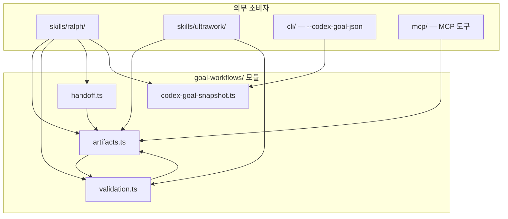
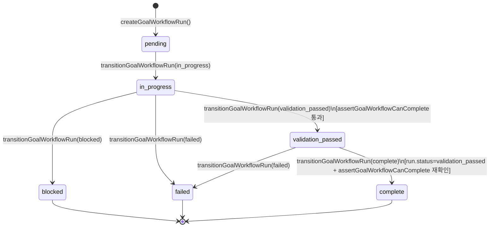

# src/goal-workflows 모듈 분析

## 폴더 구조

```
src/goal-workflows/
├── artifacts.ts              # 목표 워크플로우 런 CRUD·상태 전환·원장(Ledger) I/O
├── validation.ts             # 완료 검증 정규화·완료 가드
├── handoff.ts                # 에이전트 핸드오프 메시지 생성
├── codex-goal-snapshot.ts    # Codex thread goal 스냅샷 파싱·정합성 검증
└── __tests__/                # 단위 테스트
```

---

## 시스템 개요

`src/goal-workflows/`는 **OMX 워크플로우(ralph, ralplan, ultrawork 등)가 목표 기반으로 실행될 때 파일 시스템에 상태를 영속화하고, 완료 검증을 강제하며, 에이전트 간 핸드오프 메시지를 생성**하는 하위 시스템이다.

```
[OMX 워크플로우/스킬]
       ↓ createGoalWorkflowRun()
  artifacts.ts — GoalWorkflowRun 생성 (status.json)
       ↓ 작업 실행
  validation.ts — 검증 결과 정규화
       ↓ transitionGoalWorkflowRun(validation_passed)
  artifacts.ts — 상태 전환 + ledger.jsonl 기록
       ↓ transitionGoalWorkflowRun(complete)
  handoff.ts — 핸드오프 메시지 생성 (서브 에이전트 전달용)

  codex-goal-snapshot.ts — Codex goal API 결과 파싱·정합성 검증 (독립 유틸)
```

### 모듈 계층 구조

| 계층 | 파일 | 역할 |
|------|------|------|
| **핵심 상태** | `artifacts.ts` | 런 생성·읽기·전환, JSONL 원장, 파일 경로 관리 |
| **완료 가드** | `validation.ts` | 검증 결과 정규화, 플레이스홀더 차단, 완료 전제 조건 강제 |
| **핸드오프** | `handoff.ts` | 에이전트 핸드오프 텍스트 빌더 (Codex goal 통합 지시 포함) |
| **외부 통합** | `codex-goal-snapshot.ts` | Codex thread goal 스냅샷 파싱·정합성 검증 |

---

## 파일별 상세 분析

---

### `artifacts.ts` — 목표 워크플로우 런 CRUD

#### 파일 시스템 레이아웃

```
{cwd}/
└── .omx/goals/
    └── {workflow}/            # 워크플로우 종류 (ralph, ultrawork 등)
        └── {slug}/            # 목표를 요약한 URL-safe 슬러그
            ├── status.json    # GoalWorkflowRun 전체 상태
            └── ledger.jsonl   # 이벤트 원장 (JSONL)
```

상수:
```typescript
GOAL_WORKFLOWS_DIR = '.omx/goals'
GOAL_WORKFLOW_STATUS = 'status.json'
GOAL_WORKFLOW_LEDGER = 'ledger.jsonl'
```

#### 타입 정의

```typescript
type GoalWorkflowStatus =
  | 'pending'          // 생성됨, 미시작
  | 'in_progress'      // 실행 중
  | 'validation_passed' // 검증 통과 (완료 가능 상태)
  | 'blocked'          // 검증 실패 — 차단됨
  | 'failed'           // 실패
  | 'complete'         // 완료 (최종)

type GoalWorkflowLedgerEvent =
  | 'workflow_created'
  | 'goal_started'
  | 'validation_passed'
  | 'validation_failed'
  | 'goal_handoff_emitted'
  | 'goal_completed'
  | 'goal_failed'
```

#### 핵심 데이터 구조

```typescript
interface GoalWorkflowRun {
  version: 1;
  workflow: string;
  slug: string;
  objective: string;
  status: GoalWorkflowStatus;
  createdAt: string;
  updatedAt: string;
  artifactDir: string;   // 레포 상대 경로 (/ 구분)
  statusPath: string;
  ledgerPath: string;
  metadata?: Record<string, unknown>;
  validation?: GoalWorkflowValidationSummary;
  evidence?: string;
}

interface GoalWorkflowLedgerEntry {
  ts: string;
  event: GoalWorkflowLedgerEvent;
  status?: GoalWorkflowStatus;
  message?: string;
  evidence?: string;
  validation?: GoalWorkflowValidationSummary;
  metadata?: Record<string, unknown>;
}
```

#### 주요 함수

##### 경로 유틸

```typescript
goalWorkflowDir(cwd, workflow, slug)
// → {cwd}/.omx/goals/{workflow}/{slug}/

goalWorkflowStatusPath(cwd, workflow, slug)
goalWorkflowLedgerPath(cwd, workflow, slug)
```

##### 슬러그 생성

```typescript
normalizeGoalWorkflowSegment(value, fallback)
// 소문자 변환 → 비알파숫자 → '-' → 72자 절단

slugFromObjective(objective)
// 첫 번째 비빈 줄을 cleanSegment 처리
```

##### CRUD

```typescript
// 생성 — force 없으면 기존 파일 덮어쓰기 거부
createGoalWorkflowRun(cwd, options): Promise<GoalWorkflowRun>
// 1. 슬러그 결정 (slug 옵션 또는 objective에서 자동 생성)
// 2. status.json 쓰기
// 3. ledger.jsonl 빈 파일 생성
// 4. 'workflow_created' 이벤트 기록

// 읽기 — version/workflow/slug/objective 유효성 검사
readGoalWorkflowRun(cwd, workflow, slug): Promise<GoalWorkflowRun>

// 원장 추가
appendGoalWorkflowLedger(cwd, run, entry): Promise<void>
```

##### 상태 전환

```typescript
transitionGoalWorkflowRun(cwd, workflow, slug, options): Promise<GoalWorkflowRun>
```

전환 제약:
- `validation_passed` → `assertGoalWorkflowCanComplete(options.validation)` 호출
- `complete` → `run.status === 'validation_passed'` 선행 필수, `assertGoalWorkflowCanComplete(run.validation)` 재확인

상태 → 이벤트 매핑:

| 상태 | 원장 이벤트 |
|------|------------|
| `in_progress` | `goal_started` |
| `validation_passed` | `validation_passed` |
| `blocked` / `failed` | `goal_failed` |
| `complete` | `goal_completed` |

---

### `validation.ts` — 완료 검증 가드

#### 타입

```typescript
type GoalWorkflowValidationStatus = 'pass' | 'fail' | 'blocker';

interface GoalWorkflowValidationInput {
  status: GoalWorkflowValidationStatus | boolean;
  summary: string;
  artifactPath?: string;
  checkedAt?: Date;
}
```

#### `normalizeGoalWorkflowValidation`

`GoalWorkflowValidationInput` → `GoalWorkflowValidationSummary` 변환:

```typescript
input.status === true || 'pass'  → 'validation_passed'
input.status === 'blocker'       → 'blocked'
그 외                             → 'failed'
```

- `summary` 비어 있으면 즉시 예외
- `artifactPath` 공백 제거, 빈 문자열은 `undefined`

#### `assertGoalWorkflowCanComplete` — 완료 전제 조건 가드

```typescript
assertGoalWorkflowCanComplete(validation?: GoalWorkflowValidationSummary): void
```

다음 중 하나라도 해당하면 `GoalWorkflowValidationError` 예외:

| 조건 | 에러 메시지 |
|------|------------|
| `validation` 없음 | `'Completion requires a validation artifact.'` |
| `status !== 'validation_passed'` | `'Completion requires validation_passed; got {status}.'` |
| `artifactPath` 없음 | `'Completion requires a validation artifact path.'` |
| `summary`에 플레이스홀더 텍스트 | `'Completion requires real validation evidence...'` |

#### 플레이스홀더 탐지

```typescript
function hasPlaceholderEvidence(summary: string): boolean {
  return /\b(?:todo|tbd|placeholder|stub|not\s+implemented|fake\s+pass)\b/i.test(summary);
}
```

`todo`, `tbd`, `placeholder`, `stub`, `not implemented`, `fake pass`를 대소문자 무관하게 탐지한다.

---

### `handoff.ts` — 에이전트 핸드오프 메시지

에이전트가 서브 에이전트(또는 다음 세션)에게 목표와 아티팩트 위치를 전달할 때 사용하는 **텍스트 빌더**.

```typescript
export function buildGoalWorkflowHandoff(options: GoalWorkflowHandoffOptions): string
```

옵션:

```typescript
interface GoalWorkflowHandoffOptions {
  run: GoalWorkflowRun;
  title?: string;
  tokenBudget?: number;
  completionCommand?: string;
  degradedMode?: boolean;   // tmux 쉘 렌더링 등 도구 없이 실행 시
}
```

생성 메시지 구성:

```
{title}
Status: {status}
Artifacts: {artifactDir}
Ledger: {ledgerPath}

Codex goal integration constraints:
- get_goal → create_goal → update_goal 흐름 지시
- 완료 감사 통과 후에만 update_goal({status:"complete"}) 허용
- {completionCommand} 또는 기본 안내
  
{degradedMode 경고 or truth boundary 문구}

create_goal payload:
{ "objective": "...", "token_budget": ... }

Objective:
{목표 텍스트}
```

**`degradedMode`**: tmux 쉘 렌더링처럼 Codex goal 도구가 없는 환경에서 생성된 핸드오프임을 명시한다.

---

### `codex-goal-snapshot.ts` — Codex Goal 스냅샷 파싱·정합성 검증

Codex CLI의 `get_goal` 도구 결과를 파싱하고, 워크플로우 목표와 일치하는지 검증하는 독립 유틸.

#### 타입

```typescript
type CodexGoalSnapshotStatus = 'active' | 'complete' | 'cancelled' | 'failed' | 'unknown';

interface CodexGoalSnapshot {
  available: boolean;
  objective?: string;
  status?: CodexGoalSnapshotStatus;
  tokenBudget?: number;
  remainingTokens?: number | null;
  unavailableReason?: 'db_schema_context_error' | 'tool_error';
  errorMessage?: string;
  raw: unknown;    // 파싱 전 원본
}

interface CodexGoalReconciliation {
  ok: boolean;
  snapshot: CodexGoalSnapshot;
  warnings: string[];
  errors: string[];
}
```

#### `parseCodexGoalSnapshot`

```typescript
parseCodexGoalSnapshot(value: unknown): CodexGoalSnapshot
```

파싱 논리:
- `value.goal` 프로퍼티가 있으면 그 안에서 `objective`, `status`, `token_budget` 추출
- `goal === null/false` → `available: false`
- 에러 메시지 있으면 `unavailableReason` 분류:
  - `db_schema_context_error` — `thread_goals` 테이블 없음 등 DB/스키마 오류
  - `tool_error` — 그 외 도구 오류

`normalizeStatus` 정규화 테이블:

| 원본 값 | 정규화 |
|---------|--------|
| `'complete'`, `'completed'`, `'done'` | `'complete'` |
| `'cancelled'`, `'canceled'` | `'cancelled'` |
| `'failed'`, `'failure'` | `'failed'` |
| `'active'`, `'in_progress'`, `'pending'`, `'running'` | `'active'` |
| 그 외 | `'unknown'` |

#### `readCodexGoalSnapshotInput`

```typescript
readCodexGoalSnapshotInput(raw: string | undefined, cwd?): Promise<CodexGoalSnapshot | null>
```

- JSON 문자열이면 직접 파싱
- 아니면 파일 경로로 해석하여 읽기
- 둘 다 실패하면 `CodexGoalSnapshotError` 예외

#### `reconcileCodexGoalSnapshot`

```typescript
reconcileCodexGoalSnapshot(snapshot, options: ReconcileCodexGoalOptions): CodexGoalReconciliation
```

검증 항목:

| 검사 | 결과 |
|------|------|
| `snapshot.available === false` | `requireSnapshot=true`면 에러, 아니면 경고 |
| `objective` 없음 | 에러 |
| `objective` 불일치 | 에러 (`acceptedObjectives` 목록 포함 비교) |
| `status`가 허용 목록 밖 | 에러 |
| `requireComplete`인데 `status !== 'complete'` | 에러 |

`isCodexGoalDbSchemaContextError(message)`: `thread_goals` 관련 SQLite/DB 오류인지 정규식으로 판별한다.

---

## 파일 간 의존관계

```
validation.ts
  ↑
  └── artifacts.ts    ← validation.ts (assertGoalWorkflowCanComplete, GoalWorkflowValidationSummary)

handoff.ts             ← artifacts.ts (GoalWorkflowRun 타입만)

codex-goal-snapshot.ts  (독립 — 외부 의존 없음)
```

### 외부 소비자

```
skills/ralph/           ← artifacts.ts, validation.ts, handoff.ts, codex-goal-snapshot.ts
skills/ultrawork/       ← artifacts.ts, validation.ts
skills/ralplan/         ← artifacts.ts 간접 사용 (완료 검증 흐름)
cli/                    ← codex-goal-snapshot.ts (--codex-goal-json 플래그 처리)
mcp/                    ← artifacts.ts (MCP 도구로 노출)
```

---

## 호출 관계 다이어그램



---

## 상태 전환 다이어그램



**완료 이중 검증**:
1. `validation_passed` 전환 시 `assertGoalWorkflowCanComplete(options.validation)` 호출
2. `complete` 전환 시 `run.status === 'validation_passed'` 확인 + `assertGoalWorkflowCanComplete(run.validation)` 재호출

---

## 파일 시스템 레이아웃 (런타임)

```
{projectRoot}/
└── .omx/goals/
    └── {workflow}/           # 예: ralph, ultrawork, ralplan
        └── {slug}/           # 예: implement-feature-x
            ├── status.json   # GoalWorkflowRun 전체 상태 (JSON, 원자적 쓰기)
            └── ledger.jsonl  # 이벤트 원장 (JSONL, append-only)
```

---

## 설계 원칙

### 1. 검증 선행 필수 — 완료 이중 잠금

`complete` 전환은 `validation_passed` 상태를 거치지 않으면 불가능하다. `transitionGoalWorkflowRun`이 두 번 `assertGoalWorkflowCanComplete`를 호출하여 중간에 상태가 변경되는 경우도 차단한다.

### 2. 플레이스홀더 증거 거부 — 형식적 완료 방지

`hasPlaceholderEvidence`가 검증 요약에서 `todo`, `tbd`, `placeholder`, `stub`, `not implemented`, `fake pass` 등을 탐지하면 예외를 발생시킨다. 에이전트가 형식적으로만 완료를 기록하는 것을 막는다.

### 3. Append-only 원장 — 상태 변경 이력 보존

`status.json`은 현재 상태를, `ledger.jsonl`은 모든 전환 이력을 보존한다. 원장은 쓰기-전용으로 과거 이벤트를 수정하지 않는다.

### 4. 슬러그 자동 생성 — 경로 안전 보장

`slugFromObjective`가 목표 텍스트 첫 줄을 URL-safe 슬러그로 변환한다. `force` 옵션 없이는 기존 `status.json` 덮어쓰기를 거부하여 의도치 않은 런 삭제를 방지한다.

### 5. Codex Goal 통합 — 진실 경계 명시

`codex-goal-snapshot.ts`는 Codex CLI의 `get_goal` 결과를 파싱하여 OMX 워크플로우 목표와 정합성을 검증한다. `handoff.ts`는 핸드오프 메시지에 **"OMX가 아티팩트를 소유하고, Codex가 스레드 포커스를 소유한다"**는 진실 경계를 명시적으로 기술한다.

### 6. `degradedMode` — 도구 없는 환경 핸드오프 지원

tmux 쉘 렌더링처럼 Codex goal 도구가 없는 환경에서도 `buildGoalWorkflowHandoff`는 핸드오프 메시지를 생성하되, `degradedMode: true`로 제약 사항을 명시하여 에이전트가 상황을 인지하게 한다.
