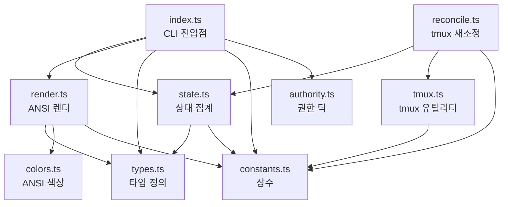
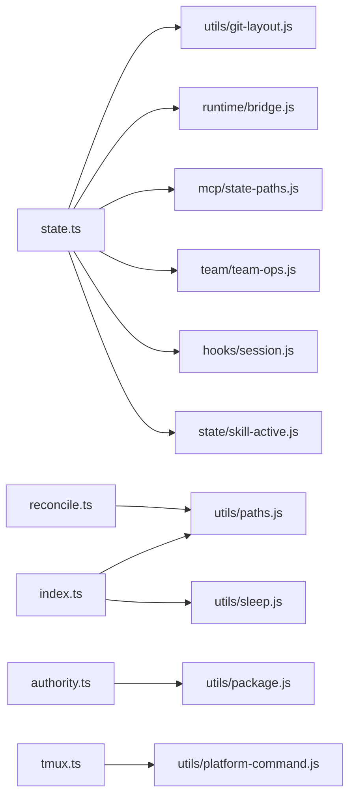
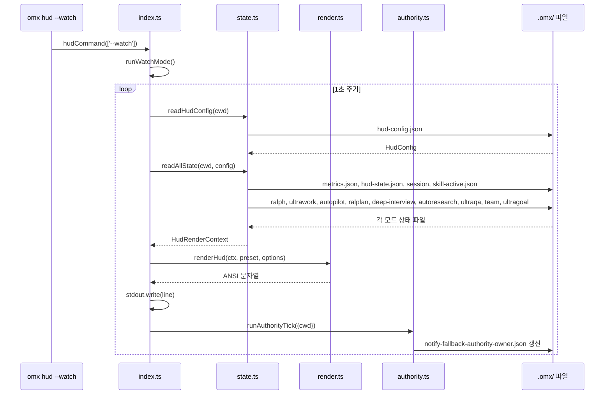
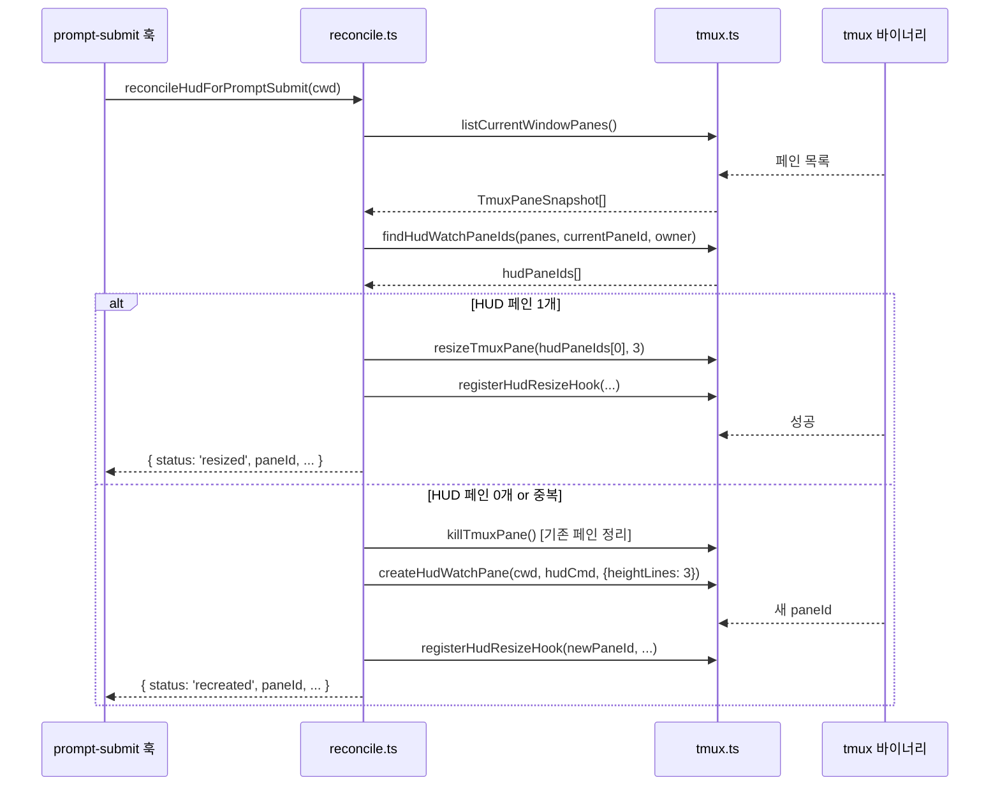

# src/hud 모듈 분析

## 폴더 구조

```
src/hud/
├── types.ts       # 전체 타입 정의 (HUD 상태·설정·플래그)
├── constants.ts   # tmux 레이아웃 상수
├── colors.ts      # ANSI 색상 유틸리티
├── state.ts       # 상태 파일 읽기 + readAllState 집계
├── render.ts      # HudRenderContext → ANSI 문자열 변환
├── reconcile.ts   # prompt-submit 시 tmux HUD 페인 재조정
├── tmux.ts        # tmux 페인 생성·관리·훅 등록
├── authority.ts   # notify-fallback-watcher 권한 틱
├── index.ts       # CLI 진입점 (hudCommand)
└── __tests__/
```

---

## 시스템 개요

`src/hud/`는 **OMX 터미널 HUD(Heads-Up Display)** 서브시스템이다. `.omx/state/` 파일들을 읽어 현재 활성 워크플로우·메트릭·세션 정보를 수집하고, ANSI 컬러 스테이터스라인으로 렌더링하여 터미널에 표시한다.

tmux 환경에서는 분할 페인(split pane)에 `omx hud --watch`를 실행해 1초 주기로 갱신하는 상시 표시 HUD를 제공한다.

```
[ 상태 파일 (.omx/state/) ]
         │
    readAllState()
         │
  HudRenderContext
         │
    renderHud()
         │
  ANSI 스테이터스라인
         │
    stdout / tmux pane
```

---

## 파일별 상세 분析

---

### `types.ts` — 타입 정의

모든 HUD 관련 타입의 단일 소스. 크게 세 영역으로 구성된다.

#### 1. 모드별 상태 타입 (HudRenderContext 필드)

| 타입 | 필드 | 특이사항 |
|------|------|---------|
| `RalphStateForHud` | `active`, `iteration`, `max_iterations` | 반복 진행률 색상 계산용 |
| `UltragoalStateForHud` | `active`, `total`/`complete`/`pending` 등, `activeGoal` | 세부 통계 + 현재 목표 |
| `UltraworkStateForHud` | `active`, `reinforcement_count` | 단순 on/off |
| `AutopilotStateForHud` | `active`, `current_phase` | 페이즈 표시 |
| `RalplanStateForHud` | `active`, `current_phase`, `iteration`, `planning_complete` | 반복·페이즈 혼합 |
| `DeepInterviewStateForHud` | `active`, `current_phase`, `input_lock_active` | 인터뷰 잠금 표시 |
| `AutoresearchStateForHud` | `active`, `current_phase` | |
| `UltraqaStateForHud` | `active`, `current_phase` | |
| `TeamStateForHud` | `active`, `current_phase`, `agent_count`, `team_name` | |

#### 2. 메트릭·세션 타입

```typescript
interface HudMetrics {
  total_turns: number;
  session_turns: number;
  last_activity: string;
  session_input_tokens?: number;
  session_output_tokens?: number;
  session_total_tokens?: number;
  five_hour_limit_pct?: number;
  weekly_limit_pct?: number;
}

interface HudNotifyState {
  last_turn_at: string;
  turn_count: number;
  last_agent_output?: string;
}

interface SessionStateForHud {
  session_id: string;
  started_at: string;
}
```

#### 3. 설정 타입

```typescript
interface HudConfig {
  preset?: HudPreset;        // 'minimal' | 'focused' | 'full'
  git?: HudGitConfig;        // display: 'branch' | 'repo-branch'
  statusLine?: HudStatusLineConfig;
}

const DEFAULT_HUD_CONFIG: ResolvedHudConfig = {
  preset: 'focused',
  git: { display: 'repo-branch' },
  statusLine: { preset: 'focused' },
};
```

---

### `constants.ts` — 레이아웃 상수

```typescript
HUD_TMUX_HEIGHT_LINES = 3          // 기본 HUD 페인 높이
HUD_TMUX_TEAM_HEIGHT_LINES = 3     // 팀 모드 HUD 높이
HUD_TMUX_MAX_HEIGHT_LINES = 5      // 최대 HUD 렌더 줄 수
HUD_RESIZE_RECONCILE_DELAY_SECONDS = 2  // 리사이즈 훅 재확인 딜레이
```

---

### `colors.ts` — ANSI 색상 유틸리티

터미널 렌더링용 ANSI 색상 래퍼. `colorEnabled` 전역 플래그로 색상 출력 전체를 on/off할 수 있다.

| 함수 | 출력 |
|------|------|
| `green(text)` | `\x1b[32m{text}\x1b[0m` |
| `yellow(text)` | `\x1b[33m{text}\x1b[0m` |
| `cyan(text)` | `\x1b[36m{text}\x1b[0m` |
| `dim(text)` | `\x1b[2m{text}\x1b[0m` |
| `bold(text)` | `\x1b[1m{text}\x1b[0m` |
| `getRalphColor(iter, max)` | 진행률에 따라 GREEN/YELLOW/RED 반환 |
| `setColorEnabled(bool)` | 색상 출력 전역 제어 |

`getRalphColor` 임계값:
- `iter >= max * 0.9` → RED (위급)
- `iter >= max * 0.7` → YELLOW (경고)
- 그 외 → GREEN (정상)

---

### `state.ts` — 상태 읽기 집계

HUD 렌더에 필요한 모든 상태를 `.omx/` 파일 시스템에서 읽어 `HudRenderContext`로 조립한다.

#### 핵심 함수: `readAllState(cwd, config?)`

```
[병렬 읽기 1단계]
  readMetrics()           → .omx/metrics.json
  readHudNotifyState()    → .omx/state/{session}/hud-state.json
  readSessionState()      → hooks/session.js
  readCurrentSessionId()  → mcp/state-paths.js

[정규 스킬 상태 읽기]
  readVisibleSkillActiveStateForStateDir()  → .omx/state/skill-active.json
  listActiveSkills()                        → 활성 스킬 Map 구성

[병렬 읽기 2단계 — 모드별 상태]
  readSessionAwareModeState('ralph')
  readUltragoalState()     → .omx/ultragoal/goals.json
  readSessionAwareModeState('ultrawork')
  readSessionAwareModeState('autopilot')
  readSessionAwareModeState('ralplan')
  readSessionAwareModeState('deep-interview')
  readSessionAwareModeState('autoresearch')
  readSessionAwareModeState('ultraqa')
  readSessionAwareModeState('team')

[상태 필터링 — 정규 스킬 우선]
  shouldSurfaceCanonicalSkill() + mergePhase()
  → 종료/비활성 페이즈 가진 모드는 null 처리

[Rust 런타임 브리지]
  isBridgeEnabled() → getDefaultBridge().readCompatFile('snapshot.json')

→ HudRenderContext 반환
```

#### `readSessionAwareModeState(cwd, mode)`

세션 ID가 있으면 세션 범위 경로만 읽고, 없으면 후보 경로를 순서대로 시도한다.

#### `normalizeHudConfig(raw)` — 설정 정규화

미검증 JSON을 `ResolvedHudConfig`로 변환. preset, git.display, remoteName, repoLabel 각각 타입 검사 후 합리적 기본값 적용.

#### `readUltragoalState(cwd)`

`.omx/ultragoal/goals.json`에서 goal 배열을 읽어 통계를 집계하고 현재 활성 목표를 계산한다:
- `ULTRAGOAL_ACTIVE_STATUSES`: `in_progress | review_blocked | needs_user_decision`
- `activeGoalId` → 없으면 ACTIVE_STATUSES → 없으면 UNRESOLVED_STATUSES 순으로 폴백

#### `buildGitBranchLabel(cwd, config, gitRunner)`

```
config.git.display === 'branch'    → "main"
config.git.display === 'repo-branch' → "my-repo/main"
```

Windows에서는 `execFileSync('git', ...)` 대신 `.git/` 파일 직접 파싱으로 콘솔 플리커 방지.

#### `TERMINAL_OR_INACTIVE_PHASES` — 종료 페이즈 집합

`complete | completed | cancelled | canceled | failed | inactive | cleared`에 해당하는 페이즈를 가진 모드는 HUD에 표시하지 않는다.

---

### `render.ts` — HUD 렌더러

`HudRenderContext`를 받아 ANSI 스테이터스라인 문자열을 생성한다.

#### 엘리먼트 렌더러 함수 목록

| 함수 | 출력 예시 | 색상 |
|------|-----------|------|
| `renderGitBranch` | `main` | cyan |
| `renderRalph` | `ralph:3/10` | 진행률별 green/yellow/red |
| `renderUltrawork` | `ultrawork` | cyan |
| `renderAutopilot` | `autopilot:planning` | yellow |
| `renderRalplan` | `ralplan:2/?` or `ralplan:active` | cyan |
| `renderDeepInterview` | `interview:active` or `interview:active:lock` | yellow |
| `renderAutoresearch` | `research:active` | cyan |
| `renderUltraqa` | `qa:active` | green |
| `renderTeam` | `team:3 workers` or `team:my-team` | green |
| `renderUltragoal` | `ultragoal 2/5 ▶ id: title · objective: ...` | cyan |
| `renderTurns` | `turns:42` | dim |
| `renderTokens` | `tokens:12.3k` | dim |
| `renderQuota` | `quota:5h:45%,wk:20%` | dim |
| `renderLastActivity` | `last:30s ago` | dim |
| `renderTotalTurns` | `total-turns:1234` | dim |
| `renderSessionDuration` | `session:1h30m` | dim |

#### 프리셋별 엘리먼트 구성

| 프리셋 | 포함 엘리먼트 |
|--------|--------------|
| `minimal` | gitBranch, ralph, ultrawork, ralplan, deepInterview, autoresearch, ultraqa, team, ultragoal, turns |
| `focused` | minimal + autopilot, tokens, quota, sessionDuration, lastActivity |
| `full` | focused + totalTurns |

#### `renderHud(ctx, preset, options)`

```
1. getElements(preset) → 엘리먼트 렌더러 배열
2. 각 렌더러 호출 → null 제거 → parts[]
3. label = bold('[OMX#0.12.5]')
4. parts 없으면 → '[OMX] No active modes.'
5. wrapHudParts(label, parts, options) → 최종 문자열
```

#### `wrapHudParts(label, parts, options)`

`maxWidth`/`maxLines` 제약 내에서 파트를 줄바꿈으로 배분. 초과 시 `…` 말줄임 처리. 줄 수 제한 초과 시 마지막 줄에 `…` 오버플로우 표시.

---

### `reconcile.ts` — tmux HUD 페인 재조정

`omx prompt-submit` 훅에서 호출되어 tmux HUD 페인의 생명주기를 관리한다.

#### `reconcileHudForPromptSubmit(cwd, deps)`

```
전제 조건 검사:
  env.TMUX 없음         → 'skipped_not_tmux'
  OMX_TMUX_HUD_OWNER !== '1' → 'skipped_not_omx_owned_tmux'
  omxBin 없음           → 'skipped_no_entry'

현재 창의 HUD 페인 목록 조회:
  listCurrentWindowPanes() → findHudWatchPaneIds()

HUD 페인 1개 존재:
  resizeTmuxPane() → 'resized' | 'failed'
  + registerHudResizeHook() (비차단)

HUD 페인 0개 or 2개 이상:
  세션 ID 없음 → 'skipped_no_session_id'
  기존 HUD 페인 모두 kill
  createHudWatchPane() → 새 페인 생성
  → 'recreated' | 'replaced_duplicates' | 'failed'
```

반환 타입 `ReconcileHudForPromptSubmitResult`:
```typescript
{
  status: 'skipped_not_tmux' | 'skipped_no_entry' | 'skipped_not_omx_owned_tmux'
        | 'skipped_no_session_id' | 'resized' | 'recreated' | 'replaced_duplicates' | 'failed';
  paneId: string | null;
  desiredHeight: number | null;
  duplicateCount: number;
}
```

---

### `tmux.ts` — tmux 페인 관리

tmux 명령(execFileSync)을 추상화하는 순수 유틸리티 계층. 모든 함수는 `execTmuxSync` 의존성 주입을 지원한다.

#### 페인 식별

```typescript
interface TmuxPaneSnapshot {
  paneId: string;          // '%숫자' 형식
  currentCommand: string;  // 현재 실행 중인 명령
  startCommand: string;    // 페인 시작 시 명령
}
```

#### HUD 페인 판별 — `isHudWatchPane(pane)`

```
startCommand + currentCommand에서:
  /\bhud\b/ + /--watch\b/ + (/\bomx(?:\.js)?\b/ | /\bnode\b/)
  → 모두 일치해야 HUD 페인으로 인식
```

#### 환경변수 기반 소유권 — `HudPaneOwner`

```typescript
interface HudPaneOwner {
  sessionId?: string;     // OMX_SESSION_ID
  leaderPaneId?: string;  // OMX_TMUX_HUD_LEADER_PANE
}
```

`hudPaneMatchesOwner()` — sessionId + leaderPaneId 조합 우선, 단독 매칭도 허용.

#### 주요 함수

| 함수 | 동작 |
|------|------|
| `parseTmuxPaneSnapshot(output)` | `list-panes` 출력 파싱 → `TmuxPaneSnapshot[]` |
| `findHudWatchPaneIds(panes, currentPaneId, owner)` | 현재 페인 제외 + 소유권 매칭 HUD 페인 ID 목록 |
| `reapDeadHudPanes(panes, opts)` | 리더 페인 사망한 HUD 페인 정리 |
| `createHudWatchPane(cwd, hudCmd, opts)` | `split-window -v -l {height} -d ... -P -F #{pane_id}` |
| `killTmuxPane(paneId)` | `kill-pane -t {paneId}` |
| `resizeTmuxPane(paneId, height)` | `resize-pane -t {paneId} -y {height}` |
| `registerHudResizeHook(hudPaneId, currentPaneId, height)` | `set-hook client-resized[hash]` — 터미널 리사이즈 시 HUD 페인 높이 자동 재조정 |
| `unregisterHudResizeHook(currentPaneId)` | `set-hook -u client-resized[hash]` |
| `buildHudWatchCommand(omxBin, preset, sessionId, omxRoot, leaderPaneId)` | tmux 페인 시작 명령 문자열 생성 (환경변수 포함) |
| `listCurrentWindowPanes(...)` | `list-panes -F #{pane_id}\t...` |
| `shellEscapeSingle(value)` | 단일 인용부호 셸 이스케이프 |

#### 리사이즈 훅 메커니즘

```
buildHudResizeHookName(sessionId, windowId)
  → "omx_hud_resize_{sessionId}_{windowId}"

buildHudResizeHookSlot(hookName)
  → "client-resized[hash % 2147483647]"

훅 명령:
  <resize-pane> || <unregister-hook>
  sleep 2
  <resize-pane> || <unregister-hook>   (딜레이 후 재확인)
```

---

### `authority.ts` — HUD 권한 틱

```typescript
async function runHudAuthorityTick(options, deps?): Promise<void>
```

HUD가 `notify-fallback-watcher`의 권한 소유자임을 표명하고, `--once --authority-only` 모드로 `notify-fallback-watcher.js`를 실행한다.

흐름:
```
1. .omx/state/notify-fallback-authority-owner.json 생성
   { owner: 'hud', pid, cwd, heartbeat_at }

2. spawnSync(nodePath, [watcherScript, '--once', '--authority-only', ...])
   env: { ...process.env, OMX_HUD_AUTHORITY: '1' }
   timeout: timeoutMs (기본 5000ms)
```

watch 루프의 매 틱마다 호출되어 HUD가 활성 상태임을 갱신한다.

---

### `index.ts` — CLI 진입점

`omx hud [flags]` 명령의 라우터.

#### `hudCommand(args)`

```
--help / -h    → HUD_USAGE 출력
--tmux         → launchTmuxPane()
(기본)          → renderOnce()
--watch        → runWatchMode()
```

#### `renderOnce(cwd, flags)`

```
readHudConfig() → readAllState() → renderHud() → console.log()
--json 플래그 시: JSON.stringify(ctx) 출력
```

#### `runWatchMode(cwd, flags, deps?)`

```
비-TTY + 비-CI 환경 → 오류 출력 후 종료

초기화:
  cursor 숨기기 (\x1b[?25l)
  setInterval(renderTick, 1000)
  SIGINT 핸들러 등록 → stop()

renderTick():
  inFlight 플래그로 중복 실행 방지 (queued 플래그로 누락 방지)
  첫 렌더: \x1b[2J\x1b[H (전체 지우기)
  이후: \x1b[H (커서 홈)
  readHudConfig() → readAllState() → renderHud()
  stdout.write(line + \x1b[K\n\x1b[J)
  runAuthorityTick()

stop():
  cursor 복원 (\x1b[?25h)
  화면 지우기 (\x1b[2J\x1b[H)
  Promise 해결
```

`deps` 파라미터로 모든 I/O 의존성 주입 가능 → 테스트 용이.

#### `launchTmuxPane(cwd, flags)`

```
TMUX 없으면 오류 종료
resolveOmxCliEntryPath() → omxBin
buildTmuxSplitArgs(cwd, omxBin, preset, sessionId, omxRoot)
execFileSync('tmux', args)
```

#### `buildTmuxSplitArgs(cwd, omxBin, preset, sessionId, omxRoot)`

`['split-window', '-v', '-l', '3', '-c', cwd, 'exec env ... node omxBin hud --watch']` 형태의 tmux argv 배열 반환. 셸 명령 문자열이 아닌 argv 배열이므로 인수 인젝션 불가.

---

## 파일 간 의존관계



---

## 외부 의존관계



---

## 전체 렌더 흐름



---

## prompt-submit 재조정 흐름



---

## 설계 원칙

### 1. 읽기 전용 — 상태 파일 변경 없음

`state.ts`는 `.omx/` 파일을 읽기만 한다. 쓰기 권한이 없어 부작용이 없다. 모든 상태 변경은 훅 시스템이 담당한다.

### 2. 프리셋 3단계 — 정보 밀도 조절

`minimal` (필수 정보) → `focused` (기본, 메트릭 포함) → `full` (전체 정보). 터미널 너비와 HUD 목적에 따라 선택한다.

### 3. 정규 스킬 상태 우선

`skill-active.json`에서 읽은 정규 스킬 상태가 있으면 개별 모드 파일보다 우선한다. `useCompatibilityFallback`으로 이전 버전과 호환성을 유지한다.

### 4. 종료 페이즈 자동 숨김

`complete / failed / cancelled / inactive` 등 종료 페이즈를 가진 모드는 자동으로 HUD에서 제거된다. 완료된 작업이 HUD를 오염시키지 않는다.

### 5. Windows 콘솔 플리커 방지

Windows 환경에서 `git` 프로세스 스폰을 최소화하기 위해 `.git/` 파일을 직접 파싱한다. HEAD, config, remote URL을 셸 호출 없이 읽는다.

### 6. 완전한 의존성 주입

`runWatchMode`, `reconcileHudForPromptSubmit` 등 주요 함수는 모든 I/O 의존성을 `deps` 객체로 주입받는다. 프로덕션에서는 실제 구현을 사용하고 테스트에서는 목(mock)으로 대체 가능하다.

### 7. 셸 인젝션 방어

`buildTmuxSplitArgs()`는 셸 명령 문자열 대신 argv 배열을 반환한다. `shellEscapeSingle()`, `shellEscape()`로 동적 값을 안전하게 인용한다.

### 8. tmux 훅 기반 리사이즈

터미널 리사이즈 시 tmux `client-resized` 훅이 HUD 페인 높이를 자동 재조정한다. 딜레이 2초 후 한 번 더 확인하여 리사이즈 애니메이션 중 발생하는 타이밍 문제를 방지한다.
