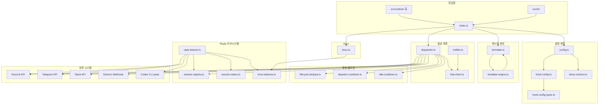
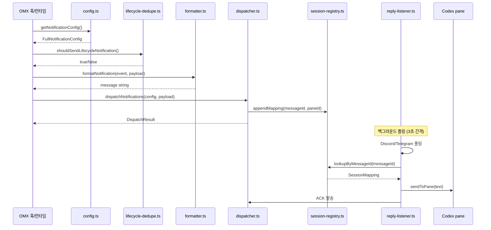

# src/notifications 모듈 분析

## 폴더 구조

```
src/notifications/
├── index.ts               # 공개 API re-export 진입점
├── types.ts               # 핵심 타입 정의 (이벤트·플랫폼·설정·페이로드)
├── config.ts              # .omx-config.json + 환경변수 설정 읽기·병합
├── hook-config-types.ts   # hookTemplates 커스텀 템플릿 타입 스키마
├── hook-config.ts         # hook 설정 읽기·캐싱·main config 병합
├── dispatcher.ts          # 플랫폼별 HTTP 발송 함수 + 통합 dispatch
├── formatter.ts           # 이벤트별 메시지 포맷 + tmux 출력 파싱
├── template-engine.ts     # {{variable}} 보간 + {{#if}} 조건 처리
├── notifier.ts            # 레거시 단순 알림 (데스크톱 + discord + telegram)
├── http-client.ts         # HTTP/HTTPS 클라이언트 (프록시·타임아웃 지원)
├── tmux.ts                # tmux 세션 탐지·pane 캡처·HUD 필터링
├── tmux-detector.ts       # reply-listener용 pane 상호작용 (캡처·분析·주입)
├── lifecycle-dedupe.ts    # 라이프사이클 알림 중복 방지 (지문 기반)
├── dispatch-cooldown.ts   # 팀 dispatch 알림 최소 간격 쿨다운
├── idle-cooldown.ts       # session-idle 알림 쿨다운 + tmux tail 지문
├── session-registry.ts    # 플랫폼 메시지 ID ↔ tmux pane ID 매핑 JSONL 원장
├── session-status.ts      # Discord !status 명령 응답 빌더
├── reply-listener.ts      # 백그라운드 데몬 — Discord·Telegram 답장 수신·주입
├── temp-contract.ts       # --notify-temp 임시 알림 계약 파싱·직렬화
└── __tests__/             # 단위 테스트
```

---

## 시스템 개요

`src/notifications/`는 **OMX 세션 라이프사이클 이벤트를 Discord·Telegram·Slack·Webhook 등 다중 플랫폼으로 비동기 전달하고, 답장을 Codex CLI 세션으로 역방향 주입하는 알림 서브시스템**이다.

```
[OMX 훅/런타임]
     ↓ notifyLifecycle(event, payload)
[config.ts] → FullNotificationConfig 로딩 (파일 + 환경변수 + hook 설정 병합)
     ↓
[lifecycle-dedupe.ts] → 중복 필터 (5초 내 동일 지문은 한 번만)
[idle-cooldown.ts]    → session-idle 쿨다운 (기본 60초)
[dispatch-cooldown.ts]→ dispatch 알림 쿨다운 (기본 60초)
     ↓
[formatter.ts / template-engine.ts] → 메시지 텍스트 생성
     ↓
[dispatcher.ts]
 ├── sendDiscord()       → Discord Webhook
 ├── sendDiscordBot()    → Discord Bot API (메시지 ID 저장 → session-registry)
 ├── sendTelegram()      → Telegram Bot API (메시지 ID 저장 → session-registry)
 ├── sendSlack()         → Slack Incoming Webhook
 └── sendWebhook()       → Generic HTTPS webhook

[reply-listener.ts] (백그라운드 데몬)
 ├── Discord 폴링 → 답장 텍스트 → tmux-detector.ts → Codex pane 주입
 └── Telegram 폴링→ 답장 텍스트 → tmux-detector.ts → Codex pane 주입
```

### 5가지 알림 이벤트

| 이벤트 | 트리거 |
|--------|--------|
| `session-start` | Codex 세션 시작 |
| `session-stop` | 반복 모드 내 개별 stop |
| `session-end` | 세션 완전 종료 |
| `session-idle` | 세션 유휴 감지 |
| `ask-user-question` | Codex가 사용자 질문 요청 |

### Verbosity 레벨

| 레벨 | 포함 이벤트 |
|------|------------|
| `verbose` | 전체 텍스트·툴 호출 출력 |
| `agent` | 에이전트 호출 + `ask-user-question` |
| `session` | start/idle/stop/end + tmux tail (**기본값**) |
| `minimal` | start/stop/end만 (idle·tmux tail 제외) |

---

## 파일별 상세 분析

---

### `types.ts` — 핵심 타입 정의

#### 핵심 타입 계층

```
NotificationEvent    — 5가지 이벤트 리터럴
NotificationPlatform — 5가지 플랫폼 리터럴
VerbosityLevel       — 4단계 상세도

플랫폼 설정:
  DiscordNotificationConfig    (webhookUrl, username, mention)
  DiscordBotNotificationConfig (botToken, channelId, mention)
  TelegramNotificationConfig   (botToken, chatId, parseMode)
  SlackNotificationConfig      (webhookUrl, channel, username, mention)
  WebhookNotificationConfig    (url, headers, method)

FullNotificationConfig  — 전체 설정 루트
  ├── enabled, verbosity, includeChildAgents
  ├── 플랫폼별 기본 설정 (discord, telegram, slack ...)
  ├── openclaw?: { enabled }
  └── events?: { "session-start"?: EventNotificationConfig, ... }

EventNotificationConfig — 이벤트별 설정
  ├── enabled, messageTemplate
  └── 플랫폼별 오버라이드 (상위 설정 상속)

FullNotificationPayload — 발송 페이로드
  ├── 식별: event, sessionId, timestamp
  ├── 컨텍스트: projectPath, projectName, tmuxSession, tmuxTail
  ├── 통계: durationMs, agentsSpawned, agentsCompleted
  ├── 상태: reason, activeMode, iteration/maxIterations
  └── 특수: question (ask-user-question), incompleteTasks
```

#### 결과 타입

```typescript
interface NotificationResult {
  platform: NotificationPlatform;
  success: boolean;
  error?: string;
  messageId?: string;  // 봇 발송 시 — reply correlation용
}

interface DispatchResult {
  results: NotificationResult[];
  sent: boolean;
}
```

---

### `config.ts` — 설정 읽기·병합

#### 설정 우선순위

```
1. 파일: {codexHome()}/.omx-config.json
2. 환경변수: OMX_DISCORD_WEBHOOK_URL, OMX_DISCORD_NOTIFIER_BOT_TOKEN,
            OMX_TELEGRAM_BOT_TOKEN, OMX_SLACK_WEBHOOK_URL 등
3. 레거시 마이그레이션: .omx-config.json의 stopHookCallbacks → FullNotificationConfig 변환
4. temp-contract: --notify-temp 임시 알림 활성화 여부
```

#### `getNotificationConfig(cwd?, opts?)` — 핵심 설정 조합

```
readRawConfig()                → .omx-config.json 읽기
migrateStopHookCallbacks()     → 구버전 설정 변환
buildConfigFromEnv()           → 환경변수 설정
mergeEnvIntoFileConfig()       → 환경변수 → 파일 설정 병합
getHookConfig()                → hook 설정 읽기
mergeHookConfigIntoNotificationConfig() → hook 설정 병합
temp-contract 처리             → getTempBuiltinSelectors() 적용
```

#### Mention 검증

| 함수 | 허용 형식 |
|------|----------|
| `validateMention()` | `<@!?{id}>`, `<@&{id}>` (Discord) |
| `validateSlackMention()` | `<@U...>`, `<!channel>`, `<!here>`, `<!subteam^S...>` |
| `parseMentionAllowedMentions()` | Discord `allowed_mentions` 객체 생성 |

---

### `hook-config-types.ts` — 커스텀 템플릿 타입

사용자가 `.omx-config.json`의 `notifications.hookTemplates`에 정의하는 **이벤트·플랫폼별 메시지 템플릿 스키마**.

```typescript
interface HookNotificationConfig {
  version: 1;
  enabled: boolean;
  events?: {
    "session-start"?: HookEventConfig;
    // ... 5개 이벤트
  };
  defaultTemplate?: string;  // 최후 폴백 템플릿
}

interface HookEventConfig {
  enabled: boolean;
  template?: string;                                      // 이벤트 기본 템플릿
  platforms?: Record<NotificationPlatform, {             // 플랫폼별 오버라이드
    template?: string;
    enabled?: boolean;
  }>;
}
```

30개 `TemplateVariable` 정의: `event`, `sessionId`, `duration`, `projectDisplay`, `tmuxTailBlock`, `footer` 등.

---

### `hook-config.ts` — hook 설정 읽기·캐싱

#### 설정 읽기 경로

```
1. OMX_HOOK_CONFIG 환경변수 → 별도 JSON 파일 직접 읽기
2. {codexHome()}/.omx-config.json → notifications.hookTemplates 키 추출
```

모듈 수준 변수 `cachedConfig`에 첫 읽기 결과를 캐싱한다.

#### `mergeHookConfigIntoNotificationConfig(config, hookConfig)` — 우선순위 병합

```
hookConfig(명시적 템플릿/활성화 설정) > config(플랫폼 활성화) > 기본값

병합 대상:
  이벤트 활성화 여부 (enabled)
  플랫폼별 messageTemplate
  플랫폼별 enabled 오버라이드
```

---

### `dispatcher.ts` — 플랫폼별 발송

#### URL 검증 (SSRF 방지)

| 플랫폼 | 허용 도메인 | 프로토콜 |
|--------|------------|---------|
| Discord | `discord.com`, `discordapp.com` | HTTPS만 |
| Slack | `hooks.slack.com` | HTTPS만 |
| Webhook | 임의 | HTTPS만 |
| Telegram | 직접 Bot API (토큰 형식 검증) | — |

#### 주요 함수

```typescript
// Discord Webhook (메시지 내용 2000자 제한, mention allowed_mentions 처리)
sendDiscord(config, payload): Promise<NotificationResult>

// Discord Bot API (채널 메시지 전송 + messageId 반환)
sendDiscordBot(config, payload): Promise<NotificationResult>

// Telegram sendMessage API
sendTelegram(config, payload): Promise<NotificationResult>

// Slack Incoming Webhook (blocks 배열 사용)
sendSlack(config, payload): Promise<NotificationResult>

// Generic HTTPS POST/PUT
sendWebhook(config, payload): Promise<NotificationResult>
```

#### `dispatchNotifications(config, payload)`

```
1. 이벤트 활성화 여부 확인 (isEventEnabled)
2. 활성화된 플랫폼 목록 추출 (getEnabledPlatforms)
3. 각 플랫폼에 대해 이벤트·플랫폼 레벨 설정 병합
4. 모든 발송을 Promise.allSettled로 병렬 실행
5. 15초 전체 타임아웃 적용
6. 실패는 삼킴 (훅 블로킹 방지)
```

---

### `formatter.ts` — 메시지 포맷

#### 이벤트별 포맷 함수

| 함수 | 포함 내용 |
|------|----------|
| `formatSessionStart` | 시작 시각, 모드, 프로젝트, 에이전트 수 |
| `formatSessionStop` | 반복 횟수, 이유, tmux tail |
| `formatSessionEnd` | 소요시간, 이유, 미완료 작업, tmux tail |
| `formatSessionIdle` | 유휴 상태, tmux tail |
| `formatAskUserQuestion` | 질문 텍스트, 프로젝트 정보 |
| `formatNotification` | 이벤트 라우터 함수 |

#### `parseTmuxTail(raw)` — tmux 출력 정제

```
입력: raw tmux pane 캡처 텍스트

필터링:
  - ANSI 이스케이프 코드 제거
  - 스피너·진행 문자 줄 (●⎿✻·◼)
  - "ctrl+o to expand" 힌트
  - 박스 그리기 문자 줄 (─═│║ 등)
  - OMX HUD 상태 줄 ([OMX#...])
  - 권한 우회 표시 (⏵)
  - 빈 프롬프트 줄 (❯>$%#)
  - 알파뉴메릭 밀도 < 15% 줄 (8자 이상)

그룹화: 들여쓰기 계속줄 → 이전 논리 블록에 합산
출력: 최대 10개 블록, 1200자 이내
```

---

### `template-engine.ts` — 보간 엔진

#### 문법

```
{{variable}}              — 단순 변수 치환 (없으면 빈 문자열)
{{#if variable}}...{{/if}} — 조건 블록 (빈 문자열/0 → false)
```

#### `computeTemplateVariables(payload)` — 변수맵 생성

```
원시 페이로드 필드 (24개): event, sessionId, durationMs, reason, question ...
계산 변수 (8개):
  duration      → "5m 23s" 형식
  time          → locale 시간 문자열
  modesDisplay  → modes.join(", ")
  iterationDisplay → "3/10"
  agentDisplay  → "2/5 completed"
  projectDisplay → projectName || basename(projectPath)
  footer        → "tmux: ... | project: ..."
  tmuxTailBlock → 코드 펜스 포함 tail 블록
```

#### `renderTemplate(template, vars)` — 안전한 렌더링

- `{{}}` 빈 변수명, 알 수 없는 변수 → 빈 문자열로 처리
- HTML/injection 방어 없음 — 신뢰된 설정 파일 전용

---

### `notifier.ts` — 레거시 단순 알림

`src/notifications/` 이전의 단순 알림 구현. 현재는 `dispatcher.ts`가 주 경로.

#### 특이사항

- 데스크톱 알림: macOS `osascript`, Linux `notify-send`, Windows PowerShell Toast
- `_buildDesktopArgs()` — 플랫폼별 명령 빌더, 테스트용으로 export됨
- 설정 파일: `.omx/notifications.json` (codexHome이 아닌 projectRoot)
- `notify(payload, config?)` — 모든 채널에 `Promise.allSettled` 병렬 발송

---

### `http-client.ts` — HTTP 클라이언트

#### 특징

- Node.js 내장 `http`/`https` 모듈 사용 (zero dependency)
- `HTTP_PROXY`/`HTTPS_PROXY` 환경변수 자동 감지
- `CONNECT` 터널링으로 HTTPS over HTTP 프록시 지원
- `requestJson(url, options)` — `JsonHttpResponse` 반환 (`.ok`, `.status`, `.json()`, `.text()`)
- 타임아웃: `timeoutMs` 옵션 (기본 10초)

---

### `tmux.ts` — tmux 세션 탐지

#### `getCurrentTmuxSession()` — 세션 이름 획득

```
1. $TMUX 환경변수 있음 → display-message -p #S
2. $TMUX 없음 + OMX_TMUX_PID_FALLBACK=1 → 프로세스 트리 탐색
   list-panes -a -F "#{pane_pid} #{session_name}" → PID 매칭
```

#### `sanitizeTmuxAlertText(raw)` — 알림용 텍스트 정제

OMX HUD·스탯·브랜치명만 있는 줄을 필터링한다.

```
파이프(|) 구분 세그먼트 분析:
  - [OMX#...] — OMX 메타데이터
  - ralph:3/10, autopilot:running 등 — HUD 상태
  - feat/feature-name, HEAD → main 등 — 브랜치 메타데이터
```

#### `captureTmuxPane(paneId?, lines?)` — pane 캡처

`TMUX_PANE` 환경변수 또는 파라미터로 지정된 pane을 `capture-pane` 명령으로 캡처.

---

### `tmux-detector.ts` — reply-listener용 pane 상호작용

#### 핵심 함수

```typescript
// pane 텍스트 캡처 (기본 15줄)
capturePaneContent(paneId, lines?): string

// Codex CLI 실행 여부·블로킹 상태 분析
analyzePaneContent(content): PaneAnalysis {
  hasCodex, hasRateLimitMessage, isBlocked, confidence
}

// pane에 텍스트 주입 (C-m을 별도 send-keys 호출로 분리 — 주입 방지)
sendToPane(paneId, text, submit): void
```

**보안**: `buildCapturePaneArgv`로 args 배열 직접 전달 (`execFileSync`) → 쉘 명령 주입 불가.

---

### `lifecycle-dedupe.ts` — 라이프사이클 중복 방지

#### 중복 제거 대상 이벤트

`session-start`, `session-stop`, `session-end` (5초 윈도우)

`session-idle`, `ask-user-question`은 중복 제거 없음.

#### 지문(Fingerprint) 구성

```typescript
JSON.stringify({
  event, reason, activeMode, question, incompleteTasks
})
```

#### 상태 파일 위치

```
{stateDir}/sessions/{sessionId}/lifecycle-notif-state.json
  (sessionId 없으면 {stateDir}/lifecycle-notif-state.json)
```

`bucket`: `"events"` (일반 훅) / `"hookEvents"` (hook 템플릿 경로) — 두 경로 독립적 중복 체크.

---

### `dispatch-cooldown.ts` — Dispatch 알림 쿨다운

팀 모드에서 dispatch 알림 폭발 방지.

```
설정 우선순위:
1. OMX_DISPATCH_COOLDOWN_SECONDS 환경변수
2. .omx-config.json → notifications.dispatchCooldownSeconds
3. 기본: 60초 (0 = 비활성화)

상태 파일: {stateDir}/[sessions/{id}/]dispatch-notif-cooldown.json
  { lastSentAt: ISO string }
```

---

### `idle-cooldown.ts` — Idle 알림 쿨다운

`session-idle` 이벤트 전용 쿨다운. **tmux tail 지문**도 함께 저장하여 동일 idle 상태 반복 발송 방지.

```
설정 우선순위:
1. OMX_IDLE_COOLDOWN_SECONDS 환경변수
2. .omx-config.json → notifications.idleCooldownSeconds
3. 기본: 60초

상태 파일: {stateDir}/[sessions/{id}/]idle-notif-cooldown.json
  { lastSentAt, fingerprint, tmuxTailFingerprint }

추가 파일: session-idle-hook-state.json (hook 이벤트 중복 체크)
```

---

### `session-registry.ts` — 답장 상관관계 JSONL 원장

Discord Bot / Telegram 발송 후 반환된 `messageId`를 tmux pane ID와 매핑하여, 답장 수신 시 어떤 Codex 세션으로 주입할지 결정한다.

#### 레코드 구조

```typescript
interface SessionMapping {
  platform: "discord-bot" | "telegram";
  messageId: string;
  sessionId: string;
  tmuxPaneId: string;
  tmuxSessionName: string;
  event: string;
  createdAt: string;
  projectPath?: string;
}
```

#### 특징

- 파일 위치: `~/.omx/state/reply-session-registry.jsonl` (전역, worktree 비의존)
- 파일 권한: `0o600`
- **크로스 프로세스 잠금**: `reply-session-registry.lock` — PID + UUID 토큰 기반, stale lock 자동 제거 (10초)
- 자동 정리: 24시간 지난 레코드 pruning
- `lookupByMessageId(platform, messageId)` — 선형 탐색, 역방향 (최신 우선)

---

### `session-status.ts` — Discord 상태 명령 응답

Discord 봇으로 `status` 명령 수신 시, 해당 세션의 현재 상태를 조회하여 응답 텍스트를 빌드한다.

```
데이터 소스:
  session-history.jsonl        → 세션 시작/종료 시각
  hooks/session.js             → 세션 상태 (ralph 진행도 등)
  state/skill-active.js        → 활성 스킬 상태
  runtime/run-state.js         → 실행 상태
  subagents/tracker.js         → 서브에이전트 목록 (최대 3개 표시)
```

5분 이상 지난 데이터는 `stale` 표시.

---

### `reply-listener.ts` — 답장 수신 데몬

#### 역할

Discord·Telegram에서 답장을 폴링하여 대상 Codex CLI pane으로 텍스트를 주입하는 **백그라운드 데몬**. PID 파일로 단일 인스턴스를 보장한다.

#### 보안 모델

| 항목 | 내용 |
|------|------|
| 상태·PID·로그 파일 권한 | `0o600` |
| 봇 토큰 저장 | 상태 파일 (환경변수 노출 방지) |
| 입력 sanitize | `sanitizeReplyInput` + 개행 제거 |
| Pane 검증 | `analyzePaneContent` 신뢰도 확인 후 주입 |
| 인증 | Discord: 허용 사용자 ID 목록, Telegram: chatId 일치 |
| Rate limiting | 분당 최대 10회 (기본), 최소 1회 |
| 환경변수 allowlist | 19개만 데몬에 전달 |
| 로그 로테이션 | 1MB 초과 시 `.bak` 교체 |

#### 데몬 생명주기

```
start → PID 파일 쓰기 → 폴링 루프 시작
         ├── Discord: GET /channels/{id}/messages?after={lastId}
         └── Telegram: getUpdates?offset={lastUpdateId+1}
               ↓
         sanitizeReplyInput() → analyzePaneContent() → sendToPane()
                ↓
         session-registry lookup → ACK 전송 (pane 상태 요약 포함)
stop  → PID 파일 삭제
```

---

### `temp-contract.ts` — 임시 알림 계약

`omx --notify-temp` 실행 시 그 세션에만 알림을 임시 활성화하는 계약 파싱·전달 시스템.

#### CLI 인수 파싱

```
--notify-temp          → 임시 모드 활성화 (소스: cli)
--discord              → Discord 선택 (소스: providers, 자동 활성화)
--telegram             → Telegram 선택
--slack                → Slack 선택
--custom <name>        → 커스텀 provider (openclaw:gateway 또는 custom:name)
OMX_NOTIFY_TEMP=1      → 환경변수 활성화 (소스: env)
```

#### 계약 직렬화

```typescript
// 환경변수 OMX_NOTIFY_TEMP_CONTRACT에 JSON 직렬화하여 자식 프로세스에 전달
serializeNotifyTempContract(contract): string
readNotifyTempContractFromEnv(): NotifyTempContract | null
```

---

## 파일 간 의존관계

```
index.ts
  ├── types.ts
  ├── dispatcher.ts
  ├── formatter.ts
  ├── tmux.ts
  └── config.ts

dispatcher.ts
  ├── types.ts
  ├── config.ts          parseMentionAllowedMentions()
  └── http-client.ts     requestJson()

config.ts
  ├── types.ts
  ├── hook-config.ts     getHookConfig(), mergeHookConfig...
  └── temp-contract.ts   getTempBuiltinSelectors(), isNotifyTempEnvActive()

hook-config.ts
  ├── hook-config-types.ts (타입)
  └── types.ts

formatter.ts
  └── types.ts

template-engine.ts
  ├── types.ts
  └── formatter.ts       parseTmuxTail()

lifecycle-dedupe.ts
  └── types.ts

dispatch-cooldown.ts
  └── utils/paths.ts     codexHome()

idle-cooldown.ts
  └── utils/paths.ts     codexHome()

session-registry.ts
  └── utils/sleep.js     sleepSync()

session-status.ts
  ├── types.ts
  ├── session-registry.ts (SessionMapping 타입)
  ├── hooks/session.js
  ├── state/skill-active.js
  ├── runtime/run-state.js
  └── subagents/tracker.js

reply-listener.ts
  ├── types.ts
  ├── tmux-detector.ts
  ├── session-registry.ts
  ├── session-status.ts
  ├── config.ts          parseMentionAllowedMentions()
  └── formatter.ts       parseTmuxTail()

tmux.ts
  └── tmux-detector.ts   buildCapturePaneArgv()

tmux-detector.ts
  ├── utils/platform-command.js
  ├── utils/sleep.js
  └── scripts/tmux-hook-engine.js  buildCapturePaneArgv()

notifier.ts
  └── http-client.ts     requestJson()
```

---

## 호출 관계 다이어그램



---

## 알림 발송 흐름 다이어그램



---

## 파일 시스템 레이아웃 (런타임)

```
{codexHome()}/          # 기본: ~/.codex
└── .omx-config.json    # FullNotificationConfig 전체 설정

~/.omx/state/
├── reply-session-registry.jsonl   # MessageID ↔ pane 매핑 JSONL
├── reply-session-registry.lock    # 크로스 프로세스 잠금
├── reply-listener.pid             # 데몬 PID
├── reply-listener.log             # 데몬 로그 (최대 1MB)
├── reply-listener-state.json      # 데몬 상태 (lastPollAt, 통계 등)
├── dispatch-notif-cooldown.json   # dispatch 쿨다운 타임스탬프
├── idle-notif-cooldown.json       # idle 쿨다운 + tmux tail 지문
└── sessions/{sessionId}/
    ├── lifecycle-notif-state.json # 라이프사이클 이벤트 중복 제거 상태
    ├── dispatch-notif-cooldown.json
    └── idle-notif-cooldown.json
```

---

## 설계 원칙

### 1. 비차단(Non-Blocking) 발송 — 훅 안정성 우선

`dispatchNotifications`는 실패를 삼키고 (`Promise.allSettled`), 15초 전체 타임아웃을 강제한다. 알림 실패가 OMX 세션을 블로킹하지 않는다.

### 2. 중복 방지 3계층

- **라이프사이클 중복 제거** (`lifecycle-dedupe.ts`): 5초 내 동일 지문 차단
- **Idle 쿨다운** (`idle-cooldown.ts`): tmux tail까지 포함한 지문으로 중복 방지
- **Dispatch 쿨다운** (`dispatch-cooldown.ts`): 팀 모드 알림 폭발 방지

### 3. 이중 메시지 생성 경로

- **기본 경로**: `formatter.ts` — 이벤트별 하드코딩 포맷
- **템플릿 경로**: `hook-config-types.ts` + `template-engine.ts` — 사용자 커스터마이징

두 경로가 동일한 `FullNotificationPayload`를 입력으로 받아 일관성을 유지한다.

### 4. Reply 서브시스템 — 양방향 통신

알림을 단순 발송에 그치지 않고, Discord·Telegram 답장을 Codex CLI로 역주입하는 **양방향 채널**을 구성한다. `session-registry` → `reply-listener` → `tmux-detector` → Codex pane 경로가 독립적으로 동작한다.

### 5. SSRF/주입 방지

- URL 검증: 허용 도메인·HTTPS 강제
- tmux pane 주입: `execFileSync` + args 배열 (`buildCapturePaneArgv`) — 쉘 주입 불가
- Mention 검증: 정규식으로 형식 검증 후 `allowed_mentions` 명시

### 6. 설정 Cascade — 세분화된 오버라이드

```
전역 설정 < 이벤트 설정 < 플랫폼 설정 < hook 템플릿 설정
```

모든 레벨에서 `enabled` 플래그로 독립적으로 활성화/비활성화 가능하다.

### 7. 세션 스코프 상태 파일

쿨다운·중복 제거 상태를 `sessions/{sessionId}/` 하위에 저장하여 동시 세션 간 간섭을 방지한다. `sessionId`가 없으면 전역 파일로 폴백.
