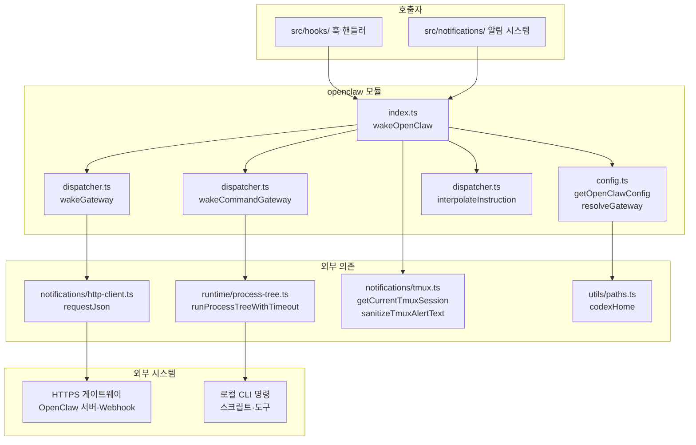

# src/openclaw 모듈 분석

## 폴더 구조

```
src/openclaw/
├── index.ts        # 공개 API + wakeOpenClaw() 메인 진입점
├── types.ts        # 타입 정의 (이벤트·게이트웨이 설정·페이로드·결과)
├── config.ts       # 설정 읽기·캐싱·alias 정규화·상태 진단
├── dispatcher.ts   # HTTP/CLI 게이트웨이 발송 + 보안 유틸
└── __tests__/      # 단위 테스트
```

---

## 시스템 개요

`src/openclaw/`는 **OMX 세션 훅 이벤트를 외부 HTTP 게이트웨이 또는 로컬 CLI 명령으로 전달하는 웨이커(waker) 서브시스템**이다. Discord·Telegram 등 기존 알림 채널과는 별도의 경로로, 자체 OpenClaw 서버나 임의 웹훅 엔드포인트·스크립트에 인스트럭션 페이로드를 비동기 발송한다.

```
OMX_OPENCLAW=1 (활성화 게이트)
         │
[config.ts] getOpenClawConfig()
   ├── OMX_OPENCLAW_CONFIG (env override 파일)
   ├── .omx-config.json → notifications.openclaw
   └── .omx-config.json → notifications.custom_cli_command / custom_webhook_command (alias 정규화)
         │
[index.ts] wakeOpenClaw(event, context)
   ├── resolveGateway(config, event) → 이벤트 → 게이트웨이 매핑 확인
   ├── interpolateInstruction(template, vars) → {{variable}} 치환
   ├── buildWhitelistedContext(context) → 민감 데이터 누출 방지
   └── 게이트웨이 타입에 따라 분기
         ├── HTTP  → dispatcher.ts::wakeGateway()
         │           → notifications/http-client.ts::requestJson()
         └── Command → dispatcher.ts::wakeCommandGateway()  [OMX_OPENCLAW_COMMAND=1 필요]
                       → runtime/process-tree.ts::runProcessTreeWithTimeout()
```

### 5가지 훅 이벤트

| 이벤트 | 설명 |
|--------|------|
| `session-start` | Codex 세션 시작 |
| `session-end` | 세션 완전 종료 |
| `session-idle` | 세션 유휴 감지 |
| `ask-user-question` | Codex가 사용자 질문 요청 |
| `stop` | 반복 모드 내 개별 stop |

> `pre-tool-use`, `post-tool-use`, `keyword-detector`는 OMC 전용 — Codex CLI에서 미지원.

---

## 파일별 상세 분석

---

### `types.ts` — 타입 정의

#### 게이트웨이 설정 타입 계층

```
OpenClawGatewayConfig (union)
├── OpenClawHttpGatewayConfig     type?: "http" (기본)
│     url       : string          (HTTPS 필수, localhost HTTP 허용)
│     headers?  : Record<string, string>
│     method?   : "POST" | "PUT"  (기본: POST)
│     timeout?  : number          (ms, 기본: 10000)
└── OpenClawCommandGatewayConfig  type: "command"
      command  : string           {{variable}} 플레이스홀더 포함 셸 명령 템플릿
      timeout? : number           (ms, 기본: 5000, 범위: 100~300000)
```

#### 설정 루트

```typescript
interface OpenClawConfig {
  enabled: boolean;
  gateways: Record<string, OpenClawGatewayConfig>;      // 이름 → 게이트웨이
  hooks: Partial<Record<OpenClawHookEvent, OpenClawHookMapping>>;
}

interface OpenClawHookMapping {
  gateway: string;       // gateways 키 참조
  instruction: string;   // {{variable}} 포함 인스트럭션 템플릿
  enabled: boolean;
}
```

#### 컨텍스트 타입 (화이트리스트)

```typescript
interface OpenClawContext {
  sessionId?, projectPath?, tmuxSession?,
  prompt?, contextSummary?, reason?, question?,
  tmuxTail?,
  replyChannel?,   // OPENCLAW_REPLY_CHANNEL 환경변수에서 읽음
  replyTarget?,    // OPENCLAW_REPLY_TARGET
  replyThread?,    // OPENCLAW_REPLY_THREAD
}
```

명시적 필드 열거로 인덱스 시그니처 없음 → **알 수 없는 키를 페이로드에 누출하지 않음**.

#### 발송 페이로드

```typescript
interface OpenClawPayload {
  event: OpenClawHookEvent;
  instruction: string;   // 보간된 인스트럭션
  text: string;          // instruction 별칭 (OpenClaw /hooks/wake 호환)
  timestamp: string;     // ISO 타임스탬프
  sessionId?, projectPath?, projectName?,
  tmuxSession?, tmuxTail?,
  channel?,    // replyChannel 별칭
  to?,         // replyTarget 별칭
  threadId?,   // replyThread 별칭
  context: OpenClawContext;
}
```

---

### `config.ts` — 설정 읽기·캐싱

#### `getOpenClawConfig()` — 런타임 설정 로딩

```
조건 1: OMX_OPENCLAW !== "1" → null 반환 (활성화 게이트)
조건 2: 캐시(_cachedConfig) 있음 → 캐시 반환

설정 소스 탐색 순서:
  1. OMX_OPENCLAW_CONFIG (별도 파일 경로) → OpenClawConfig 직접 파싱
  2. {codexHome()}/.omx-config.json
       → notifications.openclaw (명시적 설정, 우선순위 높음)
       → notifications.custom_cli_command / custom_webhook_command (alias, 폴백)
  → 유효 설정 없으면 undefined 캐시 + null 반환
```

두 소스가 모두 존재하면 `notifications.openclaw` 우선 적용, alias는 무시 + 경고 출력.

#### `normalizeFromCustomAliases(notifications)` — alias 정규화

`custom_cli_command` / `custom_webhook_command` 단순 설정을 런타임 `OpenClawConfig`로 자동 변환한다.

```
custom_cli_command → gateway "custom-cli" (type: "command")
custom_webhook_command → gateway "custom-webhook" (type: "http")

이벤트 기본값: ["session-end", "ask-user-question"]
인스트럭션 기본값: "OMX event {{event}} for {{projectPath}}"

두 alias 모두 있을 때 같은 이벤트에 매핑되면 후자(webhook)가 앞의 hook을 덮음 + 경고
```

#### `resolveGateway(config, event)` — 이벤트 → 게이트웨이 매핑

```
config.hooks[event] 없음 / enabled:false → null
config.gateways[mapping.gateway] 없음 → null
HTTP 게이트웨이: url 없으면 null
Command 게이트웨이: command 없으면 null
→ { gatewayName, gateway, instruction } 반환
```

#### `inspectOpenClawConfig()` — 진단 함수

CLI/디버그 전용. 5가지 상태를 반환:

| 상태 | 조건 |
|------|------|
| `disabled` | `OMX_OPENCLAW !== "1"` |
| `missing-config` | 설정 파일 없음 |
| `invalid-config` | JSON 파싱 실패 또는 스키마 불일치 |
| `not-configured` | 파일 있지만 openclaw 설정 없음 |
| `configured` | 유효한 설정 로딩 완료 |

---

### `dispatcher.ts` — 게이트웨이 발송

#### `validateGatewayUrl(url)` — URL 검증 (SSRF 방지)

```
HTTPS → 항상 허용
HTTP  → localhost / 127.0.0.1 / ::1 / [::1] 만 허용
그 외  → false (차단)
```

#### `interpolateInstruction(template, variables)` — 템플릿 보간

```
{{sessionId}}, {{projectPath}}, {{projectName}}, {{prompt}},
{{contextSummary}}, {{question}}, {{timestamp}}, {{event}},
{{instruction}}, {{replyChannel}}, {{replyTarget}}, {{replyThread}},
{{tmuxSession}}, {{tmuxTail}}

미정의 변수 → 빈 문자열로 교체 (원본 플레이스홀더 유지하지 않음)
```

#### `shellEscapeArg(value)` — 셸 이스케이프

```typescript
"'" + value.replace(/'/g, "'\\''") + "'"
// 예: hello world → 'hello world'
// 예: it's → 'it'"'"'s'
```

단일 인용부호 래핑으로 모든 특수문자를 안전하게 처리.

#### `resolveCommandTimeoutMs(gatewayTimeout?, envTimeoutRaw?)` — 타임아웃 우선순위

```
1. gateway.timeout (설정 파일 명시)
2. OMX_OPENCLAW_COMMAND_TIMEOUT_MS (환경변수)
3. 기본값 5000ms

안전 범위 강제: min(300000, max(100, Math.trunc(raw)))
```

#### `wakeGateway(name, config, payload)` — HTTP 게이트웨이 발송

```
1. validateGatewayUrl() → 실패 시 즉시 반환
2. requestJson(url, { method, headers, body: JSON.stringify(payload), timeoutMs })
3. !response.ok → { success: false, error: "HTTP {status}" }
4. catch → { success: false, error: message }
```

타임아웃 기본 10초, 설정 파일로 오버라이드 가능.

#### `wakeCommandGateway(name, config, variables)` — CLI 게이트웨이 발송

```
1. OMX_OPENCLAW_COMMAND !== "1" → 즉시 실패 반환 (별도 opt-in 게이트)
2. 명령 템플릿 보간 — 변수값에 shellEscapeArg() 적용 후 치환
3. SHELL_METACHAR_RE = /[|&;><`$()]/ 메타문자 감지:
   - 메타문자 있음: ["sh", "-c", interpolated]
   - 없음: 공백 분리 → [command, ...args] (직접 execFile)
4. runProcessTreeWithTimeout(command, args, { timeoutMs, cleanupOnParentExit:true })
   - 타임아웃/시그널/exit code 비정상 → 오류 throw
5. 부모 SIGTERM → 프로세스 트리 전체 SIGTERM → 1초 후 SIGKILL
```

---

### `index.ts` — wakeOpenClaw() 메인 진입점

```typescript
async function wakeOpenClaw(
  event: OpenClawHookEvent,
  context: OpenClawContext,
): Promise<OpenClawResult | null>
```

#### 실행 흐름

```
1. getOpenClawConfig() → null이면 즉시 null 반환
2. resolveGateway(config, event) → null이면 즉시 null 반환
3. 타임스탬프 생성 (now)
4. Reply 컨텍스트 수집:
     context.replyChannel ?? OPENCLAW_REPLY_CHANNEL 환경변수
     context.replyTarget  ?? OPENCLAW_REPLY_TARGET
     context.replyThread  ?? OPENCLAW_REPLY_THREAD
5. sanitizeTmuxAlertText(context.tmuxTail) — HUD 줄 제거
6. getCurrentTmuxSession() — tmux 세션명 자동 감지 (컨텍스트 미제공 시)
7. variables 맵 구성 (16개 변수)
8. interpolateInstruction(instruction, variables) → interpolatedInstruction
9. variables.instruction = interpolatedInstruction (커맨드 게이트웨이 {{instruction}} 지원)
10. 게이트웨이 타입 분기:
    isCommandGateway(gateway)
      true  → wakeCommandGateway(name, gateway, variables)
      false → HTTP 페이로드 구성 + wakeGateway(name, gateway, payload)
11. DEBUG(OMX_OPENCLAW_DEBUG=1) → 결과 stderr 로깅
12. catch all → null 반환 (훅 블로킹 절대 방지)
```

#### `buildWhitelistedContext(context)` — 컨텍스트 화이트리스팅

입력 컨텍스트에서 허가된 12개 필드만 추출하여 반환. `OpenClawContext`에 인덱스 시그니처가 없음에도 불구하고 타입 캐스팅으로 들어올 수 있는 추가 필드를 명시적으로 차단.

---

## 파일 간 의존관계

```
index.ts
  ├── types.ts                           (타입)
  ├── config.ts                          getOpenClawConfig(), resolveGateway()
  ├── dispatcher.ts                      wakeGateway(), wakeCommandGateway(),
  │                                      interpolateInstruction(), isCommandGateway()
  └── notifications/tmux.ts              getCurrentTmuxSession(), sanitizeTmuxAlertText()

config.ts
  ├── types.ts                           (타입)
  └── utils/paths.ts                     codexHome()

dispatcher.ts
  ├── types.ts                           (타입)
  ├── notifications/http-client.ts       requestJson()
  └── runtime/process-tree.ts           runProcessTreeWithTimeout()
```

---

## 호출 관계 다이어그램



---

## 설정 소스 우선순위

```mermaid
flowchart TD
    A{OMX_OPENCLAW=1?} -->|No| Z[null 반환]
    A -->|Yes| B{OMX_OPENCLAW_CONFIG 설정?}
    B -->|Yes| C[지정 파일 직접 파싱\n→ OpenClawConfig]
    B -->|No| D[.omx-config.json 읽기]
    D --> E{notifications.openclaw\n유효?}
    E -->|Yes| F[openclaw 설정 사용\nalias 있으면 경고]
    E -->|No| G{custom_cli_command /\ncustom_webhook_command?}
    G -->|Yes| H[alias 정규화\n→ OpenClawConfig 합성]
    G -->|No| Z
    F --> I[캐시 저장 + 반환]
    H --> I
    C --> I
```



---

## 보안 모델

| 위협 | 방어 수단 |
|------|----------|
| **SSRF** | `validateGatewayUrl()` — HTTPS 강제, localhost HTTP만 예외 |
| **셸 인젝션** | 변수값에 `shellEscapeArg()` 적용 후 보간, 메타문자 감지 시 `sh -c` 폴백 |
| **데이터 누출** | `buildWhitelistedContext()` — 12개 허용 필드만 추출, 나머지 차단 |
| **미인가 명령 실행** | `OMX_OPENCLAW_COMMAND=1` 별도 opt-in 게이트 (HTTP 게이트 `OMX_OPENCLAW=1`과 독립) |
| **타임아웃 오용** | 명령 타임아웃 범위 강제: 100ms ~ 300000ms |
| **프로세스 좀비** | `runProcessTreeWithTimeout(cleanupOnParentExit:true)` — 부모 SIGTERM 시 트리 전체 종료 |
| **훅 블로킹** | 모든 오류를 `catch` 후 null 반환 — OpenClaw 실패가 OMX 세션에 영향 없음 |

---

## 환경변수 레퍼런스

| 변수 | 역할 | 기본값 |
|------|------|--------|
| `OMX_OPENCLAW` | 활성화 게이트 (`"1"` 필요) | 비활성 |
| `OMX_OPENCLAW_COMMAND` | CLI 게이트웨이 허용 (`"1"` 필요) | 비활성 |
| `OMX_OPENCLAW_CONFIG` | 설정 파일 경로 오버라이드 | `.omx-config.json` |
| `OMX_OPENCLAW_COMMAND_TIMEOUT_MS` | CLI 타임아웃 (ms) | 5000 |
| `OMX_OPENCLAW_DEBUG` | 디버그 로깅 (`"1"`) | 비활성 |
| `OPENCLAW_REPLY_CHANNEL` | 답장 채널 (외부 봇 → OMX 주입) | — |
| `OPENCLAW_REPLY_TARGET` | 답장 대상 사용자/봇 | — |
| `OPENCLAW_REPLY_THREAD` | 스레드 기반 답장 ID | — |

---

## 설계 원칙

### 1. 이중 활성화 게이트

HTTP 게이트웨이(`OMX_OPENCLAW=1`)와 CLI 게이트웨이(`OMX_OPENCLAW_COMMAND=1`)를 독립적으로 관리한다. 웹훅만 허용하고 로컬 명령 실행은 별도로 opt-in해야 한다.

### 2. 설정 alias 정규화

기존 `custom_cli_command`/`custom_webhook_command` 단순 설정을 새로운 OpenClaw 스키마로 자동 변환한다. 하위 호환성을 유지하면서 명시적 `notifications.openclaw` 설정이 항상 우선된다.

### 3. 비차단(Fire-and-Forget) 발송

`wakeOpenClaw()` 최상위에서 모든 오류를 catch하고 null 반환. OpenClaw 연결 실패가 OMX 훅 실행 자체를 중단하지 않는다.

### 4. Reply 라우팅 컨텍스트

`OPENCLAW_REPLY_*` 환경변수를 통해 외부 봇이 OMX 세션에 답장을 역주입할 수 있는 컨텍스트를 페이로드에 포함한다. `context` 객체 필드와 최상위 페이로드 필드 두 경로로 모두 전달된다.

### 5. 컨텍스트 화이트리스팅

`OpenClawContext` 타입에 인덱스 시그니처가 없고, `buildWhitelistedContext()`가 명시적 필드 복사를 수행한다. 호출자가 타입 캐스팅으로 추가 필드를 주입해도 게이트웨이 페이로드에 포함되지 않는다.

### 6. 모듈 캐싱

`_cachedConfig` 모듈 수준 변수로 설정을 한 번만 읽는다. `resetOpenClawConfigCache()`는 테스트 전용이며 프로덕션에서는 호출하지 않는다.
