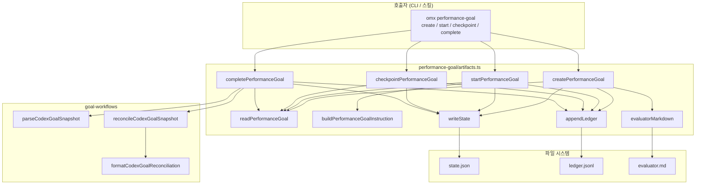
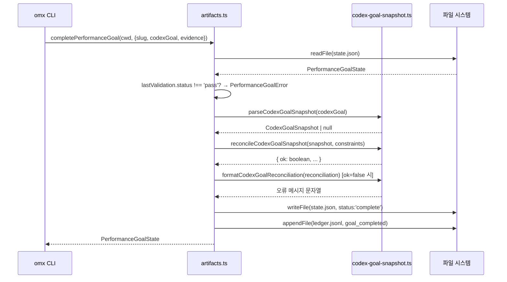

# src/performance-goal 모듈 분析

## 폴더 구조

```
src/performance-goal/
└── artifacts.ts   # 성능 목표 워크플로우 전체 구현 (단일 파일)
```

---

## 시스템 개요

`src/performance-goal/`는 **OMX 성능 개선 목표(Performance Goal)를 선언하고, 평가자(Evaluator)를 통해 검증하며, Codex Goal API와 상태를 동기화하는 워크플로우 서브시스템**이다.

파일 시스템 아티팩트(`.omx/goals/performance/{slug}/`)로 상태를 영속화하고, Codex Goal API(`create_goal`/`update_goal`/`get_goal`)와 협력하여 성능 최적화 사이클을 구조화한다.

```
omx performance-goal create …
          │
    createPerformanceGoal()
          │ 아티팩트 초기화
          ▼
  .omx/goals/performance/{slug}/
    ├── state.json       (구조화 상태)
    ├── ledger.jsonl     (변경 이력)
    └── evaluator.md     (평가자 계약 문서)

omx performance-goal start …
          │
    startPerformanceGoal()
          │ created → in_progress
          │ buildPerformanceGoalInstruction() 생성
          ▼
  모델에 Codex Goal 핸드오프 인스트럭션 출력

omx performance-goal checkpoint …
          │
    checkpointPerformanceGoal()
          │ validation_passed / validation_failed / blocked
          ▼
  state.json 갱신 + ledger.jsonl 이벤트 추가

omx performance-goal complete …
          │
    completePerformanceGoal()
          │ Codex Goal 스냅샷 재조정 검증
          │ state.status = 'complete'
          ▼
  state.json 완료 처리 + ledger.jsonl 최종 이벤트
```

---

## 상태 머신

```
[created]
    │  startPerformanceGoal()
    ▼
[in_progress]
    │
    ├── checkpointPerformanceGoal(status: 'pass')
    │       ▼
    │   [validation_passed]
    │       │  completePerformanceGoal()
    │       ▼
    │   [complete] ✓
    │
    ├── checkpointPerformanceGoal(status: 'fail')
    │       ▼
    │   [validation_failed]   (재시도 가능, 계속 checkpoint 호출)
    │
    └── checkpointPerformanceGoal(status: 'blocked')
            ▼
        [blocked]             (재시도 가능, 계속 checkpoint 호출)
```

`complete` 상태에서는 더 이상 checkpoint를 기록할 수 없다 (`PerformanceGoalError` 발생).

---

## 파일 시스템 레이아웃

```
{cwd}/.omx/goals/performance/{slug}/
├── state.json        PerformanceGoalState (들여쓰기 JSON)
├── ledger.jsonl      이벤트 로그 (JSONL, 추가 전용)
└── evaluator.md      평가자 계약 문서 (마크다운)
```

경로 상수:

| 상수 | 값 |
|------|----|
| `PERFORMANCE_GOAL_ROOT` | `.omx/goals/performance` |
| `PERFORMANCE_GOAL_STATE` | `state.json` |
| `PERFORMANCE_GOAL_LEDGER` | `ledger.jsonl` |
| `PERFORMANCE_GOAL_EVALUATOR` | `evaluator.md` |

---

## 파일별 상세 분析 — `artifacts.ts`

### 타입 정의

#### 상태·검증 열거형

```typescript
type PerformanceGoalStatus =
  | 'created' | 'in_progress' | 'validation_passed'
  | 'validation_failed' | 'blocked' | 'complete';

type PerformanceValidationStatus = 'pass' | 'fail' | 'blocked';
```

#### 핵심 상태 타입

```typescript
interface PerformanceGoalState {
  version: 1;
  workflow: 'performance-goal';
  slug: string;                   // URL-safe 식별자 (목표명에서 slugify)
  objective: string;              // 성능 목표 설명
  status: PerformanceGoalStatus;
  createdAt: string;              // ISO 타임스탬프
  updatedAt: string;
  startedAt?: string;
  completedAt?: string;
  evaluator: {
    command: string;              // 평가 실행 셸 명령
    contract: string;             // pass/fail 기준 설명
  };
  lastValidation?: {
    status: PerformanceValidationStatus;
    evidence: string;
    recordedAt: string;
  };
  artifactPaths: {                // 레포 상대 경로
    state: string;
    ledger: string;
    evaluator: string;
  };
}
```

#### 원장(Ledger) 이벤트 타입

```typescript
interface PerformanceGoalLedgerEntry {
  ts: string;
  event:
    | 'workflow_created'
    | 'goal_handoff_emitted'
    | 'validation_passed'
    | 'validation_failed'
    | 'validation_blocked'
    | 'goal_completed';
  status?: PerformanceGoalStatus;
  validationStatus?: PerformanceValidationStatus;
  evidence?: string;
  message?: string;
}
```

---

### 유틸리티 함수 (내부)

| 함수 | 동작 |
|------|------|
| `iso(now?)` | `Date` → ISO 8601 문자열 |
| `slugify(value)` | 목표명 → URL-safe slug (소문자·하이픈, max 48자) |
| `repoRelative(cwd, path)` | 절대 경로 → 레포 상대 경로 (`\` → `/` 정규화) |
| `workflowDir(cwd, slug)` | `{cwd}/.omx/goals/performance/{slug}` 경로 반환 |
| `requireText(value, name)` | 빈 문자열 거부 — `PerformanceGoalError` |
| `writeState(cwd, state)` | 디렉토리 생성 + `state.json` 원자적 덮어쓰기 |
| `appendLedger(cwd, slug, entry)` | `ledger.jsonl` 줄 추가 (추가 전용) |
| `evaluatorMarkdown(state)` | 마크다운 형식의 평가자 계약 문서 생성 |

---

### 공개 함수 상세

#### `createPerformanceGoal(cwd, options)` — 목표 생성

```
1. objective, evaluatorCommand, evaluatorContract 유효성 검증
2. slug = slugify(options.slug ?? objective)
3. force 없이 state.json 이미 존재하면 PerformanceGoalError
4. 초기 PerformanceGoalState 구성 (status: 'created')
5. 파일 쓰기:
     ledger.jsonl    — 빈 파일로 초기화
     evaluator.md    — 평가자 계약 마크다운
     state.json      — writeState()
6. appendLedger: 'workflow_created' 이벤트
7. state 반환
```

#### `readPerformanceGoal(cwd, slug)` — 상태 읽기

```
1. slugify(slug) → statePath 계산
2. readFile() 실패 → PerformanceGoalError (친절한 안내 포함)
3. JSON 파싱 후 스키마 검증:
     version !== 1 || workflow !== 'performance-goal' || !evaluator.command
     → PerformanceGoalError
4. 유효한 PerformanceGoalState 반환
```

#### `startPerformanceGoal(cwd, slug)` — 목표 시작

```
1. readPerformanceGoal() 호출
2. status === 'created'이면 → 'in_progress' 전환
     startedAt, updatedAt 갱신 + writeState()
   (이미 in_progress 이상이면 상태 변경 없이 진행)
3. buildPerformanceGoalInstruction(state) → 모델 핸드오프 텍스트 생성
4. appendLedger: 'goal_handoff_emitted' (셸 명령은 Codex goal 상태를 직접 변경하지 않음 명시)
5. { state, instruction } 반환
```

#### `checkpointPerformanceGoal(cwd, options)` — 검증 결과 기록

```
1. readPerformanceGoal()
2. status === 'complete' → PerformanceGoalError (완료된 목표에는 기록 불가)
3. evidence 유효성 검증 (requireText)
4. lastValidation 업데이트:
     pass    → status: 'validation_passed'
     fail    → status: 'validation_failed'
     blocked → status: 'blocked'
5. writeState() + appendLedger(이벤트)
6. 갱신된 state 반환
```

#### `completePerformanceGoal(cwd, options)` — 목표 완료

```
1. readPerformanceGoal()
2. lastValidation?.status !== 'pass' → PerformanceGoalError
   ("checkpoint --status pass 먼저 실행하라"는 안내 포함)
3. Codex Goal 재조정 검증:
     parseCodexGoalSnapshot(options.codexGoal)
     reconcileCodexGoalSnapshot(snapshot, {
       expectedObjective: state.objective,
       allowedStatuses: ['complete'],
       requireSnapshot: true,
       requireComplete: true,
     })
     reconciliation.ok이 false → formatCodexGoalReconciliation() 메시지로 PerformanceGoalError
4. status = 'complete', completedAt 설정 + writeState()
5. appendLedger: 'goal_completed'
6. state 반환
```

#### `buildPerformanceGoalInstruction(state)` — 핸드오프 인스트럭션 생성

모델(Codex)에 전달되는 텍스트 블록을 구성한다. 다음 항목을 포함:

```
- 아티팩트 경로 (state / ledger / evaluator)
- Codex Goal 통합 제약 조건 (8개 규칙)
  1. 먼저 get_goal 호출
  2. 기존 Codex goal이 있으면 먼저 완료
  3. 이 셸 명령은 Codex goal을 직접 변경하지 않음
  4. 평가자 없이 최적화 시작 금지
  5. 평가자 pass 없이 완료 불가
  6. update_goal → get_goal 재조회 → complete 명령 실행 순서
  7. omx performance-goal complete 명령 예시
  8. fail/blocked 시 checkpoint 후 반복
- create_goal 페이로드 (JSON)
- 평가자 명령
- 평가자 pass/fail 계약
- 목표 텍스트
```

---

## 의존 관계

```
src/performance-goal/artifacts.ts
  └── src/goal-workflows/codex-goal-snapshot.ts
        ├── parseCodexGoalSnapshot()       — JSON/unknown → Codex 스냅샷
        ├── reconcileCodexGoalSnapshot()   — 기대값과 실제 스냅샷 재조정
        └── formatCodexGoalReconciliation()— 재조정 오류 메시지 포맷
```

표준 라이브러리:
- `node:fs` (`existsSync`)
- `node:fs/promises` (`appendFile`, `mkdir`, `readFile`, `writeFile`)
- `node:path` (`join`, `relative`)

---

## 호출 관계 다이어그램



---

## 완료 조건 검증 흐름



---

## 설계 원칙

### 1. 평가자 계약 선행

목표 생성 시 반드시 평가자 명령과 pass/fail 계약을 명시해야 한다. 평가자 없이 최적화를 시작할 수 없으며, `evaluator.md` 파일이 아티팩트로 남아 검토 가능하다.

### 2. 완료 이중 잠금

`completePerformanceGoal()`은 두 가지 독립적인 조건을 모두 요구한다:
- **OMX 측**: `lastValidation.status === 'pass'` (평가자 명령 통과)
- **Codex 측**: `reconcileCodexGoalSnapshot()` 통과 (Codex goal 상태 `complete` 확인)

두 조건이 모두 충족되어야만 완료 처리된다.

### 3. JSONL 원장 추가 전용

`ledger.jsonl`은 추가 전용(`appendFile`) 이력 파일이다. 상태 변경 이력이 타임스탬프와 함께 보존되어 사후 감사가 가능하다.

### 4. Codex Goal API 분리

`startPerformanceGoal()`이 생성하는 핸드오프 인스트럭션은 모델이 `create_goal`/`update_goal`/`get_goal`을 직접 호출하도록 안내한다. **셸 명령 자체는 Codex goal 상태를 변경하지 않으며**, 모델이 직접 API를 호출해야 한다는 점을 주석과 ledger 이벤트 메시지로 명시한다.

### 5. slug 불변 식별자

목표 이름에서 파생된 slug는 48자 이하의 URL-safe 문자열로 정규화된다. 동일 slug로 재생성하려면 `--force` 옵션이 필요하다.

### 6. 경로 플랫폼 정규화

`repoRelative()`는 Windows `\` 경로 구분자를 `/`로 변환한다. 아티팩트 경로가 운영체제에 무관하게 일관되게 저장된다.
