# src/pipeline/ 모듈 분석

> 작성일: 2025-07  
> 대상 경로: `src/pipeline/`  
> 분석 범위: 소스 파일 전체(5개) + stages/ 하위 7개 + 테스트 파일 2개

---

## 1. 폴더 구조

```
src/pipeline/
├── index.ts                  # 모듈 공개 진입점 — 모든 타입/함수 재내보내기
├── orchestrator.ts           # 파이프라인 실행 오케스트레이터 (핵심)
├── review-verdict.ts         # 코드리뷰 판정 해석 헬퍼
├── types.ts                  # 공유 인터페이스/타입 정의
├── stages/                   # 각 실행 단계 어댑터
│   ├── deep-interview.ts     # 요구사항 명료화 단계
│   ├── ralplan.ts            # 합의 계획 수립 단계
│   ├── ultragoal.ts          # 목표 중심 실행 단계
│   ├── code-review.ts        # 코드 품질 게이트 단계
│   ├── ultraqa.ts            # 적대적 QA 검증 단계
│   ├── ralph-verify.ts       # Ralph 반복 검증 어댑터 (레거시 지원)
│   └── team-exec.ts          # tmux 기반 팀 실행 어댑터
└── __tests__/
    ├── orchestrator.test.ts  # 오케스트레이터 통합 테스트
    └── stages.test.ts        # 개별 스테이지 단위 테스트
```

---

## 2. 시스템 개요

`src/pipeline/`은 OMX Autopilot 루프의 **파이프라인 실행 계층**이다.  
스킬/워크플로 명령(e.g. `$autopilot`)이 호출되면 이 모듈이 단계를 순서대로 실행하며, 각 단계 결과를 축적해 다음 단계에 전달한다.

### 기본 Autopilot 파이프라인 순서

```
deep-interview → ralplan → ultragoal → code-review → ultraqa
     ↑                          ↑           │               │
     │                          └───────────┘               │
     │                        (비클린 판정 시 ralplan 복귀)   │
     └──────────────────────────────────────────────────────┘
                          (QA 비클린 시 ralplan 복귀)
```

- **상태 영속화**: 각 단계 전환 후 ModeState 시스템(`src/modes/base.ts`)에 JSON으로 저장
- **재시작 지원**: 중단된 파이프라인을 `.omx/state/` 파일에서 복원 가능
- **품질 루프**: `code-review` 또는 `ultraqa`가 비클린 판정을 내리면 `ralplan` 단계로 복귀, 최대 `maxRalphIterations`회 시도

---

## 3. 핵심 파일 상세 분석

### 3.1 `types.ts` — 공유 타입 정의

파이프라인 전체에서 사용하는 4개의 주요 인터페이스와 2개의 상태 확장 타입을 정의한다.

| 인터페이스 | 역할 |
|---|---|
| `StageContext` | 각 단계에 전달되는 컨텍스트 (task, artifacts, cwd, sessionId 등) |
| `StageResult` | 단계 실행 결과 (`completed`/`failed`/`skipped`, artifacts, duration_ms) |
| `PipelineStage` | 단계 구현체 계약 — `name`, `run(ctx)`, 선택적 `canSkip(ctx)` |
| `PipelineConfig` | 파이프라인 설정 (name, task, stages[], maxRalphIterations, callbacks) |
| `PipelineResult` | 전체 파이프라인 완료 결과 (status, stageResults, artifacts, failedStage) |
| `PipelineModeStateExtension` | `.omx/state/` 파일에 저장되는 파이프라인 전용 필드 |

**`PipelineModeStateExtension` 주요 필드:**
```typescript
{
  pipeline_stages: string[];           // 단계 이름 순서 배열
  pipeline_stage_index: number;        // 현재 실행 중인 단계 인덱스
  pipeline_stage_results: Record<string, StageResult>; // 누적 단계 결과
  review_cycle: number;                // 품질 루프 반복 횟수
  review_verdict: unknown;             // 최신 코드리뷰 판정
  qa_verdict: unknown;                 // 최신 UltraQA 판정
  return_to_ralplan_reason: string;    // ralplan 복귀 사유
  handoff_artifacts: Record<string, unknown>; // 단계 간 핸드오프 아티팩트
}
```

---

### 3.2 `orchestrator.ts` — 파이프라인 오케스트레이터

파이프라인의 핵심 실행 엔진. 5개의 공개 함수와 여러 내부 헬퍼로 구성된다.

#### 공개 API

| 함수 | 역할 |
|---|---|
| `runPipeline(config)` | 설정된 파이프라인을 순서대로 실행하고 `PipelineResult` 반환 |
| `canResumePipeline(cwd?)` | 재시작 가능한 파이프라인 상태가 존재하는지 확인 |
| `readPipelineState(cwd?)` | 현재 파이프라인 ModeState Extension을 읽어 반환 |
| `cancelPipeline(cwd?)` | 실행 중인 파이프라인을 취소 |
| `createAutopilotPipelineConfig(task, options)` | 기본 Autopilot 파이프라인 설정 객체 생성 |
| `createStrictAutopilotStages()` | 5단계 기본 파이프라인 스테이지 배열 반환 |

#### `runPipeline` 내부 흐름

```
1. validateConfig()                    // 이름/task/단계 유효성 검사
2. startMode('autopilot', ...)         // ModeState 초기화
3. updateModeState(pipelineExtension)  // 초기 상태 저장
4. for 각 단계:
   a. canSkip? → 건너뜀 → 상태 업데이트
   b. updateModeState(running)
   c. stage.run(ctx) 실행
   d. artifacts 병합
   e. code-review/ultraqa 판정 평가
   f. shouldReturnToRalplan? → i = ralplan 인덱스 - 1
   g. status == 'failed'? → 파이프라인 실패 반환
   h. updateModeState(결과)
5. updateModeState(complete)
6. PipelineResult 반환
```

#### 품질 게이트 로직
- `isNonCleanReviewVerdict()` — `clean === false` 또는 `recommendation !== 'APPROVE'` 또는 `architectural_status !== 'CLEAR'`이면 비클린
- `isNonCleanQaVerdict()` — `clean !== true`이면 비클린
- 비클린 판정 시 `reviewCycle++` → `maxRalphIterations` 초과 시 `failed` 반환

#### 내부 헬퍼

| 함수 | 역할 |
|---|---|
| `normalizeHandoffArtifactKeys()` | 단계 이름을 핸드오프 아티팩트 키로 정규화 (`code-review` → `code_review`) |
| `toHandoffArtifactKey()` | 단계 이름 → 핸드오프 키 매핑 |
| `findStageIndex()` | 단계 이름으로 인덱스 탐색 |
| `validateConfig()` | 설정 유효성 검사 (빈 이름, 중복 단계 이름, 양수 반복 횟수 등) |

---

### 3.3 `review-verdict.ts` — 판정 해석 헬퍼

```typescript
export function isNonCleanReviewVerdict(verdict: unknown): boolean
```

코드리뷰 판정 객체를 받아 비클린 여부를 판단하는 순수 함수. `ralplan.ts`와 `orchestrator.ts` 양쪽에서 공유된다.

판정 기준:
- `verdict.clean === false`
- `verdict.recommendation` 존재하고 `'APPROVE'`가 아님
- `verdict.architectural_status` 존재하고 `'CLEAR'`가 아님

---

### 3.4 `index.ts` — 모듈 공개 진입점

`pipeline/` 모듈의 모든 공개 타입과 함수를 재내보내는 배럴 파일.

```typescript
// 타입 재내보내기
export type { PipelineConfig, PipelineResult, PipelineStage, StageContext, StageResult, ... }

// 오케스트레이터 함수 재내보내기
export { runPipeline, cancelPipeline, canResumePipeline, ... }

// 각 스테이지 팩토리/빌더 재내보내기
export { createDeepInterviewStage, buildDeepInterviewInstruction }
export { createRalplanStage }
export { createTeamExecStage, buildTeamInstruction }
export { createRalphVerifyStage, createRalphStage, buildRalphInstruction }
export { createUltragoalStage, buildUltragoalInstruction }
export { createCodeReviewStage, buildCodeReviewInstruction }
export { createUltraqaStage, buildUltraqaInstruction }
```

---

## 4. stages/ 하위 파일 상세 분석

모든 스테이지는 `PipelineStage` 인터페이스를 구현한다: `{ name, run(ctx), canSkip?(ctx) }`

### 4.1 `deep-interview.ts` — 요구사항 명료화 단계

**역할**: Autopilot 루프의 첫 번째 게이트. `$deep-interview` 스킬 호출 지시문을 생성한다.

```typescript
interface DeepInterviewDescriptor {
  task: string;
  cwd: string;
  sessionId?: string;
  instruction: string;   // "$deep-interview \"<task>\""
}
```

| 함수 | 역할 |
|---|---|
| `createDeepInterviewStage()` | 스테이지 인스턴스 생성 |
| `buildDeepInterviewInstruction(task)` | `$deep-interview "<task>"` 문자열 반환 |

**반환 아티팩트**: `{ stage, deepInterviewDescriptor, instruction }`

---

### 4.2 `ralplan.ts` — 합의 계획 수립 단계

**역할**: Planner + Architect + Critic 에이전트의 합의 계획을 조율하는 단계. `.omx/plans/` 에 PRD/테스트 스펙 파일을 생성한다.

```typescript
interface CreateRalplanStageOptions {
  executor?: RalplanConsensusExecutor;  // 실시간 실행 시 필요
  maxIterations?: number;
}
```

**스킵 조건** (`canSkip`):
- 리뷰 루프 컨텍스트가 없고(`return_to_ralplan_reason` 없음)
- `isPlanningComplete()` — PRD + 테스트 스펙 파일 존재
- `hasDurableRalplanConsensusEvidence()` — Architect + Critic 승인 기록 존재

**두 실행 경로**:
1. **executor 있음**: `runRalplanConsensus()` 실제 에이전트 오케스트레이션
2. **executor 없음**: 파일 시스템에서 기존 planning artifacts + consensus gate 읽기

**주요 내부 함수**:

| 함수 | 역할 |
|---|---|
| `hasReviewLoopContext()` | 아티팩트에서 리뷰 루프 복귀 신호 감지 |
| `buildRalplanConsensusGate()` | 런타임 결과에서 consensus gate 빌드 |
| `hasDurableRalplanConsensusEvidence()` | 영속적 합의 증거 존재 여부 확인 |

**오류 코드**:
- `ralplan_planning_artifacts_missing` — PRD/스펙 파일 없음
- `ralplan_consensus_evidence_missing` — Architect/Critic 승인 없음
- `ralplan_planning_artifacts_missing_after_consensus` — 합의 후 파일 없음

---

### 4.3 `ultragoal.ts` — 목표 중심 실행 단계

**역할**: `$ultragoal` 스킬 호출 지시문을 생성. ralplan 아티팩트를 소비해 실행 단계로 전달한다.

```typescript
interface UltragoalDescriptor {
  task: string;
  ralplanArtifacts: Record<string, unknown>;
  instruction: string;          // "$ultragoal \"<task>\""
  teamCondition: string;        // 팀 실행 조건 안내 문자열
}
```

`teamCondition`: "Ultragoal 스토리 내에서 독립 레인이나 광범위한 검증이 유용할 때만 `$team`을 시작하라. Ultragoal은 목표와 원장 상태의 리더 소유다."

**반환 아티팩트**: `{ stage, ultragoalDescriptor, team_condition, instruction }`

---

### 4.4 `code-review.ts` — 코드 품질 게이트 단계

**역할**: `$code-review` 스킬 호출 지시문을 생성하고, 품질 판정을 통해 ralplan 복귀 여부를 결정한다.

```typescript
interface CodeReviewStageOptions {
  recommendation?: 'APPROVE' | 'COMMENT' | 'REQUEST CHANGES';
  architecturalStatus?: 'CLEAR' | 'WATCH' | 'BLOCK';
  summary?: string;
}

interface CodeReviewVerdict {
  recommendation: 'APPROVE' | 'COMMENT' | 'REQUEST CHANGES';
  architectural_status: 'CLEAR' | 'WATCH' | 'BLOCK';
  clean: boolean;
  summary: string;
}
```

**판정 로직**:
- `hasReviewEvidence`: `recommendation` 또는 `architecturalStatus` 중 하나라도 주입된 경우 `true`
- `clean = hasReviewEvidence && recommendation === 'APPROVE' && architecturalStatus === 'CLEAR'`
- 증거 없음 → `clean: false` (fail-closed 원칙)

**반환 아티팩트**: `{ stage, codeReviewDescriptor, review_verdict, return_to_ralplan_reason, instruction }`

---

### 4.5 `ultraqa.ts` — 적대적 QA 검증 단계

**역할**: 클린 리뷰 후 `$ultraqa` 스킬로 적대적 품질 검증을 수행한다.

```typescript
interface UltraqaStageOptions {
  clean?: boolean;         // QA 결과 주입
  skipped?: boolean;       // 저위험 조건으로 건너뜀
  summary?: string;
}

interface UltraqaVerdict {
  clean: boolean;
  skipped: boolean;
  summary: string;
}
```

**판정 로직**:
- `hasQaEvidence`: `clean` 또는 `skipped` 주입된 경우
- `clean = hasQaEvidence ? (options.clean ?? skipped) : false`
- 증거 없음 → `clean: false` (fail-closed 원칙)
- `skipped` 허용: 문서화된 저위험 조건에서 QA를 공식적으로 건너뜀

**반환 아티팩트**: `{ stage, ultraqaDescriptor, qa_verdict, return_to_ralplan_reason, instruction }`

---

### 4.6 `ralph-verify.ts` — Ralph 검증 어댑터 (레거시 지원)

**역할**: Ralph 반복 검증 루프를 `PipelineStage`로 감싸는 레거시 어댑터. 두 가지 팩토리 제공.

```typescript
interface RalphVerifyStageOptions {
  stageName?: string;              // 'ralph' 또는 'ralph-verify'
  executionArtifactKeys?: string[]; // 이전 단계 아티팩트 키
  maxIterations?: number;          // 기본값 10
}

interface RalphVerifyDescriptor {
  task: string;
  maxIterations: number;
  availableAgentTypes: string[];
  staffingPlan: ReturnType<typeof buildFollowupStaffingPlan>;
  executionArtifacts: Record<string, unknown>;
}
```

| 팩토리 | stageName | executionArtifactKeys | 사용처 |
|---|---|---|---|
| `createRalphVerifyStage()` | `'ralph-verify'` | `['ralph', 'team-exec']` | 레거시 검증 단계 |
| `createRalphStage()` | `'ralph'` | `['ralplan', 'team-exec']` | 명시적 Ralph 실행 단계 |

**외부 의존**: `src/team/followup-planner.ts` → `buildFollowupStaffingPlan`, `resolveAvailableAgentTypes`

---

### 4.7 `team-exec.ts` — 팀 실행 어댑터

**역할**: tmux 기반 Codex CLI 멀티워커 팀을 파이프라인 단계로 감싸는 어댑터. 가장 복잡한 스테이지 파일.

```typescript
interface TeamExecStageOptions {
  workerCount?: number;            // 기본값 2
  agentType?: string;              // 기본값 'executor'
  useWorktrees?: boolean;
  extraEnv?: Record<string, string>;
}

interface TeamExecDescriptor {
  task: string;
  workerCount: number;
  agentType: string;
  availableAgentTypes: string[];
  staffingPlan: ReturnType<typeof buildFollowupStaffingPlan>;
  useWorktrees: boolean;
  cwd: string;
  approvedExecution: ApprovedTeamExecutionBinding | null;
  extraEnv?: Record<string, string>;
}
```

**핵심 실행 경로**:

```
resolveTeamExecLaunch()
  ├─ ralplan.latestPlanPath 없음 → requestedTask 그대로 사용
  └─ latestPlanPath 있음 → resolveApprovedTeamLaunchFromPlanPath()
       ├─ resolveApprovedTeamPlanPath()  // PRD 경로 정규화 및 검증
       └─ readApprovedExecutionLaunchHintOutcome()  // 승인된 실행 힌트 읽기
            ├─ 'resolved' → buildApprovedTeamExecutionBinding()
            ├─ 'ambiguous' → Error: team_exec_approved_handoff_ambiguous
            └─ 기타 → Error: team_exec_approved_handoff_missing
```

**경로 정규화 내부 함수들**:

| 함수 | 역할 |
|---|---|
| `normalizePlanningRelativePath()` | 백슬래시 → 슬래시, `./` 제거, normalize |
| `resolvePlanningPrdPath()` | 절대/상대 경로 모두 처리, artifacts.prdPaths와 매칭 |
| `matchingTestSpecPathsForPrd()` | PRD 슬러그에 대응하는 테스트 스펙 파일 목록 |
| `readRuntimeLatestPlanningSelection()` | ralplan drafts 배열에서 최신 유효한 선택 탐색 |
| `readLatestApprovedPlanningSelection()` | prdPaths에서 테스트 스펙이 있는 최신 PRD 탐색 |

**CLI 지시문 생성** (`buildTeamInstruction`):
- `buildTeamRuntimeCliLaunchInput()` → `TeamRuntimeCliLaunchInput` 구성
- Base64url 인코딩 → `node dist/team/runtime-cli.js --input-json-base64 <encoded>`
- Windows/POSIX 셸 인수 이스케이프 구분 처리

---

## 5. 모듈 간 호출 관계

```mermaid
flowchart TD
    subgraph pipeline["src/pipeline/"]
        IDX[index.ts]
        ORC[orchestrator.ts]
        RV[review-verdict.ts]
        TY[types.ts]
        DI[stages/deep-interview.ts]
        RP[stages/ralplan.ts]
        UG[stages/ultragoal.ts]
        CR[stages/code-review.ts]
        QA[stages/ultraqa.ts]
        RVS[stages/ralph-verify.ts]
        TE[stages/team-exec.ts]
    end

    subgraph external["외부 모듈"]
        MB[src/modes/base.ts]
        PA[src/planning/artifacts.ts]
        RR[src/ralplan/runtime.ts]
        CG[src/ralplan/consensus-gate.ts]
        FP[src/team/followup-planner.ts]
        RD[src/team/repo-aware-decomposition.ts]
        AE[src/team/approved-execution.ts]
        TC[src/cli/team.ts]
        UP[src/utils/paths.ts]
    end

    IDX --> ORC
    IDX --> DI
    IDX --> RP
    IDX --> UG
    IDX --> CR
    IDX --> QA
    IDX --> RVS
    IDX --> TE
    IDX --> TY

    ORC --> MB
    ORC --> DI
    ORC --> RP
    ORC --> UG
    ORC --> CR
    ORC --> QA
    ORC --> RV
    ORC --> TY

    RP --> PA
    RP --> RR
    RP --> CG
    RP --> RV

    RVS --> FP
    TE --> FP
    TE --> RD
    TE --> AE
    TE --> PA
    TE --> TC
    TE --> UP
```



---

## 6. 외부 모듈 의존성 요약

| 외부 모듈 | 사용 위치 | 제공 기능 |
|---|---|---|
| `src/modes/base.ts` | `orchestrator.ts` | `startMode`, `readModeState`, `updateModeState`, `cancelMode` |
| `src/planning/artifacts.ts` | `ralplan.ts`, `team-exec.ts` | `isPlanningComplete`, `readPlanningArtifacts`, `readApprovedExecutionLaunchHintOutcome` |
| `src/ralplan/runtime.ts` | `ralplan.ts` | `runRalplanConsensus`, `RalplanConsensusExecutor` |
| `src/ralplan/consensus-gate.ts` | `ralplan.ts` | `buildRalplanConsensusGateForCwd`, `buildRalplanConsensusGateFromSources`, `hasDurableRalplanConsensusEvidenceForCwd` |
| `src/team/followup-planner.ts` | `ralph-verify.ts`, `team-exec.ts` | `buildFollowupStaffingPlan`, `resolveAvailableAgentTypes` |
| `src/team/repo-aware-decomposition.ts` | `team-exec.ts` | `buildRepoAwareTeamExecutionPlan` |
| `src/team/approved-execution.ts` | `team-exec.ts` | `buildApprovedTeamExecutionBinding`, `ApprovedTeamExecutionBinding` |
| `src/cli/team.ts` | `team-exec.ts` | `buildTeamExecutionPlan`, `parseTeamArgs` |
| `src/utils/paths.ts` | `team-exec.ts` | `packageRoot`, `sameFilePath` |

---

## 7. 상태 저장 구조 (`.omx/state/`)

```
.omx/state/
└── autopilot.json              # PipelineModeStateExtension 필드 포함
    ├── active: boolean
    ├── current_phase: string   # 현재 단계 이름 (e.g. 'ralplan', 'code-review:failed')
    ├── pipeline_name: string
    ├── pipeline_stages: string[]
    ├── pipeline_stage_index: number
    ├── pipeline_stage_results: { [stageName]: StageResult }
    ├── review_cycle: number
    ├── review_verdict: CodeReviewVerdict | null
    ├── qa_verdict: UltraqaVerdict | null
    ├── return_to_ralplan_reason: string | null
    ├── handoff_artifacts:
    │   ├── deep_interview: DeepInterviewDescriptor
    │   ├── ralplan: { prdPaths, testSpecPaths, ralplanConsensusGate, ... }
    │   ├── ultragoal: UltragoalDescriptor
    │   ├── code_review: CodeReviewDescriptor + review_verdict
    │   └── ultraqa: UltraqaDescriptor + qa_verdict
    └── completed_at?: string   # ISO 8601 완료 시각
```

---

## 8. 테스트 구조

### `orchestrator.test.ts`

- **테스트 환경**: `mkdtemp` 임시 디렉터리 + `OMX_ROOT/OMX_STATE_ROOT` 환경변수 격리
- **헬퍼**: `makeStage`, `makeFailingStage`, `makeThrowingStage` — 결과를 주입할 수 있는 목(mock) 스테이지 팩토리
- **주요 테스트 시나리오**:
  - 단순 순차 파이프라인 완료
  - 단계 실패 시 조기 종료
  - 예외(throw) 발생 시 failed 변환
  - `canSkip` 동작
  - `code-review` 비클린 → ralplan 복귀 루프
  - `maxRalphIterations` 초과 시 failed
  - `canResumePipeline` / `readPipelineState` / `cancelPipeline`
  - `createAutopilotPipelineConfig` / `createStrictAutopilotStages`

### `stages.test.ts`

- **테스트 환경**: `mkdtemp` 임시 디렉터리, PRD/테스트 스펙 파일 픽스처 생성
- **헬퍼**: 
  - `makeCtx` — 테스트용 `StageContext` 빌더
  - `writeReadyContextPack` — `.omx/context/` 컨텍스트 팩 파일 작성
  - `computeGitBlobSha1` — Git blob 해시 계산 (컨텍스트 팩 검증용)
  - `decodeRuntimeCliInstructionPayload` — base64url 인코딩된 CLI 인수 디코딩
- **커버 범위**: 7개 스테이지 모두의 `run()` + `buildXxxInstruction()` 함수, ralplan `canSkip` 로직, team-exec 경로 정규화

---

## 9. 설계 원칙 및 패턴

### 1. Fail-Closed 원칙
- `code-review`, `ultraqa` 모두 증거 없으면 `clean: false` 반환
- 알 수 없는 상태보다 명시적 실패가 안전

### 2. 단계 어댑터 패턴
- 각 스테이지는 실제 실행 로직을 소유하지 않고 **지시문(instruction)을 생성**하거나 **외부 런타임을 호출**
- 스킬 레이어(`$deep-interview`, `$ralplan` 등)가 실제 에이전트 오케스트레이션을 담당

### 3. 아티팩트 누적 모델
- `StageContext.artifacts`는 이전 모든 단계의 산출물을 `{ [stageName]: artifacts }` 형태로 누적
- 다운스트림 단계는 원하는 이전 단계의 아티팩트를 자유롭게 소비 가능

### 4. 상태 영속화 일관성
- 모든 단계 전환마다 `updateModeState()` 호출 → 중단 시 재시작 지원
- 핸드오프 아티팩트는 `normalizeHandoffArtifactKeys()`로 키 정규화(`code-review` → `code_review`)

### 5. 구성 가능한 품질 루프
- `maxRalphIterations`: 품질 루프 최대 반복 횟수 (기본 10)
- `ralplan` 단계는 `canSkip`으로 불필요한 재계획 방지 (리뷰 루프 진입 시 강제 실행)

### 6. 레거시 호환성
- `ralph-verify.ts`, `team-exec.ts`는 새 Autopilot 루프(ultragoal/code-review/ultraqa)와 기존 ralph/team 기반 레거시 파이프라인 모두 지원
- `createRalphStage` / `createRalphVerifyStage` 두 팩토리로 경로 분리

---

## 10. 연관 분석 파일

| 모듈 | 분석 파일 |
|---|---|
| `src/mcp/` | [mcp-module-analysis.md](./mcp-module-analysis.md) |
| `src/cli/` | [cli-module-analysis.md](./cli-module-analysis.md) |
| `src/modes/` | (미작성) |
| `src/ralplan/` | (미작성) |
| `src/team/` | (미작성) |
