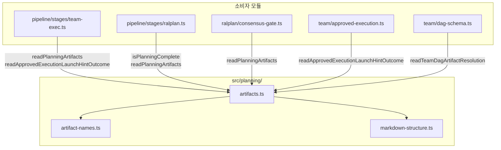

# src/planning/ 모듈 분석

> 작성일: 2025-07  
> 대상 경로: `src/planning/`  
> 분석 범위: 소스 파일 3개 + 테스트 파일 4개

---

## 1. 폴더 구조

```
src/planning/
├── artifact-names.ts          # 아티팩트 파일명 파싱·비교·선택 유틸리티
├── artifacts.ts               # 아티팩트 파일 I/O + 승인된 실행 힌트 파서 (핵심)
├── markdown-structure.ts      # Markdown 가시성 분석기 (코드블록·주석 제외)
└── __tests__/
    ├── artifacts.test.ts                               # 아티팩트 함수 단위 테스트
    ├── markdown-structure.test.ts                      # Markdown 파서 단위 테스트
    ├── approved-execution-lifecycle-matrix.test.ts     # 승인 실행 라이프사이클 매트릭스
    └── approved-launch-hint-lineage-matrix.test.ts     # 실행 힌트 계보 매트릭스
```

---

## 2. 시스템 개요

`src/planning/`은 OMX Ralplan → 실행 전환의 **파일 시스템 브리지** 역할을 한다.

Ralplan이 생성한 PRD/테스트 스펙 마크다운 파일을 읽고, 그 안에 내장된 실행 힌트(`$team`/`$ralph` 명령)를 파싱해 팀 실행(`team-exec.ts`) 또는 Ralph 실행에 전달한다.

### 데이터 흐름

```
.omx/plans/
  prd-{slug}.md          ← ralplan이 생성
  test-spec-{slug}.md    ← ralplan이 생성
  repo-context-{slug}.md ← 선택적 사이드카 파일
  team-dag-{slug}.json   ← 선택적 팀 DAG 사이드카
         │
         │ readPlanningArtifacts()
         ▼
  PlanningArtifacts
    { prdPaths[], testSpecPaths[], deepInterviewSpecPaths[] }
         │
         │ readApprovedExecutionLaunchHintOutcome()
         ▼
  PRD 파일 본문에서 정규식 추출
    "omx team 2:executor \"<task>\""
    "$ralph \"<task>\""
         │
         ▼
  ApprovedExecutionLaunchHintOutcome
    { status: 'resolved' | 'absent' | 'ambiguous', hint? }
         │
         ▼
  team/approved-execution.ts → buildApprovedTeamExecutionBinding()
  pipeline/stages/team-exec.ts → 실행 명령 구성
```

---

## 3. 파일별 상세 분석

### 3.1 `artifact-names.ts` — 파일명 파싱 유틸리티

계획 아티팩트 파일명을 구조적으로 파싱하고 정렬·선택하는 순수 함수 모음. 파일 I/O 없음.

#### 타입

```typescript
type PlanningArtifactKind = 'prd' | 'test-spec' | 'deep-interview' | 'deep-interview-autoresearch';

interface PlanningArtifactNameInfo {
  kind: PlanningArtifactKind;
  slug: string;
  timestamp?: string;   // "20260507T120000Z" 형식
}
```

#### 파일명 명명 규칙

| 종류 | 파일명 패턴 | 예시 |
|---|---|---|
| PRD | `prd-{slug}.md` | `prd-add-auth.md` |
| PRD (타임스탬프) | `prd-{ts}-{slug}.md` | `prd-20260507T120000Z-add-auth.md` |
| 테스트 스펙 | `test-spec-{slug}.md` 또는 `testspec-{slug}.md` | `test-spec-add-auth.md` |
| 테스트 스펙 (타임스탬프) | `test-spec-{ts}-{slug}.md` | `test-spec-20260507T120000Z-add-auth.md` |
| 딥 인터뷰 | `deep-interview-{slug}.md` | `deep-interview-add-auth.md` |
| 딥 인터뷰 자동리서치 | `deep-interview-autoresearch-{slug}.md` | |

#### 공개 함수

| 함수 | 역할 |
|---|---|
| `parsePlanningArtifactFileName(path)` | 파일명 → `PlanningArtifactNameInfo` 파싱. 미인식 시 `null` |
| `planningArtifactSlug(path, kind)` | 지정 kind의 slug 반환. kind 불일치 시 `null` |
| `planningArtifactTimestamp(date?)` | `Date` → `"20260507T120000Z"` 형식 타임스탬프 문자열 |
| `comparePlanningArtifactPaths(left, right)` | 타임스탬프 → 사전순으로 비교. 타임스탬프 없는 파일은 더 오래된 것으로 간주 |
| `selectMatchingTestSpecsForPrd(prdPath, testSpecPaths)` | PRD에 대응하는 테스트 스펙 파일 목록 반환 |
| `selectLatestPlanningArtifactPath(paths)` | 가장 최신 타임스탬프를 가진 파일 경로 반환 |

#### PRD-테스트 스펙 매칭 로직

- **타임스탬프 있는 PRD**: 동일 타임스탬프의 `test-spec-{ts}-{slug}.md`만 대응
- **레거시 PRD** (타임스탬프 없음): slug가 같은 `test-spec-{slug}.md` / `testspec-{slug}.md` 대응

```typescript
// 예시: prd-20260507T120000Z-add-auth.md
// → 대응: test-spec-20260507T120000Z-add-auth.md (동일 타임스탬프 필수)

// 예시: prd-add-auth.md (레거시)
// → 대응: test-spec-add-auth.md, testspec-add-auth.md
```

---

### 3.2 `markdown-structure.ts` — Markdown 가시성 분석기

Markdown 문서에서 **일반 텍스트(normal) 영역만** 추출하는 상태 머신 파서. 코드 블록, HTML 주석, 들여쓰기 코드 내의 텍스트를 제외한다.

PRD 파일에서 실행 힌트를 추출할 때 코드 예시 내의 `omx team ...` 명령이 잘못 매칭되는 것을 방지하기 위해 사용된다.

#### 타입

```typescript
type MarkdownScanState = 'normal' | 'fenced' | 'indented-code' | 'comment';

interface MarkdownVisibilityState {
  fence: MarkdownFenceState | null;   // 현재 열린 코드 펜스 상태
  commentDepth: number;               // 중첩 HTML 주석 깊이
}

interface MarkdownLineInspection {
  scanState: MarkdownScanState;
  visibleText: string;    // 'normal' 상태일 때만 원본 줄 텍스트, 나머지는 ''
  nextState: MarkdownVisibilityState;
}
```

#### 상태 전환 규칙

```
normal → fenced       : ``` 또는 ~~~ 시작
fenced → normal       : 동일 문자 동일 길이 이상의 펜스 닫힘 (suffix는 공백만 허용)
normal → comment      : <!-- 로 시작하는 줄
comment → normal      : --> 으로 닫힘 (중첩 depth 추적)
normal → indented-code: 4칸 이상 들여쓰기 또는 탭 시작 줄
indented-code → normal: 다음 비들여쓰기 줄
```

#### 공개 함수

| 함수 | 역할 |
|---|---|
| `inspectMarkdownLine(state, line)` | 한 줄 분석 → `MarkdownLineInspection` 반환 |
| `collectMarkdownVisibleMatches(content, pattern)` | 전체 Markdown에서 가시 영역의 패턴 매칭 결과 배열 반환 |
| `isIndentedMarkdownCodeLine(line)` | 들여쓰기 코드 줄 여부 |
| `INITIAL_MARKDOWN_VISIBILITY_STATE` | 초기 상태 상수 (`fence: null, commentDepth: 0`) |

#### `collectMarkdownVisibleMatches` 동작

```typescript
// 코드 펜스 안의 "match-token"은 무시되고, 일반 텍스트에서만 매칭
const content = `
Some match-token here
\`\`\`
match-token inside fence (ignored)
\`\`\`
Another match-token
`;
collectMarkdownVisibleMatches(content, /match-token/g);
// → ["match-token", "match-token"] (2개, 펜스 안 1개 제외)
```

---

### 3.3 `artifacts.ts` — 아티팩트 I/O + 승인 실행 힌트 파서

`src/planning/` 모듈의 핵심 파일. 계획 파일 읽기, 실행 힌트 파싱, 팀 DAG 해석 등 실질적인 파일 시스템 연산을 모두 담당한다.

#### 주요 타입

```typescript
// 파일 시스템 스캔 결과
interface PlanningArtifacts {
  plansDir: string;              // .omx/plans/
  specsDir: string;              // .omx/specs/
  prdPaths: string[];            // prd-*.md 파일 목록 (정렬됨)
  testSpecPaths: string[];       // test-spec-*.md 파일 목록
  deepInterviewSpecPaths: string[];  // deep-interview-*.md 파일 목록
}

// PRD에 포함된 실행 힌트 파싱 결과
interface ApprovedExecutionLaunchHint extends ApprovedPlanContext {
  mode: 'team' | 'ralph';
  command: string;   // 정규화된 실행 명령 ("omx team 2:executor \"task\"")
  task: string;      // 명령 내 따옴표 제거한 task 문자열
  workerCount?: number;    // team 모드 전용
  agentType?: string;      // team 모드 전용 (e.g. 'executor')
  linkedRalph?: boolean;   // team 모드에서 ralph 연계 여부
  sourcePath: string;      // PRD 파일 경로
  testSpecPaths: string[]; // 연결된 테스트 스펙 파일들
  repositoryContextSummary?: ApprovedRepositoryContextSummary;
}

// 실행 힌트 조회 결과 (판별 유니온)
type ApprovedExecutionLaunchHintOutcome =
  | { status: 'absent' }    // PRD 없거나 힌트 없음
  | { status: 'ambiguous' } // 동일 조건 힌트가 여러 개
  | { status: 'resolved'; hint: ApprovedExecutionLaunchHint };

// 팀 DAG 아티팩트 해석 결과
interface TeamDagArtifactResolution {
  source: 'json-sidecar' | 'markdown-handoff' | 'none';
  prdPath: string | null;
  planSlug: string | null;
  artifactPath?: string;
  content?: string;         // JSON 문자열
  warnings: string[];
}
```

#### 공개 API

| 함수 | 역할 |
|---|---|
| `readPlanningArtifacts(cwd)` | `.omx/plans/`, `.omx/specs/` 디렉터리를 스캔해 `PlanningArtifacts` 반환 |
| `isPlanningComplete(artifacts)` | PRD + 테스트 스펙이 모두 존재하는지 확인 |
| `readLatestPlanningArtifacts(cwd)` | 최신 PRD와 그에 대응하는 테스트 스펙 선택 반환 |
| `selectLatestPlanningArtifacts(artifacts)` | 이미 읽은 artifacts에서 최신 선택 반환 |
| `readApprovedExecutionLaunchHintOutcome(cwd, mode, options?)` | PRD에서 승인 실행 힌트 파싱 → `ApprovedExecutionLaunchHintOutcome` |
| `readApprovedExecutionLaunchHint(cwd, mode, options?)` | `readApprovedExecutionLaunchHintOutcome` 래퍼 — `null` 또는 즉시 사용 가능한 hint |
| `readTeamDagArtifactResolution(cwd)` | `team-dag-{slug}.json` 사이드카 또는 PRD 마크다운 핸드오프에서 DAG 해석 |
| `decodeApprovedExecutionQuotedValue(raw)` | 단인용부호/쌍인용부호로 감싼 문자열 디코딩 |

---

#### 실행 힌트 파싱 심층 분석

PRD 파일 안의 텍스트에서 아래 두 패턴을 `collectMarkdownVisibleMatches`로 추출한다:

```
team 패턴:
(?:omx\s+team|\$team)\s+(?:ralph\s+)?(?<count>\d+)(?::(?<role>[a-z][a-z0-9-]*))?\s+(?<task>".."|'..')

ralph 패턴:
(?:omx\s+ralph|\$ralph)\s+(?<task>".."|'..')
```

**정규화 규칙**:
- `$team` / `omx team` 접두어 보존 (사용된 형태 그대로)
- `$team 2 "task"` → role 없으면 count만, `$team 2:executor "task"` → count:role
- `$team ralph 3 "task"` → `linkedRalph: true`

**힌트 조회 우선순위**:

```
readApprovedExecutionLaunchHintOutcome(cwd, mode, options)
  │
  ├─ options.prdPath 지정됨 → 해당 PRD에서만 탐색
  │
  ├─ task + command 없음 (bare 조회):
  │   → 최신 PRD에서 탐색
  │   → 파일 준비 안 됨 → resolveOlderReusableSameLineageHint()로 폴백
  │       (같은 서명의 더 오래된 PRD 역순 탐색)
  │
  └─ task 또는 command 지정됨:
      → 모든 PRD를 최신→오래된 순으로 순회
      → team 계보 앵커 추적 (같은 task의 첫 발견 서명으로 이후 필터링)
      → 준비된 hint 즉시 반환, 없으면 준비 안 된 hint 폴백
```

**힌트 "준비" 조건**:
- `testSpecPaths.length > 0` AND
- `existsSync(hint.sourcePath)` — PRD 파일이 아직 존재함

---

#### 리포지토리 컨텍스트 요약 추출

PRD 파일에서 팀 실행에 필요한 코드베이스 컨텍스트를 요약해 힌트에 첨부한다.

**두 가지 소스** (우선순위 순):
1. **사이드카 파일**: `.omx/plans/repo-context-{slug}.md` — 존재하면 우선 사용
2. **PRD 인라인 섹션**: `## Approved Repository Context Summary` 헤딩 아래 본문

**제한**:
- 최대 `4,000` 자 또는 `80` 줄 (초과 시 `truncated: true`)

---

#### 팀 DAG 아티팩트 해석

`readTeamDagArtifactResolution(cwd)`:

```
1. planning incomplete → { source: 'none', warnings: ['planning_incomplete'] }
2. .omx/plans/team-dag-{slug}.json 존재 → { source: 'json-sidecar', content: <JSON> }
3. PRD 본문 "Team DAG Handoff" 섹션 JSON 블록 추출 → { source: 'markdown-handoff', content: <JSON> }
4. 없음 → { source: 'none', warnings: [] }
```

---

#### `resolveRequestedPrdPath` — 상대 경로 해석

`options.prdPath`에 상대 경로를 허용한다. 보안을 위해 `resolveRelativePathWithinRoot()`를 사용해 루트 디렉터리(`repoRoot`) 밖으로 경로가 탈출하지 못하도록 제한한다.

```
[절대 경로] → resolve() 후 artifacts.prdPaths 매칭
[상대 경로] → repoRoot 기준 resolve 시도 → plansDir 기준 resolve 시도
모두 실패 → null
```

---

## 4. 모듈 간 호출 관계



---

## 5. 외부 의존성

| 외부 모듈 | 사용 위치 | 역할 |
|---|---|---|
| `node:fs` (sync) | `artifacts.ts` | `existsSync`, `readdirSync`, `readFileSync` — 계획 파일 동기 읽기 |
| `node:path` | `artifacts.ts`, `artifact-names.ts` | `basename`, `join`, `resolve`, `isAbsolute` |
| `./artifact-names.js` | `artifacts.ts` | 파일명 파싱·정렬·선택 유틸 |
| `./markdown-structure.js` | `artifacts.ts` | Markdown 가시 영역 패턴 매칭 |

---

## 6. `.omx/` 디렉터리 파일 구조

```
.omx/
├── plans/
│   ├── prd-{slug}.md                    # Ralplan이 생성하는 PRD 문서
│   ├── prd-{ts}-{slug}.md               # 타임스탬프 포함 PRD
│   ├── test-spec-{slug}.md              # 테스트 스펙 문서
│   ├── test-spec-{ts}-{slug}.md         # 타임스탬프 포함 테스트 스펙
│   ├── repo-context-{slug}.md           # 선택적 리포지토리 컨텍스트 사이드카
│   └── team-dag-{slug}.json             # 선택적 팀 DAG 사이드카
└── specs/
    ├── deep-interview-{slug}.md         # 딥 인터뷰 명세
    └── deep-interview-autoresearch-{slug}.md  # 자동 리서치 딥 인터뷰 명세
```

---

## 7. 실행 힌트 패턴 예시

PRD 파일 내에 자연어와 함께 내장된 형태:

```markdown
## Implementation Plan

The implementation will require team execution:

Launch via `omx team 2:executor "Implement the auth feature"`

Or with Ralph verification:

Launch via `$team ralph 3:executor "Implement the auth feature"`

Single-agent fallback:

Launch via `omx ralph "Implement the auth feature"`
```

추출 결과:
- team 힌트 1: `{ command: 'omx team 2:executor "..."', workerCount: 2, agentType: 'executor', linkedRalph: false }`
- team 힌트 2: `{ command: '$team ralph 3:executor "..."', workerCount: 3, agentType: 'executor', linkedRalph: true }`
- ralph 힌트: `{ command: 'omx ralph "..."', mode: 'ralph' }`

코드 펜스 안에 동일 패턴이 있어도 `collectMarkdownVisibleMatches`가 필터링해 무시한다.

---

## 8. 테스트 파일 요약

### `artifacts.test.ts`

- **환경**: `mkdtemp` 임시 디렉터리 + `fs` 모듈 모킹 (`syncBuiltinESMExports`)
- **커버 범위**:
  - `decodeApprovedExecutionQuotedValue` — 단/쌍인용 부호 왕복 변환
  - `isPlanningComplete` — PRD+테스트 스펙 조합 판정
  - `readPlanningArtifacts` — 파일 시스템 스캔 결과
  - `readLatestPlanningArtifacts` — 최신 선택
  - `readApprovedExecutionLaunchHint` / `readApprovedExecutionLaunchHintOutcome` — 실행 힌트 추출
  - `readTeamDagArtifactResolution` — DAG 아티팩트 해석
- **헬퍼**: `writeContextPack`, `writeContextPackWithEntries`, `computeGitBlobSha1`

### `markdown-structure.test.ts`

- **환경**: 파일 시스템 없음 (순수 문자열 테스트)
- **커버 범위**: `collectMarkdownVisibleMatches`의 다양한 펜스/주석/들여쓰기 시나리오
- **접근법**: 테스트 전용 `ModelFenceState` 모델을 독립 구현해 참조 구현과 비교 검증

### `approved-execution-lifecycle-matrix.test.ts`

- **환경**: 실제 PRD + 테스트 스펙 파일 작성 후 전체 파이프라인 시뮬레이션
- **커버 범위**:
  - PRD 있으나 테스트 스펙 없음 → `absent`
  - PRD + 테스트 스펙 있음 → `resolved`
  - `buildApprovedTeamExecutionBinding`, `buildApprovedTeamHandoffSection` 출력 검증
  - `createTeamExecStage().run()` 실행 결과 종단 간(E2E) 검증
- **외부 의존**: `team/approved-execution.ts`, `cli/ralph.ts`, `pipeline/stages/team-exec.ts`

### `approved-launch-hint-lineage-matrix.test.ts`

- **환경**: 여러 PRD 파일 상태(`none`, `hidden`, `ready`, `nonready`, `ambiguous`)와 쿼리 종류(`bare`, `task`, `command`, `signatureA/B`)의 **조합 행렬** 테스트
- **커버 범위**:
  - Ralph 5개 × 3개 = 15가지 조합
  - Team 10개 × 8개 = 80가지 조합
  - 계보 앵커 추적(같은 서명 유지), 폴백 동작, ambiguous 감지
- **목적**: 계보(lineage) 기반 힌트 해석의 회귀 방지

---

## 9. 설계 원칙

### 1. 파일 시스템 진실의 원천
- 모든 상태는 `.omx/plans/`, `.omx/specs/` 디렉터리 파일에 있음
- ModeState나 메모리 캐시 없이 매 호출마다 동기 파일 시스템 읽기

### 2. PRD 본문에 실행 힌트 내장
- 에이전트가 PRD를 작성할 때 `omx team N "task"` 형태로 실행 방법을 문서화
- `artifacts.ts`가 이를 파싱해 파이프라인 실행의 입력으로 변환

### 3. 타임스탬프 기반 버전 관리
- 파일명에 `{ts}` 포함 시 버전 식별이 명확해짐
- 타임스탬프 없는 레거시 파일도 지원 (slug 기반 매칭)
- `selectLatestPlanningArtifactPath`: 타임스탬프 → 사전순 정렬로 최신 선택

### 4. Fail-Safe 힌트 해석
- 동일 조건의 힌트가 여러 개 → `ambiguous` (실행 거부)
- 파일 없음 / 힌트 없음 → `absent` (실행 거부)
- 최신 PRD가 준비 안 됨 → 같은 계보의 오래된 PRD로 폴백

### 5. 가시 영역 한정 파싱
- 코드 예시, HTML 주석, 들여쓰기 코드 블록은 파싱 제외
- PRD가 문서화 목적으로 `$team` 명령을 예시로 보여줘도 실행 힌트로 오인하지 않음

### 6. 경계 내 경로 해석
- `resolveRelativePathWithinRoot`: 상대 경로가 `repoRoot` 밖으로 탈출 불가
- `..` 세그먼트로 루트 이상 역행 시 `null` 반환

---

## 10. 연관 분석 파일

| 모듈 | 분석 파일 |
|---|---|
| `src/pipeline/` | [pipeline-module-analysis.md](./pipeline-module-analysis.md) |
| `src/mcp/` | [mcp-module-analysis.md](./mcp-module-analysis.md) |
| `src/cli/` | [cli-module-analysis.md](./cli-module-analysis.md) |
| `src/ralplan/` | (미작성) |
| `src/team/` | (미작성) |
