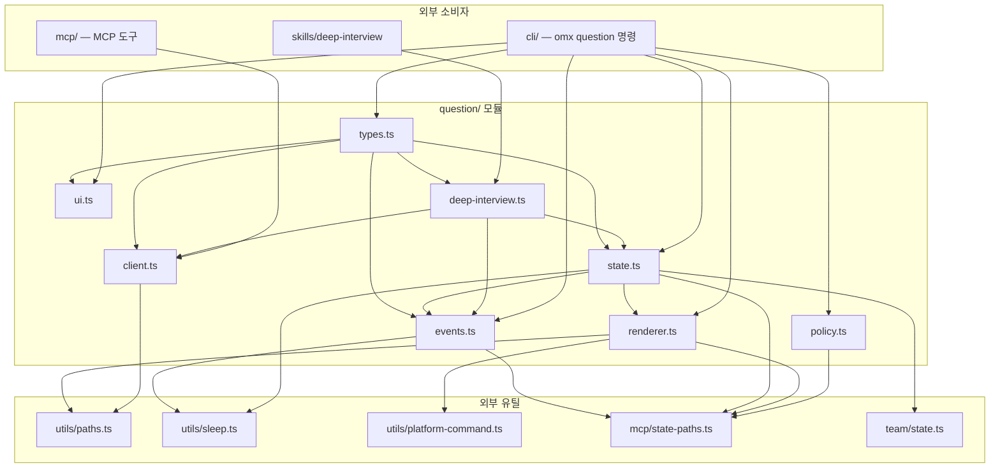

# src/question 모듈 분석

## 폴더 구조

```
src/question/
├── types.ts          # 데이터 모델·인터페이스·정규화 유틸
├── events.ts         # 이벤트 로그 I/O (question-events.jsonl)
├── state.ts          # 질문 레코드 생성·갱신·제출 잠금
├── policy.ts         # 실행 정책 (워커/팀/자동실행 모드 차단)
├── renderer.ts       # 렌더러 전략 선택·tmux 패인 런칭·생존 확인
├── ui.ts             # TTY 인터랙티브 UI (키입력·커서·멀티선택 위저드)
├── client.ts         # `omx question` CLI 서브프로세스 클라이언트
├── deep-interview.ts # deep-interview 훅과의 Obligation 브릿지
└── __tests__/        # 단위 테스트
```

---

## 시스템 개요

`src/question/`은 **OMX가 LLM 에이전트 실행 도중 사람에게 선택형 질문을 보내고 답변을 받는** 전체 파이프라인을 구현한다.

```
[LLM / deep-interview] → client.ts → (omx question 서브프로세스)
                                             ↓
                                       policy 검사
                                             ↓
                                       state 생성 (QuestionRecord JSON)
                                             ↓
                                       renderer 전략 선택
                                       (inside-tmux / windows-console / inline-tty)
                                             ↓
                                       ui.ts 인터랙티브 위저드 (TTY)
                                             ↓
                                       state 업데이트 (status: answered)
                                             ↓
                                       events.ts 로그 기록
                                             ↓
                              답변 JSON → stdout → client.ts 파싱 → 반환
```

### 모듈 계층 구조

| 계층 | 파일 | 역할 |
|------|------|------|
| **타입** | `types.ts` | 모든 데이터 모델, 정규화 함수 |
| **상태** | `state.ts` | 레코드 CRUD, 제출 잠금, 폴링 |
| **이벤트** | `events.ts` | JSONL 이벤트 로그, 잠금, 정규화 |
| **정책** | `policy.ts` | 실행 허가/차단 평가 |
| **렌더러** | `renderer.ts` | 전략 탐지, tmux 패인 런칭, 생존 확인 |
| **UI** | `ui.ts` | TTY 인터랙티브 위저드, 키 입력 처리 |
| **클라이언트** | `client.ts` | 서브프로세스 실행, 결과 JSON 파싱 |
| **통합** | `deep-interview.ts` | `$deep-interview` 스킬 Obligation 관리 |

---

## 파일별 상세 분석

---

### `types.ts` — 데이터 모델 및 정규화

#### 핵심 타입

```typescript
// 질문 옵션 항목
interface QuestionOption {
  label: string;
  value: string;
  description?: string;
}

type QuestionType = 'single-answerable' | 'multi-answerable';

// 단일 질문 항목 (멀티-질문 위저드의 원소)
interface QuestionItem {
  id?: string;
  header?: string;
  question: string;
  options: QuestionOption[];
  allow_other: boolean;    // "기타" 자유 입력 허용
  other_label: string;
  multi_select: boolean;
  type?: QuestionType;
}

// id·type 보장된 정규화 버전
interface NormalizedQuestionItem extends QuestionItem {
  id: string;
  source?: string;
  type: QuestionType;
  multi_select: boolean;
}
```

#### 답변 구조

```typescript
interface QuestionAnswer {
  kind: 'option' | 'other' | 'multi';
  value: string | string[];
  selected_labels: string[];
  selected_values: string[];
  other_text?: string;
}

interface QuestionAnswerEntry {
  question_id: string;
  index: number;
  answer: QuestionAnswer;
}
```

#### QuestionRecord — 질문 생명주기 문서

```typescript
interface QuestionRecord {
  kind: 'omx.question/v1';
  question_id: string;
  session_id?: string;
  created_at: string;
  updated_at: string;
  status: 'pending' | 'prompting' | 'answered' | 'aborted' | 'error';
  run_id?: string;
  // ... 질문 필드 ...
  questions?: NormalizedQuestionItem[];  // 멀티-질문 위저드 시
  renderer?: QuestionRendererState;
  answer?: QuestionAnswer;   // 첫 번째 답변 (하위 호환)
  answers?: QuestionAnswerEntry[];  // 전체 답변 배열
  error?: { code, message, at };
}
```

#### 렌더러 상태

```typescript
type QuestionRendererKind = 'tmux-pane' | 'tmux-session' | 'inline-tty' | 'windows-console';

interface QuestionRendererState {
  renderer: QuestionRendererKind;
  target: string;           // 패인 ID 또는 세션 이름
  launched_at: string;
  return_target?: string;   // 답변 주입 대상 패인
  return_transport?: 'tmux-send-keys';
  pid?: number;             // windows-console용
}
```

#### 정규화 유틸 (types.ts 내 함수)

```typescript
normalizeQuestionInput(input)  // 원시 입력 → NormalizedQuestionItem[]
normalizeOption(raw, index)    // 문자열/객체 → QuestionOption
parseQuestionType(raw)         // 문자열 → QuestionType (오타 허용)
getNormalizedQuestionType(item) // multi_select 플래그까지 고려
isMultiAnswerableQuestion(item) // multi-answerable 여부
```

---

### `state.ts` — 레코드 생명주기 관리

#### 파일 경로 해결

```typescript
getQuestionStateDir(cwd, sessionId?)
// → {stateDir}/questions/

getQuestionRecordPath(cwd, questionId, sessionId?)
// → {stateDir}/questions/{questionId}.json
```

#### 레코드 CRUD

```typescript
// 생성 — normalizeQuestionInput 후 JSON 원자적 쓰기
createQuestionRecord(cwd, input, sessionId?, now?, options?)

// 읽기
readQuestionRecord(recordPath): Promise<QuestionRecord | null>

// 업데이트 (updater 함수 패턴)
updateQuestionRecord(recordPath, updater)

// 상태 전환 헬퍼
markQuestionPrompting(recordPath, renderer)   // pending → prompting
markQuestionAnswered(recordPath, answer)       // → answered
markQuestionAborted(recordPath, code, message) // → aborted
markQuestionTerminalError(recordPath, code, message) // → error
```

#### 답변 제출 (`submitQuestionAnswer`)

```
withQuestionSubmitLock(recordPath, async () => {
  1. 레코드 읽기, status == 'prompting' 확인
  2. entry 검증 (validateAnswerEntries: 중복·없는 옵션 검사)
  3. markQuestionAnswered 호출
  4. appendQuestionAnsweredEventOnce (중복 방지)
})
```

잠금은 `{recordPath}.submit.lock/` 디렉터리 기반이며 스테일 복구(30초)와 타임아웃(10초)을 지원한다.

#### 답변 대기 (`waitForQuestionAnswer`)

```typescript
// 폴링 방식 — 100ms 간격으로 status 확인
async function waitForQuestionAnswer(
  recordPath: string,
  timeoutMs?: number,
): Promise<QuestionRecord>
// answered / aborted / error 상태가 되면 반환
// 타임아웃 → markQuestionAborted 후 예외
```

---

### `events.ts` — 이벤트 로그

`question-events.jsonl`에 JSONL 형식으로 질문 생명주기 이벤트를 기록한다.

#### 이벤트 파일 경로

```typescript
getQuestionEventsPath(cwd)
// → {baseStateDir}/question-events.jsonl
```

#### 이벤트 타입

```typescript
type QuestionEventType = 'question-created' | 'question-answered' | 'question-error';
```

#### 핵심 함수

```typescript
// 단순 추가 (비잠금)
appendQuestionEvent(cwd, type, record, options?)

// answered 이벤트 중복 방지 버전 (잠금 사용)
appendQuestionAnsweredEventOnce(cwd, record, options?)
// → { event, appended: boolean }

// 이벤트 읽기 (최대 1000개)
readQuestionEvents(cwd, options?)

// 답변 페이로드 정규화
normalizeSubmittedAnswers(record, raw)
// → QuestionAnswerEntry[] — answer/answers 두 형식 모두 처리
```

#### `buildQuestionEvent` 이벤트 레코드 구성

```typescript
{
  kind: 'omx.question-event/v1',
  event_id: `${type}-${question_id}-${timestamp}`,
  type, question_id, session_id?, run_id?,
  context_summary,   // 제목 + 질문 텍스트 요약 (600자 이내)
  option_schema,     // questions[] 스냅샷
  state: { record_path, renderer, timeout_ms, error, answer_count }
}
```

#### `resolveQuestionRunId`

```typescript
env.OMX_RUN_ID || env.OMX_RUN_ID_OVERRIDE || env.OMX_CURRENT_RUN_ID
```

---

### `policy.ts` — 실행 정책

```typescript
export async function evaluateQuestionPolicy(options): Promise<QuestionPolicyDecision>
```

#### 차단 조건 (우선순위 순)

| 코드 | 조건 | 설명 |
|------|------|------|
| `worker_blocked` | `OMX_TEAM_WORKER` 환경변수 설정됨 | 팀 워커는 질문 불가 |
| `team_blocked` | 현재 세션이 활성 팀 모드 소유 중 | 팀 리더도 팀 진행 중에는 차단 |
| `active_execution_mode_blocked` | BLOCKED_EXECUTION_SKILLS 활성화 | autopilot·ralph·ultrawork 등 자동실행 모드 |

```typescript
const BLOCKED_EXECUTION_SKILLS = new Set([
  'autopilot', 'autoresearch', 'team', 'ralph', 'ultrawork', 'ultraqa'
]);
```

#### 결과 구조

```typescript
interface QuestionPolicyDecision {
  allowed: boolean;
  sessionId?: string;
  code?: 'worker_blocked' | 'team_blocked' | 'active_execution_mode_blocked';
  message?: string;
  fallbackAllowed?: boolean;
  activeModes: string[];
  activeSkills: string[];
  activeTeams: NotifyCanonicalActiveTeam[];
}
```

정책 평가는 `readActiveWorkflowModes`, `readVisibleSkillActiveState`, `listNotifyCanonicalActiveTeams`를 **병렬로** 호출한다.

---

### `renderer.ts` — 렌더러 전략 및 런칭

#### 전략 선택 (`resolveQuestionRendererStrategy`)

```
OMX_QUESTION_TEST_RENDERER=noop  → 'test-noop'  (테스트용)
Windows + psmux 브릿지 감지       → 'windows-console'
TMUX 환경변수 설정됨              → 'inside-tmux'
OMX_QUESTION_RETURN_PANE 설정됨  → 'inside-tmux'
영속 리턴 타겟 존재               → 'inside-tmux'
Windows + TTY                    → 'inline-tty'
그 외                            → 'unsupported'
```

#### 런칭 (`launchQuestionRenderer`)

```typescript
// 전략별 렌더러 실행
async function launchQuestionRenderer(
  options: LaunchQuestionRendererOptions,
  deps?: { execTmux?, sleepSync?, spawnDetachedRenderer? },
): Promise<QuestionRendererState | null>
```

| 전략 | 실행 방식 |
|------|-----------|
| `inside-tmux` | `tmux split-window` 또는 `new-window`로 UI 프로세스 런칭 |
| `detached-tmux` | `tmux new-session -d`로 분리된 세션 생성 |
| `windows-console` | `cmd.exe /c start /wait "..."` 동기 실행 |
| `inline-tty` | 직접 spawn (현재 TTY 내) |
| `test-noop` | 런칭 없음 (테스트) |

#### 패인 높이 적응 계산

```typescript
estimateQuestionContentLines(record)
// 질문 옵션 수·헤더 줄 수 기반 예상 줄 수

computeAdaptiveQuestionPaneHeight(availableHeight, estimatedContentLines)
// 최소 8줄, 최대 availableHeight-2줄
// 최소 large = max(18, floor(availableHeight * 0.60))
```

#### 생존 확인

```typescript
isQuestionRendererAlive(renderer, execTmux)
// tmux-pane     → tmux list-panes 확인
// tmux-session  → tmux has-session 확인
// windows-console → process.kill(pid, 0) 확인
```

#### 답변 주입 (`injectQuestionAnswersToPane`)

```typescript
// 답변 텍스트를 tmux send-keys로 리턴 패인에 주입
formatQuestionAnswerForInjection(answer): string
// → "[omx question answered] {value}"
formatQuestionAnswersForInjection(answers): string
// → "[omx question answered] q-1: val1; q-2: val2"
```

---

### `ui.ts` — TTY 인터랙티브 위저드

`readline`과 raw 모드 키 이벤트로 구동되는 커서 기반 선택 UI.

#### 단일 질문 상태 (`InteractiveSelectionState`)

```typescript
{
  cursorIndex: number;        // 현재 커서 위치
  selectedIndices: number[];  // 선택된 항목 인덱스
  error?: string;
}
```

#### 멀티 질문 위저드 상태 (`WizardState`)

```typescript
{
  currentQuestionIndex: number;
  selections: InteractiveSelectionState[];  // 질문별 선택 상태
  otherTexts: Array<string | undefined>;    // "기타" 입력 텍스트
  mode: 'answering' | 'review';
  error?: string;
}
```

#### 키 매핑

| 키 | 동작 |
|----|------|
| `↑` / `k` | 커서 위로 |
| `↓` / `j` | 커서 아래로 |
| `Space` | 선택/해제 (multi) |
| `Enter` | 확인/제출 |
| `Escape` | 취소 (aborted) |
| `Ctrl+C` | 강제 중단 |

#### 주요 함수

```typescript
// 단일 질문 인터랙티브 실행
runInteractiveQuestion(record, recordPath, deps?)

// 멀티 질문 위저드 실행
runInteractiveWizard(record, recordPath, deps?)

// 위저드 키 처리 (상태 → 다음 상태)
handleWizardKey(state, key, questions, otherText?): WizardUpdate

// 화면 렌더링 (ANSI 이스케이프)
renderWizardFrame(state, questions, output): void
```

`ui.ts`는 UI 처리 후 `markQuestionAnswered` / `markQuestionAborted` / `markQuestionTerminalError`를 직접 호출한다.

---

### `client.ts` — CLI 서브프로세스 클라이언트

LLM이나 다른 OMX 컴포넌트가 `omx question`을 **자식 프로세스**로 실행하고 결과를 받는 인터페이스.

```typescript
export async function runOmxQuestion(
  input: QuestionInput | { questions: ...; header?; source?; session_id? },
  options: OmxQuestionClientOptions = {},
): Promise<OmxQuestionSuccessPayload>
```

#### 실행 흐름

```
resolveOmxCliEntryPath → omxBin 결정
runner(process.execPath, [omxBin, 'question', '--json', '--input', JSON.stringify(input)])
  → stdout 수집
  → parseQuestionStdout(stdout, stderr, code)
     ├─ JSON 파싱 시도
     ├─ payload.ok=false → OmxQuestionError 예외
     └─ exitCode != 0 → 'question_nonzero_exit' 예외
→ OmxQuestionSuccessPayload 반환
```

#### 결과 페이로드

```typescript
interface OmxQuestionSuccessPayload {
  ok: true;
  question_id: string;
  session_id?: string;
  questions: NormalizedQuestionItem[];
  answers: QuestionAnswerEntry[];
  answer?: QuestionAnswer;  // 첫 번째 답변 (하위 호환)
  prompt?: QuestionInput | NormalizedQuestionItem;
}
```

#### `OmxQuestionError`

```typescript
class OmxQuestionError extends Error {
  code: string;      // 에러 코드
  payload?           // 실패 페이로드
  stdout / stderr    // 원시 출력
  exitCode           // 프로세스 종료 코드
}
```

에러 코드 목록: `question_cli_not_found`, `question_no_stdout`, `question_invalid_stdout`, `question_nonzero_exit`

---

### `deep-interview.ts` — Obligation 브릿지

`$deep-interview` 스킬이 실행 중일 때, LLM이 반드시 `omx question`을 통해 사용자 질문을 한 번 해야 함을 강제하는 **Obligation 상태 기계**.

#### 상태 타입

```typescript
interface DeepInterviewQuestionEnforcementState {
  obligation_id: string;
  source: 'omx-question';
  status: 'pending' | 'satisfied' | 'cleared';
  lifecycle_outcome: 'askuserQuestion';
  requested_at: string;
  question_id?: string;     // 연결된 실제 질문 ID
  satisfied_at?: string;
  cleared_at?: string;
  clear_reason?: 'handoff' | 'abort' | 'error';
}
```

#### 상태 전환

```
createDeepInterviewQuestionObligation()
  → status: 'pending'
  → deep-interview-state.json에 저장됨

satisfyDeepInterviewQuestionObligation(enforcement, questionId)
  → status: 'satisfied'

clearDeepInterviewQuestionObligation(enforcement, reason)
  → status: 'cleared' (pending인 경우만)
```

#### Obligation 확인

```typescript
// 아직 처리하지 않은 의무가 있는지 체크
isPendingDeepInterviewQuestionEnforcement(enforcement): boolean

// 답변된 레코드를 찾아 obligation 해소 처리
resolveDeepInterviewQuestionEnforcement(cwd, sessionId, enforcement?)
```

`findAnsweredDeepInterviewRecordForObligation`은 아래 조건으로 레코드를 검색한다:
- `source === 'deep-interview'`
- `status === 'answered'`
- `created_at >= enforcement.requested_at`
- `session_id` 일치

---

## 파일 간 의존관계

```
types.ts
  ↑
  ├─ state.ts    ← events.ts, renderer.ts, utils/sleep.ts, team/state.ts, mcp/state-paths.ts
  ├─ events.ts   ← utils/sleep.ts, mcp/state-paths.ts
  ├─ policy.ts   ← scripts/notify-hook/active-team.ts, mcp/state-paths.ts,
  │               state/skill-active.ts, state/workflow-transition.ts
  ├─ renderer.ts ← state.ts(간접), mcp/state-paths.ts, utils/paths.ts,
  │               utils/platform-command.ts, hud/tmux.ts,
  │               notifications/tmux-detector.ts, notifications/tmux.ts,
  │               notifications/reply-listener.ts, state/workflow-transition.ts
  ├─ ui.ts       ← state.ts
  ├─ client.ts   ← utils/paths.ts
  └─ deep-interview.ts ← state.ts, events.ts, client.ts, mcp/state-paths.ts,
                          runtime/terminal-lifecycle.ts, state/workflow-transition.ts
```

### 외부 소비자

```
cli/              ← omx question 명령 진입점 (renderer + state + policy + ui 조합)
mcp/              ← MCP 도구로 노출 (client.ts 호출)
skills/deep-interview ← deep-interview.ts 통해 Obligation 관리
```

---

## 호출 관계 다이어그램



---

## 파일 시스템 레이아웃 (런타임)

```
{projectRoot}/
└── .omx/state/
    ├── questions/
    │   ├── question-{timestamp}-{rand}.json  # QuestionRecord 파일
    │   └── {recordPath}.submit.lock/         # 제출 잠금 디렉터리 (임시)
    └── question-events.jsonl                 # 이벤트 로그 (JSONL)
        └── question-events.jsonl.answered-{id}.lock/ # 이벤트 잠금 (임시)
```

---

## 설계 원칙

### 1. 렌더러 환경 자동 탐지 — 단일 전략 선택 함수

`resolveQuestionRendererStrategy`는 환경변수·플랫폼·TTY 상태를 계층적으로 확인하여 하나의 전략 문자열을 반환한다. 호출자는 분기할 필요가 없다.

### 2. 잠금 계층 — 제출 잠금 + 이벤트 잠금 이중 보호

- `withQuestionSubmitLock`: `{recordPath}.submit.lock/` — 같은 질문에 동시 제출 방지
- `withQuestionEventLock`: `{eventsPath}.answered-{id}.lock/` — `answered` 이벤트 중복 기록 방지
- 두 잠금 모두 **stale lock 자동 복구**(30초)와 타임아웃(10초)을 갖춘다.

### 3. 서브프로세스 격리 — client.ts가 유일한 실행 경계

LLM/에이전트가 `omx question`을 호출할 때 `client.ts`의 `runOmxQuestion`만 사용한다. 서브프로세스 실행·stdout 파싱·에러 처리가 한 파일에 캡슐화되어 있다.

### 4. 멀티-질문 위저드 — `questions[]` 배열로 통합

단일 질문은 `questions: [{ id: 'q-1', ... }]`로 정규화되어 멀티-질문과 동일한 코드 경로로 처리된다. `answer` 필드는 하위 호환용 별칭이다.

### 5. Obligation 패턴 — deep-interview 강제 적용

`deep-interview.ts`는 LLM이 `omx question`을 실제로 실행했는지를 파일 시스템 상태(`deep-interview-state.json`)로 추적한다. 아직 `pending`이면 세션이 계속되지 못하도록 `lifecycle_outcome: 'askuserQuestion'`으로 블록한다.

### 6. 워커 + 자동실행 모드 차단 — policy.ts가 게이트키퍼

`OMX_TEAM_WORKER` 환경변수나 활성 팀 모드, 자동실행 스킬이 감지되면 `evaluateQuestionPolicy`가 `allowed: false`를 반환하여 질문 흐름 자체가 시작되지 않는다.

### 7. 답변 주입 — tmux send-keys로 비동기 반환

렌더러가 별도 패인에서 UI를 실행하는 경우, 답변 완료 후 `injectQuestionAnswersToPane`이 `tmux send-keys`로 원래 리더 패인에 결과를 주입한다. 동기적 폴링 없이 이벤트-드리븐 방식으로 답변을 전달한다.
