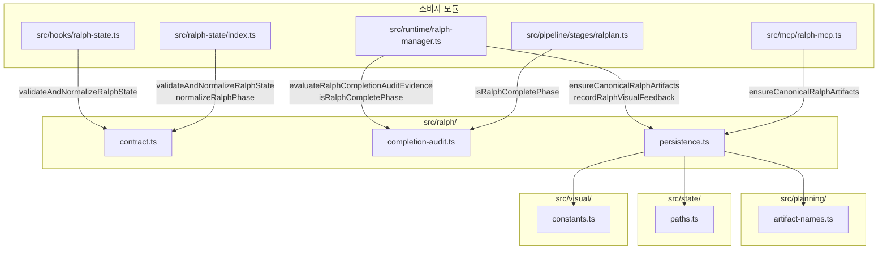

# src/ralph/ 모듈 분석

> 작성일: 2026-05  
> 대상 경로: `src/ralph/`  
> 분석 범위: 소스 파일 3개 + 테스트 파일 2개

---

## 1. 폴더 구조

```
src/ralph/
├── contract.ts          # Ralph 실행 페이즈 정의 · 상태 검증
├── completion-audit.ts  # 완료 감사(audit) 증거 평가 + 보안 경계
├── persistence.ts       # 진행 원장 파일 I/O + 레거시 마이그레이션
└── __tests__/
    ├── completion-audit.test.ts   # 보안 경계 단위 테스트
    └── persistence.test.ts        # 원장 I/O + 마이그레이션 테스트
```

---

## 2. 시스템 개요

`src/ralph/`는 OMX의 **Ralph 실행 루프**를 지탱하는 세 가지 핵심 관심사를 분리·캡슐화한다.

| 파일 | 관심사 |
|---|---|
| `contract.ts` | 페이즈 상태 기계(State Machine) — 유효 전환·기본값·정규화 |
| `completion-audit.ts` | 완료 판정 — 감사 증거 필드 검증 + 파일 시스템 보안 |
| `persistence.ts` | 진행 원장(Ledger) I/O — 생성·기록·레거시 마이그레이션 |

### 데이터 흐름

```
$ralph / omx ralph 명령
       │
       ▼
  state 파일 (.omx/state/ralph-progress.json)
  contract.ts: validateAndNormalizeRalphState()
       │
       ├── active=true  → 페이즈 전환, 반복 카운트 증가
       └── 터미널 페이즈 → active=false, completed_at 기록
              │
              ▼
  completion-audit.ts: evaluateRalphCompletionAuditEvidence()
              │
              ├── 인라인 audit 오브젝트 (state.completion_audit)
              └── 파일 참조 (state.completion_audit_path → .json 파일)
                     │
                     ▼
              { complete: true/false, reason, source }
```

---

## 3. 파일별 상세 분석

### 3.1 `contract.ts` — 페이즈 상태 기계

Ralph 실행 상태의 **공식 계약(Contract)**. 유효 페이즈 집합, 레거시 별칭, 상태 오브젝트 전체 검증 로직을 담당한다. 파일 I/O 없음.

#### 페이즈 정의

```typescript
const RALPH_PHASES = [
  'starting',       // 실행 시작 중
  'executing',      // 코드 구현/작업 실행 중
  'verifying',      // 완료 검증 중
  'fixing',         // 문제 수정 중
  'blocked_on_user',// 사용자 입력 대기 (터미널)
  'complete',       // 성공 완료 (터미널)
  'failed',         // 실패 종료 (터미널)
  'cancelled',      // 취소됨 (터미널)
] as const;
```

**터미널 페이즈** (`blocked_on_user`, `complete`, `failed`, `cancelled`):
- `active=true`와 공존 불가 → 에러
- `completed_at` 자동 기록

#### 레거시 별칭 정규화 테이블

| 입력 (레거시) | 정규화 결과 |
|---|---|
| `start`, `started` | `starting` |
| `execution`, `execute` | `executing` |
| `verify`, `verification` | `verifying` |
| `fix` | `fixing` |
| `blocked`, `blocked-on-user` | `blocked_on_user` |
| `completed` | `complete` |
| `fail`, `error` | `failed` |
| `cancel` | `cancelled` |

#### 공개 함수

| 함수 | 역할 |
|---|---|
| `normalizeRalphPhase(rawPhase)` | 문자열 → `RalphPhase` 정규화. 레거시 별칭 처리. 알 수 없는 값이면 `{ error }` |
| `validateAndNormalizeRalphState(candidate, options?)` | 전체 상태 오브젝트 검증·정규화 → `RalphStateValidationResult` |

#### `validateAndNormalizeRalphState` 규칙

```
active=true 시 자동 채움:
  - iteration     = 0 (없을 경우)
  - max_iterations = 50 (없을 경우)
  - current_phase  = 'starting' (없을 경우)
  - started_at     = nowIso (없을 경우)

검증 실패 조건:
  - current_phase가 알 수 없는 값
  - iteration이 정수 < 0
  - max_iterations가 정수 <= 0
  - 터미널 페이즈에 active=true
  - started_at / completed_at가 ISO8601 형식 아님
```

---

### 3.2 `completion-audit.ts` — 완료 감사 증거 평가

Ralph가 작업 완료를 선언할 때 충분한 증거(감사 오브젝트)가 존재하는지 검증한다. 파일 참조를 허용하지만 **다수의 보안 경계**를 통해 경로 탈출을 방지한다.

#### 공개 타입

```typescript
interface RalphCompletionAuditResult {
  complete: boolean;
  reason: string;   // 'completion_audit_passed' | 'missing_completion_audit' | ...
  source: 'state' | 'artifact' | 'missing';
}
```

#### 감사 오브젝트 탐색 순서

```typescript
// 1순위: 상태 오브젝트 인라인 키 (source: 'state')
['completion_audit', 'completionAudit', 'completion_audit_evidence', 'completionAuditEvidence']

// 2순위: 상태 오브젝트의 파일 경로 키 (source: 'artifact')
['completion_audit_path', 'completionAuditPath', 'completion_audit_evidence_path', 'completionAuditEvidencePath']
```

#### 완료 판정 기준 (`complete: true` 조건)

```
1. 감사 오브젝트가 존재함
2. audit.passed === true  (문자열 'passed' 불인정 — 반드시 boolean true)
3. prompt_to_artifact_checklist / checklist / requirements_checklist 중 하나가 실질적 값
4. verification_evidence / evidence / validation_evidence / commands / tests 중 하나가 실질적 값
```

#### 파일 참조 보안 경계

`readAuditArtifact(cwd, rawPath)` 내부에서 4단계 보안 검사를 수행한다:

```
1. 절대 경로 거부          isAbsolute(auditPath) → null
2. 워크스페이스 외부 거부   resolve(cwd, path) 가 cwd 안에 있어야 함
3. JSON 확장자만 허용       extname(path) !== '.json' → null
4. 심볼릭 링크 재검증       realpathSync(root) + realpathSync(resolved)
                           → 심볼릭 링크 대상이 cwd 밖이면 거부
```

이 네 경계를 통과해야만 파일을 읽어 JSON으로 파싱한다.

#### 공개 함수

| 함수 | 역할 |
|---|---|
| `evaluateRalphCompletionAuditEvidence(state, cwd)` | 상태 오브젝트에서 감사 증거를 탐색·평가 → `RalphCompletionAuditResult` |
| `isRalphCompletePhase(value)` | 값이 `'complete'` 또는 `'completed'`인지 확인 (대소문자 무시) |

---

### 3.3 `persistence.ts` — 진행 원장 I/O + 레거시 마이그레이션

Ralph 실행의 **모든 진행 이력**을 `.omx/state/ralph-progress.json` 파일에 기록·관리한다. 구형 OMX에서 사용하던 `.omx/prd.json`과 `.omx/progress.txt` 파일을 자동으로 정규 형식으로 마이그레이션한다.

#### 공개 타입

```typescript
interface RalphProgressLedger {
  schema_version: number;       // 현재 2
  source?: string;              // 레거시 마이그레이션 출처
  source_sha256?: string;
  strategy?: string;
  created_at?: string;          // ISO8601
  updated_at?: string;          // ISO8601
  entries: Array<Record<string, unknown>>;  // 진행 항목 배열
  visual_feedback?: Array<Record<string, unknown>>;  // 시각 피드백 배열
}

interface RalphVisualFeedback {
  score: number;                      // 0-100 점수
  verdict: VisualVerdictStatus;       // 판정 ('approve'/'revise'/...)
  category_match: boolean;            // 카테고리 일치 여부
  differences: string[];              // 참조 대비 차이점 목록
  suggestions: string[];              // 수정 제안 목록
  reasoning?: string;                 // 추론 설명
  threshold?: number;                 // 통과 기준 (기본값 90)
}

interface RalphCanonicalArtifacts {
  canonicalPrdPath?: string;          // 최신 PRD 파일 경로 (없으면 undefined)
  canonicalProgressPath: string;      // 진행 원장 파일 경로
  migratedPrd: boolean;               // 레거시 PRD 마이그레이션 여부
  migratedProgress: boolean;          // 레거시 진행 파일 마이그레이션 여부
}
```

#### 공개 함수

| 함수 | 역할 |
|---|---|
| `ensureCanonicalRalphArtifacts(cwd, sessionId?)` | 정규 아티팩트 초기화 + 레거시 마이그레이션 → `RalphCanonicalArtifacts` |
| `recordRalphVisualFeedback(cwd, feedback, sessionId?, baseStateDir?)` | 시각 피드백 원장에 기록 (최대 30개 rolling window) |

#### `ensureCanonicalRalphArtifacts` 동작 흐름

```
1. .omx/plans/, .omx/state/{sessionId?}/ 디렉터리 생성 (없을 경우)
2. listCanonicalPrdFiles() → .omx/plans/prd-*.md 목록 (타임스탬프 정렬)

3. migrateLegacyPrdIfNeeded():
   - 이미 정규 PRD 있음 → 건너뜀 (migratedPrd=false)
   - .omx/prd.json 없음 → 건너뜀
   - .omx/prd.json 존재 → Markdown PRD 생성:
       .omx/plans/prd-{ts}-{slug}.md
       (title 추출: project > title > branchName > description)

4. migrateLegacyProgressIfNeeded():
   - 이미 정규 진행 원장 있음 → 건너뜀
   - .omx/progress.txt 없음 → 건너뜀
   - .omx/progress.txt 존재 → ralph-progress.json 생성 (줄 단위 entries 변환)

5. ensureCanonicalProgressLedgerFile() → 빈 원장 파일 생성 (없을 경우)

6. RalphCanonicalArtifacts 반환
```

**레거시 호환 원칙**: 레거시 파일 (`.omx/prd.json`, `.omx/progress.txt`)은 **읽기만** 하고 수정하지 않는다. `ralph-migration-marker.json`에 마이그레이션 기록을 남긴다.

#### 진행 원장 파일 경로

```
세션 없음: .omx/state/ralph-progress.json
세션 ID 있음: .omx/state/sessions/{sessionId}/ralph-progress.json
baseStateDir 지정: {baseStateDir}/{sessions/{sessionId}?}/ralph-progress.json
```

#### `recordRalphVisualFeedback` 동작

1. 진행 원장 읽기 (없으면 초기화)
2. 피드백 항목 구성:
   - `next_actions` = `suggestions` + `"Resolve difference: {diff}"` 합산 (상위 `VISUAL_NEXT_ACTIONS_LIMIT`개)
   - `passes_threshold` = `score >= threshold` (기본 `threshold=90`)
3. `visual_feedback` 배열에 추가 → 최신 **30개**만 유지
4. 원장 파일 저장 (`stableJsonPretty` — 키 정렬 JSON)

---

## 4. 내부 유틸리티

### `persistence.ts` 내부 함수

| 함수 | 역할 |
|---|---|
| `slugify(raw)` | 문자열 → URL-safe slug (소문자, 하이픈, 최대 48자) |
| `stableJson(value)` | 키 정렬 압축 JSON (해시 입력용 재현 가능 직렬화) |
| `stableJsonPretty(value)` | 키 정렬 들여쓰기 JSON (파일 저장용) |
| `sha256(text)` | SHA-256 hex 해시 (마이그레이션 출처 무결성 검증) |
| `splitProgressLines(content)` | 텍스트 → 비어있지 않은 trim된 줄 배열 |
| `resolveLegacyPrdTitle(parsed)` | 레거시 JSON에서 제목 추출 (`project > title > branchName > description`) |

---

## 5. 모듈 간 호출 관계



---

## 6. `.omx/` 관련 파일 구조

```
.omx/
├── plans/
│   ├── prd-{ts}-{slug}.md                # 정규 PRD (ralph가 읽음)
│   └── ralph-migration-marker.json       # 마이그레이션 기록
├── state/
│   ├── ralph-progress.json               # 세션 없는 진행 원장
│   └── sessions/
│       └── {sessionId}/
│           └── ralph-progress.json       # 세션별 진행 원장
├── prd.json       (레거시 — 읽기 전용)
└── progress.txt   (레거시 — 읽기 전용)
```

---

## 7. 테스트 파일 요약

### `completion-audit.test.ts`

보안 경계에 집중한 단위 테스트. 모두 **완료 판정 실패** 시나리오 검증.

| 테스트 케이스 | 검증 내용 |
|---|---|
| 절대 경로 거부 | `/etc/hosts` 경로 → `missing_completion_audit` |
| JSON 아닌 파일 거부 | `.md` 확장자 파일 → `missing_completion_audit` |
| 워크스페이스 외부 파일 거부 | `../../outside/audit.json` → `missing_completion_audit` |
| 심볼릭 링크 외부 대상 거부 | 심볼릭 링크 → 외부 JSON → `missing_completion_audit` |
| 빈/파손된 JSON 거부 | 빈 파일 / `{not json}` → `missing_completion_audit` |
| `passed=true` 필수 | `passed: false` / `status: 'passed'` → `completion_audit_not_passing` |
| 인라인 audit도 `passed=true` 필수 | 동일 |

### `persistence.test.ts`

정상 동작 및 마이그레이션 검증. 실제 임시 디렉터리 사용.

| 테스트 케이스 | 검증 내용 |
|---|---|
| 정규 파일 이미 존재 | 마이그레이션 건너뜀, 기존 파일 그대로 유지 |
| 레거시 PRD+진행 파일 마이그레이션 | `migratedPrd=true`, `migratedProgress=true`, 레거시 파일 훼손 없음 |
| 다수 정규 PRD 시 최신 선택 | 타임스탬프 정렬 후 가장 최신 PRD 경로 반환 |
| 시각 피드백 기록 | 점수·판정·next_actions 정확히 저장, `VISUAL_NEXT_ACTIONS_LIMIT` 이하 확인 |

---

## 8. 설계 원칙

### 1. 관심사 분리
- **계약(Contract)**: 페이즈 유효성 — 순수 함수, 파일 I/O 없음
- **감사(Audit)**: 완료 증거 평가 — 보안 경계와 분리된 판정 로직
- **지속성(Persistence)**: I/O 전담 — 비동기 파일 작업만 관리

### 2. 레거시 비파괴 호환
- `.omx/prd.json`, `.omx/progress.txt`는 읽기만 함
- 마이그레이션 후에도 원본 유지 (호환성 창 `one-release-cycle`)
- `ralph-migration-marker.json`으로 마이그레이션 이력 추적

### 3. Fail-Safe 완료 판정
- `passed === true` (boolean) 만 인정 — 문자열 `'passed'`, truthy 값 거부
- 체크리스트 + 검증 증거 **모두** 실질적 값이어야 완료 인정
- 감사 오브젝트 없으면 `complete: false` (Fail-Closed)

### 4. 보안 우선 파일 접근
- 경로 탈출 방지: 절대 경로 거부 + `relative()` 내부 확인
- 심볼릭 링크 방지: `realpathSync()`로 실제 경로 재검증
- 허용 확장자 제한: `.json`만 감사 아티팩트로 인정

### 5. 재현 가능 JSON 직렬화
- `stableJson()`: 키 정렬 JSON — SHA-256 해시 입력용
- `stableJsonPretty()`: 키 정렬 들여쓰기 JSON — 모든 파일 저장에 사용
- 동일 내용의 파일은 항상 동일 바이트 → Git diff 안정성

### 6. Rolling Visual Feedback
- `visual_feedback` 배열은 최신 **30개**만 유지
- `VISUAL_NEXT_ACTIONS_LIMIT`으로 next_actions 수 상한
- 점수 기반 `passes_threshold` 자동 계산 (기본 90점)

---

## 9. 연관 분석 파일

| 모듈 | 분석 파일 |
|---|---|
| `src/planning/` | [planning-module-analysis.md](./planning-module-analysis.md) |
| `src/pipeline/` | [pipeline-module-analysis.md](./pipeline-module-analysis.md) |
| `src/cli/` | [cli-module-analysis.md](./cli-module-analysis.md) |
| `src/mcp/` | [mcp-module-analysis.md](./mcp-module-analysis.md) |
| `src/visual/` | (미작성) |
| `src/state/` | (미작성) |
