# src/runtime/ 모듈 분석

> 작성일: 2026-05  
> 대상 경로: `src/runtime/`  
> 분석 범위: 소스 파일 5개 + 테스트 파일 5개

---

## 1. 폴더 구조

```
src/runtime/
├── run-outcome.ts        # 실행 결과 타입 정의 · 정규화 · 추론 엔진 (핵심 계약)
├── run-loop.ts           # 제네릭 반복 루프 (터미널 결과까지 step 실행)
├── run-state.ts          # 모드 상태 → RunState 변환 · 파일 I/O
├── terminal-lifecycle.ts # TerminalLifecycleOutcome 정규화 래퍼
├── bridge.ts             # TS ↔ Rust(omx-runtime 바이너리) 브리지
├── process-tree.ts       # 자식 프로세스 실행 + 프로세스 트리 종료 관리
└── __tests__/
    ├── bridge.test.ts
    ├── process-tree.test.ts
    ├── run-loop.test.ts
    ├── run-outcome.test.ts
    └── run-state.test.ts
```

---

## 2. 시스템 개요

`src/runtime/`은 OMX의 **실행 생명주기(Execution Lifecycle) 기반 계층**이다.  
여러 모드(ralph, ralplan, autopilot 등)가 공유하는 결과 분류·루프 실행·상태 영속화·외부 프로세스 관리를 담당한다.

```
src/runtime/
  ├── run-outcome.ts  ─── 결과 타입 계약 (모든 파일의 공통 의존성)
  ├── run-loop.ts     ─── 반복 루프 엔진
  ├── run-state.ts    ─── 상태 파일 I/O 게이트웨이
  ├── terminal-lifecycle.ts ─ lifecycle_outcome 정규화 공개 인터페이스
  ├── bridge.ts       ─── Rust 런타임 바이너리 통신
  └── process-tree.ts ─── 외부 프로세스 실행 및 정리
```

### 의존 방향

```
run-loop.ts ──► run-outcome.ts
run-state.ts──► run-outcome.ts
              ► mcp/state-paths.ts

terminal-lifecycle.ts ──► run-outcome.ts

bridge.ts ──► team/state-root.ts
           ► utils/safe-json.ts

process-tree.ts ──► utils/platform-command.ts
```

---

## 3. 파일별 상세 분석

### 3.1 `run-outcome.ts` — 실행 결과 계약 (핵심)

모든 런타임 모듈이 의존하는 **결과 타입 정규화 엔진**. 다양한 문자열 표현과 에이전트별 방언을 정규화된 결과 타입으로 변환한다.

#### 결과 타입 계층

```
RunOutcome (6종)
  ├── NonTerminalRunOutcome: 'progress' | 'continue'
  └── TerminalRunOutcome:    'finish' | 'blocked_on_user' | 'failed' | 'cancelled'

TerminalLifecycleOutcome (5종)
  : 'finished' | 'blocked' | 'failed' | 'userinterlude' | 'askuserQuestion'
```

#### 별칭(Alias) 매핑 — `RUN_OUTCOME_ALIASES`

| 입력 문자열 | 정규화 결과 |
|---|---|
| `finished`, `complete`, `completed`, `done` | `finish` |
| `blocked`, `blocked-on-user` | `blocked_on_user` |
| `fail`, `error` | `failed` |
| `canceled`, `cancel`, `aborted`, `abort` | `cancelled` |
| `continued` | `continue` |

별칭 사용 시 `warning` 필드를 포함한 `RunOutcomeNormalizationResult`를 반환한다.

#### RunOutcome ↔ TerminalLifecycleOutcome 변환

```
finish          ──► finished
blocked_on_user ──► blocked  (또는 askuserQuestion / userinterlude — 전략에 따라)
failed          ──► failed
cancelled       ──► userinterlude
```

#### `inferRunOutcome(candidate)` — 추론 우선순위

```
1. candidate.run_outcome 명시값
2. inferTerminalLifecycleOutcome → 호환성 변환
3. current_phase가 터미널 페이즈 키
4. active === true → 'continue'
5. completed_at 존재 → 'finish'
6. active === false → 'finish'
7. 기본값: 'continue'
```

#### `inferTerminalLifecycleOutcome(candidate)` — 추론 우선순위

```
1. lifecycle_outcome / terminal_outcome 명시값
2. run_outcome → 변환
3. current_phase 정규화
4. question_enforcement.status === 'pending' → 'askuserQuestion'
5. active === true → undefined (비터미널)
6. completed_at 존재 → 'finished'
7. active === false → 'finished'
```

#### `applyRunOutcomeContract(candidate)` — 상태 일관성 검증

터미널 결과이면서 `active=true`이거나, 비터미널 결과이면서 `active=false`이면 `ok: false` 반환.  
정상이면 `active`, `run_outcome`, `lifecycle_outcome`, `completed_at`을 일관되게 정리한 `state` 반환.

#### 공개 함수 요약

| 함수 | 역할 |
|---|---|
| `normalizeRunOutcome(value)` | 문자열 → `RunOutcome` (별칭 처리 + warning) |
| `classifyRunOutcome(value)` | 정규화 실패 시 `'progress'`로 폴백 |
| `isTerminalRunOutcome(value)` | 터미널 결과 여부 |
| `isNonTerminalRunOutcome(value)` | 비터미널 결과 여부 |
| `inferRunOutcome(candidate)` | 상태 오브젝트에서 결과 추론 |
| `inferTerminalLifecycleOutcome(candidate)` | 라이프사이클 결과 추론 |
| `applyRunOutcomeContract(candidate)` | 상태 일관성 검증 + 정리 |
| `compatibilityRunOutcomeFromTerminalLifecycleOutcome(outcome)` | lifecycle → run 변환 |
| `terminalLifecycleOutcomeFromRunOutcome(outcome)` | run → lifecycle 변환 |

---

### 3.2 `run-loop.ts` — 제네릭 반복 루프 엔진

어떤 워크플로우든 재사용할 수 있는 **터미널 조건 루프 실행기**.

#### 핵심 인터페이스

```typescript
interface RunLoopIteration<TState> {
  outcome: unknown;   // 자유 형식 — run-outcome.ts가 정규화
  state: TState;      // 제네릭 상태
}

interface RunLoopTerminalResult<TState> {
  iteration: number;
  outcome: TerminalRunOutcome;
  state: TState;
  history: RunOutcome[];  // 전체 결과 이력
}
```

#### `runUntilTerminal(step, options)` — 반복 루프

```typescript
async function runUntilTerminal<TState>(
  step: (iteration: number) => Promise<RunLoopIteration<TState>>,
  options?: { maxIterations?: number; onIteration?: (result) => void }
): Promise<RunLoopTerminalResult<TState>>
```

- `step`이 반환한 `outcome`을 `classifyRunOutcome`으로 정규화
- `isTerminalRunOutcome`이 `true`이면 즉시 반환
- `maxIterations` 초과 시 예외 발생: `run loop exceeded maxIterations=N without reaching a terminal outcome`

#### `getRunContinuationSnapshot(candidate)` — 계속 가능 여부 스냅샷

상태 오브젝트를 받아 현재 `outcome`, `lifecycleOutcome`, `terminal`, `phase`를 담은 `RunContinuationSnapshot` 반환.  
`question_enforcement` 포함 터미널 판정.

#### `shouldContinueRun(candidate)` — 단순 boolean

```typescript
shouldContinueRun({ active: true, current_phase: 'executing' })  // true
shouldContinueRun({ active: true, run_outcome: 'blocked_on_user' }) // false (명시 터미널)
shouldContinueRun({ active: false, current_phase: 'complete' })  // false
```

---

### 3.3 `run-state.ts` — RunState 파일 I/O

모드 상태(모든 형태의 `RunStateLike`)를 표준화된 `RunState` 오브젝트로 변환하고 파일로 영속화한다.

#### `RunState` 스키마

```typescript
interface RunState {
  version: 1;
  mode: string;
  active: boolean;
  outcome: RunOutcome;
  lifecycle_outcome?: TerminalLifecycleOutcome;
  updated_at: string;         // 항상 갱신
  current_phase?: string;
  task_description?: string;
  started_at?: string;
  completed_at?: string;      // 터미널 결과에서 자동 스탬프
  iteration?: number;
  max_iterations?: number;
  error?: string;
  owner_omx_session_id?: string;
}
```

파일 위치: `mcp/state-paths.ts`의 `getStateFilePath('run-state.json', cwd, sessionId)`

#### `buildRunState(state, existing?, nowIso?)` — 상태 구성

```
state.active === true → outcome = 'continue'
  그 외 → deriveRunOutcomeFromModeState() 순서:
    1. inferTerminalLifecycleOutcome (question_enforcement 포함)
    2. state.outcome / state.run_outcome 명시값
    3. current_phase 기반 터미널 페이즈
    4. state.error 존재 → 'failed'
    5. completed_at 존재 → 'finish'
    6. classifyRunOutcome(current_phase)

existing?.started_at 보존 (재시작 시 원래 시작 시간 유지)
터미널 결과 → completed_at 자동 스탬프 (existing이 있으면 그 값 사용)
```

#### 파일 쓰기 — `writeAtomicFile`

```
path.tmp.{pid}.{timestamp}.{random} 임시 파일 생성
  → rename()으로 원자적 교체 (관측 시 불완전 상태 방지)
  → rename 실패 시 임시 파일 삭제 후 예외
```

#### 공개 함수

| 함수 | 역할 |
|---|---|
| `buildRunState(state, existing?, nowIso?)` | RunStateLike → RunState 변환 (파일 쓰기 없음) |
| `readRunState(cwd?, sessionId?)` | `run-state.json` 읽기 |
| `syncRunStateFromModeState(state, cwd?, sessionId?)` | 변환 후 원자적 쓰기 |
| `deriveRunOutcomeFromModeState(state)` | 모드 상태에서 RunOutcome 추론 |

---

### 3.4 `terminal-lifecycle.ts` — 라이프사이클 정규화 공개 래퍼

`run-outcome.ts`의 `normalizeTerminalLifecycleOutcome`을 외부에 노출하는 **얇은 파사드**.  
`blockedOnUserStrategy`를 기본값 `'blocked'`로 고정하고 warning 메시지를 정제한다.

#### 추가 제공 함수

```typescript
// 명시적 lifecycle_outcome 우선, 없으면 run_outcome에서 추론
inferTerminalLifecycleOutcome({ lifecycle_outcome?, run_outcome? })
  → TerminalLifecycleNormalizationResult

// lifecycle → run 변환 (역방향 참조용)
preferredRunOutcomeForLifecycleOutcome(outcome: TerminalLifecycleOutcome): RunOutcome
```

---

### 3.5 `bridge.ts` — Rust 런타임 바이너리 브리지

TypeScript 레이어와 Rust로 작성된 `omx-runtime` 바이너리 간의 **통신 계층**.  
`OMX_RUNTIME_BRIDGE=0`으로 비활성화하면 TypeScript 직접 구현으로 폴백한다.

#### 아키텍처 개요

```
TypeScript (bridge.ts)
    │
    ├── execCommand(cmd) ──► execFileSync('omx-runtime exec {JSON}') ──► RuntimeEvent
    ├── readSnapshot()   ──► execFileSync('omx-runtime snapshot --json')
    └── readCompatFile() ──► readFileSync('.omx/state/{file}.json')   (쓰기는 Rust)
```

#### `RuntimeCommand` — Rust로 전송하는 명령 (11종)

| 명령 | 역할 |
|---|---|
| `AcquireAuthority` | 팀 리더 권한 획득 |
| `RenewAuthority` | 권한 임대 갱신 |
| `QueueDispatch` | 디스패치 큐에 요청 추가 |
| `MarkNotified` | 디스패치 통지 완료 표시 |
| `MarkDelivered` | 디스패치 전달 완료 표시 |
| `MarkFailed` | 디스패치 실패 표시 |
| `RequestReplay` | 이벤트 리플레이 요청 |
| `CaptureSnapshot` | 상태 스냅샷 캡처 |
| `CreateMailboxMessage` | 워커 간 메시지 생성 |
| `MarkMailboxNotified` | 메일박스 통지 완료 |
| `MarkMailboxDelivered` | 메일박스 전달 완료 |

#### `RuntimeSnapshot` — Rust에서 읽는 스냅샷

```typescript
interface RuntimeSnapshot {
  schema_version: number;
  authority: AuthoritySnapshot;   // 팀 리더 권한 상태
  backlog:   BacklogSnapshot;     // 디스패치 큐 카운터
  replay:    ReplaySnapshot;      // 이벤트 리플레이 커서
  readiness: ReadinessSnapshot;   // 준비 여부 + 이유 목록
}
```

#### 호환성 파일(Compat Files)

Rust가 기록하고 TypeScript가 읽기 전용으로 소비하는 파일들:

| 파일 | 타입 | 역할 |
|---|---|---|
| `authority.json` | `AuthoritySnapshot` | 리더 권한 상태 |
| `readiness.json` | `ReadinessSnapshot` | 준비 상태 |
| `backlog.json` | `BacklogSnapshot` | 큐 카운터 |
| `dispatch.json` | `{ records: DispatchRecord[] }` | 디스패치 이력 |
| `mailbox.json` | `{ records: MailboxRecord[] }` | 메시지 이력 |

파일 읽기 실패 시 `null` 반환 (EACCES, EISDIR, truncate-then-write 경합 포함).

#### `RuntimeBridgeError`

```typescript
class RuntimeBridgeError extends Error {
  context: { command?: string; stdoutPreview?: string; cause?: unknown };
}
```

바이너리가 비-JSON을 반환할 때 발생. `instanceof RuntimeBridgeError`로 타입 감지 가능 → 디스패치 루프에서 해당 명령만 실패 처리하고 상위 루프는 계속 실행.

#### 바이너리 탐색 우선순위 (`resolveRuntimeBinaryPath`)

```
1. 환경변수 OMX_RUNTIME_BINARY
2. target/debug/omx-runtime  (빌드 워크스페이스 debug)
3. target/release/omx-runtime (빌드 워크스페이스 release)
4. PATH의 omx-runtime
```

#### 스키마 검증 (`validateSchemaOnce`)

첫 `execCommand` 호출 시 한 번만 실행:
```
omx-runtime schema --json
  → commands 목록에 8개 필수 명령어 포함 여부 확인
  → 누락 시 예외 (바이너리와 TypeScript 타입 불일치)
```

#### 싱글턴 헬퍼

```typescript
getDefaultBridge(stateDir?: string): RuntimeBridge
isBridgeEnabled(): boolean
```

---

### 3.6 `process-tree.ts` — 프로세스 트리 실행 관리

외부 명령어를 실행하면서 **타임아웃·출력 크기·프로세스 수를 제한**하고, 종료 시 자식 프로세스 트리 전체를 정리한다.

#### `runProcessTreeWithTimeout(command, args, options)`

```typescript
interface ProcessTreeRunOptions {
  cwd?:               string;
  env?:               NodeJS.ProcessEnv;
  timeoutMs?:         number;          // 전체 실행 타임아웃
  killSignal?:        NodeJS.Signals;  // 기본 SIGTERM
  sigkillGraceMs?:    number;          // SIGTERM → SIGKILL 대기 (기본 1000ms)
  maxOutputBytes?:    number;          // stdout+stderr 총 크기 제한
  maxProcessCount?:   number;          // 자식 프로세스 수 제한 (Linux 전용)
  processLimitPollMs?: number;         // 프로세스 수 폴링 간격 (기본 100ms)
  cleanupOnParentExit?: boolean;       // 부모 종료 시 자식 정리
  platform?:          NodeJS.Platform; // 테스트 주입용
  spawnImpl?:         typeof spawn;    // 테스트 주입용
  existsImpl?:        (path: string) => boolean;
}

interface ProcessTreeRunResult {
  stdout:               string;
  stderr:               string;
  status:               number | null;
  signal:               NodeJS.Signals | null;
  timedOut:             boolean;
  processLimitExceeded: boolean;
  outputLimitExceeded:  boolean;
  error?:               NodeJS.ErrnoException;
}
```

#### 주요 동작 원리

**프로세스 트리 종료 (`killProcessTree`)**
```
POSIX: process.kill(-child.pid, signal)  → 프로세스 그룹 전체 (detached 옵션으로 생성)
Win32: child.kill(signal)                → 직접 자식만
SIGTERM → 1초 후 SIGKILL (ESRCH 무시)
```

**출력 크기 제한 (`appendBoundedOutput`)**
```
maxOutputBytes 초과 시:
  outputLimitExceeded = true → terminate() 호출
  남은 바이트까지만 출력에 포함 (버퍼 슬라이스)
```

**프로세스 수 제한 (Linux 전용)**
```
setInterval(processLimitPollMs) 마다:
  /proc 디렉터리를 파싱해 자식 트리 계층 구조 구축
  rootPid의 하위 프로세스 수 계산 (BFS)
  descendants + 1 > maxProcessCount → terminate()
```

**부모 종료 시 정리 (`cleanupOnParentExit`)**
```
process.once('SIGINT', 'SIGTERM', 'SIGHUP', 'beforeExit', 'exit')
  → killProcessTree(child, ...)
자식의 exit 이벤트에서도 프로세스 그룹을 즉시 스윕
  (grandchild가 상속받은 stdio 소켓을 열어두는 경우 방지)
```

---

## 4. 모듈 간 호출 관계

```mermaid
flowchart TD
    subgraph runtime["src/runtime/"]
        RO[run-outcome.ts\n결과 타입 계약]
        RL[run-loop.ts\n반복 루프]
        RS[run-state.ts\n상태 I/O]
        TL[terminal-lifecycle.ts\n라이프사이클 래퍼]
        BR[bridge.ts\nRust 브리지]
        PT[process-tree.ts\n프로세스 관리]
    end

    subgraph utils["src/utils/"]
        PC[platform-command.ts]
        SJ[safe-json.ts]
    end

    subgraph mcp_["src/mcp/"]
        SP[state-paths.ts]
    end

    subgraph team["src/team/"]
        SR[state-root.ts]
    end

    subgraph consumers["소비자 모듈"]
        RALPH[src/ralph/]
        RALPLAN[src/ralplan/runtime.ts]
        AUTOPILOT[src/autopilot/]
        PIPELINE[src/pipeline/stages/]
        TEAMDISP[src/team/state/dispatch.ts]
        TEAMHUD[src/team/hud/]
        SPARKSHELL[src/sparkshell/]
    end

    subgraph rust["Rust (crates/)"]
        BINARY[omx-runtime 바이너리]
    end

    RL -->|classifyRunOutcome\nisTerminalRunOutcome\ninferTerminalLifecycleOutcome| RO
    RS -->|normalizeRunOutcome\ninferTerminalLifecycleOutcome\ncompatibilityRunOutcome...| RO
    TL -->|normalizeTerminalLifecycleOutcome\ncompatibility 함수들| RO

    RS --> SP
    BR --> SR
    BR --> SJ
    PT --> PC

    RALPH -->|runUntilTerminal\nshouldContinueRun| RL
    RALPH -->|syncRunStateFromModeState\nreadRunState| RS
    RALPLAN -->|inferRunOutcome\nisTerminalRunOutcome| RO

    AUTOPILOT -->|runUntilTerminal| RL
    AUTOPILOT -->|syncRunStateFromModeState| RS

    PIPELINE -->|shouldContinueRun\ngetRunContinuationSnapshot| RL
    PIPELINE -->|inferRunOutcome| RO

    TEAMDISP -->|execCommand\nreadBacklog| BR
    TEAMDISP -->|RuntimeBridgeError| BR
    TEAMHUD  -->|readSnapshot\nreadAuthority\nreadReadiness| BR

    SPARKSHELL -->|runProcessTreeWithTimeout| PT

    BR -->|execFileSync\nreadCompatFile| BINARY
```



---

## 5. 상태 파일 구조

### `run-state.json`

```json
{
  "version": 1,
  "mode": "ralph",
  "active": false,
  "outcome": "finish",
  "lifecycle_outcome": "finished",
  "updated_at": "2026-05-28T12:00:00.000Z",
  "current_phase": "complete",
  "task_description": "implement feature X",
  "started_at": "2026-05-28T10:00:00.000Z",
  "completed_at": "2026-05-28T12:00:00.000Z",
  "iteration": 3,
  "max_iterations": 10,
  "owner_omx_session_id": "sess-abc123"
}
```

### Rust compat 파일 (`authority.json` 예시)

```json
{
  "owner": "pane-1",
  "lease_id": "lease-xyz",
  "leased_until": "2026-05-28T12:05:00.000Z",
  "stale": false,
  "stale_reason": null
}
```

---

## 6. 테스트 파일 요약

| 파일 | 주요 시나리오 |
|---|---|
| `run-outcome.test.ts` | 별칭 정규화, active 기반 결과 추론, terminal/non-terminal 모순 감지, `applyRunOutcomeContract`, `shouldContinueRun`, `question_enforcement` |
| `run-state.test.ts` | `buildRunState` 생성, `syncRunStateFromModeState` 원자 쓰기, sessionId 스코핑, `deriveRunOutcomeFromModeState` 우선순위 |
| `run-loop.test.ts` | `runUntilTerminal` 터미널 조건 종료, maxIterations 초과 예외, `onIteration` 콜백, 이력 누적 |
| `bridge.test.ts` | 바이너리 탐색 우선순위, `RuntimeBridgeError` 타입 구조, `readCompatFile` 파싱 오류 격리, 환경변수 오버라이드 |
| `process-tree.test.ts` | 타임아웃 + SIGKILL 에스컬레이션, 출력 크기 제한, `processLimitExceeded`, cleanupOnParentExit, 플랫폼별 분기 |

---

## 7. 환경변수 제어

| 변수 | 역할 |
|---|---|
| `OMX_RUNTIME_BRIDGE=0` | Rust 브리지 비활성화 (TypeScript 직접 구현 폴백) |
| `OMX_RUNTIME_BINARY=/path` | omx-runtime 바이너리 경로 직접 지정 |

---

## 8. 설계 원칙

### 1. 타입 계약 중앙화 — `run-outcome.ts`
모든 결과 타입·변환·추론 로직이 단일 파일에 집중. 다른 파일은 이 파일의 함수만 호출하여 상태 해석 로직이 분산되지 않는다.

### 2. 결과 추론의 관대함 + 검증의 엄격함
`inferRunOutcome`은 7단계 폴백으로 관대하게 추론하고, `applyRunOutcomeContract`는 `active`와 결과의 모순을 엄격히 거부한다.

### 3. 원자적 파일 쓰기
`run-state.ts`는 `pid + timestamp + random` 접미사로 임시 파일 생성 후 rename으로 교체 — 파일 관측 중 불완전 상태 방지.

### 4. Rust 바이너리 통신의 격리
`RuntimeBridgeError`로 JSON 파싱 실패를 타입화 — 디스패치 루프가 `instanceof` 검사로 해당 명령만 실패 처리하고 루프는 계속 실행.

### 5. 프로세스 트리 완전 정리
Unix에서 `detached: true`로 프로세스 그룹 생성 후 `process.kill(-pid, signal)`로 전체 트리 종료. 손자 프로세스가 stdio를 잡아두는 패턴까지 `child.on('exit')` 즉시 스윕으로 대응.

### 6. 테스트 주입 인터페이스
`process-tree.ts`는 `spawnImpl`, `existsImpl`, `platform`을, `bridge.ts`는 `binaryPath`, `exists`를 옵션으로 주입 받아 실제 시스템 없이 단위 테스트 가능.

---

## 9. 연관 분석 파일

| 모듈 | 분석 파일 |
|---|---|
| `src/ralph/` | [ralph-module-analysis.md](./ralph-module-analysis.md) |
| `src/ralplan/` | [ralplan-module-analysis.md](./ralplan-module-analysis.md) |
| `src/pipeline/` | [pipeline-module-analysis.md](./pipeline-module-analysis.md) |
| `src/cli/` | [cli-module-analysis.md](./cli-module-analysis.md) |
| `src/mcp/` | [mcp-module-analysis.md](./mcp-module-analysis.md) |
