# src/scripts/ 모듈 분석

> 작성일: 2026-05  
> 대상 경로: `src/scripts/`  
> 분석 범위: 최상위 스크립트 파일 30개 + `notify-hook/` 18개 + `eval/` 13개 + `__tests__/` 12개

---

## 1. 폴더 구조

```
src/scripts/
├── ── Codex 훅 (Hook) 진입점 ──
│   ├── codex-native-hook.ts        # Codex 네이티브 훅 메인 진입점 (SessionStart/PreToolUse/PostToolUse/Stop 등)
│   ├── codex-native-pre-post.ts    # Pre/PostToolUse 페이로드 정규화 + 슬롭 탐지 + 문서 갱신
│   ├── notify-hook.ts              # Notify 훅 진입점 (에이전트 턴 완료 후 호출)
│   ├── notify-dispatcher.ts        # 사용자 notify + OMX notify 직렬 디스패치 래퍼
│   ├── hook-derived-watcher.ts     # 훅 파생 파일 감시기
│   └── notify-fallback-watcher.ts  # notify 실패 시 폴백 감시기
│
├── ── 실행 표면 탐지 ──
│   ├── codex-execution-surface.ts  # native vs cli, attached-tmux vs outside-tmux 판별
│   ├── tmux-hook-engine.ts         # tmux 설정 정규화·주입 가드·send-keys 빌더
│
├── ── 빌드 / 릴리스 ──
│   ├── build-api.ts                # omx-api Rust 바이너리 빌드 + 스테이지
│   ├── build-explore-harness.ts    # omx-explore 테스트 하네스 빌드
│   ├── build-sparkshell.ts         # omx-sparkshell 빌드
│   ├── cleanup-explore-harness.ts  # 하네스 정리
│   ├── generate-native-release-manifest.ts # 네이티브 릴리스 매니페스트 생성
│   ├── generate-release-body.ts    # 릴리스 노트 MD 자동 생성 (GitHub API 사용)
│   ├── verify-native-agents.ts     # 네이티브 에이전트 존재/실행 검증
│   ├── verify-native-release-assets.ts # 릴리스 에셋 검증
│   └── smoke-packed-install.ts     # 패키지 설치 스모크 테스트
│
├── ── 검증 / 점검 ──
│   ├── check-version-sync.ts       # package.json ↔ Cargo.toml 버전 동기화 확인
│   ├── check-runtime-syntax.ts     # 런타임 파일 문법 검사
│   ├── run-test-files.ts           # 테스트 파일 실행기
│   └── team-hardening-benchmark.ts # 팀 모드 강화 벤치마크
│
├── ── 코드 생성 / 동기화 ──
│   ├── generate-catalog-docs.ts    # 카탈로그 docs 생성 (공개 계약 JSON)
│   ├── prompt-inventory.ts         # 프롬프트 표면 인벤토리 리포트 생성
│   ├── sync-plugin-mirror.ts       # 플러그인 미러 스킬 동기화
│   ├── sync-prompt-guidance-fragments.ts # 프롬프트 가이던스 단편 동기화
│
├── ── 알림 / 프로바이더 ──
│   ├── notify-dispatcher.ts        # notify 디스패치 직렬화 + 코얼레스싱
│   └── run-provider-advisor.ts     # 프로바이더 어드바이저 실행
│
├── ── 런타임 테스트 / 실험 ──
│   ├── test-reply-listener-live.ts # 라이브 reply 리스너 테스트
│   ├── test-sparkshell.ts          # sparkshell 통합 테스트
│   ├── run-autoresearch-showcase.sh
│   └── demo-team-e2e.sh / demo-claude-workers.sh
│
├── ── 설치 후 처리 ──
│   ├── postinstall.ts              # npm postinstall — 버전 범프 감지 + 힌트 출력
│   └── postinstall-bootstrap.js    # 부트스트랩 래퍼
│
├── notify-hook/                    # notify-hook 하위 모듈 (18개)
├── eval/                           # 평가 스크립트 (13개)
├── fixtures/                       # 테스트 픽스처 (1개)
└── __tests__/                      # 테스트 파일 (12개)
```

---

## 2. 시스템 개요

`src/scripts/`는 OMX의 **실행 경계(Hook) 진입점과 개발/운영 자동화 스크립트**를 담당한다.  
크게 세 영역으로 나뉜다:

| 영역 | 파일 | 역할 |
|---|---|---|
| **Codex 훅** | `codex-native-hook.ts`, `notify-hook.ts`, `notify-dispatcher.ts`, `tmux-hook-engine.ts` | Codex CLI가 발화하는 생명주기 훅 처리 |
| **notify-hook/** | 18개 하위 모듈 | notify 훅의 관심사 분리 구현체 |
| **빌드/검증/코드젠** | `build-*.ts`, `check-*.ts`, `generate-*.ts`, `sync-*.ts` | CI/CD, 릴리스, 문서 자동화 |

---

## 3. 파일별 상세 분석

### 3.1 `codex-native-hook.ts` — Codex 네이티브 훅 메인 진입점

Codex CLI의 모든 생명주기 훅 이벤트를 수신하는 **가장 복잡한 파일**.  
`SessionStart`, `PreToolUse`, `PostToolUse`, `UserPromptSubmit`, `PreCompact`, `PostCompact`, `Stop` 이벤트를 처리한다.

#### 주요 의존 모듈 (임포트 지도)

```
codex-native-hook.ts
  ├── modes/base.ts             — readModeStateForActiveDecision, updateModeState
  ├── state/skill-active.ts     — listActiveSkills, readSkillActiveState
  ├── subagents/tracker.ts      — readSubagentTrackingState, recordSubagentTurnForSession
  ├── team/state-root.ts        — resolveCanonicalTeamStateRoot
  ├── hooks/session.ts          — readSessionState, reconcileNativeSessionStart
  ├── team/state.ts             — readTeamManifestV2, readTeamPhase, writeTeamPhase
  ├── hooks/keyword-detector.ts — detectKeywords, detectPrimaryKeyword, recordSkillActivation
  ├── hooks/deep-interview-config-instruction.ts
  ├── scripts/notify-hook/auto-nudge.ts
  ├── scripts/codex-native-pre-post.ts
  ├── scripts/notify-hook/team-worker-posttooluse.ts
  ├── scripts/notify-hook/team-worker-stop.ts
  ├── scripts/codex-execution-surface.ts
  ├── hooks/extensibility/events.ts — buildNativeHookEvent
  ├── hooks/extensibility/runtime.ts — dispatchHookEventRuntime
  ├── notifications/config.ts
  ├── hud/reconcile.ts          — reconcileHudForPromptSubmit
  └── wiki/lifecycle.ts         — 위키 세션 시작/컴팩트 컨텍스트
```

#### 처리 흐름 (이벤트별)

```
SessionStart
  → reconcileNativeSessionStart()
  → buildWikiSessionStartContext()
  → reconcileHudForPromptSubmit() (세션 초기화)

UserPromptSubmit
  → detectPrimaryKeyword() → 키워드 라우팅 (ralph, ralplan, team, ...)
  → recordSkillActivation() (스킬 활성화 기록)
  → buildDeepInterviewConfigInstruction() (deep-interview 활성 시)
  → reconcileHudForPromptSubmit()

PreToolUse
  → buildNativePreToolUseOutput() — lore 커밋 가드, 문서 갱신 어드바이저리

PostToolUse
  → buildNativePostToolUseOutput() — 슬롭 탐지, MCP 전송 실패 감지
  → handleTeamWorkerPostToolUseSuccess() (팀 워커인 경우)

Stop
  → maybeNudgeLeaderForAllowedWorkerStop() — 워커 허용된 중단 시 리더 알림
```

---

### 3.2 `codex-native-pre-post.ts` — Pre/PostToolUse 페이로드 처리

PreToolUse/PostToolUse 훅의 출력을 구성하는 **순수 변환 레이어**.

#### 주요 기능

| 함수 | 역할 |
|---|---|
| `buildNativePreToolUseOutput(payload)` | lore 커밋 가드 체크, 문서 갱신 어드바이저리 출력 구성 |
| `buildNativePostToolUseOutput(payload)` | 슬롭 탐지, MCP 전송 실패 감지, 그라운딩 컨텍스트 주입 |
| `detectMcpTransportFailure(payload)` | MCP 도구 실패 신호 탐지 → `McpTransportFailureSignal` |
| `hasAnyPattern(text, patterns)` | 패턴 배열 매칭 헬퍼 |

#### 슬롭 탐지 패턴 상수

- `SLOPPY_FALLBACK_PHRASE_PATTERNS` — 허가 요청 등 부적절 문구 패턴
- `SLOPPY_FALLBACK_GROUNDING_PATTERNS` — 그라운딩 없이 추측하는 패턴
- `SLOPPY_FALLBACK_IMPLEMENTATION_CONTEXT_PATTERNS` — 구현 컨텍스트 부재 패턴

#### 실행 표면 활용

`isNativeOutsideTmuxSurface(payload)` — 훅이 native + outside-tmux 환경인지 판별하여 tmux 의존 동작 스킵.

---

### 3.3 `notify-hook.ts` — Notify 훅 진입점

Codex CLI가 **에이전트 턴 완료 후** 실행하는 핵심 알림 훅.

#### 처리 단계 (순서)

```
1. 페이로드 파싱
     getSessionTokenUsage() / getQuotaUsage() / normalizeInputMessages()

2. 세션 상태 로드
     readCurrentSessionId() → getScopedStateDirsForCurrentSession()

3. Ralph 세션 재개 감지
     reconcileRalphSessionResume()

4. 상태 정규화 · 이력 추가
     normalizeNotifyState() → pruneRecentTurns()

5. 운영 컨텍스트 수집
     buildOperationalContext() → deriveAssistantSignalEvents()

6. 팀 디스패치 소비
     drainPendingTeamDispatch()

7. tmux 주입
     handleTmuxInjection()

8. 리더 상태 점검
     isLeaderStale() → maybeNudgeTeamLeader()

9. 팀 워커 처리
     updateWorkerHeartbeat() → maybeNotifyLeaderWorkerIdle()
     maybeNotifyLeaderAllWorkersIdle()

10. Auto-nudge
     syncSkillStateFromTurn() → maybeAutoNudge()

11. 로그 기록
     logNotifyHookEvent()
```

#### ralph 진행 중 페이즈 감지

```typescript
const RALPH_ACTIVE_PROGRESS_PHASES = new Set([
  'start', 'started', 'starting',
  'execute', 'execution', 'executing',
  'verify', 'verification', ...
]);
```

---

### 3.4 `notify-dispatcher.ts` — Notify 디스패치 직렬화

사용자 기존 notify + OMX notify를 **순서 보장과 중복 방지**를 적용하여 실행.

#### 핵심 메커니즘

| 구성 요소 | 역할 |
|---|---|
| `DISPATCH_LOCK_STALE_MS = 45_000` | 잠금 파일 만료 시간 |
| `DEFAULT_TURN_DISPATCH_MIN_INTERVAL_MS = 10_000` | 동일 턴 중복 디스패치 최소 간격 |
| `DEFAULT_STALE_EVENT_AGE_MS = 5 * 60_000` | 오래된 이벤트 무시 임계치 |

```
1. 잠금 파일 획득 (fs.openSync O_EXCL 원자적 생성)
2. 이전 notify 명령 실행 (사용자 기존 설정)
3. OMX notify-hook 실행
4. 잠금 해제
```

`isTurnEndedPayload()` — `turn-ended`, `agent-turn-complete` 등 다양한 페이로드 형식 정규화.

---

### 3.5 `codex-execution-surface.ts` — 실행 표면 탐지

```typescript
interface CodexExecutionSurface {
  launcher: "native" | "cli";      // Codex App 앱 vs CLI
  transport: "attached-tmux" | "outside-tmux";
}
```

#### 탐지 로직

```
transport: TMUX 환경변수 존재 여부
launcher:
  1. payload.source === 'cli' → cli
  2. payload.source === 'native'/'codex-app' → native
  3. SessionStart + nativeSessionId 존재 → native
  4. payloadSessionId === persistedNativeSessionId → native
  5. canonicalSessionId ≠ nativeSessionId (둘 다 존재) → native
  6. 기본값: cli
```

---

### 3.6 `tmux-hook-engine.ts` — tmux 훅 엔진

tmux 프롬프트 주입의 **설정 정규화와 가드 레이어**.

#### 주요 기능

| 함수 | 역할 |
|---|---|
| `normalizeTmuxHookConfig(raw)` | 설정 객체 정규화 + 유효성 검사 |
| `evaluateInjectionGuards(...)` | 쿨다운·모드·스크롤 상태 등 주입 허용 여부 |
| `buildSendKeysArgv(target, keys)` | `tmux send-keys` 명령 인수 구성 |
| `buildCapturePaneArgv(paneId)` | `tmux capture-pane` 명령 인수 구성 |
| `pickActiveMode(runState, teamState)` | 현재 활성 모드 선택 |
| `paneHasActiveTask(captureOutput)` | 패인에 활성 작업 존재 여부 탐지 |

#### 설정 키

```
enabled, valid, target (type: 'pane'|'session', value),
allowed_modes (기본: ['ralph','ultrawork','team']),
cooldown_ms (기본: 15,000), max_injections_per_session (기본: 200),
prompt_template, marker, dry_run, skip_if_scrolling
```

`DEFAULT_MARKER = '[OMX_TMUX_INJECT]'`

---

### 3.7 빌드 / 검증 스크립트

| 파일 | 실행 방법 | 역할 |
|---|---|---|
| `build-api.ts` | `cargo build --release` → bin/native 스테이지 | omx-api Rust 바이너리 빌드 |
| `build-explore-harness.ts` | — | omx-explore 테스트 하네스 빌드 |
| `build-sparkshell.ts` | — | omx-sparkshell 빌드 |
| `check-version-sync.ts` | `package.json` ↔ `Cargo.toml` 버전 비교 | 버전 불일치 CI 검사 |
| `check-runtime-syntax.ts` | — | 런타임 파일 구문 검사 |
| `verify-native-agents.ts` | — | 네이티브 에이전트 바이너리 존재·실행 검증 |
| `verify-native-release-assets.ts` | — | 릴리스 에셋 무결성 검증 |
| `smoke-packed-install.ts` | — | 패키지 설치 스모크 테스트 |

#### `check-version-sync.ts` 검사 항목

```
package.json version
  ↔ Cargo.toml [workspace.package].version
  ↔ crates/omx-explore, omx-runtime-core, omx-mux, native/omx-runtime, omx-sparkshell
     (모두 version.workspace = true 이어야 함)
  ↔ --tag 인수 (v{version} 형식)
```

---

### 3.8 코드 생성 / 동기화 스크립트

| 파일 | 역할 |
|---|---|
| `generate-catalog-docs.ts` | `src/catalog/manifest.json` → `generated/public-catalog.json` 생성·검증 |
| `generate-release-body.ts` | GitHub Compare API → 릴리스 노트 MD 생성 (기여자 목록 포함) |
| `generate-native-release-manifest.ts` | 네이티브 릴리스 매니페스트 생성 |
| `prompt-inventory.ts` | 프롬프트 파일 인벤토리 리포트 (토큰 수·절대 지시어 수·중복 단편) |
| `sync-plugin-mirror.ts` | 카탈로그 → 플러그인 미러 스킬 동기화 + MCP 매니페스트 생성 |
| `sync-prompt-guidance-fragments.ts` | 프롬프트 가이던스 단편 동기화 |

#### `generate-catalog-docs.ts` 주요 검사

- 카탈로그 스키마 검증 (`validateCatalogManifest`)
- `public-catalog.json` 출력 내용 일치 확인 (`assertDeepEqual`)
- 하드코딩된 카운트 리터럴 금지 (`forbiddenCountLiterals`: `30`, `40`, `30+`)

#### `prompt-inventory.ts` 분석 항목

- 파일별 라인 수·추정 토큰 수
- 절대 지시어(`MUST`, `NEVER`, `ALWAYS`, `ONLY` 등) 출현 수
- OMX 런타임 마커 (`<!-- OMX:RUNTIME:START -->` 등) 카운트
- 중복 단편 패밀리 탐지

---

### 3.9 `postinstall.ts` — npm postinstall 처리

전역 설치(`npm install -g omx`) 시에만 동작하는 버전 범프 힌트 알림.

```typescript
type PostinstallStatus =
  | "noop-local"         // 로컬 설치 — 무시
  | "noop-same-version"  // 동일 버전 재설치 — 무시
  | "noop-missing-version"
  | "hinted";            // 버전 범프 감지 → 힌트 출력
```

의존성 주입(`PostinstallDependencies`) 구조로 테스트 가능.

---

## 4. `notify-hook/` 하위 모듈 상세

```
src/scripts/notify-hook/
├── utils.ts              # 순수 헬퍼 (safeString, asNumber, isTerminalPhase)
├── payload-parser.ts     # 페이로드 필드 추출 (토큰 사용량, 쿼터, 메시지 정규화)
├── state-io.ts           # 상태 파일 I/O (세션 ID 해석, 스코프 디렉토리)
├── process-runner.ts     # 자식 프로세스 실행 헬퍼
├── log.ts                # 구조화 이벤트 로깅
├── auto-nudge.ts         # 스톨 패턴 탐지 + 자동 nudge
├── tmux-injection.ts     # tmux 패인 해석 + 주입 가드
├── team-dispatch.ts      # 팀 디스패치 큐 소비 (Rust 브리지 + JS 폴백)
├── team-leader-nudge.ts  # 리더 메일박스 nudge
├── team-worker.ts        # 워커 하트비트 + 유휴 알림
├── team-tmux-guard.ts    # tmux 패인 주입 가드 (pane readiness 평가)
├── team-worker-posttooluse.ts # 팀 워커 PostToolUse 성공 처리
├── team-worker-stop.ts   # 팀 워커 허용 중단 → 리더 nudge
├── active-team.ts        # 활성 팀 상태 읽기
├── managed-tmux.ts       # 관리형 tmux 세션 해석
├── operational-events.ts # 운영 컨텍스트 수집 + 어시스턴트 신호 이벤트
├── orchestration-intent.ts # 오케스트레이션 인텐트 태그 빌더 + 리더 상태 분류
├── ralph-session-resume.ts # ralph 세션 재개 조율
└── visual-verdict.ts     # 비주얼 버딕트 상태 읽기
```

### 주요 모듈 역할

#### `auto-nudge.ts`

```
목표: 에이전트가 "허가 요청" 패턴으로 멈췄을 때 자동으로 continuation 프롬프트 전송

핵심 상수:
  DEFAULT_AUTO_NUDGE_RESPONSE = 'continue with the current task only if it is already authorized'
  DEFAULT_AUTO_NUDGE_TTL_MS = 30_000
  DEEP_INTERVIEW_BLOCKED_APPROVAL_INPUTS = ['yes', 'y', 'proceed', 'continue', 'ok', ...]

핵심 함수:
  maybeAutoNudge(...)          — 스톨 탐지 후 nudge 실행
  detectNativeStopStallPattern() — Stop 이벤트의 멈춤 패턴 탐지
  resolveEffectiveAutoNudgeResponse() — 환경변수 오버라이드 반영한 nudge 텍스트 결정
  isDeepInterviewStateActive() — deep-interview 진행 중 여부
  isDeepInterviewInputLockActive() — deep-interview 입력 잠금 여부

방어:
  deep-interview 중에는 'yes', 'proceed' 등 자동 승인 차단
  DEEP_INTERVIEW_INPUT_LOCK_MESSAGE 표시
```

#### `team-dispatch.ts`

```
목표: Rust 런타임 브리지를 통해 팀 디스패치 큐 소비

핵심 함수: drainPendingTeamDispatch(stateDir, teamName, pane)

실행 순서:
  1. runtimeExec({ command: 'MarkDelivered', request_id }) — Rust 브리지 경유
  2. 실패 시 → bridge_fallback 이벤트 기록 + JS 직접 상태 변경 (폴백)
  3. tmux send-keys로 워커 패인에 프롬프트 주입

환경변수: OMX_RUNTIME_BRIDGE=0 으로 전체 비활성화
```

#### `team-worker.ts`

```
목표: 워커 하트비트 갱신 + 전체 워커 유휴 감지

핵심 함수:
  parseTeamWorkerEnv(rawValue) — OMX_TEAM_WORKER 파싱 ("{teamName}/{worker-N}" 형식)
  updateWorkerHeartbeat(stateDir, workerName) — 상태 파일에 last_heartbeat 타임스탬프
  maybeNotifyLeaderWorkerIdle(...) — 개별 워커 유휴 → 리더 nudge
  maybeNotifyLeaderAllWorkersIdle(...) — 전체 워커 유휴 → 리더 nudge

환경변수:
  OMX_TEAM_WORKER_IDLE_NOTIFY (기본: enabled)
  OMX_TEAM_WORKER_IDLE_COOLDOWN_MS (기본: 30,000)
  OMX_TEAM_ALL_IDLE_COOLDOWN_MS (기본: 60,000)
  OMX_TEAM_STATUS_STALE_MS (기본: 120,000)
  OMX_TEAM_HEARTBEAT_STALE_MS (기본: 180,000)
```

#### `payload-parser.ts`

```
목표: Codex 페이로드에서 토큰·쿼터 정보 통일된 형식으로 추출

getSessionTokenUsage(payload) — input/output 토큰 수 + 누적 여부 추출
  (session_input_tokens, input_tokens, total_input_tokens, prompt_tokens 등 모든 별칭 지원)

getQuotaUsage(payload) — 쿼터 % 계산
  (percent, used/max, remaining/max 등 다양한 형식 지원)

LANGUAGE_REMINDER_TEXT — 비라틴 스크립트 탐지 시 언어 유지 안내 마커
```

#### `state-io.ts`

```
목표: notify-hook 상태 파일의 경로 해석 + 읽기/쓰기 추상화

readCurrentSessionId(baseStateDir) — 환경변수 → session.json 순서로 세션 ID 해석
getScopedStateDirsForCurrentSession(baseStateDir) — 현재 세션의 스코프 디렉토리 목록
normalizeNotifyState(state) — 알림 상태 정규화
pruneRecentTurns(state, maxTurns) — 오래된 턴 이력 정리

보안: SESSION_ID_PATTERN = /^[A-Za-z0-9_-]{1,64}$/ 로 세션 ID 검증
      isSafeStateFileName() — path traversal 방지 ('..' 금지)
```

#### `orchestration-intent.ts`

```
목표: 팀 모드 오케스트레이션 인텐트 태그 관리

TEAM_ORCHESTRATION_INTENTS:
  'followup-reuse'        — 리더가 계속 사용
  'followup-relaunch'     — 리더 재시작 필요
  'stalled-unblock'       — 막힌 상태 해소 필요
  'done-review-or-shutdown' — 완료 검토 또는 종료
  'pending-mailbox-review' — 메일박스 검토 대기

classifyLeaderActionState({ allWorkersIdle, workerPanesAlive, taskCounts })
  → 'done_waiting_on_leader' | 'stuck_waiting_on_leader' | 'still_actionable'

buildOrchestrationIntentTag(intent) → '[OMX_INTENT:{intent}]'
stripOrchestrationIntentTags(text) — 태그 제거
```

---

## 5. `eval/` 평가 스크립트

```
src/scripts/eval/
├── eval-candidate-handoff.ts       # 에이전트 핸드오프 평가
├── eval-cli-discoverability.ts     # CLI 디스커버빌리티 평가
├── eval-fresh-run-tagging.ts       # 신규 실행 태깅 평가
├── eval-help-consistency.ts        # 도움말 일관성 평가
├── eval-in-action-cat-shellout-demo.ts # 셸 아웃 데모
├── eval-parity-smoke.ts            # 패리티 스모크 테스트
├── eval-parity-sweep.ts            # 패리티 스윕 평가
├── eval-resume-dirty-guard.ts      # 재개 더티 가드 평가
├── eval-security-path-traversal.ts # 보안 경로 순회 평가
├── eval-adaptive-sort-optimization.py
├── eval-ml-kaggle-model-optimization.py
├── eval-noisy-bayesopt-highdim.py
└── eval-noisy-latent-subspace-discovery.py
```

---

## 6. 전체 호출 관계 다이어그램

```mermaid
flowchart TD
    subgraph EntryPoints["진입점"]
        CNH[codex-native-hook.ts]
        NH[notify-hook.ts]
        ND[notify-dispatcher.ts]
    end

    subgraph NHSub["notify-hook/ 하위 모듈"]
        AN[auto-nudge.ts]
        TW[team-worker.ts]
        TD[team-dispatch.ts]
        TI[tmux-injection.ts]
        TLN[team-leader-nudge.ts]
        OE[operational-events.ts]
        OI[orchestration-intent.ts]
        SI[state-io.ts]
        PP[payload-parser.ts]
        LOG[log.ts]
        MT[managed-tmux.ts]
        TTG[team-tmux-guard.ts]
        RSR[ralph-session-resume.ts]
    end

    subgraph Infra["인프라 레이어"]
        CNP[codex-native-pre-post.ts]
        CES[codex-execution-surface.ts]
        THE[tmux-hook-engine.ts]
    end

    subgraph Build["빌드 / 검증 / 코드젠"]
        BA[build-api.ts]
        CVS[check-version-sync.ts]
        GCD[generate-catalog-docs.ts]
        GRB[generate-release-body.ts]
        PI[prompt-inventory.ts]
        SPM[sync-plugin-mirror.ts]
        POST[postinstall.ts]
    end

    subgraph Runtime["src/runtime/"]
        BRIDGE[bridge.ts]
    end

    subgraph Team["src/team/"]
        TSTATE[state.ts]
        TROOT[state-root.ts]
    end

    subgraph Hooks["src/hooks/"]
        KW[keyword-detector.ts]
        SESSION[session.ts]
        EXT[extensibility/runtime.ts]
    end

    ND -->|순서 보장| NH
    NH --> AN
    NH --> TW
    NH --> TD
    NH --> TI
    NH --> TLN
    NH --> OE
    NH --> SI
    NH --> PP
    NH --> LOG
    NH --> RSR

    CNH --> CNP
    CNH --> CES
    CNH --> KW
    CNH --> SESSION
    CNH --> EXT
    CNH --> TSTATE

    AN --> THE
    AN --> TTG
    AN --> OI
    TI --> THE
    TI --> TTG
    TI --> MT
    TD --> BRIDGE
    TD --> TTG
    TW --> TLN
    TW --> TTG

    THE -->|normalizeTmuxHookConfig| CES

    BA -->|cargo build| BRIDGE
```



---

## 7. 환경변수 제어 테이블

| 변수 | 기본값 | 역할 |
|---|---|---|
| `OMX_RUNTIME_BRIDGE` | `1` (활성) | `0`으로 Rust 브리지 비활성화 |
| `OMX_RUNTIME_BINARY` | 자동 탐색 | omx-runtime 바이너리 경로 지정 |
| `OMX_SESSION_ID` / `CODEX_SESSION_ID` | — | 세션 ID 명시 |
| `OMX_TEAM_WORKER` | — | `{teamName}/{worker-N}` 형식 워커 ID |
| `OMX_TEAM_WORKER_IDLE_NOTIFY` | `true` | 워커 유휴 알림 활성화 |
| `OMX_TEAM_WORKER_IDLE_COOLDOWN_MS` | `30000` | 워커 유휴 nudge 쿨다운 |
| `OMX_TEAM_ALL_IDLE_COOLDOWN_MS` | `60000` | 전체 유휴 nudge 쿨다운 |
| `OMX_TEAM_STATUS_STALE_MS` | `120000` | 상태 만료 임계치 |
| `OMX_TEAM_HEARTBEAT_STALE_MS` | `180000` | 하트비트 만료 임계치 |
| `OMX_API_MANIFEST` | `crates/omx-api/Cargo.toml` | API 빌드 매니페스트 경로 |
| `OMX_API_STAGE_DIR` | `bin/native/{platform}-{arch}` | API 바이너리 스테이지 디렉토리 |
| `TURN_DISPATCH_MIN_INTERVAL_MS` | `10000` | notify 코얼레스싱 최소 간격 |

---

## 8. 테스트 파일 요약

| 파일 | 주요 시나리오 |
|---|---|
| `codex-native-hook.test.ts` | 이벤트 라우팅, 키워드 탐지, 세션 조율 |
| `notify-dispatcher.test.ts` | 잠금 획득·해제, 코얼레스싱, 페이로드 파싱 |
| `notify-state-io.test.ts` | 세션 ID 해석, 경로 traversal 방지, 상태 정규화 |
| `hook-derived-watcher.test.ts` | 훅 파생 파일 감시 |
| `generate-release-body.test.ts` | 릴리스 노트 템플릿 렌더링 |
| `prompt-inventory.test.ts` | 인벤토리 집계, 절대 지시어 카운트 |
| `run-test-files.test.ts` | 테스트 파일 실행기 동작 |
| `smoke-packed-install.test.ts` | 스모크 설치 시나리오 |
| `postinstall.test.ts` | noop-local, 버전 범프, 힌트 출력 |
| `verify-native-agents.test.ts` | 에이전트 바이너리 검증 |
| `test-reply-listener-live.test.ts` | 라이브 reply 리스너 |
| `docs-site-contract.test.ts` | 문서 사이트 계약 검증 |

---

## 9. 설계 원칙

### 1. 관심사 분리 (notify-hook/)
`notify-hook.ts`는 18개 하위 모듈로 분리. 각 모듈은 단일 책임(상태 I/O, 팀 디스패치, tmux 주입 등)만 담당.

### 2. 실행 표면 추상화 (codex-execution-surface.ts)
`launcher × transport` 2×2 매트릭스로 모든 Codex 실행 컨텍스트를 표현. 훅 코드가 환경을 직접 분기하지 않고 표면 탐지 결과를 조회.

### 3. Rust 브리지 비치명적 폴백 (team-dispatch.ts)
`runtimeExec()` 실패 시 예외를 전파하지 않고 `bridge_fallback` 이벤트를 기록 후 JS 상태 변경으로 폴백. 바이너리 부재·충돌이 팀 루프 전체를 중단시키지 않음.

### 4. Deep-interview 입력 잠금 (auto-nudge.ts)
deep-interview 진행 중에는 `yes`, `proceed` 등 자동 승인 입력을 차단. `DEEP_INTERVIEW_INPUT_LOCK_MESSAGE`로 사용자에게 명시적 안내.

### 5. 세션 ID 보안 검증 (state-io.ts)
`/^[A-Za-z0-9_-]{1,64}$/` 정규식과 `isSafeStateFileName()` 로 세션 ID와 파일명에 대한 path traversal 공격 방지.

### 6. 버전 단일 진실 원천 (check-version-sync.ts)
`package.json` 버전을 기준으로 모든 Cargo.toml이 `version.workspace = true`를 따르는지 CI에서 검증. 수동 버전 동기화 오류 차단.

---

## 10. 연관 분석 파일

| 모듈 | 분석 파일 |
|---|---|
| `src/runtime/` | [runtime-module-analysis.md](./runtime-module-analysis.md) |
| `src/hooks/` | [hooks-module-analysis.md](./hooks-module-analysis.md) |
| `src/ralph/` | [ralph-module-analysis.md](./ralph-module-analysis.md) |
| `src/pipeline/` | [pipeline-module-analysis.md](./pipeline-module-analysis.md) |
| `src/cli/` | [cli-module-analysis.md](./cli-module-analysis.md) |
