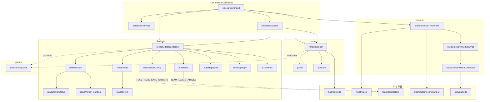

# src/sidecar/ 모듈 분析

> 작성일: 2026-05  
> 대상 경로: `src/sidecar/`  
> 분析 범위: 소스 파일 5개 + `__tests__/` 6개

---

## 1. 폴더 구조

```
src/sidecar/
├── types.ts       # 모든 인터페이스·타입 정의
├── collector.ts   # 팀 상태 파일 수집 → SidecarSnapshot 조립
├── render.ts      # SidecarSnapshot → 터미널 대시보드 텍스트 렌더링
├── tmux.ts        # tmux 분할 패인으로 sidecar watch 모드 실행
├── index.ts       # CLI 진입점 + watch 루프 + 인수 파싱
└── __tests__/
    ├── boundary.test.ts          # 경계 조건 (최솟값, 빈 상태, 오버플로우)
    ├── collector.test.ts         # 수집기 단위 테스트
    ├── render.test.ts            # 렌더링 출력 테스트
    ├── resource-leak-watch.test.ts # 리소스 누수 (타이머·이벤트 리스너)
    ├── tmux.test.ts              # tmux 명령 생성 테스트
    └── watch.test.ts             # watch 루프 동작 테스트
```

---

## 2. 시스템 개요

`sidecar`는 **OMX 팀 모드(`--team`)의 실시간 모니터링 사이드카**다.

```
omx sidecar <team-name>           # 한 번 렌더링 후 종료
omx sidecar <team-name> --json    # 정규화된 스냅샷 JSON 출력
omx sidecar <team-name> --watch   # 현재 터미널에서 주기적 갱신
omx sidecar <team-name> --tmux    # 현재 tmux 세션의 오른쪽 패인으로 watch 모드 실행
```

팀 상태 파일(`.omx/state/team/{teamName}/`)을 읽어서 워커·태스크·이벤트·위상·하이라이트를 **수집 → 정규화 → 렌더링** 파이프라인으로 처리한다.

---

## 3. 데이터 흐름

```
.omx/state/team/{teamName}/
  ├── manifest.v2.json   (또는 config.json)
  ├── phase.json
  ├── monitor-snapshot.json
  ├── tasks/task-N.json
  ├── workers/{name}/status.json
  ├── workers/{name}/heartbeat.json
  └── events/events.ndjson
         │
         ▼
  [collector.ts] collectSidecarSnapshot()
         │  SidecarSnapshot
         ▼
  [render.ts]   renderSidecar()
         │  string (ANSI 텍스트)
         ▼
  process.stdout  (watch 루프 / 단발 출력 / tmux 패인)
```

---

## 4. 파일별 상세 분析

### 4.1 `types.ts` — 타입 계약

모든 인터페이스를 **단일 파일**에 집중 관리한다.

#### 핵심 타입 계층

```
SidecarSnapshot                    ← 최상위 스냅샷 컨테이너
  ├── schema_version: 'omx.sidecar/v1'
  ├── team_name, team_task, phase
  ├── topology: SidecarTopology
  │     └── summary, nodes[], edges[]
  ├── workers: SidecarWorkerSnapshot[]
  │     ├── SidecarWorkerInfo      (설정: 이름·역할·패인·워크트리)
  │     ├── status: SidecarWorkerStatus
  │     │     └── state: SidecarWorkerState
  │     ├── heartbeat: SidecarWorkerHeartbeat | null
  │     ├── alive: boolean | null
  │     ├── current_task: SidecarTask | null
  │     └── turns_without_progress: number | null
  ├── tasks: SidecarTask[]
  │     └── id, subject, status(TeamTaskStatus), owner, blocked_by[], depends_on[]
  ├── events: SidecarEvent[]
  │     └── event_id, type(TeamEventType), worker, state, prev_state
  ├── panes: SidecarPaneMapping[]
  │     └── target, pane_id, role('leader'|'hud'|'worker')
  ├── highlights: SidecarHighlight[]
  │     └── severity('info'|'warning'|'critical'), kind, target, message
  └── source_warnings: string[]
```

#### `SidecarWorkerState` 7종

```typescript
'idle' | 'working' | 'blocked' | 'done' | 'failed' | 'draining' | 'unknown'
```

#### 옵션 인터페이스

| 인터페이스 | 역할 |
|---|---|
| `CollectSidecarSnapshotOptions` | `cwd`, `now`, `eventLimit`, `env` 수집 옵션 |
| `RenderSidecarOptions` | `width`, `height`, `color` 렌더링 옵션 |
| `SidecarFlags` | CLI 인수 (`json`, `watch`, `tmux`, `width`, `intervalMs`) |

---

### 4.2 `collector.ts` — 상태 수집기

파일시스템에서 팀 상태를 읽어 `SidecarSnapshot`을 조립하는 **순수 I/O 레이어**.

#### 진입 함수

```typescript
async function collectSidecarSnapshot(
  teamName: string,
  options: CollectSidecarSnapshotOptions = {},
): Promise<SidecarSnapshot | null>
```

팀 이름이 `TEAM_NAME_SAFE_PATTERN`에 맞지 않으면 예외를 던진다.  
설정 파일이 없으면 `null` 반환 (에러 아님).

#### 읽기 순서 및 병렬화

```typescript
// 병렬 수행
const [tasks, events, phase, monitorSnapshot] = await Promise.all([
  readTasks(root),
  readEvents(root, options.eventLimit ?? 12),
  readPhase(root),
  readMonitorSnapshot(root),
]);
// 직렬 (tasks 결과 필요)
const workers = await buildWorkers(config, tasks, root, monitorSnapshot);
```

#### 파일 경로 규칙

| 파일 | 경로 |
|---|---|
| 팀 설정 | `{root}/manifest.v2.json` → 없으면 `config.json` (레거시) |
| 태스크 | `{root}/tasks/task-N.json` (숫자 오름차순) |
| 워커 상태 | `{root}/workers/{name}/status.json` |
| 워커 하트비트 | `{root}/workers/{name}/heartbeat.json` |
| 이벤트 로그 | `{root}/events/events.ndjson` (NDJSON, 테일 읽기) |
| 페이즈 | `{root}/phase.json` |
| 모니터 스냅샷 | `{root}/monitor-snapshot.json` |

환경변수 `OMX_TEAM_STATE_ROOT`로 상태 루트 디렉토리 오버라이드 가능.

#### `readTailText()` — NDJSON 테일 읽기

```typescript
export async function readTailText(
  path: string,
  maxBytes: number = 64 * 1024,
): Promise<string | null>
```

이벤트 로그가 커질 수 있으므로 파일 끝에서 최대 `64KB`만 읽는다.  
첫 번째 줄이 불완전 JSON일 경우 자동 제거.

#### `buildWorkers()` — 진행 없는 턴 계산

```typescript
turnsWithoutProgress =
  status.state === 'working'
  && currentTask
  && prevTaskId === currentTaskId
  && prevTurnCount !== null
  && typeof currentTurnCount === 'number'
    ? Math.max(0, currentTurnCount - prevTurnCount)
    : null;
```

`monitor-snapshot.json`의 이전 스냅샷과 비교해 **같은 태스크를 잡고 있으면서 진행 없이 몇 턴이 지났는지** 계산.

#### `buildHighlights()` — 주목 이벤트 탐지

| 조건 | severity | kind |
|---|---|---|
| 워커 상태 `blocked` | `warning` | `blocked-worker` |
| 워커 `alive === false` | `critical` | `dead-worker` |
| `turns_without_progress > 5` | `warning` | `non-reporting-worker` |
| 태스크 `blocked` | `warning` | `blocked-task` |
| 태스크 `failed` | `critical` | `failed-task` |

#### `buildTopology()` — 위상 구성

```
nodes: ['leader', worker-1, worker-2, ...]
edges: leader → worker-N (label: 'task-{id}' 또는 현재 상태)
summary: "N workers · X working · Y blocked · Z in progress · W pending"
```

---

### 4.3 `render.ts` — 터미널 렌더러

`SidecarSnapshot`을 **패널 형식의 ANSI 텍스트 문자열**로 변환.

#### 진입 함수

```typescript
export function renderSidecar(
  snapshot: SidecarSnapshot,
  options: RenderSidecarOptions = {},
): string
```

#### 렌더링 구조

```
OMX Sidecar · {team_name}
phase={phase} generated={generated_at}

╭ Topology ────────────────...
│ {topology.summary}
│ leader ── {label} → worker-1
│ ...
╭ Agents ──────────────────...
│ worker-1 [working/alive] executor task-3 %1 Δturns=0
│ ...
╭ Tasks ───────────────────...
│ task-1 [done] @worker-1 태스크 제목
│ ...
╭ Highlights ──────────────...
│ !! task-3: task-3 failed           ← critical
│ !  worker-2: worker-2 is blocked   ← warning
│ ·  no blockers detected            ← 없을 경우 green
╭ Panes ───────────────────...
│ leader [leader] %1
╭ Events ──────────────────...
│ 2026-05-28T... worker_state_changed worker-1 task-3
╭ Warnings ────────────────...    (source_warnings 있을 때만)
│ ...
```

#### 텍스트 처리 헬퍼

| 함수 | 역할 |
|---|---|
| `clean(value)` | OSC/ANSI/제어 문자 제거 |
| `visibleLength(value)` | 실제 표시 길이 (ANSI 제외) |
| `truncate(value, width)` | 너비 초과 시 `…` 말줄임 |
| `panel(title, lines, width)` | `╭ title ───` 패널 테두리 생성 |

#### 색상 토글

`withColorSetting(enabled, fn)` — 렌더링 중에만 색상 설정 변경 후 원래 값으로 복원. `--json` 모드에서 색상 없이 출력할 때 활용.

---

### 4.4 `tmux.ts` — tmux 패인 실행기

`--tmux` 플래그 사용 시 현재 tmux 세션에 **오른쪽 수직 분할 패인**으로 sidecar watch 모드를 실행.

#### 주요 함수

```typescript
// tmux 명령 인수 구성
export function buildSidecarTmuxSplitArgs(options: SidecarTmuxOptions): string[]

// 패인 생성 실행 → pane_id 반환 (실패 시 null)
export function launchSidecarTmuxPane(
  options: SidecarTmuxOptions,
  execTmuxSync: TmuxExecSync = defaultExecTmuxSync,
): string | null
```

#### 생성하는 tmux 명령

```
tmux split-window -h -d -l {width} -c {cwd} -P -F '#{pane_id}'
  'OMX_SESSION_ID={sessionId} node /path/to/omx sidecar {teamName} --watch --width {width}'
```

| 옵션 | 의미 |
|---|---|
| `-h` | 수평 분할 (오른쪽 패인) |
| `-d` | 분할 후 포커스 이동 없음 |
| `-l {width}` | 패인 너비 지정 (기본 48) |
| `-P -F '#{pane_id}'` | 생성된 패인 ID 출력 |

#### 너비 정규화

```typescript
function sidecarWidth(width): number {
  return Number.isFinite(width) && width >= 30 ? Math.floor(width) : 48;
}
```

최솟값 30, 기본값 48.

---

### 4.5 `index.ts` — CLI 진입점

#### `parseSidecarArgs(args)` — 인수 파싱

```typescript
interface SidecarFlags {
  json: boolean;     // --json
  watch: boolean;    // --watch | -w
  tmux: boolean;     // --tmux
  width?: number;    // --width <n> | --width=<n>  (기본 48)
  intervalMs?: number; // --interval-ms <n>         (기본 1000)
}
```

#### `runSidecarWatch()` — watch 루프

의존성 주입 패턴(`RunSidecarWatchDeps`)으로 테스트 가능하게 설계.

```
루프 시작:
  커서 숨김 (\x1b[?25l)
  while (!stopped):
    collect() → render() → writeStdout(ANSI 화면 지우기 + 출력)
    sleep(intervalMs - 경과 시간)
  커서 복원 (\x1b[?25h)
  SIGINT 리스너 해제
```

**첫 렌더 `\x1b[2J\x1b[H`** — 전체 화면 지우기 후 커서를 좌상단으로.  
**이후 렌더 `\x1b[H`** — 커서만 좌상단으로 이동 (플리커 방지).  
**후처리 `\x1b[J`** — 커서 이하 나머지 화면 지우기.

`inFlight` + `queued` 플래그로 중첩 렌더 방지.

#### `sidecarCommand()` — 모드 분기

```
args[0] === '--help' or 없음  → 사용법 출력
flags.tmux    → launchSidecarTmuxPane() → 패인 ID 출력
flags.watch   → runSidecarWatch()
flags.json    → collectSidecarSnapshot() → JSON.stringify 출력
기본           → collectSidecarSnapshot() → renderSidecar() → 단발 출력
```

---

## 5. 호출 관계 다이어그램



---

## 6. 상태 파일 스키마 (읽기 전용)

```
.omx/state/team/{teamName}/
├── manifest.v2.json    ← { name, task, worker_count, tmux_session,
│                            leader_pane_id, hud_pane_id, workers[] }
├── config.json         ← 동일 스키마 (레거시 폴백)
├── phase.json          ← { current_phase: string }
├── monitor-snapshot.json ← { workerTurnCountByName, workerTaskIdByName }
├── tasks/
│   └── task-N.json     ← { id, subject, description, status,
│                            owner, blocked_by[], depends_on[], ... }
├── workers/
│   └── {name}/
│       ├── status.json    ← { state, current_task_id, reason, updated_at }
│       └── heartbeat.json ← { pid, last_turn_at, turn_count, alive }
└── events/
    └── events.ndjson   ← NDJSON 이벤트 스트림 (테일 64KB 읽기)
```

---

## 7. 보안 및 안전 처리

| 위협 | 대응 |
|---|---|
| 팀 이름 경로 순회 | `TEAM_NAME_SAFE_PATTERN` 정규식 검증 후 예외 발생 |
| 워커 이름 경로 순회 | `WORKER_NAME_SAFE_PATTERN` 검증, 불일치 시 워커 건너뜀 + 경고 |
| 불완전 NDJSON 첫 줄 | `readTailText` 후 첫 줄 자동 제거 |
| JSON 파싱 실패 | 모든 `readJson()` 호출에서 `catch → null` 반환 (비치명적) |
| ANSI 주입 | `clean()` 함수로 OSC/ANSI/제어 문자 완전 제거 후 렌더링 |
| 워커 이름 `source_warnings` 노출 | 렌더링 결과에만 포함, 파일시스템 미기록 |

---

## 8. 테스트 파일 요약

| 파일 | 주요 검증 항목 |
|---|---|
| `collector.test.ts` | 팀 설정 정규화, 워커/태스크/이벤트 읽기, `turns_without_progress` 계산 |
| `render.test.ts` | 패널 렌더링, 너비 제한, ANSI 색상, 빈 상태 출력 |
| `tmux.test.ts` | `buildSidecarTmuxSplitArgs` 인수 구성, 패인 ID 파싱 |
| `watch.test.ts` | 렌더 루프 타이밍, SIGINT 처리, 중첩 렌더 방지 |
| `boundary.test.ts` | 최솟값(너비 30), 빈 팀, 스냅샷 없음, 이벤트 없음 |
| `resource-leak-watch.test.ts` | 타이머 해제, SIGINT 리스너 해제, AbortController 정리 |

---

## 9. 환경변수 제어

| 변수 | 기본값 | 역할 |
|---|---|---|
| `OMX_TEAM_STATE_ROOT` | `{cwd}/.omx/state` | 상태 루트 디렉토리 오버라이드 |
| `OMX_SESSION_ID` | — | tmux 패인 시작 명령에 주입할 세션 ID |
| `TMUX` | — | tmux 환경 여부 (`--tmux` 플래그 선결 조건) |

---

## 10. 설계 원칙

### 1. 파이프라인 관심사 분리
`collector.ts` → `render.ts` → `index.ts` 3단 파이프라인. 각 레이어는 이전 레이어의 타입만 의존.

### 2. 의존성 주입으로 테스트 가능
`runSidecarWatch()`의 `RunSidecarWatchDeps`는 `collect`, `render`, `writeStdout`, `sleep`, `registerSigint` 등 모든 부수 효과를 외부에서 주입받아 유닛 테스트 가능.

### 3. 비치명적 파일 읽기
모든 상태 파일 읽기는 `catch → null/[]` 로 실패를 흡수. 일부 파일이 없어도 스냅샷 조립 계속 진행.

### 4. 플리커 없는 화면 갱신
첫 렌더는 `\x1b[2J\x1b[H` (전체 지우기), 이후는 `\x1b[H` (커서 이동만) + `\x1b[J` (이하 지우기)로 최소 재드로우.

### 5. 레거시 설정 폴백
`manifest.v2.json` → `config.json` 순서로 설정 파일을 탐색. 구버전 팀 상태도 호환.

---

## 11. 연관 분析 파일

| 모듈 | 분析 파일 |
|---|---|
| `src/team/` | (미작성) |
| `src/hud/` | (미작성) |
| `src/scripts/notify-hook/` | [scripts-module-analysis.md](./scripts-module-analysis.md) |
| `src/runtime/` | [runtime-module-analysis.md](./runtime-module-analysis.md) |
