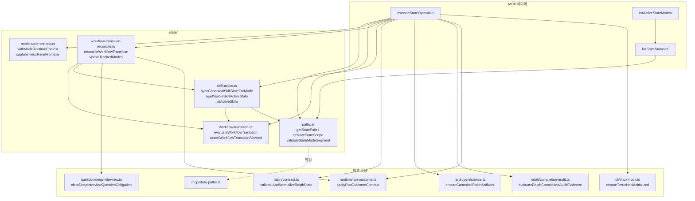

# src/state/ 모듈 분석

> 작성일: 2026-05  
> 대상 경로: `src/state/`  
> 분석 범위: 소스 파일 6개 + `__tests__/` 7개

---

## 1. 폴더 구조

```
src/state/
├── paths.ts                         # state-paths 재수출 배럴 (src/mcp/state-paths.js 위임)
├── mode-state-context.ts            # tmux 런타임 컨텍스트 캡처 & 병합
├── skill-active.ts                  # 활성 스킬 목록 관리 (정식 상태 파일)
├── workflow-transition.ts           # 워크플로우 전환 규칙 평가 (순수 함수)
├── workflow-transition-reconcile.ts # 전환 실행·자동완료·파일 쓰기 (부수 효과)
├── operations.ts                    # MCP state_* 명령어 라우터 (최상위 공개 API)
└── __tests__/
    ├── mode-state-context.test.ts
    ├── operations-ralph-phase.test.ts
    ├── operations.test.ts
    ├── path-traversal.test.ts
    ├── planning-gate.test.ts
    ├── skill-active.test.ts
    └── workflow-transition.test.ts
```

---

## 2. 시스템 개요

`state` 모듈은 **OMX 워크플로우 모드의 영속 상태 관리 레이어**다.

```
MCP 호출 (state_read / state_write / state_clear / state_list_active / state_get_status)
         │
         ▼
    [operations.ts] ← 공개 진입점
         │
         ├── paths.ts              경로 해석 (mcp/state-paths.js 위임)
         ├── mode-state-context.ts tmux 패인 ID 캡처
         ├── workflow-transition.ts 전환 가능 여부 판단 (순수)
         ├── workflow-transition-reconcile.ts 전환 실행 (파일 쓰기)
         └── skill-active.ts       skill-active-state.json 동기화
```

### 상태 파일 위치 규칙

```
{cwd}/.omx/state/
├── {mode}-state.json               ← 전역 스코프
├── skill-active-state.json         ← 전역 canonical
└── sessions/{sessionId}/
    ├── {mode}-state.json           ← 세션 스코프
    └── skill-active-state.json     ← 세션 canonical
```

---

## 3. 파일별 상세 분석

### 3.1 `paths.ts` — 경로 배럴

`src/mcp/state-paths.ts`의 모든 공개 심볼을 **그대로 재수출**하는 배럴 파일.  
직접 로직 없음 — 모든 경로 계산은 `mcp/state-paths.ts`에 위임.

재수출 대상 (주요):

| 심볼 | 역할 |
|---|---|
| `getStatePath(mode, cwd, sessionId?)` | 특정 모드 상태 파일 절대 경로 |
| `getStateDir(cwd, sessionId?)` | 상태 디렉토리 경로 |
| `getBaseStateDir(cwd)` | 세션 없는 기본 상태 루트 |
| `resolveStateScope(cwd, sessionId?)` | 유효 스코프 결정 |
| `resolveWorkingDirectoryForState(dir?)` | cwd 정규화 |
| `validateSessionId(id?)` | 세션 ID 유효성 검사 |
| `validateStateModeSegment(mode)` | 모드 이름 유효성 검사 |
| `getReadScopedStatePaths(mode, cwd, sessionId?)` | 읽기 우선순위 경로 목록 |
| `getAllScopedStatePaths(mode, cwd)` | 전체 스코프 경로 목록 |
| `listModeStateFilesWithScopePreference(...)` | 스코프 우선순위 파일 목록 |

---

### 3.2 `mode-state-context.ts` — tmux 런타임 컨텍스트

모드 상태 파일에 **tmux 패인 ID와 윈도우 ID를 주입**하는 유틸리티.

#### 주요 함수

```typescript
// 환경변수 TMUX_PANE에서 패인 ID 캡처
export function captureTmuxPaneFromEnv(env = process.env): string | null

// OMX_TMUX_HUD_OWNER=1 이고 TMUX가 설정된 경우 윈도우 ID 조회
export function captureTmuxWindowForPane(pane: string, env = process.env): string | null

// 모드 상태 객체에 tmux 컨텍스트 주입
export function withModeRuntimeContext<T extends ModeStateContextLike>(
  existing: ModeStateContextLike,
  next: T,
  options?: { env?: NodeJS.ProcessEnv; nowIso?: string }
): T
```

#### `withModeRuntimeContext()` 동작 조건

```
next.active === true
  AND (기존에 비활성이었거나 패인 ID가 없는 경우)
    → TMUX_PANE 환경변수에서 패인 ID 캡처
    → OMX_TMUX_HUD_OWNER === '1' 이면 tmux 명령으로 윈도우 ID도 캡처
    → next.tmux_pane_id, next.tmux_window_id, next.tmux_pane_set_at 설정
```

조건을 만족하지 않으면 `next`를 그대로 반환 (순수 함수에 가깝게 동작).

---

### 3.3 `workflow-transition.ts` — 전환 규칙 평가기

**파일 I/O 없음** — 현재 활성 모드 집합과 요청 모드를 받아 전환 가능 여부를 순수하게 계산.

#### 추적 대상 워크플로우 모드 (9종)

```typescript
export const TRACKED_WORKFLOW_MODES = [
  'autopilot', 'autoresearch', 'team', 'ultragoal',
  'ralph', 'ultrawork', 'ultraqa', 'ralplan', 'deep-interview',
]
```

#### 전환 종류 (`WorkflowTransitionKind`)

| 종류 | 조건 |
|---|---|
| `allow` | 이미 활성이거나 활성 모드가 없음 |
| `overlap` | 허용된 오버랩 쌍 (ex: `ralph\|team`) |
| `auto-complete` | 현재 모드 중 전환 테이블에 있는 것만 자동 완료 |
| `deny` | 위 조건 불충족 (롤백 또는 미지원 오버랩) |

#### 허용 오버랩 쌍

```typescript
const ALLOWED_OVERLAP_PAIRS = new Set(['ralph|team']);
// ultrawork는 모든 모드와 오버랩 허용
```

#### 자동완료 전환 테이블 (일부)

```
deep-interview → ralplan, autopilot, autoresearch, ralph, team, ultragoal, ultrawork
ralplan        → team, ralph, autopilot, autoresearch
autopilot      → ralplan
```

#### 롤백 거부 규칙

실행 계열 모드(`autopilot`, `team`, `ralph`, `ultrawork`, `ultraqa` 등)가 활성인 상태에서  
계획 계열 모드(`deep-interview`, `ralplan`)를 활성화하면 **롤백으로 거부**.

#### 핵심 함수

```typescript
// 전환 결정 반환 (allowed, kind, resultingModes, autoCompleteModes)
export function evaluateWorkflowTransition(
  currentActiveModes: Iterable<string>,
  requestedMode: TrackedWorkflowMode,
): WorkflowTransitionDecision

// 거부 시 throw
export function assertWorkflowTransitionAllowed(
  currentActiveModes, requestedMode, action = 'activate'
): void

// 파일에서 현재 활성 모드 읽기
export async function readActiveWorkflowModes(cwd, sessionId?): Promise<TrackedWorkflowMode[]>
```

---

### 3.4 `workflow-transition-reconcile.ts` — 전환 실행기

`workflow-transition.ts`의 평가 결과를 받아 **실제 파일 쓰기**를 수행하는 부수 효과 레이어.

#### 진입 함수

```typescript
export async function reconcileWorkflowTransition(
  cwd: string,
  requestedMode: TrackedWorkflowMode,
  options: {
    action?: WorkflowTransitionAction;
    sessionId?: string;
    nowIso?: string;
    source?: string;
    baseStateDir?: string;
    currentModes?: Iterable<string>;
  } = {},
): Promise<ReconciledWorkflowTransition>
```

#### 실행 흐름

```
1. visibleTrackedModes() → 현재 활성 모드 읽기
   (canonical skill-active + 개별 {mode}-state.json 합집합)

2. evaluateWorkflowTransition() → 전환 결정
   denied → throw Error

3. autoCompleteModes 순회:
   completeSourceModeState() 호출:
     - 기존 상태 읽기
     - active=false, current_phase='completed' 로 패치
     - deep-interview 이면 question_enforcement 클리어 (handoff)
     - run_outcome 필드 삭제 → applyRunOutcomeContract 재적용
     - 파일 쓰기
     - syncCanonicalSkillStateForMode(active=false)

4. ReconciledWorkflowTransition 반환
   { decision, transitionMessage, autoCompletedModes, completedPaths }
```

---

### 3.5 `skill-active.ts` — canonical 스킬 상태 관리

`skill-active-state.json` 을 **single source of truth**로 관리하는 레이어.  
여러 워크플로우 모드가 동시 활성일 수 있어 `active_skills` 배열로 추적.

#### 정식 워크플로우 스킬 (8종)

```typescript
export const CANONICAL_WORKFLOW_SKILLS = [
  'autopilot', 'autoresearch', 'team', 'ralph',
  'ultrawork', 'ultraqa', 'ralplan', 'deep-interview',
]
```

#### 핵심 데이터 구조

```typescript
// 파일 최상위 구조
interface SkillActiveStateLike {
  version?: number;
  active?: boolean;
  skill?: string;          // 주 스킬 (단일)
  phase?: string;
  active_skills?: SkillActiveEntry[];  // 다중 스킬 목록
  initialized_mode?: string;
  initialized_state_path?: string;
  input_lock?: unknown;
  session_id?: string;
  thread_id?: string;
  turn_id?: string;
  ...
}

// 목록의 각 항목
interface SkillActiveEntry {
  skill: string;
  phase?: string;
  active?: boolean;
  activated_at?: string;
  session_id?: string;
  thread_id?: string;
  turn_id?: string;
}
```

#### 세션 스코프 병합 전략

```
rootPath     = .omx/state/skill-active-state.json          (전역)
sessionPath  = .omx/state/sessions/{id}/skill-active-state.json (세션)

읽기:
  sessionPath 존재 → 세션 파일만 반환
  sessionPath 없음, 세션 요청 → null 반환 (전역 노출 안 함)
  세션 없음 → rootPath 반환

쓰기 (syncCanonicalSkillStateForMode):
  세션 스코프:
    rootPath  ← 세션 항목 포함한 전체 목록 (다른 세션 포함)
    sessionPath ← 해당 세션 항목만
  전역 스코프:
    rootPath만 업데이트
```

#### `sanitizeInheritedSkillActiveBase()` — 크로스 세션 오염 방지

다른 세션에서 초기화된 상태가 현재 세션에 상속될 때 다음 필드를 **제거**:
`initialized_mode`, `initialized_state_path`, `input_lock`, `context_snapshot_path`,  
`prd_path`, `test_spec_path`, `task_slug`, `prd_path`, `owner_*_session_id` 등.

#### 주요 공개 함수

| 함수 | 역할 |
|---|---|
| `listActiveSkills(raw)` | `active_skills[]` 또는 레거시 단일 `skill` 필드에서 활성 항목 추출 |
| `normalizeSkillActiveState(raw)` | 정규화 + 레거시 단일 필드 → `active_skills[]` 변환 |
| `readSkillActiveState(path)` | JSON 읽기 + 정규화 |
| `readVisibleSkillActiveState(cwd, sessionId?)` | 스코프 우선순위로 파일 읽기 |
| `writeSkillActiveStateCopies(cwd, state, sessionId?)` | 루트·세션 양쪽 쓰기 |
| `syncCanonicalSkillStateForMode(options)` | 모드 하나의 활성화/비활성화를 `active_skills` 배열에 반영 |

---

### 3.6 `operations.ts` — MCP 상태 연산 라우터

MCP에서 호출하는 **`state_*` 명령의 최상위 진입점**.

#### 공개 API

```typescript
export async function executeStateOperation(
  name: StateOperationName,
  rawArgs: Record<string, unknown> = {},
): Promise<StateOperationResponse>

export async function listActiveStateModes(
  workingDirectory?, explicitSessionId?
): Promise<string[]>

export async function listStateStatuses(
  cwd, explicitSessionId?, mode?, options?
): Promise<Record<string, unknown>>
```

#### 지원 연산 (`StateOperationName`)

```typescript
'state_read' | 'state_write' | 'state_clear' |
'state_list_active' | 'state_get_status'
```

#### `state_read`

```
validateStrictReadableMode(mode)  ← SUPPORTED_STATE_READ_MODES 중 하나
getReadScopedStatePaths()         ← 세션>전역 우선순위 경로 목록
existsSync() 첫 번째 경로 읽기
→ payload: JSON 내용 그대로
```

#### `state_write`

```
resolveStateScope() → effectiveSessionId 결정
initializeStateEnvironment()      ← 디렉토리 생성 + tmux 훅 초기화

withStateWriteLock(path, async () => {
  기존 파일 읽기 → mergedRaw 병합
  run_outcome / lifecycle_outcome / terminal_outcome 필드 제거 (명시 없으면)

  mode === 'ralph':
    validateAndNormalizeRalphState()     ← 페이즈 검증·정규화
    complete 페이즈이면 evaluateRalphCompletionAuditEvidence() 게이트

  applyRunOutcomeContract() → run_outcome 재계산
  isTrackedWorkflowMode && active=true:
    reconcileWorkflowTransition()        ← 전환 충돌 체크·자동완료

  withModeRuntimeContext()              ← tmux 패인 주입
  writeAtomicFile()                     ← tmp → rename 원자적 쓰기
})

mode === 'skill-active':
  readSkillActiveState() → writeSkillActiveStateCopiesForStateDir()
else:
  ensureCanonicalRalphArtifacts() (ralph + complete)
  syncCanonicalSkillStateForMode()
```

#### `state_clear`

```
all_sessions=false (단일 스코프):
  세션 스코프이면서 전역 파일도 존재 → 세션 파일에 cleared 상태 기록 (삭제 안 함)
  그 외 → unlink()
  syncCanonicalSkillStateForMode(active=false)

all_sessions=true:
  getAllScopedStatePaths() 전부 unlink()
  syncCanonicalSkillStateForMode(active=false, allSessions=true)
```

#### `writeAtomicFile()` — 원자적 파일 쓰기

```
tmpPath = {path}.tmp.{pid}.{timestamp}.{random}
writeFile(tmpPath) → rename(tmpPath, path)
실패 시 tmpPath unlink()
```

#### `withStateWriteLock()` — 동일 경로 직렬화

```typescript
const stateWriteQueues = new Map<string, Promise<void>>();
// 같은 path에 대한 쓰기 작업을 순서대로 직렬화
// Promise 체인으로 큐잉, 완료 후 큐에서 제거
```

---

## 4. 호출 관계 다이어그램



---

## 5. 상태 파일 스키마

### 일반 `{mode}-state.json`

```json
{
  "active": true,
  "current_phase": "plan",
  "updated_at": "2026-05-28T00:00:00.000Z",
  "mode": "ralph",
  "session_id": "sess-abc123",
  "tmux_pane_id": "%1",
  "tmux_window_id": "@1",
  "tmux_pane_set_at": "2026-05-28T00:00:00.000Z",
  "run_outcome": { ... }
}
```

### `skill-active-state.json`

```json
{
  "version": 1,
  "active": true,
  "skill": "ralph",
  "phase": "plan",
  "active_skills": [
    {
      "skill": "ralph",
      "phase": "plan",
      "active": true,
      "session_id": "sess-abc123",
      "activated_at": "...",
      "updated_at": "..."
    }
  ],
  "initialized_mode": "ralph",
  "initialized_state_path": ".omx/state/sessions/sess-abc123/ralph-state.json"
}
```

---

## 6. Planning Gate (`workflow-transition.ts` 내 별도 서브시스템)

`deep-interview` 모드의 `downstream_authority: 'plan_then_execute'` 설정 시  
구현 도구(`Edit`, `Write`, `NotebookEdit`, `git push`, `gh pr create`) 호출을 차단.

```typescript
export function evaluatePreToolUseGate(
  toolInput: PreToolUseGateInput,
  gateState: PlanningGateState | null | undefined,
  planningComplete: boolean,
  now: Date = new Date(),
): PreToolUseGateDecision
```

#### 게이트 해제 조건

| 조건 | 결과 |
|---|---|
| `gateState` 없거나 `downstream_authority !== 'plan_then_execute'` | 허용 |
| `planningComplete === true` (ralplan 산출물 존재) | 허용 |
| 구현 도구 호출이 아닌 경우 | 허용 |
| `bypass_planning_gate_until` 시각이 아직 미래 (TTL=10분) | 허용 (bypass) |
| 위 모두 해당 없음 | 차단 (`gate_fired: true`) |

```
"bypass planning gate" 문구 감지 → computeBypassExpiry() → 10분 유예
```

---

## 7. 보안 및 안전 처리

| 위협/문제 | 대응 |
|---|---|
| 경로 순회 공격 | `validateStateModeSegment()` 정규식 검증 |
| 동시 쓰기 충돌 | `withStateWriteLock()` Promise 체인 직렬화 |
| 파일 쓰기 중 프로세스 종료 | `writeAtomicFile()` tmp→rename 원자적 쓰기 |
| 손상된 JSON 읽기 | `catch → null / throw 명시적 오류` 선택적 처리 |
| 크로스 세션 상태 오염 | `sanitizeInheritedSkillActiveBase()` 세션 전용 필드 제거 |
| 실행→계획 롤백 | `isRollbackTransition()` → `deny` 종류로 거부 |
| 계획 완료 전 구현 실행 | `evaluatePreToolUseGate()` Planning Gate |

---

## 8. 테스트 파일 요약

| 파일 | 주요 검증 항목 |
|---|---|
| `operations.test.ts` | state_read/write/clear/list_active/get_status 전체 흐름 |
| `operations-ralph-phase.test.ts` | ralph 페이즈 검증, completion_audit 게이트 |
| `skill-active.test.ts` | listActiveSkills, syncCanonicalSkillStateForMode, 세션 상속 필터 |
| `workflow-transition.test.ts` | evaluateWorkflowTransition 전환 매트릭스, 롤백 거부 |
| `mode-state-context.test.ts` | captureTmuxPaneFromEnv, withModeRuntimeContext |
| `planning-gate.test.ts` | evaluatePreToolUseGate, bypass TTL |
| `path-traversal.test.ts` | validateStateModeSegment 경로 순회 시도 차단 |

---

## 9. 설계 원칙

### 1. 계층 분리
- `workflow-transition.ts` ← 순수 함수 (I/O 없음)
- `workflow-transition-reconcile.ts` ← 부수 효과 (파일 쓰기)
- `operations.ts` ← 외부 진입점 (조율)

### 2. Canonical Single Source of Truth
`skill-active-state.json` 이 활성 스킬 목록의 정식 파일.  
개별 `{mode}-state.json`은 참조용이며, 쓰기 후 반드시 `syncCanonicalSkillStateForMode()` 로 canonical 파일 동기화.

### 3. 원자적 쓰기 + 직렬 큐
동시 쓰기 경쟁 조건 방지를 위해 경로별 Promise 큐 + tmp→rename 원자적 파일 쓰기.

### 4. 레거시 호환
단일 `skill` 필드 (구버전) → `active_skills[]` 배열 (신버전) 자동 정규화.  
`config.json` → `manifest.v2.json` 순서의 레거시 폴백과 동일한 패턴.

### 5. 의존성 주입 가능 API
`withStateWriteLock`, `writeAtomicFile` 등 내부 함수는 테스트에서 모킹 가능한 구조로 분리.

---

## 10. 연관 분석 파일

| 모듈 | 분석 파일 |
|---|---|
| `src/scripts/` | [scripts-module-analysis.md](./scripts-module-analysis.md) |
| `src/runtime/` | [runtime-module-analysis.md](./runtime-module-analysis.md) |
| `src/hooks/` | [hooks-module-analysis.md](./hooks-module-analysis.md) |
| `src/sidecar/` | [sidecar-module-analysis.md](./sidecar-module-analysis.md) |
| `src/mcp/` | (미작성) |
| `src/ralph/` | (미작성) |
