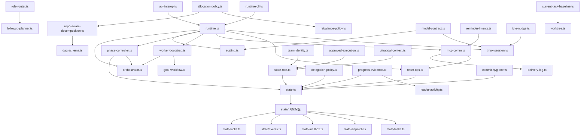

# src/team 모듈 분析

## 폴더 구조

```
src/team/
├── contracts.ts              # 공유 상수·상태 기계 규칙
├── orchestrator.ts           # 파이프라인 단계 전환 엔진
├── runtime.ts                # 메인 런타임 루프 (startTeam/monitorTeam/shutdownTeam)
├── runtime-cli.ts            # CLI 진입점 (JSON 입출력)
├── team-ops.ts               # MCP 정렬 게이트웨이 (state.ts 위 얇은 alias 레이어)
├── state.ts                  # 영속화 퍼블릭 API (state/ 서브모듈 재수출)
├── state-root.ts             # 팀 상태 루트 경로 해석
├── tmux-session.ts           # tmux 세션·패인 생성·관리
├── worker-bootstrap.ts       # 워커 초기화 (AGENTS.md 오버레이 생성)
├── mcp-comm.ts               # 메시지 디스패치 파이프라인
├── phase-controller.ts       # 단계 전환 조정 (태스크 카운트 기반)
├── allocation-policy.ts      # 태스크→워커 점수 기반 할당
├── rebalance-policy.ts       # 유휴 워커에 미할당 태스크 재분배
├── delegation-policy.ts      # 태스크 하위 위임 계획 합성
├── role-router.ts            # 역할 프롬프트 로딩 + 태스크 휴리스틱 라우팅
├── scaling.ts                # 동적 워커 추가·제거 (Phase 1: Manual Scaling)
├── worktree.ts               # Git worktree 생성·관리 (워커별 격리 브랜치)
├── team-identity.ts          # 팀 이름 정규화·중의성 해결
├── model-contract.ts         # 워커 모델·추론 설정 해석
├── goal-workflow.ts          # 워커 목표 인스트럭션 빌드·렌더링
├── delivery-log.ts           # 디스패치 이벤트 JSONL 로그
├── commit-hygiene.ts         # 팀 운영 커밋 이력 관리
├── dag-schema.ts             # DAG 핸드오프 스키마 (TeamDagHandoff)
├── repo-aware-decomposition.ts  # DAG+할당 통합 태스크 분해
├── followup-planner.ts       # 후속 스태핑 계획 생성
├── progress-evidence.ts      # 진행 증거 타임스탬프 집계
├── leader-activity.ts        # git 활동 기반 리더 활성도 감지
├── idle-nudge.ts             # 유휴 워커 패인 tmux 넛지
├── approved-execution.ts     # 승인 실행 바인딩 (PRD → 팀 실행)
├── ultragoal-context.ts      # ultragoal 팀 컨텍스트 관리
├── reminder-intents.ts       # 팀 리마인더 인텐트 상수·라우팅
├── pane-status.ts            # 패인 상태 스냅샷 상세 정보
├── current-task-baseline.ts  # 현재 태스크 브랜치 기준점 관리
├── api-interop.ts            # runtime.ts 경유 팀 API interop
├── state/                    # 상태 영속화 레이어
│   ├── index.ts              # 서브모듈 퍼블릭 API 재수출
│   ├── types.ts              # 핵심 타입 정의
│   ├── io.ts                 # 파일 I/O 유틸리티
│   ├── config.ts             # 팀 설정 읽기·쓰기
│   ├── tasks.ts              # 태스크 CRUD·클레임·의존성 검사
│   ├── workers.ts            # 워커 상태·하트비트
│   ├── dispatch.ts           # 디스패치 요청 큐
│   ├── mailbox.ts            # 워커 간 직접 메시지
│   ├── events.ts             # 팀 이벤트 추가·읽기
│   ├── locks.ts              # 파일 기반 잠금
│   ├── dispatch-lock.ts      # 디스패치 전용 잠금
│   ├── approvals.ts          # 태스크 승인 레코드
│   ├── monitor.ts            # 모니터 스냅샷
│   ├── shutdown.ts           # 종료 요청·ACK
│   └── summary.ts            # 팀 요약 집계
└── __tests__/                # 38개 테스트 파일
```

---

## 시스템 개요

`src/team`은 **oh-my-codex 멀티에이전트 팀 오케스트레이션**의 전체 구현을 담는다.  
리더 에이전트가 복수의 워커 에이전트를 tmux 패인에 생성·감시·통신하면서 하나의 팀 목표를 달성하는 데 필요한 모든 계층을 포함한다.

### 책임 계층 분류

| 계층 | 파일 그룹 | 역할 |
|------|-----------|------|
| **계약** | `contracts.ts` | 상태 기계 상수·전환 규칙 |
| **오케스트레이션** | `orchestrator.ts`, `phase-controller.ts` | 파이프라인 단계 전환 |
| **런타임** | `runtime.ts`, `runtime-cli.ts` | 팀 실행 루프 |
| **상태 영속화** | `state/`, `state.ts`, `team-ops.ts`, `state-root.ts` | JSON 파일 기반 상태 관리 |
| **프로세스 관리** | `tmux-session.ts`, `scaling.ts`, `worktree.ts` | tmux·워커 생명주기 |
| **워커 초기화** | `worker-bootstrap.ts`, `goal-workflow.ts` | 워커 인스트럭션 생성 |
| **통신** | `mcp-comm.ts`, `delivery-log.ts` | 인박스·메일박스 디스패치 |
| **정책** | `allocation-policy.ts`, `rebalance-policy.ts`, `delegation-policy.ts`, `role-router.ts` | 태스크 배분 정책 |
| **모델 설정** | `model-contract.ts` | 워커 모델·추론 해석 |
| **보조 기능** | `progress-evidence.ts`, `leader-activity.ts`, `idle-nudge.ts`, `commit-hygiene.ts` | 모니터링·위생 |
| **메타** | `team-identity.ts`, `dag-schema.ts`, `repo-aware-decomposition.ts`, `followup-planner.ts` | 계획·메타데이터 |

---

## 1. 계약 레이어 — `contracts.ts`

팀 전체에서 공유하는 상수, 상태 기계 규칙, 타입 가드.

### 주요 상태 기계

#### 태스크 상태 (`TeamTaskStatus`)
```
pending → (in_progress) → completed
pending → (in_progress) → failed
blocked → (in_progress) → completed / failed
```
- `TEAM_TASK_STATUS_TRANSITIONS`: 허용 전환 맵 (terminal 상태에서 전환 불가)
- `isTerminalTeamTaskStatus()`, `canTransitionTeamTaskStatus()` 헬퍼 제공

#### 디스패치 요청 상태 (`TeamDispatchRequestStatus`)
```
pending → notified → delivered
pending → failed
notified → failed
```

#### 워커 통합 상태 (`TeamWorkerIntegrationStatus`)
`idle | integrated | integration_failed | cherry_pick_conflict | rebase_conflict`

#### 이벤트 타입 (`TeamEventType`)
35개 이벤트 (task_completed, worker_state_changed, worker_merge_conflict 등)

- **WAKEABLE 이벤트**: 리더 런타임이 대기 해제하는 17개 이벤트 집합 (`TEAM_WAKEABLE_EVENT_TYPES`)

---

## 2. 파이프라인 엔진 — `orchestrator.ts`

```
team-plan → team-prd → team-exec → team-verify → (team-fix ↔ team-exec)
                                              ↓
                                         complete / failed / cancelled
```

### 핵심 타입·함수

```typescript
export type TeamPhase = 'team-plan' | 'team-prd' | 'team-exec' | 'team-verify' | 'team-fix';
export type TerminalPhase = 'complete' | 'failed' | 'cancelled';

export interface TeamState {
  active: boolean;
  phase: TeamPhase | TerminalPhase;
  phase_transitions: Array<{ from; to; at; reason? }>;
  max_fix_attempts: number;    // 기본값 3
  current_fix_attempt: number;
}
```

| 함수 | 역할 |
|------|------|
| `createTeamState(desc, maxFix)` | 초기 상태 생성 (phase: 'team-plan') |
| `isValidTransition(from, to)` | 전환 규칙 검증 |
| `transitionPhase(state, to, reason)` | 불변 전환 실행; fix 루프 초과 시 자동으로 'failed' 전환 |
| `canResumeTeamState(state)` | 재개 가능 여부 판단 |

**fix 루프 제한**: `current_fix_attempt > max_fix_attempts`이면 `team-fix` 전환 시 자동으로 `failed` 처리됨.

---

## 3. 상태 영속화 레이어 — `state/`

JSON 파일 기반 팀 상태 관리. `.omx/state/team/<teamName>/` 디렉토리 구조 사용.

### 3-1. 핵심 타입 (`state/types.ts`)

```typescript
interface TeamConfig {
  name, task, agent_type, worker_count, max_workers;
  workers: WorkerInfo[];
  tmux_session, leader_pane_id, hud_pane_id;
  workspace_mode?: 'single' | 'worktree';
}

interface WorkerInfo {
  name, index, role;
  worker_cli?: 'codex' | 'claude' | 'gemini';
  assigned_tasks: string[];
  worktree_path?, worktree_branch?;
}

interface TeamTask {
  id, subject, description;
  status: TeamTaskStatus;
  owner?, claim?: TeamTaskClaim;
  depends_on?, blocked_by?;
  delegation?: TeamTaskDelegationPlan;
  version?: number;
}

interface TeamTaskClaim {
  owner: string;
  token: string;                // randomUUID
  leased_until: string;         // ISO timestamp
}

type TeamTaskDelegationMode = 'none' | 'optional' | 'auto' | 'required';
```

### 3-2. 태스크 관리 (`state/tasks.ts`)

| 함수 | 역할 |
|------|------|
| `computeTaskReadiness(teamName, taskId, cwd, deps)` | 의존성 완료 여부 확인 |
| `claimTask(taskId, workerName, expectedVersion, deps)` | 파일 잠금 내 원자적 클레임 획득; 만료 클레임 재확보 |
| `releaseTaskClaim(...)` | 클레임 해제 |
| `reclaimExpiredTaskClaim(...)` | 만료 클레임 재할당 |

**클레임 프로토콜**: `withTaskClaimLock` 내에서 이중 확인 (더블 체크 패턴) — 잠금 획득 전후로 readiness를 각 1회 검사.

### 3-3. 디스패치 큐 (`state/dispatch.ts`)

`TeamDispatchRequest` — inbox/mailbox/nudge 종류별 배달 요청 레코드.

- `normalizeDispatchRequest()`: 입력 검증 후 정규화
- `transitionDispatchRequest()`: `pending → notified → delivered / failed` 전환
- `sanitizeDispatchRequestForStatus()`: 상태 불일치 필드 정리

### 3-4. 메일박스 (`state/mailbox.ts`)

워커 간 직접 메시지 (`TeamMailboxMessage`).

- `sendDirectMessage(from, to, body, deps)`: 잠금 내 메시지 삽입; Bridge 전송 우선 → 레거시 JSON fallback
- 중복 제거: 메시지 ID 기반 dedup (Bridge + JSON 양쪽 확인)

### 3-5. 이벤트 로그 (`state/events.ts`)

`appendTeamEvent` / `readTeamEvents` — JSONL 추가 기반 이벤트 추적.

---

## 4. MCP 게이트웨이 — `team-ops.ts`

```typescript
// MCP-aligned gateway for all team operations.
// state.ts remains the private persistence layer.
// Every exported function here corresponds to (or backs) an MCP tool.
```

`state.ts` 함수들을 `team*` 네이밍 컨벤션으로 재수출.  
예: `initTeamState as teamInit`, `createTask as teamCreateTask`, `claimTask as teamClaimTask`.  
MCP 서버(`state-server.ts`)와 런타임(`runtime.ts`) 양쪽이 `team-ops.ts`를 통해 상태에 접근한다.

---

## 5. 메인 런타임 — `runtime.ts`

팀 전체 실행 루프.

### 주요 인터페이스

```typescript
// 런타임에서 사용하는 주요 임포트
import { startTeam, monitorTeam, shutdownTeam } from './runtime.js';
export type TeamRuntime = { ... };
export type TeamShutdownSummary = { ... };
export type StaleTeamSummary = { teamName, worktreePaths, statePath, hasDirtyWorktrees };
```

### 실행 흐름

```
startTeam(config)
  ├── initTeamState()          # 상태 디렉토리 초기화
  ├── createTeamSession()       # tmux 세션·패인 생성
  ├── 워커별:
  │   ├── ensureWorktree()      # Git worktree 준비
  │   ├── writeWorkerWorktreeRootAgentsFile()  # AGENTS.md 오버레이
  │   ├── generateInitialInbox()# 초기 인박스 생성
  │   └── buildWorkerProcessLaunchSpec()  # codex/claude/gemini 실행 스펙
  └── 워커 프로세스 launch

monitorTeam(teamName, cwd)
  └── 이벤트 루프:
      ├── waitForTeamEvent() (wakeable 이벤트 감시)
      ├── buildRebalanceDecisions() → 태스크 재분배
      ├── queueInboxInstruction() → 워커 통보
      ├── inferPhaseTargetFromTaskCounts() → 단계 전환
      └── idle 감지 → nudge

shutdownTeam(teamName, cwd)
  ├── writeShutdownRequest() → 워커에 종료 알림
  ├── teardownWorkerPanes() → tmux 패인 정리
  └── 워크트리 정리
```

---

## 6. CLI 진입점 — `runtime-cli.ts`

```
stdin/--input-json → CliInput JSON → startTeam/monitorTeam/shutdownTeam → stdout JSON
```

- `promptStaleCleanup()`: 이전 팀 아티팩트 발견 시 대화형 정리 확인 (y/N)
- `--input-json-base64` 옵션으로 셸 이스케이프 없이 복잡한 JSON 전달 지원

---

## 7. tmux 세션·패인 관리 — `tmux-session.ts`

```typescript
export interface TeamSession {
  name: string;               // "session:window" 형태
  workerCount: number;
  workerPaneIds: string[];
  leaderPaneId: string;       // 절대 worker cleanup 대상이 되면 안 됨
  hudPaneId: string | null;   // HUD 패인 (리더 아래 세로 분할)
  resizeHookName: string | null;
}
```

### 주요 함수

| 함수 | 역할 |
|------|------|
| `createTeamSession(config)` | tmux 세션 생성 + 워커 패인 분할 |
| `buildWorkerProcessLaunchSpec(worker, config)` | CLI 별 실행 스펙 빌드 |
| `resolveTeamWorkerCli(config)` | codex/claude/gemini CLI 결정 |
| `waitForWorkerReady(paneId)` | 워커 준비 대기 (패인 출력 폴링) |
| `sendToWorker(paneId, message)` | tmux send-keys |
| `isWorkerAlive(paneId)` / `isWorkerPaneOpen(paneId)` | 생존 확인 |
| `teardownWorkerPanes(config)` | 워커 패인 일괄 종료 |
| `destroyTeamSession(name)` | tmux 세션 제거 |

**환경 변수 처리**: `OMX_TEAM_WORKER_CLI`, `OMX_TEAM_WORKER_LAUNCH_MODE` 등으로 워커 CLI 및 실행 모드 오버라이드.  
`TMUX_WORKER_AMBIENT_ENV_ALLOWLIST`: HTTPS_PROXY 등 안전한 환경 변수만 워커에 전파.

---

## 8. 워커 초기화 — `worker-bootstrap.ts`

워커가 시작 시 읽는 AGENTS.md 오버레이(`<!-- OMX:TEAM:WORKER:START -->..<!-- OMX:TEAM:WORKER:END -->`)를 생성.

### 생성 콘텐츠 (generateWorkerRootAgentsContent)

```markdown
## Worker Identity
- Team: <teamName>
- Worker: <workerName>
- Role: <role>
- Inbox path: .omx/state/team/<teamName>/workers/<workerName>/inbox.md
- Mailbox path: .omx/state/team/<teamName>/mailbox/<workerName>.json

## Protocol
1. 인박스 읽기
2. worker SKILL.md 로딩 (CODEX_HOME 우선순위 순)
3. ACK 전송: omx team api send-message ...
4. canonical team state root 해석
```

### 주요 함수

| 함수 | 역할 |
|------|------|
| `generateWorkerOverlay(options)` | AGENTS.md 오버레이 본문 생성 |
| `writeWorkerWorktreeRootAgentsFile(options)` | worktree 루트에 AGENTS.md 쓰기 + 백업 |
| `removeWorkerWorktreeRootAgentsFile(options)` | AGENTS.md 복원 |
| `generateInitialInbox(...)` | 초기 인박스 마크다운 생성 |
| `generateTaskAssignmentInbox(...)` | 태스크 할당 인박스 생성 |
| `generateShutdownInbox(...)` | 종료 인박스 생성 |
| `buildTriggerDirective(...)` | tmux send-keys 트리거 디렉티브 생성 |
| `buildLeaderMailboxTriggerDirective(...)` | 리더 메일박스 트리거 디렉티브 |
| `writeWorkerRoleInstructionsFile(...)` | 역할 프롬프트 파일 쓰기 |

---

## 9. 메시지 디스패치 — `mcp-comm.ts`

워커 인박스·메일박스에 메시지를 전달하는 파이프라인.

```typescript
export type DispatchTransport = 'hook' | 'prompt_stdin' | 'tmux_send_keys' | 'mailbox' | 'none';

export interface DispatchOutcome {
  ok: boolean;
  transport: DispatchTransport;
  reason: string;
  request_id?, message_id?, to_worker?;
}

export type TeamNotifier = (target, message, context) => DispatchOutcome | Promise<DispatchOutcome>;
```

### 디스패치 전략

```
transport_preference:
  hook_preferred_with_fallback → hook 우선, 실패 시 fallback
  transport_direct             → tmux send-keys 직접
  prompt_stdin                 → stdin 주입
```

| 함수 | 역할 |
|------|------|
| `queueInboxInstruction(target, message, ...)` | 인박스 큐잉 + 알림 |
| `queueDirectMailboxMessage(from, to, body, ...)` | 메일박스 직접 메시지 |
| `queueBroadcastMailboxMessage(from, body, ...)` | 전체 워커 브로드캐스트 |
| `waitForDispatchReceipt(requestId, ...)` | 배달 완료 대기 (폴링) |

로깅: `appendTeamDeliveryLogForCwd()` 를 통해 모든 배달 결과를 JSONL에 기록.

---

## 10. 단계 전환 조정 — `phase-controller.ts`

```typescript
export function inferPhaseTargetFromTaskCounts(
  taskCounts: { pending; blocked; in_progress; failed },
  options: { verificationPending? }
): TeamPhase | TerminalPhase;
```

태스크 카운트로 다음 단계를 추론:
- 모든 태스크 완료 + 실패 없음 → `complete` (또는 `team-verify` if verificationPending)
- 모든 태스크 완료 + 실패 있음 → `team-fix`
- 진행 중 → `team-exec`

`buildTransitionPath(from, to)`: 현재 단계에서 목표 단계까지 중간 전환 경로 계산.

---

## 11. 태스크 할당 정책 — `allocation-policy.ts`

역할 매칭·경로/도메인 힌트 기반 점수를 사용해 최적 워커를 선택.

### 점수 체계

```
역할 정확 매칭 (primaryRole === taskRole)  +18
역할 매칭 (workerRole === taskRole)         +12
미할당 워커에 역할 일치                     +9
경로 힌트 오버랩 (path:*)                  ×4, +3/항목
도메인 힌트 오버랩                         ×4, +1/항목
힌트 있는 워커에 오버랩 없음                -3
워커별 할당 수 패널티                       계산
```

| 함수 | 역할 |
|------|------|
| `extractTaskHints(task)` | 파일경로·도메인 힌트 추출 |
| `scoreWorker(task, worker, taskHints, uniformRolePool)` | 워커 점수 계산 |
| `chooseTaskOwner(task, workers, inFlightAssignments)` | 최고 점수 워커 선택 |
| `allocateTasksToWorkers(tasks, workers)` | 전체 태스크 일괄 할당 |

---

## 12. 리밸런스 정책 — `rebalance-policy.ts`

```typescript
export function buildRebalanceDecisions(input: RebalancePolicyInput): RebalanceDecision[];
```

- 살아있고 유휴(`idle | done | unknown`) 워커 필터링
- 의존성 완료된 `pending` + `!owner` 태스크 선별
- 재클레임된 태스크 우선 처리
- `chooseTaskOwner()`로 할당 결정 생성

---

## 13. 위임 정책 — `delegation-policy.ts`

태스크 텍스트 분석으로 서브에이전트 위임 계획 합성.

```typescript
export function synthesizeDelegationPlan(task): TeamTaskDelegationPlan;
```

| 패턴 분류 | 결과 |
|-----------|------|
| 타이포 수정 등 좁은 태스크 | `mode: 'none'` |
| 디버그·리팩토링 등 넓은 태스크 | `mode: 'auto', max_parallel_subtasks: 3, required_parallel_probe: true` |
| 중간 | `mode: 'optional'` |

`roleAwareSubtaskCandidates()`: 태스크 성격에 맞는 서브태스크 프로브 후보 생성.

---

## 14. 역할 라우터 — `role-router.ts`

### Layer 1: 프롬프트 로딩

```typescript
loadRolePrompt(role, promptsDir)   // prompts/<role>.md 로딩
isKnownRole(role, promptsDir)      // 역할 존재 확인
listAvailableRoles(promptsDir)     // 사용 가능 역할 목록
```

역할 이름 검증: `SAFE_ROLE_PATTERN = /^[a-z][a-z0-9-]*$/`

### Layer 2: 휴리스틱 라우팅

```typescript
routeTaskToRole(task): RoleRouterResult  // 태스크 → 역할 추론
computeWorkerRoleAssignments(...)        // 워커 역할 배분 계산
```

`LaneIntent`: `implementation | verification | review | debug | design | docs | build-fix | cleanup | unknown`

---

## 15. 동적 스케일링 — `scaling.ts`

```
OMX_TEAM_SCALING_ENABLED 환경 변수로 활성화
```

- **scale_up**: `next_worker_index` 단조 증가 카운터로 고유 이름 보장, 파일 잠금으로 동시 스케일 방지, 신규 워커 생성 + 인박스 주입
- **scale_down**: 워커를 `draining` 상태로 전환 후 graceful 종료, 패인 정리

---

## 16. Git Worktree 관리 — `worktree.ts`

워커별 격리 브랜치를 Git worktree로 관리.

```typescript
export type WorktreeMode =
  | { enabled: false }
  | { enabled: true; detached: true; name: null }    // detached HEAD
  | { enabled: true; detached: false; name: string }; // named branch
```

| 함수 | 역할 |
|------|------|
| `isGitRepository(cwd)` | Git 저장소 여부 확인 |
| `ensureWorktree(input, options)` | worktree 생성 또는 재사용 |
| `removeWorktree(path, repoRoot)` | worktree 제거 |
| `planWorktreeTarget(input)` | 생성 계획 수립 |
| `assertCurrentTaskBranchAvailable(...)` | 브랜치 충돌 사전 확인 |

`BRANCH_IN_USE_PATTERN`: 이미 체크아웃된 브랜치 오류 감지.

---

## 17. 상태 루트 해석 — `state-root.ts`

```typescript
export function resolveCanonicalTeamStateRoot(leaderCwd, env): string;
```

우선순위:
1. `OMX_TEAM_STATE_ROOT` 환경 변수
2. `OMX_ROOT` / `OMX_STATE_ROOT` 환경 변수 → `<root>/.omx/state`
3. `omxStateDir(leaderCwd)` (기본값: `<cwd>/.omx/state`)

`resolveWorkerTeamStateRoot()`: 워커 환경에서 상태 루트 해석 (identity → manifest → config → cwd fallback 순).

---

## 18. 팀 정체성 — `team-identity.ts`

```typescript
export function sanitizeTeamName(value): string;   // 이름 정규화 (RFC 안전)
export function resolveTeamName(input, cwd): Promise<string>;  // 중의성 해결
```

`TeamLookupAmbiguityError`: 동일 이름 후보가 여러 개일 때 발생.  
`TeamLookupCandidate`: 팀 메타데이터 (세션 ID, 패인 ID, 단계 업데이트 시간 등).

---

## 19. 모델 계약 — `model-contract.ts`

워커 모델 및 추론 효율 설정 파싱·해석.

```typescript
export type TeamReasoningEffort = 'low' | 'medium' | 'high' | 'xhigh';
export const TEAM_LOW_COMPLEXITY_DEFAULT_MODEL = DEFAULT_SPARK_MODEL;

export function parseTeamWorkerLaunchArgs(args): ParsedTeamWorkerLaunchArgs;
export function resolveTeamWorkerLaunchArgs(options): string[];
export function resolveAgentDefaultModel(agentType, options): string;
export function resolveAgentReasoningEffort(agentType, options): TeamReasoningEffort;
```

`LOW_COMPLEXITY_AGENT_TYPES`: `explore | explorer | style-reviewer` → spark 모델 사용.

---

## 20. 목표 워크플로 — `goal-workflow.ts`

```typescript
export function buildTeamWorkerGoalInstruction(
  teamName, workerName, tasks, options
): TeamWorkerGoalInstruction | undefined;

export function renderTeamWorkerGoalInstruction(
  instruction
): string;  // ## Scrum / Team Goal Workflow 섹션 마크다운
```

목표 인스트럭션에 태스크 ID, 주제, 상태, 클레임 정보 포함.

---

## 21. 배달 로그 — `delivery-log.ts`

```typescript
export type TeamDeliveryEventName =
  'mailbox_created' | 'dispatch_attempted' | 'dispatch_result' |
  'startup_timing' | 'delivered' | 'mark_delivered' | 'nudge_triggered';

export async function appendTeamDeliveryLogForCwd(cwd, event): Promise<void>;
```

날짜별 JSONL 파일 (`~/.omx/logs/team-delivery-YYYY-MM-DD.jsonl`)에 기록.

---

## 22. 커밋 위생 — `commit-hygiene.ts`

팀 운영 중 발생하는 git 작업(merge, cherry-pick, rebase 등)을 추적하는 감사 원장.

```typescript
export type TeamOperationalCommitKind =
  'auto_checkpoint' | 'integration_merge' | 'integration_cherry_pick' |
  'cross_rebase' | 'worker_clean_rebase' | 'leader_integration_attempt' |
  'shutdown_checkpoint' | 'shutdown_merge';

export type TeamOperationalCommitStatus = 'applied' | 'noop' | 'conflict' | 'skipped';

export interface TeamOperationalCommitEntry {
  recorded_at, operation, worker_name, task_id?, status;
  operational_commit?, source_commit?;
  leader_head_before?, leader_head_after?;
}
```

---

## 23. DAG 스키마 — `dag-schema.ts`

팀 실행 계획을 DAG(방향 비순환 그래프)로 표현하는 핸드오프 스키마.

```typescript
export interface TeamDagNode {
  id, subject, description;
  role?, lane?, filePaths?, domains?;
  depends_on?: string[];
}

export interface TeamDagHandoff {
  schema_version: 1;
  plan_slug?, source_prd?;
  nodes: TeamDagNode[];
  worker_policy?: TeamDagWorkerPolicy;
}

export interface TeamDagResolution {
  dag: TeamDagHandoff | null;
  source: 'sidecar' | 'markdown' | 'none';
}
```

`readTeamDagHandoffForLatestPlan()`: 최신 planning 아티팩트에서 DAG 읽기.

---

## 24. 레포 인식 분해 — `repo-aware-decomposition.ts`

DAG 핸드오프 + 할당 정책을 통합해 최종 태스크 목록 생성.

```typescript
export interface RepoAwareTask {
  subject, description, owner, role?;
  depends_on?, symbolic_depends_on?;
  filePaths?, domains?, lane?;
  allocation_reason?, symbolic_id?;
}

export interface TeamDecompositionMetadata {
  decomposition_source: 'dag_sidecar' | 'dag_markdown' | 'legacy_text';
  worker_count_requested, worker_count_effective;
  allocation_reasons, node_dependencies, task_hints;
}
```

`remapRepoAwareDecompositionMetadataToCreatedTasks()`: DAG 노드 ID → 생성된 태스크 ID 매핑.

---

## 25. 진행 증거 — `progress-evidence.ts`

여러 신호 소스에서 팀 진행 타임스탬프 집계.

```typescript
export async function readLatestTeamProgressEvidenceMs(
  cwd, teamName
): Promise<number>;
```

신호 소스:
- 워커 상태 파일 (`status.json`) 수정 시간
- 팀 이벤트 JSONL 마지막 항목
- 리더 nudge 진행 타임스탬프
- 워크트리별 git 브랜치 활동

---

## 26. 리더 활동 — `leader-activity.ts`

```typescript
export async function readBranchGitActivityMsForPath(path): Promise<number>;
```

- git `log --format=%ct -1` 로 마지막 커밋 시간 읽기
- Windows: `.git/` 파일 직접 읽기 (conhost.exe flicker 방지)
- 캐시: `MIN=1초 / MAX=5초` TTL 메모이제이션

HUD·리더 런타임 활동 파일에서 마지막 활동 시간 합산.

---

## 27. 유휴 넛지 — `idle-nudge.ts`

```typescript
export const DEFAULT_NUDGE_CONFIG: NudgeConfig = {
  delayMs: 30_000,
  maxCount: 3,
  message: 'Next: read your inbox/mailbox, continue your assigned task now...',
};

export async function isPaneIdle(paneId): Promise<boolean>;
// paneLooksReady(capture) && !paneHasActiveTask(capture)
```

유휴 패인 감지 후 `sendToWorker(paneId, message)`로 tmux 넛지 전송.

---

## 28. 승인 실행 — `approved-execution.ts`

PRD → 팀 실행 바인딩 관리.

```typescript
export interface ApprovedTeamExecutionBinding {
  prd_path: string;
  task: string;
  command?: string;
}

export type PersistedApprovedTeamExecutionContinuityState =
  | { status: 'missing' | 'malformed' | 'stale' | 'ambiguous' | 'valid'; ... }
```

`resolveApprovedTeamExecutionContinuityState()`: 저장된 바인딩의 유효성 검증 (PRD 존재 여부 + 힌트 매칭).

---

## 29. Ultragoal 컨텍스트 — `ultragoal-context.ts`

ultragoal 모드에서 팀에 목표 컨텍스트를 주입.

```typescript
export interface UltragoalTeamContext {
  kind: 'leader_owned_ultragoal_context';
  activeGoalId: string;
  codexGoalMode: 'aggregate' | 'per_story';
  checkpointPolicy: 'fresh_leader_get_goal_required';
}
```

`ULTRAGOAL_GOAL_ID_SAFE_PATTERN = /^G\d{3}[-\w]*$/` 형식 검증.

---

## 30. 리마인더 인텐트 — `reminder-intents.ts`

```typescript
export type TeamReminderIntent =
  'followup-reuse' | 'followup-relaunch' | 'stalled-unblock' |
  'done-review-or-shutdown' | 'pending-mailbox-review';
```

`resolveLeaderNudgeIntent(reason, options)`: 넛지 이유 → 리마인더 인텐트 라우팅 테이블.

---

## 31. 후속 계획 — `followup-planner.ts`

팀 실행 후 후속 스태핑 계획 생성.

```typescript
export type FollowupMode = 'team' | 'ralph';

export interface FollowupStaffingPlan {
  mode, availableAgentTypes, recommendedHeadcount;
  allocations: FollowupAllocation[];
  staffingSummary, rosterSummary;
  launchHints: { shellCommand, skillCommand, rationale };
  verificationPlan: { summary, checkpoints };
}
```

`buildFollowupStaffingPlan()`: 역할 라우터 기반 헤드카운트 결정 + launch 힌트 생성.

---

## 32. 패인 상태 스냅샷 — `pane-status.ts`

```typescript
export async function readTeamPaneStatus(config, cwd, snapshot, tailLines): Promise<{
  leader_pane_id, hud_pane_id, worker_panes;
  sparkshell_hint, sparkshell_commands;
  recommended_inspect_targets: string[];
  // ... 30개 이상의 상세 필드 (role, index, status, worktree, claim 등)
}>;
```

sparkshell 검사 우선순위 목록을 워커 상태에 따라 자동 생성.

---

## 33. 현재 태스크 기준점 — `current-task-baseline.ts`

Ralph/단일 태스크 작업 시 현재 브랜치 상태 추적.

```typescript
export interface CurrentTaskBaselineEntry {
  branch_name, worktree_path?;
  status: 'active' | 'merged' | 'closed' | 'superseded';
  pr_number?, pr_url?;
}
```

`upsertCurrentTaskBaseline()`: 기존 항목 업서트 또는 신규 생성.

---

## 34. API Interop — `api-interop.ts`

```typescript
import { sendWorkerMessage, shutdownTeam } from './runtime.js';
```

`runtime.ts`의 `sendWorkerMessage` / `shutdownTeam`을 CLI 명령어 인터페이스로 노출.  
TASK_ID_SAFE_PATTERN, WORKER_NAME_SAFE_PATTERN 등으로 입력 검증 후 라우팅.

---

## 파일 간 호출 관계



---

## 설계 원칙

### 1. 관심사 분리
- **state/**는 순수 영속화 레이어: I/O만 담당, 비즈니스 로직 없음
- **team-ops.ts**는 MCP 게이트웨이: state 함수의 네이밍 컨벤션 어댑터
- **runtime.ts**는 실행 오케스트레이터: 모든 레이어를 조합

### 2. 파일 기반 분산 상태
- JSON 파일로 상태 영속화 → 프로세스 재시작에 내성
- `writeAtomic()`: 원자적 쓰기로 부분 실패 방지
- 파일 잠금(`state/locks.ts`)으로 동시성 제어

### 3. 클레임 기반 태스크 소유권
- randomUUID 토큰 + 만료 시간 → 분산 클레임 충돌 방지
- 더블 체크 패턴: 잠금 전/후 각 1회 readiness 검사

### 4. 이벤트 드리븐 모니터링
- `waitForTeamEvent()`: wake 가능 이벤트 감시 → 폴링 최소화
- JSONL 이벤트 로그로 감사 추적

### 5. 다중 CLI 지원
- `worker_cli: 'codex' | 'claude' | 'gemini'` 추상화
- `OMX_TEAM_WORKER_CLI` 환경 변수로 전역 오버라이드

### 6. 입력 검증 우선
- `TEAM_NAME_SAFE_PATTERN`, `WORKER_NAME_SAFE_PATTERN`, `TASK_ID_SAFE_PATTERN`
- 모든 MCP/CLI 진입점에서 패턴 검증 후 처리

### 7. Graceful 종료
- `draining` 상태 → 현재 태스크 완료 후 종료
- shutdown ACK 파일로 종료 확인
- 워크트리 정리 + AGENTS.md 복원
