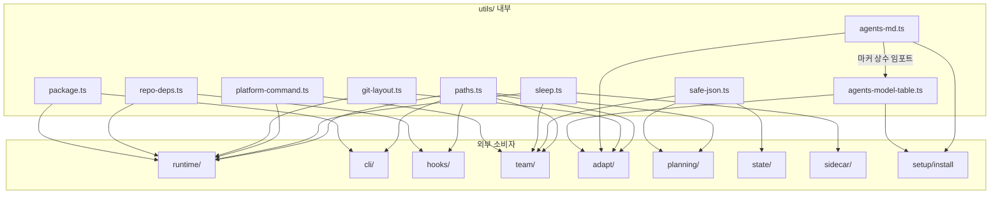

# src/utils 모듈 분석

## 폴더 구조

```
src/utils/
├── agents-md.ts           # AGENTS.md 파일 파싱·생성·업서트
├── agents-model-table.ts  # 모델 역량 테이블 빌드 (Markdown)
├── git-layout.ts          # .git 디렉터리 레이아웃 탐색
├── package.ts             # 패키지 루트 경로 해결
├── paths.ts               # 전체 경로·디렉터리 해결 허브
├── platform-command.ts    # 플랫폼별 명령 해결·실행
├── repo-deps.ts           # worktree node_modules 재사용 전략
├── safe-json.ts           # 안전한 JSON 파싱·파일 읽기
├── sleep.ts               # AbortSignal 지원 sleep 유틸리티
└── __tests__/             # 단위 테스트 모음
    ├── agents-md.test.ts
    ├── agents-model-table.test.ts
    ├── dep-versions.test.ts
    ├── package.test.ts
    ├── paths.test.ts
    ├── platform-command.test.ts
    ├── repo-deps.test.ts
    └── sleep-resource.test.ts
```

---

## 시스템 개요

`src/utils/`는 **OMX 런타임 전체에서 공유하는 순수 유틸리티 레이어**다. 외부 OMX 서브시스템(runtime, team, cli, hooks 등)에 의존하지 않고, 반대로 모든 레이어가 이 모듈을 임포트한다. 크게 다섯 범주로 구성된다.

| 범주 | 파일 | 핵심 역할 |
|------|------|-----------|
| **경로 해결** | `paths.ts`, `package.ts` | Codex 홈, OMX 상태/계획/로그 디렉터리, 스킬 목록, 패키지 루트 |
| **AGENTS.md 관리** | `agents-md.ts`, `agents-model-table.ts` | OMX 관리 블록 감지·삽입·업서트, 모델 테이블 렌더링 |
| **플랫폼 명령** | `platform-command.ts` | Windows/POSIX 명령 해결, bat/ps1/node 래핑, spawnSync 추상화 |
| **Git / 레포 의존성** | `git-layout.ts`, `repo-deps.ts` | `.git` 레이아웃 탐색, worktree node_modules 심볼릭링크 전략 |
| **기본 유틸** | `safe-json.ts`, `sleep.ts` | JSON 파싱 에러 격리, AbortSignal 지원 비동기 슬립 |

---

## 파일별 상세 분석

---

### `paths.ts` — 경로 해결 허브

OMX 전체에서 경로를 계산하는 **단일 진실 소스(SSoT)**. 70개 이상의 순수 함수를 내보낸다.

#### 주요 상수 및 환경 변수

| 상수/환경변수 | 역할 |
|---------------|------|
| `OMX_ENTRY_PATH_ENV` (`OMX_ENTRY_PATH`) | CLI 엔트리 파일 절대경로 캐시 |
| `OMX_STARTUP_CWD_ENV` (`OMX_STARTUP_CWD`) | 런처 시작 시 CWD 스냅샷 |
| `OMX_ROOT` / `OMX_STATE_ROOT` | `.omx/` 디렉터리 위치 오버라이드 |

#### 함수 그룹별 분류

**① Codex 홈 / 설정**

```typescript
codexHome()          // → ~/.codex (또는 CODEX_HOME 오버라이드)
codexConfigPath()    // → ~/.codex/config.toml
codexPromptsDir()    // → ~/.codex/prompts/
codexAgentsDir()     // → ~/.codex/agents/
projectCodexAgentsDir() // → .codex/agents/ (프로젝트 로컬)
```

**② OMX 런타임 디렉터리**

```typescript
omxRoot()            // → .omx/ (또는 OMX_ROOT 오버라이드)
omxStateDir()        // → .omx/state/
omxPlansDir()        // → .omx/plans/
omxLogsDir()         // → .omx/logs/
omxNotepadPath()     // → .omx/notepad.md
omxAdaptersDir()     // → .omx/adapters/
omxWikiDir()         // → omx_wiki/ (리포 레벨)
omxLegacyWikiDir()   // → .omx/wiki/ (레거시)
```

**③ 프로젝트 메모리**

```typescript
omxProjectMemoryPath()      // → .omx/project-memory.json
canonicalProjectMemoryPath() // → project-memory.json (리포 루트)
projectMemoryPathCandidates() // → [canonical, legacy] 우선순위 목록
resolveProjectMemoryPath()   // → 첫 번째 존재하는 경로
```

**④ 스킬 디렉터리**

```typescript
userSkillsDir()       // → ~/.codex/skills/
projectSkillsDir()    // → .codex/skills/
legacyUserSkillsDir() // → ~/.agents/skills/ (레거시)

// 비동기 목록 조회 (SKILL.md 존재 여부 필터링)
listInstalledSkillDirectories() // project 우선 중복 제거
detectLegacySkillRootOverlap()  // 스킬 해시 비교 중복 리포트
```

**⑤ OMX CLI 엔트리 경로**

```typescript
resolveOmxEntryPath()       // argv1 / OMX_ENTRY_PATH 에서 절대경로 계산
resolveOmxCliEntryPath()    // omx.js 파일인지 검증 후 반환
rememberOmxLaunchContext()  // 환경변수에 CWD + 엔트리 경로 캐시
```

**⑥ 경로 정규화 / 비교**

```typescript
canonicalizeComparablePath() // realpathSync.native 로 심볼릭링크 해제
sameFilePath()               // 정규화 후 동일 경로 비교
```

**⑦ 패키지 루트**

```typescript
packageRoot() // package.json 존재 여부로 상위 디렉터리 탐색
```

---

### `package.ts` — 패키지 루트 해결

```typescript
export function getPackageRoot(): string
```

- `import.meta.url` → `fileURLToPath` → `__dirname` 계산
- `dist/utils/` 또는 `src/utils/` 기준으로 `../..` 탐색
- `package.json` 존재 여부로 루트 확인
- 실패 시 `process.cwd()` 폴백

> `paths.ts`의 `packageRoot()`와 동일 로직의 독립 버전으로, 빌드 출력(`dist/`) 환경에서도 정확히 동작한다.

---

### `agents-md.ts` — AGENTS.md 관리

OMX 런타임이 관리하는 AGENTS.md 블록의 **감지·삽입·교체** 로직.

#### 마커 상수

```typescript
OMX_GENERATED_AGENTS_MARKER  = '<!-- omx:generated:agents-md -->'
OMX_MANAGED_AGENTS_START_MARKER = '<!-- OMX:AGENTS:START -->'
OMX_MANAGED_AGENTS_END_MARKER   = '<!-- OMX:AGENTS:END -->'
OMX_AGENTS_CONTRACT_HEADING   = '# oh-my-codex - Intelligent Multi-Agent Orchestration'
```

#### 주요 함수

| 함수 | 역할 |
|------|------|
| `isOmxGeneratedAgentsMd(content)` | `<!-- omx:generated:agents-md -->` 마커 포함 여부 |
| `hasOmxManagedAgentsSections(content)` | 생성 마커 or 관리 블록 존재 여부 |
| `hasOmxAgentsContract(content)` | 필수 텍스트 3개 모두 존재 확인 |
| `upsertManagedAgentsBlock(existing, managed)` | 관리 블록 신규 삽입 또는 기존 교체 |
| `addGeneratedAgentsMarker(content)` | `<!-- END AUTONOMY DIRECTIVE -->` 뒤 또는 첫 줄 뒤에 마커 삽입 |

#### `upsertManagedAgentsBlock` 동작 흐름

```
기존 콘텐츠에 START/END 마커 있음?
  ├─ Yes → 해당 블록을 새 내용으로 교체 (slice 치환)
  └─ No  → 콘텐츠 끝에 \n\n<!-- OMX:AGENTS:START -->\n...\n<!-- OMX:AGENTS:END -->\n 추가
```

---

### `agents-model-table.ts` — 모델 역량 테이블 생성

AGENTS.md 내 `<!-- OMX:MODELS:START/END -->` 블록에 삽입할 **Markdown 테이블을 자동 생성**한다.

#### 마커 상수

```typescript
OMX_MODELS_START_MARKER = '<!-- OMX:MODELS:START -->'
OMX_MODELS_END_MARKER   = '<!-- OMX:MODELS:END -->'
```

#### 의존성

```
agents/definitions.ts   → AGENT_DEFINITIONS (에이전트 메타데이터)
agents/policy.ts        → isNativeAgentInstallableStatus
catalog/reader.ts       → tryReadCatalogManifest (설치 가능 에이전트 필터)
config/generator.ts     → getRootModelName (config.toml 파싱)
config/models.ts        → DEFAULT_FRONTIER_MODEL, DEFAULT_SPARK_MODEL, ...
```

#### 인터페이스

```typescript
interface AgentsModelTableContext {
  frontierModel: string;      // 프론티어 모델명
  sparkModel: string;         // Spark(빠른) 모델명
  subagentDefaultModel: string; // 서브에이전트 기본 모델명
}
```

#### 주요 함수

| 함수 | 역할 |
|------|------|
| `resolveAgentsModelTableContext(toml, opts)` | config.toml + 환경변수로 3가지 모델명 결정 |
| `buildAgentsModelTable(context, definitions)` | 테이블 헤더 + 고정 3행 + 에이전트 행 생성 |
| `renderAgentsModelTableBlock(context, defs)` | START/END 마커로 감싼 최종 블록 반환 |

#### 모델 우선순위 해결 (resolveAgentsModelTableContext)

```
frontierModel  = getRootModelName(toml) ?? envMain ?? DEFAULT_FRONTIER_MODEL
sparkModel     = envSpark ?? getSparkDefaultModel() ?? DEFAULT_SPARK_MODEL
subagentDefault = envStandard ?? frontierModel
```

#### 에이전트 모델 매핑 (getAgentRecommendedModel)

```
executor       → frontierModel (항상 프론티어)
modelClass=fast      → sparkModel
modelClass=frontier  → frontierModel
modelClass=standard  → subagentDefaultModel
```

---

### `git-layout.ts` — Git 레이아웃 탐색

워크트리(worktree) 환경에서 `.git` 경로를 정확히 해결한다.

#### 타입

```typescript
interface GitLayout {
  gitDir: string;      // .git 디렉터리 (워크트리 경우 .git 파일이 가리키는 경로)
  commonDir: string;   // 공유 오브젝트 스토어 (기본 리포의 .git)
  worktreeRoot: string; // 워킹 디렉터리 루트
}
```

#### 주요 함수

| 함수 | 역할 |
|------|------|
| `findGitLayout(startCwd)` | 현재 디렉터리에서 상위로 `.git` 탐색 |
| `readGitLayoutFile(baseDir, ...parts)` | `.git` 내 파일 읽기 (trim, null-safe) |

#### `findGitLayout` 알고리즘

```
현재 dir 부터 루트까지 반복:
  .git이 디렉터리  → gitDir=.git, commonDir 해결
  .git이 파일     → "gitdir: <path>" 파싱 → 실제 gitDir 해결
  없음            → 상위로 이동
  루트 도달       → null 반환
```

> **worktree 지원**: `git worktree add` 로 생성된 경우 `.git`은 파일이며 실제 `gitdir:` 포인터를 포함한다. `commonDir`는 `.git/commondir` 파일 내용으로 기본 리포의 오브젝트 스토어를 가리킨다.

---

### `repo-deps.ts` — worktree node_modules 재사용

git worktree에서 기본 리포의 `node_modules`를 심볼릭링크로 재사용하는 전략을 구현한다.

#### 상수

```typescript
REQUIRED_NODE_MODULE_MARKERS = [
  'typescript/package.json',
  '@iarna/toml/package.json',
  '@modelcontextprotocol/sdk/package.json',
  'zod/package.json',
]
```

#### 인터페이스

```typescript
interface EnsureReusableNodeModulesResult {
  strategy: 'existing' | 'symlink' | 'missing';
  nodeModulesPath: string;
  sourceNodeModulesPath?: string;
  warning?: string;
}
```

#### 주요 함수

| 함수 | 역할 |
|------|------|
| `hasUsableNodeModules(repoRoot)` | 4개 필수 마커 패키지 존재 확인 |
| `resolveGitCommonDir(cwd)` | `git rev-parse --git-common-dir` 실행 |
| `resolveReusableNodeModulesSource(repoRoot)` | 기본 리포 node_modules 경로 반환 |
| `ensureReusableNodeModules(repoRoot, opts)` | 3-way 전략 선택 및 실행 |

#### `ensureReusableNodeModules` 전략 결정 흐름

```
워크트리 내 node_modules 사용 가능?
  ├─ Yes → strategy: 'existing' (아무것도 안 함)
  └─ No  → 기존 node_modules 제거 후...
           기본 리포 node_modules 찾음?
             ├─ Yes → symlink (Windows: junction, POSIX: dir)
             │         strategy: 'symlink'
             └─ No  → strategy: 'missing' + warning
```

---

### `platform-command.ts` — 플랫폼 명령 추상화

Windows와 POSIX의 명령 실행 차이를 완전히 추상화한다.

#### 타입

```typescript
interface PlatformCommandSpec {
  command: string;
  args: string[];
  resolvedPath?: string;
}

interface ProbedPlatformCommand {
  spec: PlatformCommandSpec;
  result: SpawnSyncReturns<string>;
}

type SpawnErrorKind = 'missing' | 'blocked' | 'error';
```

#### Windows 전용 상수

```typescript
WINDOWS_DEFAULT_PATHEXT      = ['.com', '.exe', '.bat', '.cmd', '.ps1']
WINDOWS_DIRECT_EXTENSIONS    = {'.com', '.exe'}
WINDOWS_CMD_EXTENSIONS       = {'.bat', '.cmd'}
WINDOWS_COMPATIBLE_COMMAND_ALIASES = { tmux: ['tmux', 'psmux'] }
WINDOWS_NODE_HOSTED_COMMANDS = { codex: ['node_modules', '@openai', 'codex', 'bin', 'codex.js'] }
```

#### 명령 분류 계층

```
resolveCommandPathForPlatform(command)
  ├─ win32 → resolveWindowsCommandPath()
  │           ├─ PATHEXT 순서로 확장자 후보 생성
  │           ├─ Windows 호환 별칭 확인 (tmux → psmux)
  │           └─ PATH 탐색
  └─ posix → resolvePosixCommandPath()
              └─ PATH 탐색
```

#### `buildPlatformCommandSpec` 변환 규칙

```
POSIX     → {command, args} 그대로 반환
Windows:
  .js/.mjs  → {node.exe, [scriptPath, ...args]}  (node 호스팅)
  .bat/.cmd → {cmd.exe, ['/d','/s','/c', "..."]}  (CMD 래핑)
  .ps1      → {powershell, ['-NoLogo','-NoProfile','-File', path, ...args]}
  .exe/.com → {resolvedPath, args}
```

#### 주요 공개 함수

| 함수 | 역할 |
|------|------|
| `classifySpawnError(error)` | errno 코드를 `missing/blocked/error`로 분류 |
| `resolveCommandPathForPlatform(cmd, platform, env)` | 플랫폼별 실행 파일 절대경로 |
| `resolveTmuxBinaryForPlatform()` | tmux 경로 특화 래퍼 |
| `buildPlatformCommandSpec(cmd, args, platform)` | 실행 가능한 CommandSpec 생성 |
| `spawnPlatformCommandSync(cmd, args, opts)` | CommandSpec 빌드 후 동기 실행 |

---

### `safe-json.ts` — 안전한 JSON 처리

```typescript
// 파싱 실패 시 fallback 반환
safeJsonParse<T>(raw: string, fallback: T): T

// 파일 읽기 + 파싱 실패 시 fallback 반환
safeReadJsonFile<T>(filePath: string, fallback: T): Promise<T>
```

- 예외를 절대 던지지 않음
- 호출자가 `try/catch` 없이 안전하게 사용 가능
- state 파일, JSON 설정 파일 읽기에서 전역 사용

---

### `sleep.ts` — 비동기 슬립

```typescript
// AbortSignal 지원 비동기 슬립
sleep(ms: number, signal?: AbortSignal): Promise<void>

// Atomics 기반 동기 슬립 (SharedArrayBuffer 필요)
sleepSync(ms: number): void
```

#### `sleep` 동작 상세

```
signal 이미 aborted?
  └─ 즉시 reject(reason)

setTimeout 등록
  abort 이벤트 핸들러 등록 (once)
  타임아웃 도달 → cleanup + resolve
  abort 이벤트  → cleanup + reject(reason)
```

> `sleepSync`는 `SharedArrayBuffer`가 불가한 환경에서 busy-wait 폴백을 사용한다.

---

## 파일 간 의존관계 및 호출 흐름

### 내부 의존 관계 (utils/ 내부)

```
agents-model-table.ts
  └─ (agents-md.ts의 마커 상수 임포트)
      OMX_MODELS_START_MARKER, OMX_MODELS_END_MARKER

agents-md.ts
  └─ agents-model-table.ts
      OMX_MODELS_START_MARKER, OMX_MODELS_END_MARKER
```

나머지 파일들은 utils/ 내부에서 서로 의존하지 않는다.

### 외부 모듈의 utils 임포트

```
paths.ts         ← runtime, cli, hooks, team, adapt, state, planning, ...
                   (OMX 전체 레이어가 공유)

safe-json.ts     ← state/* 파일 읽기, team/state, planning 등

sleep.ts         ← runtime, team, sidecar (폴링·재시도·타이머 로직)

platform-command.ts ← team (tmux 바이너리 해결), runtime (명령 실행)

repo-deps.ts     ← hooks (신규 워크트리 setup), runtime (install 워크플로우)

git-layout.ts    ← adapt (git 통합), runtime (리포 탐색)

agents-md.ts     ← adapt (AGENTS.md 업데이트), setup, install 워크플로우

agents-model-table.ts ← setup (모델 테이블 갱신), adapt (AGENTS.md 렌더링)

package.ts       ← cli, runtime (패키지 루트 해결)
```

---

## 호출 관계 다이어그램



---

## 설계 원칙

### 1. 순방향 의존만 허용 — 유틸은 아무것도 임포트하지 않는다

`utils/`는 OMX 내부 모듈(runtime, team, cli...)을 전혀 임포트하지 않는다. 모든 의존 화살표는 외부 → utils 방향으로만 흐른다. 이로 인해 순환 참조가 원천 차단된다.

### 2. 단일 책임 파일 — 파일 하나 = 관심사 하나

각 파일은 명확히 구분된 단일 책임을 갖는다. `paths.ts`는 경로만, `sleep.ts`는 슬립만, `safe-json.ts`는 JSON 파싱만 담당한다.

### 3. 폴백 우선 설계 — 절대 예외를 전파하지 않는다

`safe-json.ts`의 `safeJsonParse/safeReadJsonFile`, `paths.ts`의 `packageRoot()`, `platform-command.ts`의 경로 해결 등 모든 함수는 실패 시 null/fallback을 반환하거나 `process.cwd()`로 돌아온다.

### 4. 환경 오버라이드 지원 — 테스트·CI 친화적

`paths.ts`의 모든 함수는 `OMX_ROOT`, `CODEX_HOME` 등 환경변수를 우선한다. `platform-command.ts`는 `existsImpl`, `spawnImpl`을 주입받아 완전한 단위 테스트가 가능하다.

### 5. 플랫폼 추상화 집중 — Windows 복잡성을 한 곳에서 처리

Windows의 PATHEXT, CMD 래핑, PowerShell 실행, Node.js 호스팅, tmux 호환 별칭 등 모든 플랫폼 차이는 `platform-command.ts` 하나에 집중된다. 외부 호출자는 OS를 신경 쓰지 않아도 된다.

### 6. 워크트리 1급 지원

`git-layout.ts`와 `repo-deps.ts`는 `git worktree` 환경을 기본 전제로 설계됐다. gitdir 포인터 파싱, commonDir 탐색, node_modules 심볼릭링크 전략 모두 워크트리에서 정확히 동작한다.

### 7. AGENTS.md 불변 마커 계약

`agents-md.ts`와 `agents-model-table.ts`는 HTML 주석 마커를 진실 소스로 사용한다. 마커 범위 밖의 내용은 절대 수정하지 않으며, 업서트는 항상 멱등(idempotent)하게 동작한다.
