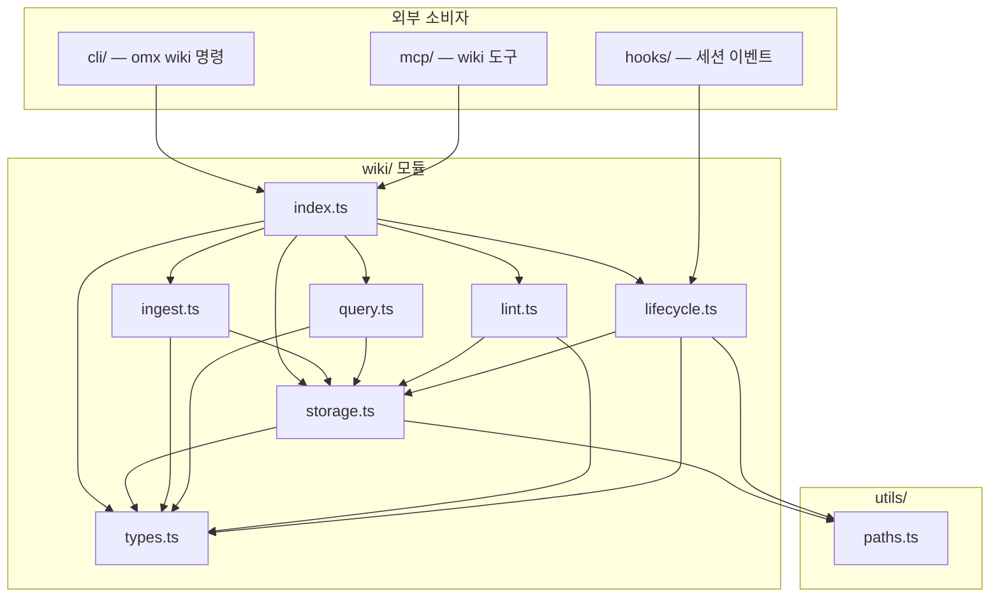

# src/wiki 모듈 분석

## 폴더 구조

```
src/wiki/
├── index.ts      # 퍼블릭 API 배럴 (모든 심볼 재익스포트)
├── types.ts      # 타입·인터페이스·상수 전체 정의
├── storage.ts    # 파일 I/O 레이어 — 원자적 쓰기·잠금·YAML 파싱
├── ingest.ts     # 지식 흡수 (생성 / 머지-업데이트)
├── query.ts      # 키워드 + 태그 검색, CJK 지원 토크나이저
├── lint.ts       # 위키 상태 검사 (6가지 이슈 탐지)
├── lifecycle.ts  # 세션 훅 통합 (시작·종료·컴팩션)
└── __tests__/    # 단위 테스트 모음
```

---

## 시스템 개요

`src/wiki/`는 **OMX의 영속 지식 베이스(wiki knowledge base)** 구현이다. LLM이 세션을 넘나들며 프로젝트 지식을 축적하고 검색할 수 있도록 **Markdown 파일 + YAML 프론트매터** 형식으로 `omx_wiki/` 디렉터리에 지식 페이지를 관리한다.

설계 철학:
- **벡터 임베딩 없음** — 키워드 기반 검색만 사용 (하드 제약)
- **원자적 파일 쓰기** — 임시 파일 + rename으로 쓰다가 크래시 방지
- **파일 잠금** — `.wiki-lock` 디렉터리 기반 뮤텍스 (Atomics busy-wait)
- **머지-전용 업데이트** — 기존 콘텐츠를 절대 덮어쓰지 않고 타임스탬프 섹션으로 추가
- **레거시 폴백** — `.omx/wiki/`(구 경로) → `omx_wiki/`(신 경로) 마이그레이션 안전망

### 모듈 계층 구조

| 계층 | 파일 | 역할 |
|------|------|------|
| **공개 API** | `index.ts` | 외부 진입점, 모든 심볼 재익스포트 |
| **타입** | `types.ts` | 데이터 모델, 상수, WikiConfig |
| **스토리지** | `storage.ts` | 원자 I/O, 잠금, YAML 직렬화, 인덱스/로그 |
| **운영** | `ingest.ts`, `query.ts`, `lint.ts` | 핵심 기능 (쓰기·읽기·검사) |
| **통합** | `lifecycle.ts` | Codex 세션 훅과의 브릿지 |

---

## 파일별 상세 분석

---

### `types.ts` — 데이터 모델 정의

#### 상수

```typescript
WIKI_SCHEMA_VERSION = 1   // 프론트매터 스키마 버전
```

#### WikiCategory (8가지 카테고리)

```typescript
type WikiCategory =
  | 'architecture'   // 시스템 구조 결정
  | 'decision'       // 의사결정 기록
  | 'pattern'        // 코드 패턴
  | 'debugging'      // 디버깅 발견사항
  | 'environment'    // 환경 설정 사실
  | 'session-log'    // 자동 캡처 세션 로그
  | 'reference'      // 참조 문서
  | 'convention'     // 코딩 컨벤션
```

#### WikiPage 구조

```typescript
interface WikiPageFrontmatter {
  title: string;
  tags: string[];
  created: string;        // ISO 8601
  updated: string;        // ISO 8601
  sources: string[];      // 출처 목록
  links: string[];        // [[wiki-link]] 추출된 참조 슬러그
  category: WikiCategory;
  confidence: 'high' | 'medium' | 'low';
  schemaVersion: number;
}

interface WikiPage {
  filename: string;       // slug.md 형식
  frontmatter: WikiPageFrontmatter;
  content: string;        // --- 이후 본문
}
```

#### 운영 인터페이스

```typescript
interface WikiIngestInput {
  title: string;
  content: string;
  tags: string[];
  category: WikiCategory;
  sources?: string[];
  confidence?: 'high' | 'medium' | 'low';
}

interface WikiIngestResult {
  created: string[];   // 새로 생성된 페이지 슬러그
  updated: string[];   // 업데이트된 페이지 슬러그
  totalAffected: number;
}

interface WikiQueryOptions {
  tags?: string[];
  category?: WikiCategory;
  limit?: number;
  logQuery?: boolean;
}

interface WikiQueryMatch {
  page: WikiPage;
  snippet: string;   // 매칭 위치 주변 텍스트 발췌
  score: number;     // 관련도 점수
}

interface WikiLintIssue {
  page: string;
  severity: 'error' | 'warning' | 'info';
  type: 'orphan' | 'stale' | 'broken-ref' | 'low-confidence' | 'oversized' | 'structural-contradiction';
  message: string;
}

interface WikiLintReport {
  issues: WikiLintIssue[];
  stats: {
    totalPages: number;
    orphanCount: number;
    staleCount: number;
    brokenRefCount: number;
    lowConfidenceCount: number;
    oversizedCount: number;
    contradictionCount: number;
  };
}
```

#### WikiConfig

```typescript
interface WikiConfig {
  enabled: boolean;                 // 위키 활성화 여부
  autoCapture: boolean;             // 세션 종료 시 자동 캡처
  maxContextLines: number;          // onSessionStart 시 인덱스 출력 줄 수 (기본 30)
  staleDays: number;                // stale 판정 기준 일수 (기본 30)
  maxPageSize: number;              // 페이지 크기 제한 바이트 (기본 10,240)
  feedProjectMemoryOnStart: boolean; // 시작 시 project-memory.json → environment.md 동기화
}

const DEFAULT_WIKI_CONFIG: WikiConfig = {
  enabled: true,
  autoCapture: true,
  maxContextLines: 30,
  staleDays: 30,
  maxPageSize: 10_240,
  feedProjectMemoryOnStart: false,
};
```

---

### `storage.ts` — 파일 I/O 레이어

위키의 모든 파일 읽기·쓰기를 담당하는 **하위 레이어**. 모든 쓰기는 원자적이며 잠금을 통해 동시성을 제어한다.

#### 예약 파일

```typescript
const RESERVED_FILES = new Set(['index.md', 'log.md', 'environment.md'])
```

> 예약 파일은 `allowReserved: true` 옵션 없이는 `writePageUnsafe`가 예외를 던진다.

#### 원자적 쓰기 (`atomicWriteFileSync`)

```
path.pid.timestamp.tmp 임시 파일 생성
  → writeFileSync 완료
  → renameSync(tmp → 최종 경로)
  (rename은 POSIX에서 원자적)
```

#### 파일 잠금 (`withFileLockSync`)

```
mkdirSync(.wiki-lock) 시도 (EEXIST이면 재시도)
  ├─ 성공 → fn() 실행 후 rmSync(.wiki-lock)
  └─ EEXIST → sleepSync(50ms) 재시도
              타임아웃(5초) 초과 시 예외
```

> Atomics.wait 기반 `sleepSync`로 이벤트 루프를 블록하지 않고 busy-wait한다.

#### 디렉터리 경로 해결

```typescript
getWikiDir(root)       // → omx_wiki/ (utils/paths.omxWikiDir)
getLegacyWikiDir(root) // → .omx/wiki/ (레거시)
isLegacyWikiFallbackActive(root) // omx_wiki/ 없고 .omx/wiki/ 있을 때 true
hasReadableWiki(root)  // 어느 쪽이라도 존재하면 true
```

#### YAML 파싱 / 직렬화

```typescript
// 파싱: "---\n...\n---\n본문" 형식 → {frontmatter, content}
parseFrontmatter(raw) // 내장 간이 YAML 파서 (외부 의존 없음)

// 직렬화: WikiPage → "---\n...\n---\n본문"
serializePage(page)
```

내장 YAML 파서는 `key: value` 형식만 지원하며, 배열은 `[a, b, c]` 인라인 형식만 처리한다.

#### 경로 보안 (`safeWikiPath`)

```typescript
// 경로 트라버설 방지
// '/', '\\', '..' 포함 시 null 반환
// resolve 후 wikiDir 내부인지 확인
safeWikiPath(wikiDir, filename): string | null
```

#### 슬러그 생성

```typescript
titleToSlug(title)
// Unicode NFC 정규화
// 비영문자/비숫자 → '-' 치환
// 최대 64자 + ".md" 확장자
// 빈 결과 → "page-{hash8}.md"
```

#### 주요 함수 요약

| 함수 | 잠금 | 역할 |
|------|------|------|
| `readPage(root, filename)` | 없음 | 단일 페이지 읽기 (레거시 폴백 포함) |
| `readCanonicalPage(root, filename)` | 없음 | 정식 경로에서만 읽기 |
| `listPages(root)` | 없음 | .md 파일 목록 (예약 파일 제외) |
| `readAllPages(root)` | 없음 | 전체 페이지 배열 |
| `writePage(root, page)` | `withWikiLock` | 쓰기 + 인덱스 갱신 |
| `deletePage(root, filename)` | `withWikiLock` | 삭제 + 인덱스 갱신 |
| `appendLog(root, entry)` | `withWikiLock` | 로그 항목 추가 |
| `writePageUnsafe` | **잠금 없음** | 잠금 내부에서만 사용 |
| `deletePageUnsafe` | **잠금 없음** | 잠금 내부에서만 사용 |
| `updateIndexUnsafe` | **잠금 없음** | 카테고리별 인덱스 재생성 |
| `appendLogUnsafe` | **잠금 없음** | log.md에 항목 추가 |

> `Unsafe` 접미사 = 반드시 `withWikiLock` 내부에서만 호출해야 함.

---

### `ingest.ts` — 지식 흡수 엔진

```typescript
export function ingestKnowledge(root: string, input: WikiIngestInput): WikiIngestResult
```

#### 동작 흐름

```
titleToSlug(input.title) → slug 계산
withWikiLock(root, () => {
  readCanonicalPage(root, slug) 존재?
    ├─ Yes (기존 페이지) → mergePage(existing, input, now)
    │                       → writePageUnsafe(merged)
    │                       → result.updated 추가
    └─ No  (신규 페이지) → createPage(slug, input, now)
                           → writePageUnsafe(new)
                           → result.created 추가

  updateIndexUnsafe(root)
  appendLogUnsafe(root, {operation: 'ingest', ...})
})
```

#### 머지 전략 (`mergePage`)

```
tags     : Set union (중복 제거)
sources  : Set union (중복 제거)
links    : extractWikiLinks(신규 콘텐츠)와 합집합
confidence: rank 비교 후 더 높은 레벨 유지 (high=3, medium=2, low=1)
content  : 기존 + "\n\n---\n\n## Update ({timestamp})\n\n{신규 콘텐츠}\n"
           (절대 기존 콘텐츠 덮어쓰기 없음)
```

#### WikiLink 추출

```typescript
// [[slug-name]] 패턴 → titleToSlug 변환 슬러그 배열
extractWikiLinks(content): string[]
```

---

### `query.ts` — 검색 엔진

```typescript
export function queryWiki(
  root: string,
  queryText: string,
  options: WikiQueryOptions,
): WikiQueryMatch[]

export function tokenize(text: string): string[]
```

#### 다국어 토크나이저 (`tokenize`)

```
라틴/숫자   → [a-z0-9\u00C0-\u024F]+ 매칭 (é, ñ 등 포함)
CJK         → 한자+히라가나+가타카나+한글 구간
              단일 문자 + 바이그램 동시 생성
              (예: "한글" → ["한", "글", "한글"])
기타 스크립트 → 공백 분리 폴백 (키릴, 아랍, 태국 등)
```

#### 검색 점수 계산

| 조건 | 가중치 |
|------|--------|
| 필터 태그 일치 (개당) | +3 |
| 쿼리 텀이 페이지 태그에 포함 | +2 |
| 제목에 쿼리 전체 포함 | +5 |
| 제목에 개별 쿼리 텀 포함 (개당) | +2 |
| 본문에 쿼리 텀 포함 (개당, 고유) | +1 |

#### 스니펫 추출

```
첫 번째 텀 매칭 위치 기준 앞 40자 + 뒤 80자
다중 줄 → 공백으로 정규화
score > 0인 페이지만 결과 포함
```

#### 결과 정렬 및 필터링

- score 내림차순 정렬
- `options.limit` (기본 20)까지 반환
- `options.category` 필터 적용
- `logQuery=true`(기본)이면 `appendLog`로 쿼리 기록

---

### `lint.ts` — 상태 검사기

```typescript
export function lintWiki(root: string, config: WikiConfig): WikiLintReport
```

#### 6가지 검사

| 검사 유형 | 심각도 | 조건 |
|-----------|--------|------|
| `orphan` | info | 다른 페이지에서 인바운드 링크 없음 |
| `stale` | warning | `updated` 기준 `config.staleDays`일 초과 |
| `broken-ref` | error | `links[]`의 슬러그가 존재하지 않는 페이지 참조 |
| `low-confidence` | info | `confidence: low` 표시됨 |
| `oversized` | warning | 본문 크기가 `config.maxPageSize` 초과 |
| `structural-contradiction` | warning/info | 동일 슬러그 접두사 그룹 내 confidence high+low 혼재 또는 태그-카테고리 충돌 |

#### 인바운드 링크 맵 구축

```
모든 페이지의 frontmatter.links[]를 순회
Map<slug, Set<출처 페이지>> 생성
→ orphan 감지에 사용
```

#### `detectStructuralContradictions`

```
슬러그를 '-' 기준 앞 2단어로 그룹핑
그룹 내 2개 이상일 때:
  high+low confidence 혼재 → warning
  같은 태그가 다른 category에 걸쳐 있음 → info
```

#### 레거시 폴백 시 동작

- 읽기 전용 모드: `legacyFallbackActive`이면 lint 후 `appendLog` 호출하지 않음
  (canonical 경로에 파일 생성하는 부작용 방지)

---

### `lifecycle.ts` — 세션 훅 통합

Codex 런타임의 훅 이벤트를 wiki와 연결하는 **브릿지 레이어**.

#### `onSessionStart(data)` → `{ additionalContext? }`

```
1. WikiConfig 로드 (.omx-config.json → ~/.codex/.omx-config.json → DEFAULT)
2. enabled=false → 빈 객체 반환
3. 레거시 폴백 활성화 시 → 마이그레이션 안내 메시지 반환
4. feedProjectMemoryOnStart=true → feedProjectMemory(root) 실행
   (project-memory.json → environment.md 동기화, mtime 비교로 중복 방지)
5. 인덱스 읽어서 최대 maxContextLines 줄 → additionalContext 반환
```

#### `onSessionEnd(data)` → `{ continue: true }`

```
autoCapture=false → 즉시 { continue: true }
타임아웃 3초 내에:
  session-log-{date}-{sessionId[-8:]}.md 생성
  category='session-log', confidence='medium'
  updateIndexUnsafe 호출
→ 세션 종료 후 LLM이 수동으로 선별·ingest 가능
```

#### `onPreCompact(data)` → `{ additionalContext? }`

```
페이지 수 + 카테고리 목록 + 마지막 업데이트 일시
→ 컴팩션 전 위키 요약 문자열 반환
```

#### `onPostCompact(data)` → `{ additionalContext? }`

```
컴팩션 후 "omx_wiki/에 발견사항 기록하세요" 넛지 메시지 반환
wiki_ingest / wiki_add 명령어 사용 안내 포함
```

#### `feedProjectMemory(root)` (내부 헬퍼)

```
project-memory.json mtime vs environment.md updated 비교
→ 더 최신 project-memory.json이 있으면:
   techStack, build, conventions, structure 필드 → 섹션별 Markdown 변환
   notes[], directives[] 상위 20개 → 불릿리스트
   environment.md 업데이트 (allowReserved: true)
```

---

## 파일 간 의존관계

```
index.ts
  ├─ types.ts
  ├─ storage.ts → types.ts, utils/paths.ts
  ├─ ingest.ts  → types.ts, storage.ts
  ├─ query.ts   → types.ts, storage.ts
  ├─ lint.ts    → types.ts, storage.ts
  └─ lifecycle.ts → types.ts, storage.ts, utils/paths.ts
```

### 외부 의존성

```
utils/paths.ts
  ← storage.ts    (omxWikiDir, omxLegacyWikiDir)
  ← lifecycle.ts  (codexHome, resolveProjectMemoryPath)
```

> wiki/ 내부에서 다른 OMX 서브시스템(runtime, team, cli 등)을 일절 임포트하지 않는다.

---

## 호출 관계 다이어그램



---

## 파일 시스템 레이아웃 (런타임)

```
{projectRoot}/
└── omx_wiki/               # getWikiDir (canonical)
    ├── index.md            # 카테고리별 자동 생성 인덱스
    ├── log.md              # 모든 위키 운영 로그
    ├── environment.md      # project-memory.json 동기화 (예약)
    ├── {slug}.md           # 위키 페이지 (YAML 프론트매터 + 본문)
    └── .wiki-lock/         # 파일 잠금 디렉터리 (임시)

{projectRoot}/
└── .omx/wiki/              # getLegacyWikiDir (구 경로, 읽기 전용 폴백)
```

---

## 설계 원칙

### 1. 불변 머지 — 기존 콘텐츠는 절대 삭제하지 않는다

`ingestKnowledge`의 `mergePage`는 기존 본문 끝에 타임스탬프 구분자와 함께 새 콘텐츠를 **추가**한다. 이는 지식이 실수로 손실되는 것을 방지하는 설계 계약이다.

### 2. 원자성 + 잠금으로 동시 실행 안전성 보장

모든 쓰기 경로는 `withWikiLock → withFileLockSync → atomicWriteFileSync` 3중 구조를 거친다. 동시에 여러 에이전트가 위키를 수정해도 손상이 없다.

### 3. 외부 파서 의존 없음

YAML 파싱은 내장 `parseSimpleYaml`로 처리한다. `js-yaml` 같은 외부 패키지를 임포트하지 않아 의존성 트리가 깨끗하다. 단, 지원 형식은 플랫 구조 + 인라인 배열로 제한된다.

### 4. 벡터 임베딩 없음 (명시적 하드 제약)

`query.ts` 상단 주석에 "NO vector embeddings — search is keyword-based only (hard constraint)"라고 명시되어 있다. 검색 부담을 LLM 호출자에게 위임하고, 위키는 자료 반환만 담당한다.

### 5. 레거시 경로 안전 폴백

`isLegacyWikiFallbackActive`가 true면 모든 읽기 경로는 `.omx/wiki/`를 사용하고, 쓰기(`lint appendLog` 포함)는 수행하지 않아 리포지토리에 부작용이 없다.

### 6. 경로 보안 (path traversal 방지)

`safeWikiPath`는 `..`, `/`, `\` 포함 파일명을 null 반환하고, resolve 후 wikiDir 하위인지 재확인한다. 위키 파일명은 항상 슬러그 형식이어야 한다.

### 7. 세션 생명주기와 독립적 커플링

`lifecycle.ts`는 훅 이벤트를 받아 wiki를 갱신하지만, wiki 내부 모듈은 lifecycle을 역참조하지 않는다. wiki ↔ lifecycle은 단방향 의존만 허용한다.
