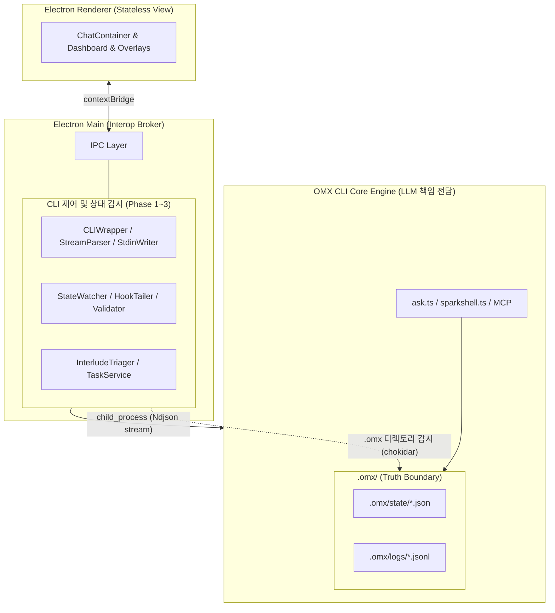
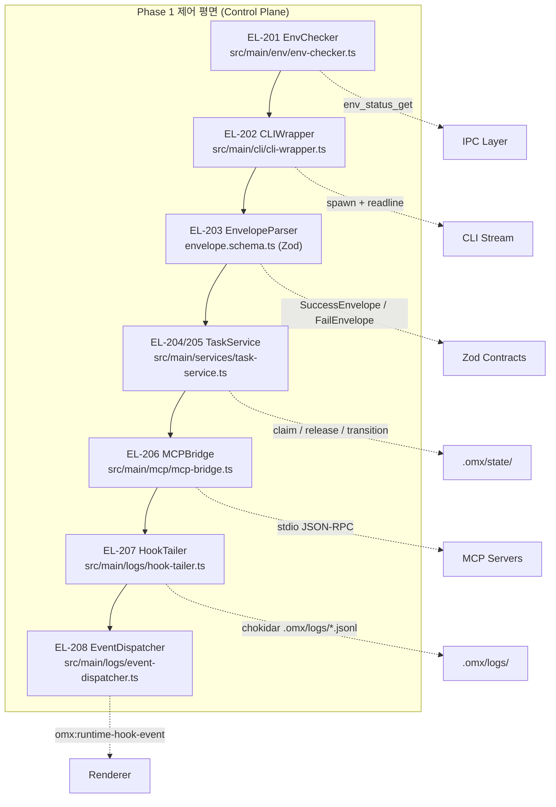
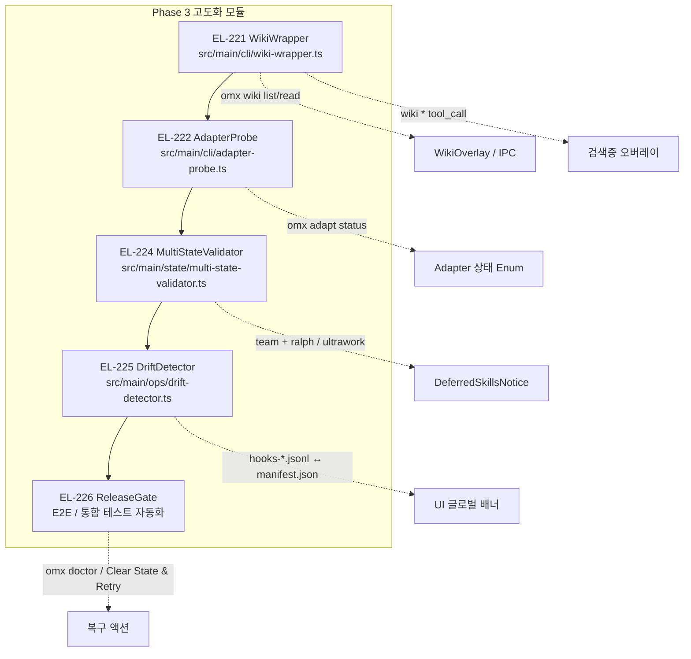

# ADR-001: OMX 데스크톱 에이전트 시스템 아키텍처

**Status:** Accepted  
**Date:** 2026-05-26  
**Deciders:** 백엔드 코어 엔진팀, Electron UI 개발팀  
**Reference:** [ite-ai-roadmap.md](./ite-ai-roadmap.md), EL-201 ~ EL-226


## Context

기존 데스크톱 코드는 LLM SDK 통합 로직, 프롬프트 파싱, `spawnSync` 기반의 블로킹 CLI 호출 등이 Electron Main Process에 뒤섞여 있었다. 이로 인해 UI 블로킹, 좀비 프로세스, 스트리밍 불가, 테스트 불가 등의 문제가 누적되었다.

OMX CLI 코어 엔진에는 이미 `reasoningEffort` 추상화, `model-contract.ts` 계약 계층, `CommandEventEmitter`, MCP Stdio, Ndjson 훅 로그, 팀 이벤트 계약이 완비되어 있다. 이 자산들을 재사용하고, Electron의 책임을 **상태 비저장 뷰(Stateless View) + Interop 브로커**로 명확히 한정하는 설계가 필요하다.


## Decision

**LLM 공급자 통합 책임을 Electron Main Process에서 OMX CLI 코어 엔진으로 전면 이관한다.**

Electron은 복잡한 LLM SDK 제어, 프롬프트 파싱, `reasoningEffort` 변환 논리를 직접 품지 않는다.  
대신 CLI 프로세스를 비차단 스트림으로 조율하고, 화면을 그려주는 **수려한 상태 비저장 뷰**의 책임만 수행한다.

---

## 전체 시스템 아키텍처



### 📐 아키텍처 핵심 결정

**"LLM 책임은 CLI에, Electron은 Stateless View + Interop 브로커"**

| 레이어 | 책임 | 기술 |
|--------|------|------|
| **OMX CLI Core** | LLM SDK, reasoningEffort, CommandEventEmitter, Ndjson 방출 | `--stream-json` 플래그, `model-contract.ts` |
| **Electron Main** | spawn 제어, IPC 브로킹, 상태 감시, 이벤트 브로드캐스트 | `child_process.spawn`, chokidar, Zod, readline |
| **Renderer** | 무상태 뷰, IPC 구독 → React State 1:1 매핑 | React, contextBridge, Rehydration |

### 🏗️ 전체 구조 (3 Phase, 8 Milestone, 23 티켓)

| Phase | 목표 | 핵심 모듈 |
|-------|------|----------|
| **Phase 1** (EL-201~208) | 제어 평면 완성 | EnvChecker, CLIWrapper, EnvelopeParser, TaskService, MCPBridge, HookTailer, EventDispatcher |
| **Phase 2** (EL-211~219) | 스트리밍 UX 완성 | StreamParser, StdinWriter, InterludeTriager, StateWatcher, ChatContainer, LifecycleDashboard, TaskTimeline |
| **Phase 3** (EL-221~226) | 고도화 안정화 | WikiWrapper, AdapterProbe, MultiStateValidator, DriftDetector, UI Integration |

> 티켓 번호는 EL-209, EL-210, EL-220을 예비 슬롯으로 비워 두어 총 23개로 관리한다.


### ⚠️ 5대 불변 규칙 (PR 필수 체크)
1. Electron에 LLM SDK import 금지
2. `spawnSync` 사용 금지 → `spawn`만 허용  
3. `.omx/state/` 직접 쓰기 금지 → CLI API만
4. Renderer에 전역 스토어 금지 → IPC 페이로드 1:1 매핑
5. 비JSON stdout 라인은 크래시 없이 콘솔 fallback


## 핵심 설계 원칙 (5대 불변 규칙)

| # | 원칙 | 설명 |
|---|------|------|
| 1 | **LLM 책임 위임** | Electron은 LLM SDK/프롬프트/reasoningEffort 변환 로직을 일절 포함하지 않는다. 모두 CLI에 위임. |
| 2 | **비차단 스트림 전용** | `spawnSync` / `stdio: 'inherit'` 전면 금지. 모든 CLI 호출은 `child_process.spawn` 비동기 스트림으로. |
| 3 | **진실의 경계 (Truth Boundary)** | `.omx/state/` 파일이 유일한 진실. Electron은 이 파일을 직접 쓰지 않는다. 오직 CLI API를 통해서만 조작. |
| 4 | **무상태 뷰 (Stateless View)** | Renderer에 전역 스토어 없음. IPC 수신 페이로드를 React State로 1:1 매핑. 컴포넌트 마운트 시 Rehydration으로 복원. |
| 5 | **방어적 파서** | stdout에 비JSON 라인이 섞여도 파이프라인 크래시 없음. `try-catch`로 fallback → 콘솔 뷰 우회. |

---

## Phase 별 구현 레이어 상세

### Phase 1 — Action & State Layer (실행 제어 및 상태 백엔드)

**목표:** Electron Main Process를 Interop 브로커로 만들어 CLI·MCP 파이프라인과 완벽한 정합성을 이루는 제어 평면 완성.

#### 레이어 구성



---

### Phase 2 — Stream & UI Layer (CLI 스트림 오케스트레이션 및 UI 결합)

**목표:** Legacy 파편화 출력을 리팩토링하고, `CommandEventEmitter` 자산을 Stdout 스트림으로 직렬화하여 Claude AI 스타일의 스트리밍 UX 완성.

#### Ndjson 스트리밍 파이프라인

```
CLI Core (ask.ts, spawn 전환)
  │  --stream-json 플래그 활성화
  │  CommandEventEmitter.progress 이벤트 인터셉트
  ▼
process.stdout  (Ndjson 한 줄씩 방출)
  │
  ├─ {"type":"agent_init", "data":{"persona":"planner","reasoningEffort":"high"}}
  ├─ {"type":"token",      "data":{"text":"출력", "subType":"reasoning|content"}}
  ├─ {"type":"tool_call",  "data":{"tool":"claim-task","arguments":{...}}}
  └─ {"type":"interlude",  "data":{"question":"...", "wakeable_only":true}}
  │
  ▼
Electron Main  (readline 인터페이스 — child.stdout에 장착)
  │
  StreamParser (stream-parser.ts)
  │  ├─ subType:"reasoning" → omx:stream-thinking IPC → 사고과정 오버레이
  │  ├─ subType:"content"   → omx:stream-token   IPC → 채팅창 토큰
  │  ├─ type:"tool_call"    → wiki/adapter 오버레이 판단
  │  └─ 비JSON 라인        → fallback → 콘솔 뷰 (크래시 없음)
  │
  ▼
Renderer  (IPC 구독 → React State 1:1 매핑 → 화면 렌더링)
```

#### 차단형 인터랙션 (Interlude) 흐름

```
CLI → type:"interlude" Ndjson
  │
InterludeTriager (EL-215)
  │  다중 차단 유형 Zod 감지:
  │  ├─ askUserQuestion
  │  ├─ worker_merge_conflict
  │  ├─ pre-tool-use (도구실행 전 승인 대기)
  │  └─ needs-input (컨텍스트 보완 대기)
  │
  → omx:interlude-start IPC → Renderer
  │
ChatContainer 차단형 인터뷰 모드 전환 (EL-216)
  │  일반 입력 동결, 승인/거절 오버레이 표시
  │
사용자 입력 → StdinWriter (EL-214)
  │  child.stdin.write(input + '\n')
  │  백프레셔 → drain 이벤트 추적
  │
StateWatcher (EL-217)
  │  .omx/state/ 파일 변경 감지 (chokidar + 디바운스 100~200ms)
  │
  → in_progress 상태 확인 → UI 락 해제 (EL-216 원자성 가드)
```

---

### Phase 3 — Hardening & Specialized Features (고도화 안정화)

#### 기능 모듈 맵



---

## 디렉토리 및 소스 구조 (Electron 앱 src/)

> **팀 컨벤션:** 새 티켓 구현 시 `src/` 하위에 파일이 추가·이동·삭제될 경우,  
> 반드시 이 트리도 동시에 업데이트한다 (PR 체크리스트 항목).  
> 특히 EL-223(UI 통합 패널) 등 미확정 파일이 확정되면 해당 경로를 즉시 반영한다.

```
src/
├── main/                           # Electron Main Process
│   ├── env/
│   │   └── env-checker.ts          # EL-201: 환경 진단
│   ├── cli/
│   │   ├── cli-wrapper.ts          # EL-202: spawn 비차단 래퍼
│   │   ├── envelope-parser.ts      # EL-203: Zod Envelope 파서
│   │   ├── schemas/
│   │   │   └── envelope.schema.ts  # EL-203: 스키마 정의
│   │   ├── stream-parser.ts        # EL-213: Ndjson 스트림 파서
│   │   ├── stdin-writer.ts         # EL-214: stdin 쓰기 + backpressure
│   │   ├── interlude-triager.ts    # EL-215: 차단 신호 분류기
│   │   ├── wiki-wrapper.ts         # EL-221: Wiki CLI 래퍼
│   │   └── adapter-probe.ts        # EL-222: 외부 어댑터 프로브
│   ├── services/
│   │   └── task-service.ts         # EL-204/205: 태스크 생명주기
│   ├── mcp/
│   │   ├── mcp-bridge.ts           # EL-206: MCP stdio 파이프
│   │   └── mains/mcp-manager.ts    # EL-206: 다중 서버 풀 관리
│   ├── logs/
│   │   ├── hook-tailer.ts          # EL-207: Ndjson 로그 테일러
│   │   └── event-dispatcher.ts     # EL-208: 훅 이벤트 → IPC 브로드캐스트
│   ├── state/
│   │   ├── state-watcher.ts        # EL-217: .omx/state/ chokidar 감시
│   │   ├── lifecycle-parser.ts     # EL-218: 수명주기 상태 파서
│   │   └── multi-state-validator.ts # EL-224: 복합 상태 검증기
│   ├── ops/
│   │   └── drift-detector.ts       # EL-225: 로그-카탈로그 정합성 검증
│   └── ipc/
│       ├── env-ipc.ts              # EL-201
│       ├── cli-ipc.ts              # EL-202
│       ├── task-ipc.ts             # EL-204/205
│       ├── event-broadcast-ipc.ts  # EL-208
│       ├── stream-bridge-ipc.ts    # EL-213
│       ├── interlude-ipc.ts        # EL-216
│       ├── state-ipc.ts            # EL-218
│       ├── adapter-ipc.ts          # EL-222
│       └── ops-ipc.ts              # EL-225
│
├── renderer/                       # Renderer Process (React)
│   └── components/
│       ├── ChatContainer.tsx        # EL-213/216: 스트리밍 뷰 + 인터류드 락
│       ├── LifecycleDashboard.tsx   # EL-219: 수명주기 대시보드
│       ├── TaskTimeline.tsx         # EL-219: 타임라인
│       ├── WikiOverlay.tsx          # EL-221: 위키 검색 오버레이
│       └── DeferredSkillsNotice.tsx # EL-224: 지연된 스킬 배지
│
└── preload/
    └── index.ts                    # contextBridge API 노출
```

---

## IPC 채널 계약 전체 목록

| 채널명 | 방향 | 용도 | 티켓 |
|--------|------|------|------|
| `env_status_get` | Renderer → Main (invoke) | 환경 상태 조회 | EL-201 |
| `omx:runtime-hook-event` | Main → Renderer (send) | 훅 이벤트 브로드캐스트 | EL-208 |
| `omx:stream-thinking` | Main → Renderer (send) | 사고과정 토큰 스트리밍 | EL-213 |
| `omx:stream-token` | Main → Renderer (send) | 콘텐츠 토큰 스트리밍 | EL-213 |
| `omx:interlude-start` | Main → Renderer (send) | 차단형 인터류드 시작 | EL-215 |
| `omx:lifecycle-change` | Main → Renderer (send) | 수명주기 상태 변경 | EL-218 |
| `task:claim-conflict` | Main → Renderer (send) | 태스크 선점 충돌 경고 | EL-204 |
| `task_status_changed` | Main → Renderer (send) | 태스크 상태 전이 완료 | EL-205 |

---

## Ndjson Envelope 스키마 표준 (v1.0)
에이전트와 데스크톱 앱 사이의 데이터 통신 규약을 의미합니다. 단순히 데이터를 "날것(Raw)"으로 쏘는 것이 아니라, 데이터를 '봉투'라는 표준 규격 안에 넣어 , JSON 형식으로 한 줄씩 끊어서 보내는 스트리밍 전송 방식

```typescript
// 성공 Envelope (Unary JSON)
interface SuccessEnvelope<T> {
  schema_version: "1.0";
  timestamp: string;      // ISO 8601
  command: string;
  ok: true;
  operation: string;
  data: T;
}

// 실패 Envelope
interface FailEnvelope {
  schema_version: "1.0";
  ok: false;
  error: {
    code: string;         // 예: "CONFLICT", "FORBIDDEN", "NOT_FOUND"
    message: string;
    metadata?: Record<string, unknown>;
  };
}

// 스트리밍 토큰 (--stream-json 활성화 시)
type StreamEnvelope =
  | { schema_version:"1.0"; ok:true; type:"agent_init"; data:{ persona:string; reasoningEffort:string } }
  | { schema_version:"1.0"; ok:true; type:"token";      data:{ text:string; subType:"reasoning"|"content" } }
  | { schema_version:"1.0"; ok:true; type:"tool_call";  data:{ tool:string; arguments:Record<string,unknown> } }
  | { schema_version:"1.0"; ok:true; type:"interlude";  data:{ question:string; wakeable_only:true } };
```

---

## Options Considered

### Option A: Electron이 LLM SDK를 직접 통합 (기각)
| Dimension | Assessment |
|-----------|------------|
| 복잡도 | High — 프롬프트 파싱, reasoningEffort, SDK 버전 관리 등 중복 구현 |
| 유지보수 | High — CLI 코어 변경 시 Electron도 동시 수정 필요 |
| 테스트 가능성 | Low — LLM 호출을 모킹하기 어려움 |
| 팀 분리 | 불가 — 백엔드·UI팀 결합도 높음 |

**Pros:** 직접 제어 가능  
**Cons:** 중복 구현, 높은 결합도, 테스트 어려움, CLI 자산 미활용

### Option B: Electron = Stateless View + Interop Broker ✅ (채택)
| Dimension | Assessment |
|-----------|------------|
| 복잡도 | Low — LLM 로직 없음, 스트림 조율만 담당 |
| 유지보수 | Low — CLI 인터페이스만 유지하면 됨 |
| 테스트 가능성 | High — spawn mock으로 단위 테스트 가능 |
| 팀 분리 | 명확 — CLI팀 / UI팀 독립 병렬 개발 |
| 기존 자산 재사용 | CommandEventEmitter, Ndjson 훅, MCP, team 계약 100% 재사용 |

**Pros:** 경량 UI, 높은 테스트 가능성, 팀 협업 명확, 자산 재사용 극대화  
**Cons:** CLI 인터페이스 스펙(Envelope 계약)의 엄격한 공유 관리 필요

---

## Trade-off Analysis

1. **CLI 스펙 결합**: Electron이 CLI의 Envelope 계약에 의존. CLI 스펙 변경 시 `envelope.schema.ts` 동시 업데이트 필요. → **완화책**: Zod 스키마 공유 패키지(`@omx/contracts`)로 단일 진실 유지.

2. **스트리밍 지연**: Ndjson 방식은 HTTP Polling 대비 실시간성 우수. 단, CLI 내부의 `spawnSync`가 잔존할 경우 해당 커맨드는 스트리밍 불가. → **완화책**: EL-211에서 모든 AI 커맨드 `spawn` 전환 완료 후 단계 진입.

3. **좀비 프로세스**: 앱 종료 시 MCP 자식 프로세스 유실 가능. → **완화책**: EL-206 Teardown 파이프라인 (SIGTERM → 5초 타임아웃 → SIGKILL).

---

## Consequences

**쉬워지는 것:**
- UI 개발자는 LLM/CLI 내부 구조를 몰라도 됨
- 단위 테스트: spawn mock → Envelope 파서 → IPC 채널 독립 검증
- CLI 팀과 UI 팀의 병렬 개발 (계약 인터페이스만 공유)
- 새로운 에이전트 기능은 CLI에서 개발 → Envelope 방출 추가만으로 UI 자동 연동

**어려워지는 것:**
- CLI `--stream-json` 플래그 미구현 시 Phase 2 전체 블로킹
- Envelope 스키마 버전 관리 필요 (`schema_version: "1.0"`)
- `.omx/state/` 파일 포맷 변경 시 StateWatcher·LifecycleParser 동시 수정

**재검토가 필요한 시점:**
- CLI를 HTTP 서버로 전환할 경우 (`executeUnary` → fetch API 교체)
- MCP transport가 stdio에서 WebSocket으로 변경될 경우

---

## Action Items

### Phase 1 — Milestone 1~3 (SP-21, SP-22, SP-23)
- [ ] **EL-201** `src/main/env/env-checker.ts` — omx doctor 헬스체크 모듈
- [ ] **EL-202** `src/main/cli/cli-wrapper.ts` — spawn 비차단 래퍼 (executeUnary/executeStream)
- [ ] **EL-203** `src/main/cli/envelope-parser.ts` — Zod Envelope 파서 (parseObject/parseLine)
- [ ] **EL-204** `src/main/services/task-service.ts` — read-task, claim-task, release-task-claim
- [ ] **EL-205** (EL-204 확장) — transition-task-status + 불변성 가드
- [ ] **EL-206** `src/main/mcp/mcp-bridge.ts` — MCP stdio 브릿지 + Teardown 파이프라인
- [ ] **EL-207** `src/main/logs/hook-tailer.ts` — chokidar + 라인 버퍼 어셈블러
- [ ] **EL-208** `src/main/logs/event-dispatcher.ts` — 6대 필드 검증 + 패스트 채널

### Phase 2 — Milestone 4~6 (SP-24, SP-25, SP-26)
- [ ] **EL-211** CLI `ask.ts`/`sparkshell.ts` — spawnSync → spawn 전환 (리팩토링)
- [ ] **EL-212** CLI `execute-command.ts` — `--stream-json` 플래그 + CommandEventEmitter 직렬화
- [ ] **EL-213** `src/main/cli/stream-parser.ts` — readline 파이프 + thinking/content 분기
- [ ] **EL-214** `src/main/cli/stdin-writer.ts` — stdin 쓰기 + drain 백프레셔 처리
- [ ] **EL-215** `src/main/cli/interlude-triager.ts` — 다중 차단 Zod 스키마 감지기
- [ ] **EL-216** `src/renderer/components/ChatContainer.tsx` — 차단형 인터뷰 모드 + 원자성 락
- [ ] **EL-217** `src/main/state/state-watcher.ts` — chokidar + 디바운스 + getCurrentState()
- [ ] **EL-218** `src/main/state/lifecycle-parser.ts` — 수명주기 파서 + 다중 상태 병합
- [ ] **EL-219** `src/renderer/components/LifecycleDashboard.tsx` — 무상태 대시보드 + Rehydration

### Phase 3 — Milestone 7~8 (SP-31, SP-32)
- [ ] **EL-221** `src/main/cli/wiki-wrapper.ts` — omx wiki 래퍼 + WikiOverlay
- [ ] **EL-222** `src/main/cli/adapter-probe.ts` — 외부 어댑터 상태 Enum 파서
- [ ] **EL-223** UI 통합 — 지식 탐색 패널 + 어댑터 상태 인디케이터
- [ ] **EL-224** `src/main/state/multi-state-validator.ts` — 복합 상태 + Deferred 스킬 분리
- [ ] **EL-225** `src/main/ops/drift-detector.ts` — 로그-카탈로그 Drift 감지 + 복구 버튼
- [ ] **EL-226** E2E 테스트 스위트 + 릴리즈 게이트 자동화

---

## 데스크톱 개발팀 실무 가이드

> **핵심 4원칙 체크리스트 (PR 승인 전 반드시 확인)**

```
✅ Electron Main에 LLM SDK import 없음
✅ child_process.spawnSync 호출 없음 (spawn만 허용)
✅ .omx/state/ 직접 fs.writeFile 없음 (CLI API만 허용)
✅ src/ 파일 추가·이동·삭제 시 ADR-001 디렉토리 트리 동시 업데이트
```

> **방어적 스트림 파서 패턴 (필수 적용)**

```typescript
// stream-parser.ts — 비JSON 라인 크래시 방지
readline.on('line', (line) => {
  try {
    const parsed = JSON.parse(line);
    dispatch(parsed);            // 유효 Envelope 처리
  } catch {
    sendToConsoleView(line);     // fallback: 원시 텍스트 콘솔로
  }
});
```

> **도구 지연(Deferred) 처리 원칙**

단일 프롬프트에 다중 `$skill` 토큰 감지 시, 즉각 자동 실행하지 말고  
`DeferredSkillsNotice` 배지로 노출 → 사용자가 순서를 확인하고 승인 후 실행.
