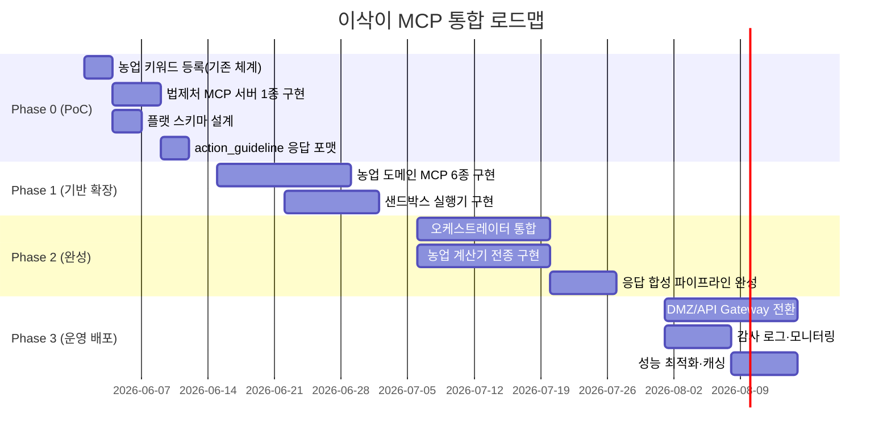

# AI 이삭이 MCP 농업 특화 AI 전환 설계 검토서

**작성일:** 2026-05-28  
**참조 문서:** 농업특화 AI이삭이 MCP서버 구축 설계안 (농촌진흥청 API 전문정보시스템 연계)  
**대상 코드베이스:** OMX (oh-my-codex) `src/` — TypeScript/Node.js 멀티에이전트 프레임워크

---

## 1. 개요

본 문서는 첨부된 **"농업특화 에이전틱 AI이삭이 MCP서버 구축"** 설계안을 현행 OMX 코드베이스에 통합하거나, 이삭이 전용 농업 AI 시스템으로 전환할 때의 **중점 검토 사항·난이도·변경 대상**을 체계적으로 분석한 기술 검토서다.

### 1.1 이삭이 설계안 핵심 요약

| 항목 | 내용 |
|------|------|
| 연계 기관 | 5개 기관 (법제처, 본청, 농과원, 원예원, 식량원/축산원) |
| 도메인 API | 21개 전문정보시스템 |
| 핵심 엔진 | ① 컨텍스트 최적화(샌드박스), ② 플랫 스키마 |
| 도구 선택 | Score = wi·Sint + we·Sent + wc·Sctx − wm·Pmissing − wr·Prisk |
| 응답 형식 | Raw 데이터 제거 → `action_guideline` (현장 실행 지침) 중심 |
| 인프라 | DMZ/API Gateway + Internal Network (3-tier) |

### 1.2 OMX 현행 자산 요약

| 자산 | 파일 / 경로 | 이삭이 대응 가능성 |
|------|-------------|------------------|
| 키워드 기반 스킬 라우팅 | `src/hooks/keyword-registry.ts` | 농업 의도 키워드로 확장 가능 |
| Triage 의도 분류 엔진 | `src/hooks/triage-heuristic.ts` | 기존 OMX 방식 유지, 농업 키워드만 추가 등록 |
| MCP 서버 기반 | `src/mcp/` (state, wiki, code-intel 등) | 농업 도메인 MCP 서버 추가 구조 사용 가능 |
| 세션·슬롯 관리 | `src/hooks/session.ts`, `triage-state.ts` | 농업 파라미터(작목·지역·시기) 세션 확장 가능 |
| 샌드박스 코드 실행 | `src/scripts/` | V8 샌드박스 연산 레이어 대응 가능 |
| 응답 합성 | `src/pipeline/` | `action_guideline` 생성 파이프라인으로 교체 가능 |
| 오케스트레이터 계층 | `src/team/`, `src/planning/` | 농업 멀티에이전트 오케스트레이터로 재사용 |

---

## 2. 통합 시나리오 비교

3가지 접근법을 검토한다.

```
[A] 확장 모드  — OMX 위에 이삭이 농업 도메인 레이어 추가
[B] 전환 모드  — OMX를 이삭이 전용 농업 AI로 전면 재설계
[C] 연계 모드  — 이삭이 MCP 서버를 독립 구성 + OMX 오케스트레이터 연결
```

### 2.1 시나리오별 비교

| 기준 | A: 확장 | B: 전환 | C: 연계 |
|------|---------|---------|---------|
| 개발 공수 | 중간 (4~6주) | 높음 (12~16주) | 낮음 (2~3주) |
| 기존 코드 재사용 | 90%+ | 30% | 60% |
| 농업 특화 최적화 | 부분적 | 완전 | 부분적 |
| 유지보수성 | 높음 | 중간 | 높음 |
| 리스크 | 낮음 | 높음 | 낮음 |
| 추천 | ✅ 1차 단계 | 장기 목표 | ✅ 빠른 PoC |

**권고:** C(연계) → A(확장) 순으로 단계적 접근.

---

### 2.2 개발 공수 세부 산정 (인원·M/M·일정)

> **기준:** 권고 경로 C(연계 PoC) → A(확장) 기준. Phase 3 운영 배포는 인프라팀 별도 산정.  
> M/M 산출 기준: 1인 × 1개월 (4.3주) = 1.0 M/M

#### 시나리오별 M/M 비교

| 시나리오 | 투입 인원 | 기간 | 총 M/M | 비고 |
|----------|----------|------|--------|------|
| C: 연계 (PoC만) | 2명 | 2~3주 | **1.0 M/M** | 최소 검증 용도 |
| A: 확장 (Phase 1~2) | 3명 | 9~10주 | **6.75 M/M** | PoC 이후 전체 확장 |
| B: 전환 (전면 재설계) | 5~6명 | 12~16주 | **18~24 M/M** | 비권고 — 장기 목표 |
| **C→A 권고 (Phase 0~2 합산)** | **2~3명** | **11~12주** | **~8.0 M/M** | **권고 경로** |

#### 역할별 투입 인원

| 역할 | 인원 | 참여 Phase | 주요 담당 | 필요 역량 |
|------|------|-----------|-----------|-----------|
| 백엔드 개발자 (Lead) | 1명 | Phase 0~2 (전체) | MCP 서버 구현, OMX 훅 확장, 아키텍처 설계 | TypeScript 3년+, MCP 프로토콜 이해 |
| 백엔드 개발자 | 1명 | Phase 0~2 (전체) | 공공 API 클라이언트, 플랫 스키마 설계 | TypeScript 2년+, 공공데이터 REST API |
| AI 엔지니어 | 1명 | Phase 1~2 (9주) | 오케스트레이터, 응답 합성, V8 샌드박스 | LLM 오케스트레이션, 프롬프트 엔지니어링 |
| 농업 도메인 전문가 | 1명 | Phase 0~2 (자문) | 시나리오 검증, 농업 은어 사전, API 명세 확인 | 농업 실무 경험 (0.3 FTE 수준) |
| **소계** | **4명** | | | 상시 3명 + 자문 1명 |

#### Phase별 세부 일정 및 M/M

| Phase | 일정 | 상시 인원 | M/M | 주요 작업 | 완료 기준 |
|-------|------|-----------|-----|-----------|-----------|
| **Phase 0** — PoC | 2026-06-01 ~ 06-13 (2주) | 2명 | **1.0** | ① 농업 키워드 20개 등록 ② 법제처 MCP 1종 구현 ③ `action_guideline` 포맷 PoC | "사과 탄저병 예방" 질문 → API 호출 → 응답 출력 |
| **Phase 1** — 기반 확장 | 2026-06-16 ~ 07-11 (4주) | 3명 | **3.0** | ① 6개 도메인 MCP 구현 ② 도구 스코어링 기본 로직 ③ V8 샌드박스 프로토타입 (한우 TMR) | 3개 이상 도메인 멀티 호출 시나리오 통과 |
| **Phase 2** — 완성 | 2026-07-14 ~ 08-14 (5주) | 3명 | **3.75** | ① 21종 전체 API 연계 ② 오케스트레이터 완성 ③ 농업 계산기 전종 ④ 응답 합성 완성 | 전 API 커버 + 계산기 동작 확인 |
| **Phase 3** — 운영 배포 | 2026-08-17 ~ 09-11 (4주) | 인프라 협력 | **별도** | DMZ/HTTP 전환, 감사 로그, 성능 최적화 | 운영 배포 가능 상태 |
| **합계 (Phase 0~2)** | **11주** | 평균 2.7명 | **7.75 M/M** | | |

> **비고:**
> - 농업 도메인 전문가(자문 0.3 FTE) 포함 시 **+1.0 M/M** 추가 → 총 **~8.75 M/M**.
> - Phase 3 운영 배포는 인프라팀 협력 별도 산정 필요 (예상 **2~3 M/M** 추가).
> - 초기 PoC(Phase 0)는 기존 백엔드 인력 2명으로 리스크 최소화 후 투입 확대.

---

> **참고:** 의미론적 의도 매핑(Semantic Intent Mapping) 및 농업 파라미터 추출(작목·지역·시기 등)은 기존 OMX 키워드 라우팅(`keyword-registry.ts` / `triage-heuristic.ts`) 및 세션 관리(`session.ts`, `triage-state.ts`) 체계를 확장하여 처리하므로 별도 검토 항목에서 제외한다.

## 3. 중점 검토 사항 및 난이도

### 3.1 농업 도메인 MCP 서버 신규 구축

**설계안 요구 사항:**
- 21개 전문정보시스템을 MCP 도구로 래핑
- 기관별 도메인 서버 분리: 법령·농약·토양기상·원예·식품·축산

**현재 상태 (`src/mcp/`):**
```
state-server.ts, wiki-server.ts, code-intel-server.ts 등
— 코드 인텔리전스/메모리 중심, 농업 API 없음
```

**변경 대상 및 신규 생성:**

```
src/isaki/
├── mcp/
│   ├── servers/
│   │   ├── law-server.ts          # 법제처: 국가법령정보, 현행법령본문
│   │   ├── pesticide-server.ts    # 본청: 농약등록정보, 농약안전사용정보
│   │   ├── soil-weather-server.ts # 농과원/원예원: 토양특성, 농업기상365
│   │   ├── horticulture-server.ts # 원예원: 과수생육품질, 과수재배변동
│   │   ├── food-server.ts         # 식량원: 국가표준식품성분, 기능성성분
│   │   └── livestock-server.ts   # 축산원: 가축더위지수, 한우TMR배합비
│   ├── tools/
│   │   ├── schema.ts              # 플랫 스키마 (Flattened Schema)
│   │   ├── executors.ts           # 외부 API 호출 실행기
│   │   └── registry.ts            # 도메인 도구 카탈로그
│   └── external/
│       └── client.ts              # 공공데이터포털 API 클라이언트
```

| 항목 | 난이도 | 주요 고려사항 |
|------|--------|--------------|
| 기관별 MCP 서버 21개 구현 | ⭐⭐⭐⭐ 높음 | API 인증키 관리, 각 API 스펙 파싱 |
| 플랫 스키마 설계 | ⭐⭐ 낮음 | 1차원 파라미터 규칙 수립 |
| API 오류/폴백 처리 | ⭐⭐⭐ 중간 | 기관 API 장애 시 대체 전략 |
| API 키 보안 관리 | ⭐⭐⭐ 중간 | 환경변수 + Keychain 통합 |

**플랫 스키마 원칙 (Flattened Schema):**

```typescript
// ❌ 중첩 구조 (JSON 생성 오류 유발)
interface BadPesticide {
  query: { pesticide_name: string; crop: { name: string; stage: string } }
}

// ✅ 플랫 구조 (이삭이 원칙)
interface GoodPesticide {
  pesticide_name: string;
  crop_name: string;
  crop_stage?: string;
}
```

---

### 3.2 컨텍스트 최적화 — V8 샌드박스 실행

**설계안 요구 사항:**
- 한우 TMR 배합비, 온실 에너지 등 복잡 연산은 샌드박스에서 실행
- LLM에는 최종 요약본(`action_guideline`)만 전달
- Raw 데이터 노출 금지

**현재 상태:**
- `src/scripts/` — 일부 계산 스크립트 존재
- 샌드박스 격리 메커니즘 없음

**변경 대상:**

| 항목 | 난이도 | 변경 대상 |
|------|--------|-----------|
| V8 Isolate / vm2 샌드박스 구성 | ⭐⭐⭐⭐ 높음 | (신규) `src/isaki/sandbox/runner.ts` |
| 농업 계산기 구현 (TMR, 온실에너지 등) | ⭐⭐⭐ 중간 | (신규) `src/isaki/calculators/` |
| 샌드박스 출력 → action_guideline 변환 | ⭐⭐⭐ 중간 | (신규) `src/isaki/compressors.ts` |
| 실행 시간 제한·메모리 격리 | ⭐⭐⭐⭐ 높음 | 샌드박스 런타임 설정 |

```typescript
// 샌드박스 실행 흐름
rawData → SandboxRunner.execute(code, data) → rawResult
rawResult → Compressor.summarize() → action_guideline
action_guideline → LLM Context (최소 토큰)
```

**보안 고려사항:**
- 샌드박스 내 네트워크 접근 차단
- 실행 시간 최대 30초 제한
- `require`, `process`, `fs` 등 위험 모듈 접근 차단

---

### 3.3 응답 합성 파이프라인 (Response Generation Rules)

**설계안 요구 사항:**
- Raw JSON 데이터 노출 금지
- 조치 중심 서술 (Action-oriented advice)
- 데이터 충돌 시 우선순위 안내
- 출처 및 기준 시점 필수 표기 (Disclaimer)

**현재 상태:**
- `src/pipeline/` — 범용 응답 파이프라인
- 농업 현장 특화 응답 포맷 없음

**변경 대상:**

| 항목 | 난이도 | 변경 대상 |
|------|--------|-----------|
| `action_guideline` 출력 포맷 설계 | ⭐⭐ 낮음 | (신규) `src/isaki/response-synthesizer.ts` |
| 다중 API 결과 충돌 해결 로직 | ⭐⭐⭐ 중간 | 우선순위 규칙 정의 |
| Disclaimer 자동 첨부 | ⭐ 낮음 | 출력 후처리 레이어 |
| 기관별 출처 표기 규칙 | ⭐⭐ 낮음 | 도구 메타데이터 활용 |

**응답 합성 규칙:**

```
출력 구조:
  [권장조치] — 즉각 실행 가능한 지침 (서술형)
  [데이터 분석] — 핵심 수치·상태 (3줄 이내)
  [컨설팅 개적] — 맥락·배경 (선택)
  [출처] — 기관명, 기준 시점, 면책 조항

충돌 해결:
  최신 데이터 우선 → 상위 기관 데이터 우선 → 불확실 표기
```

---

### 3.4 오케스트레이터 계층 — 농업 특화 멀티에이전트

**설계안 요구 사항:**
- LLM 벤더 독립적 오케스트레이터
- 의도 분류기, 파라미터 추출기, 도구 선택기, 응답 합성기 4요소
- 다중/순차 도구 호출 (Sequential Calling)
- 폴백 및 재시도 로직

**현재 상태 (`src/planning/`, `src/team/`):**
- 범용 멀티에이전트 오케스트레이션 존재
- 코드 작업 특화 (농업 도메인 로직 없음)

**변경 대상:**

| 항목 | 난이도 | 변경 대상 |
|------|--------|-----------|
| 농업 오케스트레이터 진입점 | ⭐⭐ 낮음 | (신규) `src/isaki/orchestrator.ts` |
| 다중 도구 순차 호출 | ⭐⭐⭐ 중간 | 기존 `team/` 파이프라인 활용 |
| 도구 실패 → 폴백/재시도 | ⭐⭐⭐ 중간 | (신규) `src/isaki/fallback-tracker.ts` |
| 벤더 독립 LLM 라우팅 | ⭐⭐⭐⭐ 높음 | `src/adapt/` 계층 활용·확장 |

---

### 3.5 물리적 인프라 — DMZ/API Gateway 연계

**설계안 요구 사항:**
```
External Zone (공공API)
    ↓
DMZ / API Gateway (신규 MCP 서버 배치)
    ↓
Internal Network (오케스트레이터, LLM, RAG)
```

**현재 상태:**
- 단일 로컬 프로세스 (dmz 분리 없음)
- MCP 서버는 stdio 기반 로컬 실행

**변경 대상:**

| 항목 | 난이도 | 변경 대상 |
|------|--------|-----------|
| HTTP 기반 MCP 서버 전환 | ⭐⭐⭐⭐ 높음 | MCP stdio → HTTP/SSE 전환 |
| API 인증 게이트웨이 통합 | ⭐⭐⭐⭐ 높음 | 별도 인프라 구성 |
| 내부망/인터넷망 분리 설계 | ⭐⭐⭐⭐⭐ 매우 높음 | 시스템 아키텍처 변경 필요 |
| 감사 로그 (Audit Log) 구성 | ⭐⭐⭐ 중간 | `src/mcp/lifecycle-telemetry.ts` 확장 |

> **참고:** PoC 단계에서는 로컬 stdio MCP 구조 유지. 운영 배포 시 DMZ 분리 필요.

---

## 4. 전체 변경 대상 목록 및 난이도 요약

### 4.1 기존 파일 수정

| 파일 경로 | 변경 유형 | 난이도 | 변경 내용 |
|-----------|-----------|--------|-----------|
| `src/hooks/keyword-registry.ts` | 확장 | ⭐ | 농업 키워드 100+ 추가 (기존 체계 유지) |
| `src/hooks/triage-state.ts` | 확장 | ⭐⭐ | 농업 파라미터(작목·지역·시기) 상태 추가 |
| `src/hooks/session.ts` | 확장 | ⭐⭐⭐ | 농업 파라미터 세션 간 지속성 추가 |
| `src/pipeline/` | 확장 | ⭐⭐⭐ | action_guideline 포맷 추가 |
| `src/mcp/state-paths.ts` | 확장 | ⭐⭐ | 농업 도메인 상태 경로 추가 |
| `src/mcp/lifecycle-telemetry.ts` | 확장 | ⭐⭐⭐ | 감사 로그 확장 |
| `src/adapt/` | 확장 | ⭐⭐⭐⭐ | 다중 LLM 벤더 라우팅 |

### 4.2 신규 생성 파일

```
src/isaki/
├── orchestrator.ts              ⭐⭐⭐   농업 특화 오케스트레이터
├── response-synthesizer.ts      ⭐⭐⭐   action_guideline 응답 합성
├── fallback-tracker.ts          ⭐⭐⭐   폴백·재시도 제어
├── compressors.ts               ⭐⭐⭐   샌드박스 결과 압축·요약
├── mcp/
│   ├── servers/
│   │   ├── law-server.ts        ⭐⭐⭐   법제처 MCP 서버
│   │   ├── pesticide-server.ts  ⭐⭐⭐   본청 농약 MCP 서버
│   │   ├── soil-weather-server.ts ⭐⭐⭐ 농과원 토양기상 MCP 서버
│   │   ├── horticulture-server.ts ⭐⭐⭐ 원예원 MCP 서버
│   │   ├── food-server.ts       ⭐⭐⭐   식량원 MCP 서버
│   │   └── livestock-server.ts  ⭐⭐⭐   축산원 MCP 서버
│   ├── tools/
│   │   ├── schema.ts            ⭐⭐     플랫 스키마 정의
│   │   ├── executors.ts         ⭐⭐⭐   API 실행기
│   │   └── registry.ts          ⭐⭐     도구 카탈로그 레지스트리
│   └── external/
│       └── client.ts            ⭐⭐⭐   공공데이터포털 HTTP 클라이언트
├── sandbox/
│   ├── runner.ts                ⭐⭐⭐⭐  V8 샌드박스 실행기
│   └── validators.ts            ⭐⭐⭐   샌드박스 입출력 검증
└── calculators/
    ├── hanwoo-tmr.ts            ⭐⭐⭐   한우 TMR 배합비 계산
    ├── greenhouse-energy.ts     ⭐⭐⭐   온실 에너지 계산
    └── pesticide-dilution.ts    ⭐⭐     농약 희석배수 계산
```

---

## 5. 단계별 전환 로드맵



### Phase 0 — PoC (1~2주)

**목표:** 최소한의 변경으로 이삭이 동작 가능성 검증

**작업:**
1. `keyword-registry.ts`에 농업 핵심 키워드 20개 추가
2. 법제처 `get_national_law_info` MCP 서버 1종 구현
3. 플랫 스키마 원칙 문서화
4. `action_guideline` 응답 포맷 프로토타입

**완료 기준:** "안동 풍산 사과 탄저병 예방" 질문 → 법제처 API 도구 호출 → action_guideline 응답

---

### Phase 1 — 기반 확장 (3~5주)

**목표:** 21개 API 중 도메인별 대표 API 연계 완료

**작업:**
1. 6개 도메인 MCP 서버 구현 (기관별 대표 API 1~2종)
2. 도구 스코어링 기본 구현 (기존 OMX 키워드 가중치 기반)
3. V8 샌드박스 프로토타입 (한우 TMR 계산기)

**완료 기준:** 3개 이상 API를 연계한 멀티 도구 호출 시나리오 검증

---

### Phase 2 — 완성 (5~8주)

**목표:** 21개 전 API 연계 + 오케스트레이터·응답 합성 완성

**작업:**
1. 농업 오케스트레이터 완성
2. 전 계산기 구현
3. 응답 합성 파이프라인 완성

---

### Phase 3 — 운영 배포 (4~6주)

**목표:** DMZ 분리, 보안, 모니터링

**작업:**
1. MCP stdio → HTTP/SSE 전환
2. DMZ/API Gateway 인프라 구성
3. 감사 로그·이상 감지 모니터링

---

## 6. 리스크 및 고려사항

### 6.1 기술적 리스크

| 리스크 | 영향 | 대응 방안 |
|--------|------|-----------|
| 공공 API 가용성 불안정 (농진청 API) | 높음 | 캐싱 레이어 + 폴백 응답 |
| API 인증키 만료·변경 | 중간 | 환경변수 중앙 관리 + 알림 |
| 샌드박스 보안 취약점 | 높음 | vm2/isolated-vm 검증된 라이브러리 사용 |
| 농업 용어 다의성 처리 | 중간 | 도메인 전문가 검증 레이어 |

### 6.2 데이터 보안

```
민감 정보 처리 원칙:
- API 키: 환경변수 저장, 절대 코드에 하드코딩 금지
- 농가 개인정보: 지역명만 수집, 개인 식별 정보 미수집
- 샌드박스 입력: 악의적 코드 주입 방지 검증 필수
- 응답 캐싱: 개인화 데이터 캐시 금지
```

### 6.3 이삭이 고유 제약

| 제약 사항 | 이유 | 구현 방안 |
|-----------|------|-----------|
| 현장 표현 정규화 필수 | "약 쳐" = 농약 살포, "땅 봐" = 토양 분석 | NLP 농업 은어 사전 구축 |
| 긴급도 우선 처리 | 재해·병해충 즉각 대응 필요 | urgency 파라미터 + 우선순위 라우팅 |
| 지역 특화 정보 | 지역별 기상·토양 상이 | region 파라미터 필수화 |
| 법적 책임 면책 | 농약 오용 시 법적 문제 | Disclaimer 필수 자동 첨부 |

---

## 7. hooks-module-design.md 연계 포인트

현행 `hooks-module-design.md`의 설계와 이삭이 연계 시 수정/확장이 필요한 접점:

| hooks 설계 항목 | 이삭이 연계 방안 |
|----------------|----------------|
| `keyword-detector.ts` — 키워드 기반 라우팅 | 농업 도메인 키워드 + 스코어링 기반 라우팅으로 확장 |
| `triage-heuristic.ts` — 폴백 분류 | 농업 의도(재해/법령/농약/생육) 분류 카테고리 추가 |
| `agents-overlay.ts` — AGENTS.md 동적 주입 | 농업 현장 컨텍스트(작기, 지역, 기상) 동적 주입 |
| `session.ts` — 세션 관리 | 농업 파라미터(작목, 지역) 세션 간 지속성 유지 |
| `prompt-guidance-contract.ts` — 계약 검증 | action_guideline 출력 포맷 계약 추가 |

---

## 8. 결론 및 권고안

### 권고 접근법: **확장 우선 + 도메인 레이어 분리**

```
[현행 OMX 코어]
    + [isaki/ 도메인 레이어] (신규 src/isaki/ 폴더)
    + [농업 MCP 서버 6종] (신규 src/isaki/mcp/)
    + [키워드/파라미터 확장] (기존 hooks/ 수정)
```

**핵심 원칙:**
1. **코어 훼손 없이 도메인 분리** — `src/isaki/`를 별도 레이어로 구성, 기존 OMX 기능 유지
2. **플랫 스키마 엄수** — 모든 농업 MCP 도구 파라미터는 1차원 구조 의무화
3. **action_guideline 최우선** — 모든 응답은 Raw 데이터 없이 실행 지침 중심
4. **샌드박스 강제** — 연산이 포함된 모든 도구 호출은 샌드박스 경유 필수
5. **PoC → 확장** — Phase 0부터 실 사용 가능한 단일 시나리오로 시작

**총 예상 공수:** Phase 0~2 기준 약 10~12주 (풀타임 2인 기준)

| Phase | 공수 | 주요 산출물 |
|-------|------|------------|
| Phase 0 | 2주 | 법제처 MCP 1종 + action_guideline PoC |
| Phase 1 | 4주 | 6개 도메인 MCP + 샌드박스 |
| Phase 2 | 5주 | 21종 전체 API + 오케스트레이터 + 완성본 |
| Phase 3 | 5주 | 운영 배포 (별도 인프라팀 협력 필요) |
