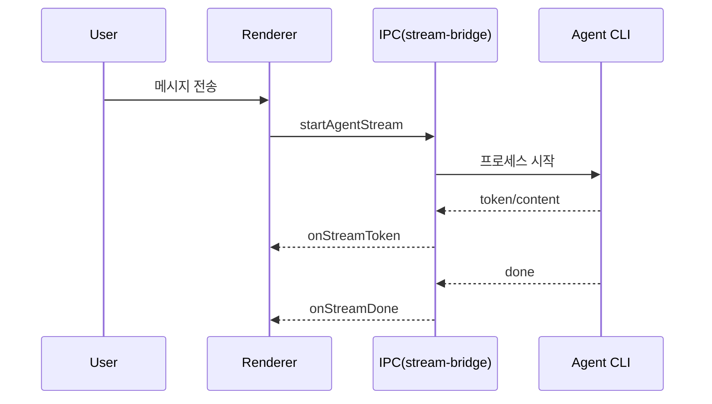
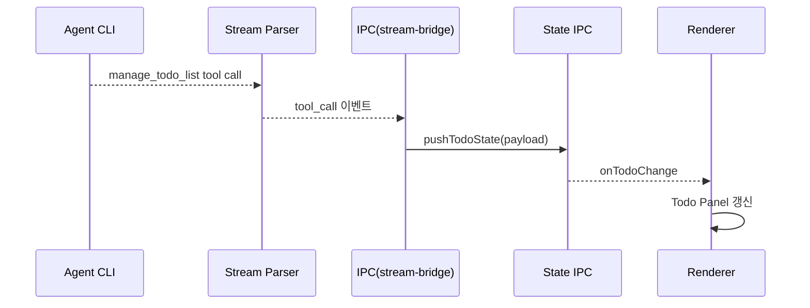
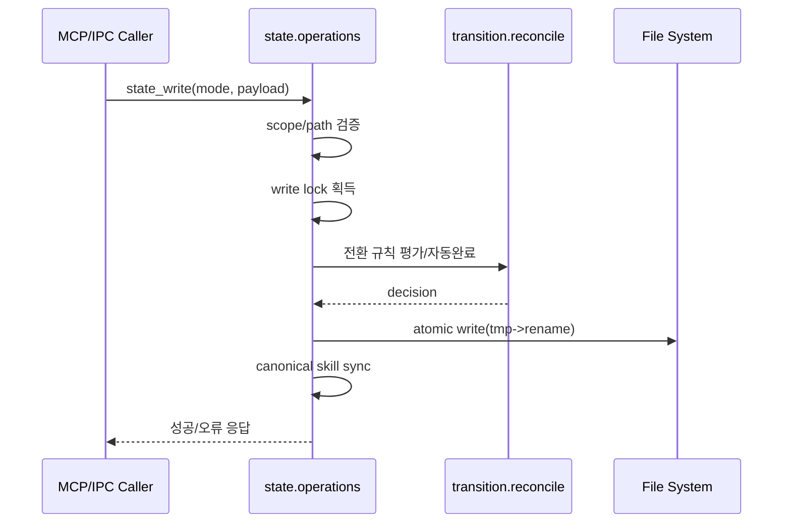
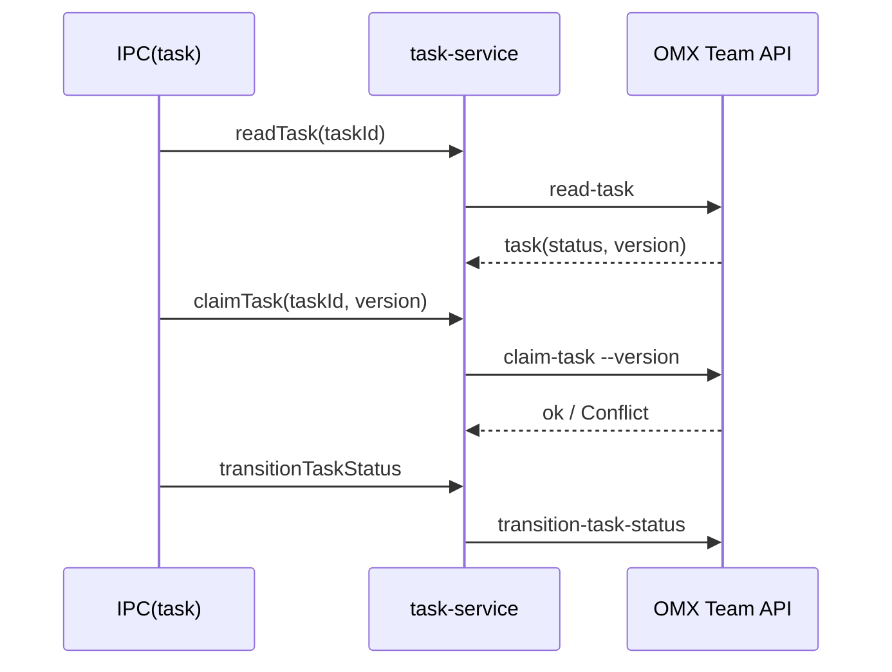
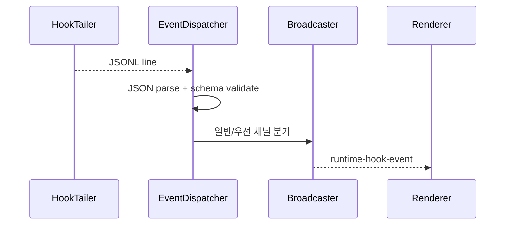
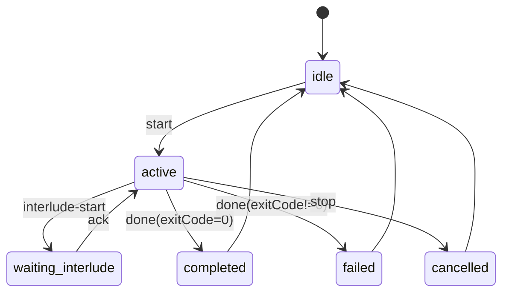
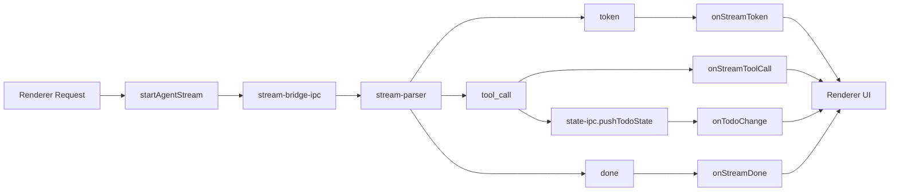

# OMX 핵심 시퀀스 및 흐름 다이어그램 (1차)

## 1) 사용자 질의 스트림 처리 시퀀스

## 2) todo 즉시 동기화 시퀀스

## 3) state_write 처리 시퀀스

## 4) task claim 및 전이 시퀀스

## 5) hooks 로그 브리지 시퀀스

## 6) 상태 전이도 (요약)

## 7) IPC 이벤트 흐름도

