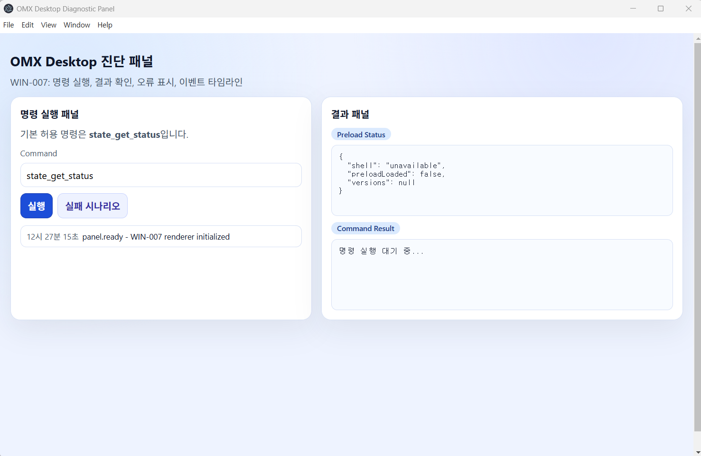

# 윈앱 사용설명서 (oh-my-codex-js)

이 문서는 Windows 환경에서 oh-my-codex-js 데스크톱 앱(Electron 기반)을 실행하고
기본 동작을 확인하는 절차를 설명한다. Phase 2 완료(2026-05-23) 기준으로
명령 히스토리·Question 모달·HUD·Sidecar 패널과 설치형 패키징(NSIS)이 포함되어 있다.



관련 게이트 문서:
- Phase 1 게이트: `winapp만들기/stage1/change-winapp-phase1-gate.md`
- Phase 2 게이트: `winapp만들기/stage1/change-winapp-phase2-gate.md`

---

## 앱 소개

**oh-my-codex Windows 데스크톱 앱**은 기존 `oh-my-codex-js` CLI(팀 오케스트레이션·HUD·Sidecar·Question 루프)를
**Claude Desktop 스타일의 설치형 Windows 앱**으로 전환한 산출물이다.
tmux/TTY 기반 터미널 의존을 제거하고, Electron Main/Preload/Renderer 3-프로세스 구조에서
동일한 도메인 코어를 **IPC 게이트웨이**를 통해 호출한다.

전환 근거와 파일 단위 변경 계획의 원전(原典)은
[change-winapp-phase1-분석.md](change-winapp-phase1-분석.md) 다.
본 사용설명서의 "소개·목적·기능 목록"은 해당 분석서의 P0/P1 변경 방향 + Phase 2 (WIN-011~WIN-020) +
Phase 3 (WIN-021~WIN-023) 의 실제 산출물을 사용자 관점으로 재정리한 것이다.

| 구분 | 기존 CLI | Windows 앱 |
|---|---|---|
| 진입점 | `omx <subcommand>` | 설치된 `.exe` (NSIS) 또는 `npm run desktop:dev` |
| UI 컨테이너 | tmux pane / TTY | Electron 창(Main+Renderer) |
| 출력 | `console.log` + ANSI | 구조화 IPC 이벤트 (`command.started/completed/failed`) |
| 질문 루프 | readline 블로킹 | Renderer 모달(`question_ask`/`question_demo`) |
| HUD/Sidecar | ANSI 재렌더 | ViewModel 기반 패널 |
| 워커 실행 | tmux 의존 | `LocalProcessTransport` (Windows 기본) + `TmuxTransport` (격리 유지) |
| 보안 경계 | OS 셸 | `contextIsolation:true` + `nodeIntegration:false` + preload allowlist + zod 입력 검증 |

## 목적

1. **Windows 운영 환경에서 tmux 의존 제거** — Windows 사용자가 별도 가상화/WSL 없이 네이티브 GUI 로 oh-my-codex 워크플로우를 운영할 수 있게 한다.
2. **CLI/Desktop 동시 지원** — 동일 도메인 코어를 두 어댑터(`CLI adapter`, `IPC adapter`)가 호출하도록 분리해, 기존 자동화 파이프라인을 깨지 않으면서 GUI 운영을 병행한다.
3. **운영형 UX 격상** — 명령 히스토리/검색/필터, 실시간 이벤트 스트리밍, 모달 질문, HUD/Sidecar 패널을 한 화면에 통합해 "진단 전용 콘솔" → "일상 운영 도구" 로 전환한다.
4. **보안 경계 선고정** — 데스크탑 앱에 기능을 더하기 전에 preload 최소 API, IPC zod 검증, 외부 프로세스 호출 allowlist, 환경변수 비활성화 스위치를 우선 적용한다.
5. **재현 가능한 배포** — `electron-builder` (NSIS) 로 설치형 `.exe` 를 생성하고, 회귀 테스트는 OS 프로파일(`test:phase2:windows:compiled` 등)로 분리해 CI 안정성을 확보한다.

## 역할

### 1) 생태계 안에서의 역할

`oh-my-codex-js` 모노레포 안에서 본 Windows 앱은 **CLI 와 동등한 1급 어댑터** 다.
도메인 코어(`src/team`, `src/hud`, `src/sidecar`, `src/question`, `src/cli/index.ts` 의 `executeCommand`)는
양쪽 어댑터가 공유하며, 앱은 다음 4가지를 책임진다.

| 역할 | 위임 / 책임 | 비고 |
|---|---|---|
| **GUI 진입점** | Electron 창 표시 + 입력/결과 패널 렌더 | tmux/TTY 대체 |
| **IPC 중재자** | Renderer 요청 → preload 화이트리스트 → Main `handleRunCommand` 라우팅 | 보안 경계 단일화 |
| **워커 트랜스포트 선택자** | Windows 기본 `LocalProcessTransport`, 호환용 `TmuxTransport` 격리 유지 | OS 분기 단일 지점 |
| **외부 CLI 트리거** | `omx_*` 그룹을 통해 동일 저장소의 `dist/cli/omx.js` 를 고정 인자로 호출 | 인젝션 차단·watchdog·환경변수 비활성 스위치 |

### 2) 프로세스별 역할 (Electron 3-프로세스 모델)

| 프로세스 | 디렉터리 | 책임 | 보안 정책 |
|---|---|---|---|
| **Main** | `desktop/main/` | 앱 수명주기, 창 생성, IPC 명령 디스패치(`desktop/ipc/commands.ts`), EventBus 게시, 명령 히스토리 ring buffer, 외부 프로세스 spawn. | Node 전권 보유 — Renderer 가 직접 닿을 수 없음. |
| **Preload** | `desktop/preload/` | `contextBridge` 로 `window.omx.runCommand` / `subscribeEvents` 같은 **화이트리스트 API 만** 노출. | `contextIsolation:true`, `nodeIntegration:false`. |
| **Renderer** | `desktop/renderer/` | HTML/CSS/TS UI — 명령 입력, 히스토리, 결과/로그, HUD/Sidecar 패널, Question 모달. | preload 가 노출한 API 외 Node 호출 불가. |
| **IPC 계약** | `desktop/ipc/` | `commands.ts`(요청 계약 + zod 검증 + 핸들러), `events.ts`(이벤트 타입), `event-bus.ts`(pub/sub), `question.ts`(모달 브로커). | 모든 채널이 zod 사전 검증, 위반 시 `INVALID_REQUEST` + `command.failed` 페어 마감. |

### 3) 사용자 역할 (RACI 관점)

| 역할 | 본 앱 사용 방식 |
|---|---|
| **운영자(Operator)** | 명령 패널에서 `omx_*` / `hud_*` / `sidecar_*` 명령을 실행해 상태 점검, 진단 번들 수집. |
| **개발자(Developer)** | `npm run desktop:dev` 로 빠른 반복, IPC contract 회귀(`test:phase2:windows:compiled`)로 PR 검증. |
| **릴리스 담당(Releaser)** | `npm run desktop:package` 로 NSIS `.exe` 산출, Phase 게이트 문서로 객관 완료 판정. |
| **보안 검토자(Reviewer)** | preload allowlist, `allowedCommands`, `OMX_DESKTOP_ALLOW_EXEC` 스위치, `omxCliMatrix` 고정 인자 정책을 감사. |

## 기능 목록 및 설명

기능은 분석서의 P0/P1 분류 + 실제 구현 티켓(WIN-NNN)으로 매핑된다.
각 항목의 "사용법" 컬럼은 본 문서 §3 / §4 의 절 번호를 가리킨다.

### 1) 코어 실행/IPC 게이트웨이 (P0)

| 기능 | 설명 | 구현 | 사용법 |
|---|---|---|---|
| 실행 코어 분리 | `executeCommand({ command, args, context })` 형태로 CLI/Desktop 공통 호출 경로 확보. `process.exit*` 는 CLI adapter 만 처리. | WIN-011 | (내부) |
| IPC 명령 게이트웨이 | Renderer → preload → Main 단방향 호출 + 응답. 허용 명령은 `allowedCommands` 화이트리스트 + 명령별 zod 인자 검증. | WIN-013, WIN-021, WIN-022, WIN-023 | §4.1, §4.7, §4.8, §4.9 |
| 실시간 이벤트 스트리밍 | Main → Renderer 방향 IPC 구독 채널 (`command.started`/`progress`/`completed`/`failed`). | WIN-013 | §4.6 |
| 보안 브리지(preload) | `contextIsolation:true`, `nodeIntegration:false`. preload 가 `window.omx.runCommand` / `subscribeEvents` 같은 화이트리스트 API 만 노출. | WIN-011, WIN-013 | (내부) |

### 2) Transport 추상화 (P0)

| 기능 | 설명 | 구현 | 사용법 |
|---|---|---|---|
| `WorkerTransport` 인터페이스 | 워커 실행 경로를 추상화해 tmux 의존을 `TmuxTransport` 로 격리. | WIN-011 | (내부) |
| `LocalProcessTransport` | Windows 기본 transport — `child_process.spawn` 기반 워커 실행. `allowedCommands`/`allowedCwdRoots`/`envAllowList`/`killGracePeriodMs` 보안 옵션. | WIN-012 | (내부) |
| OS 회귀 프로파일 분리 | tmux 의존 테스트와 Windows 전용 테스트를 별도 npm script (`test:phase2:windows:compiled` 등) 로 분리. | WIN-018 | §5.2 |

### 3) 운영형 UI 셸 (P1)

| 기능 | 설명 | 구현 | 사용법 |
|---|---|---|---|
| Electron 데스크탑 셸 | `desktop/main/`, `desktop/preload/`, `desktop/renderer/`, `desktop/ipc/` 4-디렉토리 구조. | (전반) | §3.1, §3.2 |
| 명령 입력 패널 | 명령 이름 + 선택적 인자(최대 10개, 각 200자) 입력. 비어있으면 `state_get_status` 자동 채움. | WIN-014 | §4.1 |
| 명령 히스토리/검색/필터 | 최근 명령을 시간 역순으로 표시, 키워드 즉시 필터, 클릭 시 입력란 복원. Main 측 in-memory ring buffer 50건. | WIN-014, WIN-021(`history_list`) | §4.2, §4.7 |
| 결과/로그 패널 | 명령별 응답 + 실시간 스트리밍 이벤트 누적. | WIN-013, WIN-014 | §4.6 |
| Question 모달 | CLI 블로킹 질문 루프를 모달로 대체. 모달 표시 중 입력 비활성화. | WIN-015 | §4.3 |
| HUD 패널 | `.codex/` 기반 실시간 상태(현재 단계/진행률/마지막 이벤트). tmux 없이도 동일 정보 제공. | WIN-016, WIN-021(`hud_get_snapshot`) | §4.4, §4.7 |
| Sidecar 패널 | 보조 워커/감시자 출력 누적. 자동 스크롤 + 일시 정지 토글. | WIN-017, WIN-021(`sidecar_get_snapshot`) | §4.5, §4.7 |

### 4) 진단/계측 명령군 (Phase 3)

| 명령군 | 목적 | 명령 수 | 사용법 |
|---|---|---|---|
| Group A — 무인자/단순 인자 | HUD/Sidecar 스냅샷, 버전, 플랫폼, 히스토리, EventBus 통계. 모두 read-only. | 6 (WIN-021) | §4.1, §4.7 |
| Group B — Parameterized | `state_get_field` 단일 필드 조회, `question_ask` 임의 모달, `noop_echo`/`noop_sleep` IPC/타이밍 진단. zod 사전 검증 + 위반 시 `INVALID_REQUEST`+`command.failed` 페어. | 4 (WIN-022) | §4.1, §4.8 |
| Group C — omx CLI 트리거 | `omx_doctor`, `omx_adapt_probe`, `omx_state_status`. 실행 파일은 `process.execPath` 고정, 인자는 코드 상수 매트릭스로 고정(사용자 args 무시), 30s 워치독, stdout/stderr 8KB 절단, `OMX_DESKTOP_ALLOW_EXEC=0` 비활성 스위치. | 3 (WIN-023) | §4.1, §4.9 |

### 5) 배포·운영 (P1/P2)

| 기능 | 설명 | 구현 | 사용법 |
|---|---|---|---|
| 설치형 NSIS `.exe` | `electron-builder` 기반 패키징. winCodeSign 캐시의 macOS .dylib 심링크 추출을 위해 Windows 개발자 모드 필요. | WIN-019 | §3.4 |
| Phase 2 릴리스 게이트 문서 | Phase 2 완료의 객관 기준(빌드/테스트/보안/문서)을 정리한 게이트 문서. | WIN-020 | §5.3 |
| 회귀 테스트 명령 | Phase 1 IPC/CLI 계약 회귀 + Phase 2 OS 프로파일 분리 회귀 + 게이트 구조 회귀. | WIN-018, WIN-020 | §5 |

> ℹ️ 분석서가 다음 단계(P2)로 권장한 항목 — 자동 업데이트 채널, 코드서명, 진단 번들 내보내기, 설정 저장소(`%APPDATA%/oh-my-codex/`) 운영 정책 — 은 본 문서 시점(Phase 3 종료) 기준 **미구현 후속 작업** 이다.

---

## 1. 준비 사항

- 운영체제: Windows 10/11 (x64)
- Node.js: 20 이상
- npm 사용 가능 환경
- 프로젝트 루트 예시: `C:\Workspace\Isaki\oh-my-codex-js` 또는 `D:\workspace\ite-ai-codex-js`
- (설치형 패키징 시 한정) Windows **개발자 모드** 활성화 또는 관리자 PowerShell
  - 사유: electron-builder 가 winCodeSign 캐시에 포함된 macOS .dylib 심볼릭 링크를 풀 때
    Windows 일반 사용자 권한으로는 심링크 생성이 거부됨
  - 활성화: 설정 → 시스템 → 개발자용 → 개발자 모드 On

## 2. 최초 1회 설치

PowerShell에서 아래 순서대로 실행한다.

```powershell
cd C:\Workspace\Isaki\oh-my-codex-js
npm install
```

## 3. 윈앱 실행 명령어

### 3.1 개발 모드로 실행 (권장)

아래 명령은 데스크톱 빌드 후 Electron 앱을 바로 실행한다.

```powershell
npm run desktop:dev
```

실행 성공 기준:
- 앱 창이 열림
- 진단 패널(UI) 표시
- 명령 실행 영역과 결과/로그 패널이 보임

### 3.2 데스크톱 빌드만 수행

앱 실행 없이 데스크톱 산출물만 빌드한다.

```powershell
npm run desktop:build
```

산출 경로:
- `dist-desktop/main`
- `dist-desktop/preload`
- `dist-desktop/renderer`

### 3.3 CLI 전체 빌드 확인

코어/CLI 타입스크립트 전체 빌드를 확인한다.

```powershell
npm run build
```

### 3.4 설치형 .exe 패키징 (선택)

설치형 산출물을 만들 때만 사용한다. 개발자 모드/관리자 권한이 필요하다(§1 참고).

```powershell
# 디렉터리 형태 산출 (서명 없음, 빠른 검증용)
npm run desktop:pack

# NSIS 설치 마법사 .exe 생성
npm run desktop:package
```

산출 경로: `release/` 아래 `win-unpacked/` 또는 `*-Setup-*.exe`.

## 4. 기본 동작 확인 (수동 테스트)

### 4.1 기본 명령 실행

1. 앱 실행 후 명령 입력란에서 `state_get_status` 실행
2. 결과 패널에서 JSON 응답 확인
3. 허용되지 않은 명령을 입력해 에러 UI 표시 확인

기대 결과:
- 정상 명령: `ok: true` 계열 응답
- 비허용 명령: `UNKNOWN_COMMAND` 또는 입력 검증 에러

**현재 허용된 명령 (allow-list, [desktop/ipc/commands.ts](../../desktop/ipc/commands.ts) 참조):**

| 명령 | 설명 | 응답 데이터 형태 |
|---|---|---|
| `state_get_status` | 런타임 상태 조회 — 플랫폼, Electron/Node/Chrome 버전, 타임스탬프 반환 | `{ command, status: "ok", runtime, timestamp, platform, versions: { chrome, electron, node } }` |
| `question_demo` | WIN-015 Question 모달 데모 — 모달을 띄워 사용자의 단일선택/직접입력 응답을 받아 반환 | `{ command: "question_demo", answer: { kind, value } }` |
| `hud_get_snapshot` | WIN-021 HUD 1회 스냅샷 — `process.cwd()` 기준 `.codex/` 상태를 읽어 반환 (없으면 `warning` 필드) | `{ command: "hud_get_snapshot", snapshot, warning? }` |
| `sidecar_get_snapshot` | WIN-021 Sidecar 1회 스냅샷 — `args[0]=teamName` (선택, 기본 `default`, 패턴 `^[A-Za-z0-9_-]{1,64}$`) | `{ command: "sidecar_get_snapshot", teamName, snapshot, warning? }` |
| `versions_get` | WIN-021 경량 버전 정보 — node/electron/chrome/v8 | `{ command, node, electron, chrome, v8 }` |
| `platform_get` | WIN-021 플랫폼/호스트 정보 — `platform`, `arch`, `cwd`, `hostname`, `release`, `uptimeSec` | `{ command, platform, arch, cwd, hostname, release, uptimeSec }` |
| `history_list` | WIN-021 최근 명령 이력 — `args[0]=limit` (1~200, 기본 20). Main 측 in-memory ring buffer(최대 50건). | `{ command, limit, total, entries: [{ command, args, status, exitCode, startedAt, durationMs, commandId }, …] }` |
| `event_bus_stats` | WIN-021 EventBus 통계 — 현재 구독자 수 + 이벤트 타입별 누적 카운트 | `{ command, subscriberCount, counts: { "command.started": n, "command.completed": n, "command.failed": n } }` |
| `state_get_field` | WIN-022 `state_get_status` 의 단일 필드만 반환. `args[0]=field` (enum: `platform`/`runtime`/`versions`/`timestamp`/`status`/`command`) | `{ command, field, value }` |
| `question_ask` | WIN-022 임의 질문 모달 열기. `args[0]=question`(1~200자), `args[1..5]=options`(각 1~40자, `[\p{L}\p{N} _-]`) | `{ command, question, answer: { kind, value } }` |
| `noop_echo` | WIN-022 IPC 왕복 진단용 — args 반향. 인자 최대 10개, 각 마다 최대 200자 | `{ command, args, count }` |
| `noop_sleep` | WIN-022 스트리밍 이벤트 페어 검증용 — `args[0]=ms` (0~5000) | `{ command, requestedMs, actualMs }` |
| `omx_doctor` | WIN-023 omx CLI `doctor` 트리거 (외부 프로세스 호출). 사용자 args 무시. | `{ command, argv, exitCode, signal, durationMs, stdout, stderr, stdoutTruncated, stderrTruncated }` |
| `omx_adapt_probe` | WIN-023 omx CLI `adapt openclaw probe --json` 트리거 (read-only). 사용자 args 무시. | (동일) |
| `omx_state_status` | WIN-023 omx CLI `state list-active --json` 트리거 (read-only). 사용자 args 무시. | (동일) |

규칙:
- 입력란이 비어 있으면 자동으로 `state_get_status` 가 채워진다.
- 위 목록에 없는 문자열은 모두 `UNKNOWN_COMMAND` 로 거부된다(예: `state_get_status_invalid`).
- 인자(args)는 최대 10개, 각 항목 문자열만 허용된다(zod 스키마 검증).
- 새 명령을 추가하려면 `allowedCommands` 배열과 `switch` 분기 두 곳을 모두 갱신해야 한다.

> ⚠️ **WIN-023 omx CLI 트리거 보안 정책 ([desktop/ipc/commands.ts](../../desktop/ipc/commands.ts) `runOmxSubcommand`)**
>
> - 실행 파일은 `process.execPath`(현재 Node 바이너리)로 **고정**. 임의 프로그램 실행 불가.
> - 인자는 `omxCliMatrix` 코드 상수로 **고정** — 사용자 args 는 **완전히 무시** 된다 (인젝션 차단).
> - `cwd` 는 `process.cwd()` 고정, `shell: false`, `windowsHide: true`.
> - **30초 watchdog** — 초과 시 `SIGKILL` 후 `COMMAND_FAILED { reason: "timeout" }`.
> - **stdout/stderr 8KB 절단** — 초과분은 버려지고 `stdoutTruncated`/`stderrTruncated` 플래그가 `true`.
> - 환경변수 `OMX_DESKTOP_ALLOW_EXEC=0` (또는 `false`) 설정 시 3개 명령은 **즉시 거부**(`COMMAND_FAILED { exec-disabled }`).
> - `dist/cli/omx.js` 존재가 전제 — 누락 시 `exitCode != 0` 으로 응답. 빌드(`npm run build`)가 선행되어야 한다.

### 4.2 명령 히스토리 (WIN-014)

- 좌측 패널의 히스토리 목록에 최근 실행한 명령이 시간 역순으로 표시된다.
- 검색창에 키워드를 입력하면 즉시 필터링된다.
- 항목을 클릭하면 입력란에 명령이 복원된다.

### 4.3 Question 모달 (WIN-015)

- 워커가 상호작용 질문을 요구하면 모달이 표시된다.
- 응답을 입력하면 CLI 블로킹 루프 대신 IPC 채널로 답이 전달된다.
- 모달이 떠 있는 동안 명령 입력은 비활성화된다.

### 4.4 HUD 패널 (WIN-016)

- 우상단 HUD 영역에 실시간 상태(현재 단계, 진행률, 마지막 이벤트)가 표시된다.
- tmux 환경이 없어도 동일한 정보가 패널 ViewModel로 렌더된다.

### 4.5 Sidecar 패널 (WIN-017)

- 우하단 Sidecar 영역에 보조 워커/감시자 출력이 누적된다.
- 자동 스크롤 및 일시 정지 토글을 제공한다.

### 4.6 실시간 이벤트 스트리밍 (WIN-013)

- 명령 실행 중 진행 로그가 결과 패널에 단계적으로 누적된다(완료 응답 일괄 출력이 아님).
- 내부적으로 Main → Renderer 방향 IPC 구독 채널을 사용한다.

### 4.7 진단 명령군 A — 무인자/단순 인자 (WIN-021)

명령 패널에 명령 이름만 입력해 즉시 결과를 확인할 수 있는 6종. 모두 부작용 없음(read-only).

| 입력 예시 | 설명 | 응답 핵심 |
|---|---|---|
| `hud_get_snapshot` | `process.cwd()` 기준 `.codex/` 상태를 1회 스냅샷. | `snapshot`(없으면 `warning`) |
| `sidecar_get_snapshot` | 기본 팀(`default`)의 sidecar 상태 1회 스냅샷. | `teamName`, `snapshot` |
| `sidecar_get_snapshot my-team` | 팀 이름을 지정(패턴 `^[A-Za-z0-9_-]{1,64}$`, 위배 시 `INVALID_REQUEST`). | `teamName='my-team'`, `snapshot` |
| `versions_get` | Node/Electron/Chrome/V8 버전. | `{ node, electron, chrome, v8 }` |
| `platform_get` | 플랫폼/호스트(`platform`, `arch`, `cwd`, `hostname`, `release`, `uptimeSec`). | (좌측 동일) |
| `history_list` | 최근 실행 명령 20건(기본). | `entries: [{ command, status, exitCode, durationMs, … }]` |
| `history_list 5` | 최근 5건만(`args[0]=limit`, 1~200). | (limit 반영) |
| `event_bus_stats` | 구독자 수 + `command.started/completed/failed` 누적 카운트. | `{ subscriberCount, counts }` |

수동 검증 절차 예:
1. 앱 실행 직후 `event_bus_stats` → `counts."command.started"` 가 점진적으로 증가하는지 확인.
2. `history_list 3` → 최근 3건이 시간 역순으로 반환되는지 확인.
3. `sidecar_get_snapshot ../../etc` → `INVALID_REQUEST`(팀명 패턴 위배) 응답 확인.

### 4.8 진단 명령군 B — Parameterized (WIN-022)

인자 기반 진단 4종. 모든 인자는 zod 스키마로 사전 검증되며, 실패 시 즉시 `INVALID_REQUEST` + `command.failed` 페어로 마감된다.

| 입력 예시 | 설명 | 응답 핵심 |
|---|---|---|
| `state_get_field platform` | `state_get_status` 의 단일 필드 반환. enum: `platform`/`runtime`/`versions`/`timestamp`/`status`/`command`. | `{ field, value }` |
| `state_get_field bogus_field` | enum 외 입력은 거부. | `INVALID_REQUEST` |
| `question_ask "계속 진행할까요?" 예 아니오 나중에` | Question 모달을 임의 질문/옵션으로 연다. `args[0]`=질문(1~200자), `args[1..5]`=옵션(각 1~40자, 패턴 `[\p{L}\p{N} _-]`). | `{ question, answer: { kind, value } }` |
| `noop_echo a b c` | 인자 그대로 반향(최대 10개, 각 200자). IPC 왕복/입력 정규화 진단용. | `{ args, count }` |
| `noop_sleep 120` | 지정 ms 만큼 대기 후 응답(0~5000). `command.started`→`command.completed` 간 Δt 가 ≥ 요청 ms 인지 확인용. | `{ requestedMs, actualMs }` |
| `noop_sleep 99999` | 범위 초과 거부. | `INVALID_REQUEST` |

수동 검증 절차 예:
1. `noop_sleep 200` 실행 → 결과 패널에 약 200ms 후 완료 + 결과 패널의 이벤트 타임라인이 두 줄(started, completed)로 보이는지 확인.
2. `question_ask "테스트?" yes no` → 모달이 열리고, 답변 후 입력란에 `answer.kind` / `answer.value` 가 반환되는지 확인.
3. `state_get_field versions` → `value` 가 `versions_get` 의 동일 필드와 일치하는지 확인.

### 4.9 omx CLI 트리거군 C — 외부 프로세스 호출 (WIN-023)

데스크탑에서 `omx` CLI 서브커맨드 3종을 **고정 인자**로 트리거한다. 사용자가 입력한 args 는 보안상 **완전히 무시**되며, 매트릭스에 정의된 코드 상수 인자만 사용된다.

| 입력 예시 | 실제 실행 명령 | 비고 |
|---|---|---|
| `omx_doctor` | `node dist/cli/omx.js doctor` | 환경 진단 |
| `omx_adapt_probe` | `node dist/cli/omx.js adapt openclaw probe --json` | read-only, openclaw 타깃 고정 |
| `omx_adapt_probe --rm -rf /` | (위와 동일 — args 무시) | 인젝션 시도가 차단됨을 직접 확인 |
| `omx_state_status` | `node dist/cli/omx.js state list-active --json` | read-only 상태 조회 |

공통 응답 스키마:
```jsonc
{
  "command": "omx_doctor",
  "argv": ["dist/cli/omx.js", "doctor"],
  "exitCode": 0,
  "signal": null,
  "durationMs": 312,
  "stdout": "...",
  "stderr": "",
  "stdoutTruncated": false,
  "stderrTruncated": false
}
```

수동 검증 절차 예:
1. (필수 선행) `npm run build` — `dist/cli/omx.js` 가 존재해야 한다. 누락 시 `exitCode != 0` 으로 응답된다.
2. `omx_doctor` 실행 → 결과 패널의 `stdout` 에 omx 진단 텍스트 일부가 보이는지 확인.
3. `omx_state_status` 실행 → `stdout` 이 JSON 형태(`[]` 또는 객체)로 시작하는지 확인.
4. 비활성 빌드 모드 검증:
   - 앱 종료 후 PowerShell 에서 `$env:OMX_DESKTOP_ALLOW_EXEC = '0'; npm run desktop:dev` 로 재실행.
   - `omx_doctor` 입력 → 응답이 `COMMAND_FAILED` + `message` 에 `exec-disabled` 포함됨을 확인.
5. 인젝션 방어 검증:
   - `omx_adapt_probe junk --rm -rf /` 입력 → 응답의 `argv` 가 `["dist/cli/omx.js","adapt","openclaw","probe","--json"]` 로 고정됨을 확인.

> ⚠️ §4.1 표 아래의 **WIN-023 보안 정책 경고 블록**(실행 파일·cwd·30s 타임아웃·8KB 절단·환경변수 스위치)도 함께 참조.

## 5. 회귀/계약 테스트 명령어

### 5.1 Phase 1 회귀 (기본 IPC/CLI 계약)

```powershell
npm run test:phase1:ipc-contract
npm run test:phase1:cli-smoke:compiled
npm run test:phase1:regression
```

### 5.2 Phase 2 회귀 (OS 프로파일 분리, WIN-018)

Windows 에서는 Windows 프로파일만 실행한다.

```powershell
# 빌드까지 포함 (전체 사이클)
npm run test:phase2:windows

# 빌드 산출물이 이미 있는 경우 (빠른 검증)
npm run test:phase2:windows:compiled
```

기대 출력 (2026-05-23 기준):
- common 묶음: `tests 19 / pass 19 / fail 0`
- win-smoke: `tests 1 / pass 1 / fail 0`

Linux/CI 측 검증은 `npm run test:phase2:linux` 를 사용한다(Windows 호스트에서는 실행 대상이 아님).

### 5.3 게이트 문서 구조 회귀 (WIN-020)

게이트 문서 자체의 섹션/티켓 참조 무결성을 점검한다.

```powershell
node --test dist-desktop/desktop/__tests__/release-gate.test.js
```

## 6. 자주 발생하는 문제

### 6.1 창이 뜨지 않을 때

- `npm run desktop:build`를 먼저 실행한 뒤 `npm run desktop:dev` 재실행
- Node.js 버전이 20 이상인지 확인

### 6.2 빌드 권한/파일 잠금 오류(Windows)

- 실행 중인 Electron/Node 프로세스 종료 후 재시도
- 백신/인덱서가 `dist`, `dist-desktop`를 잠그는지 확인

### 6.3 의존성 오류

```powershell
npm install
npm run build
npm run desktop:build
```

### 6.4 패키징 실패 (`Cannot create symbolic link` / winCodeSign)

증상:
- `npm run desktop:pack` 또는 `desktop:package` 실행 시
  `ERROR: Cannot create symbolic link ... A required privilege is not held by the client.`

원인:
- electron-builder 가 winCodeSign 캐시 안의 macOS `.dylib` 심볼릭 링크를 풀어내는 단계에서
  Windows 일반 사용자 권한으로는 심링크 생성이 거부됨.

해결 (택1):
1. 설정 → 시스템 → 개발자용 → **개발자 모드** 활성화 후 재실행 (권장)
2. **관리자 권한 PowerShell** 에서 재실행
3. CI: GitHub Actions `windows-latest` 러너는 기본적으로 개발자 모드가 켜져 있어 별도 조치 불필요

### 6.5 "Bridge unavailable" 오류

증상 예시:

```json
{
	"shell": "unavailable",
	"preloadLoaded": false,
	"versions": null
}
```

```json
{
	"ok": false,
	"error": {
		"message": "Bridge unavailable"
	}
}
```

원인:
- preload 스크립트가 로드되지 않았거나, preload 실행 중 예외로 브리지 노출이 실패한 상태

복구 순서:

1) 기존 앱 프로세스 종료
- 실행 중인 Electron 창/프로세스를 모두 종료

2) 데스크톱 산출물 재생성

```powershell
npm run desktop:build
```

3) 앱 재실행

```powershell
npm run desktop:dev
```

4) 상태 패널 확인
- `Preload Status`에서 `preloadLoaded: true` 확인
- `shell: "electron"` 및 `versions` 값이 채워졌는지 확인

5) 명령 재실행
- `state_get_status` 실행 후 정상 응답 확인

재발 시 추가 점검:
- Node.js 버전이 20 이상인지 확인
- `dist-desktop/preload/index.js` 파일이 생성되었는지 확인
- 보안 소프트웨어가 `dist-desktop` 파일 접근을 차단하지 않는지 확인

## 7. 참고

게이트/티켓 문서:
- Phase 1 게이트 판정: `winapp만들기/stage1/change-winapp-phase1-gate.md`
- Phase 1 리뷰어 요약: `winapp만들기/stage1/change-winapp-phase1-gate-reviewer-summary.md`
- Phase 2 게이트 판정: `winapp만들기/stage1/change-winapp-phase2-gate.md`
- Phase 2 티켓 체크리스트: `winapp만들기/stage1/change-winapp-phase2-tickets.md`

작업내역 (Phase 2 WIN-011 ~ WIN-020):
- `winapp만들기/stage1/result/작업내역-W011.md` ~ `작업내역-W020.md`

빠른 명령 요약:

| 목적 | 명령 |
|---|---|
| 앱 실행 (개발) | `npm run desktop:dev` |
| 데스크톱 빌드만 | `npm run desktop:build` |
| Phase 1 회귀 | `npm run test:phase1:regression` |
| Phase 2 회귀(Windows) | `npm run test:phase2:windows:compiled` |
| 설치형 .exe | `npm run desktop:package` (개발자 모드 필요) |
