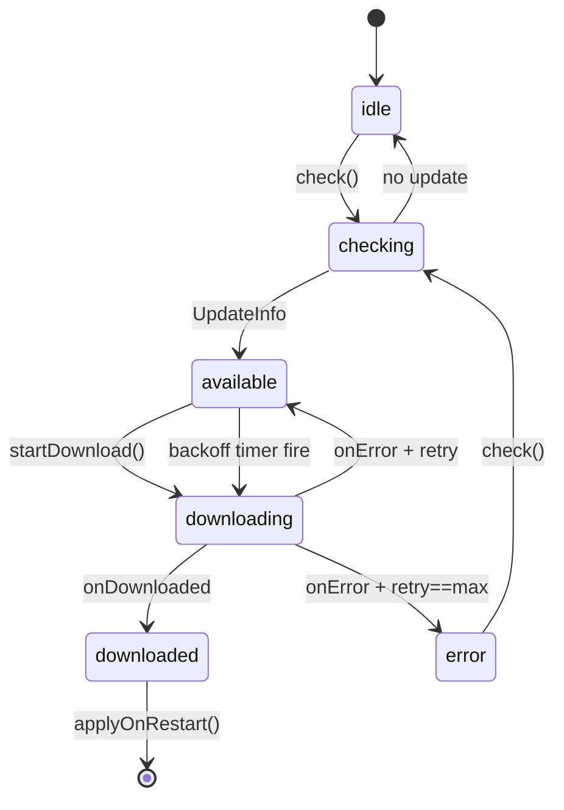

# 작업내역 — WIN-071 electron-updater 통합 (GitHub Releases / private feed)

본 문서는 Phase 8 첫 티켓 WIN-071 의 종료 보고서이다. SSOT 티켓 정의는
[change-winapp-phase8-tickets.md](../change-winapp-phase8-tickets.md) 참조.

## 1. 식별

- 티켓: WIN-071 / Phase 8 / Infra (배포)
- 선행: WIN-019 (NSIS 산출), WIN-041 (config 저장소)
- 우선순위: P0, 실행순서: 1번째 (Phase 8 인프라 토대)
- Taiga: Sprint SP-08 / Epic EP-02 / US-71

## 2. 목표

`electron-updater` 위에 좁은 추상화(`UpdaterAdapter`) + 자체 상태 머신
(`UpdaterService`) 을 얹어 다음을 달성한다.

1. 부트 후 1회 + 6시간 주기 백그라운드 업데이트 확인.
2. 신규 발견 시 자동 다운로드 → 진행률 발행 → 사용자 트리거 시 재시작 적용.
3. `electron-updater` 미설치/`provider='none'` 환경에서도 IPC 가 안전한 idle 응답을
   유지 (옵셔널 의존, 빌드/테스트 영향 0).
4. 다운로드 실패 시 1s/2s/4s exponential backoff, 최대 3회 재시도.
5. 모든 보안 제약 (https 강제, 사용자 입력 미수용, env 강제 비활성) 을 단위 테스트로
   회귀 보호.

## 3. 구현 요약

### 3.1 신규 모듈 (`desktop/main/updater/`)

| 파일 | 책임 |
| --- | --- |
| [types.ts](../../../desktop/main/updater/types.ts) | `UpdaterState` union / `UpdaterProvider` / `UpdateInfo` / `UpdateProgressDetail` / `UpdaterStatus` / `UpdaterAdapter` 인터페이스 / `UpdaterRuntimeConfig` |
| [config.ts](../../../desktop/main/updater/config.ts) | `parseUpdaterConfig({env?, configBlock?})` — env > config > github 우선순위, generic https 강제, intervalMs 클램프(5분..24h), channel 검증 |
| [null-adapter.ts](../../../desktop/main/updater/null-adapter.ts) | `NullUpdaterAdapter` — provider='none' / electron-updater 미설치 시 fallback. 모든 메서드 no-op |
| [updater.ts](../../../desktop/main/updater/updater.ts) | `UpdaterService` — 상태 머신 / 자동 다운로드 / exp backoff / publishProgress 콜백 / start/dispose |
| [electron-updater-adapter.ts](../../../desktop/main/updater/electron-updater-adapter.ts) | `createElectronUpdaterAdapter(cfg)` — `new Function('m','return import(m)')` 로 동적 import (TS module resolution 우회). 실패 시 NullUpdaterAdapter 폴백 |

상태 머신 다이어그램:



### 3.2 IPC 와이어링 (`desktop/ipc/commands.ts`)

- `allowedCommands` 28 → 31 (`update_check`, `update_status`, `update_apply_on_restart`).
- `UpdaterBackend` 인터페이스 + `setUpdaterBackend`/`getUpdaterBackend` 모듈 후크.
- `UpdateNoArgsSchema = z.array(z.string()).max(0)` — 3종 모두 args 빈 배열 강제.
- 세 switch case: backend 미초기화 시 `update_check`/`update_status` 는 `disabled:true` +
  `idle` 폴백, `update_apply_on_restart` 는 `ok:false` + reason 반환. backend 존재 시
  메서드 위임 결과를 spread.

### 3.3 부트스트랩 (`desktop/main/index.ts`)

`bootstrapUpdater()` 가 `app.whenReady()` 의 마지막 단계로 추가됨.

1. `configStore.getAll().updater` 블록 + `process.env` → `parseUpdaterConfig`.
2. provider='none' 이면 `setUpdaterBackend(null)` 후 종료.
3. `createElectronUpdaterAdapter(cfg)` 동적 로드 (실패 시 자동 NullUpdaterAdapter).
4. `UpdaterService` 인스턴스화 + `publishProgress` 콜백으로 EventBus 의
   `command.progress` 채널(`commandId='updater'`) 발행.
5. `setUpdaterBackend({check, getStatus, applyOnRestart})` + `service.start()`.

진행률 페이로드 형태(JSON 문자열로 `CommandProgressDetail.chunk` 에 인코딩):

```json
{"state":"downloading","version":"1.2.3","percent":42,"transferred":1024,"total":2048,"bytesPerSecond":51200}
```

### 3.4 패키징 / 배포

- [electron-builder.yml](../../../electron-builder.yml) — `publish:` 섹션 추가
  (`provider: github`, `owner: Yeachan-Heo`, `repo: oh-my-codex`,
  `publishAutoUpdate: true`, `releaseType: release`).
- [package.json](../../../package.json) — `desktop:publish` 스크립트 +
  `optionalDependencies.electron-updater: ^6.3.9` + 게이트에 `updater.test.js` 추가.
- [.github/workflows/desktop-publish.yml](../../../.github/workflows/desktop-publish.yml) —
  `workflow_dispatch` 전용 stub. WIN-073 에서 signtool 단계 확장 예정.

## 4. 검증

### 4.1 빌드

`npm run build:desktop` — tsc 청결 + copy-assets 정상.

### 4.2 게이트

`npm run test:phase2:common:compiled` 결과:

| 지표 | 베이스라인(W064 종료) | 현재 | 증분 |
| --- | --- | --- | --- |
| tests | 249 | 252 | +3 |
| pass | 190 | 193 | +3 |
| fail | 0 | 0 | 0 |
| skipped | 59 | 59 | 0 |

> node:test 의 top-level 집계 기준. 실제 신규 leaf 테스트는 24건 (updater 15 +
> ipc-contract 9) 이며, 4개 상위 describe 블록으로 묶여 상위 카운트 +3 으로 잡힘.

### 4.3 신규 회귀 커버리지

- `parseUpdaterConfig` — 기본값 / env=none / env 우선 / generic+http → 폴백 /
  generic+https 수용 / intervalMs 클램프(3 case) / 알려지지 않은 channel 폴백.
- `isHttpsUrl` — https / http / file / 빈문자 / undefined / 비-URL.
- `NullUpdaterAdapter` — 모든 메서드 no-op + 구독 함수 반환.
- `UpdaterService`:
  - provider='none' check 폴백.
  - 해피패스 — check → available → downloading(42%) → downloaded(100%) +
    publishProgress 4개 상태 모두 발행.
  - `applyOnRestart` 'downloaded' 가드 (외 상태 ok=false, quitAndInstall 미호출).
  - exponential backoff 4사이클 (1s/2s/4s 타이머, 최대 3회 후 state='error').
  - `dispose()` 후 타이머 0 + 이벤트 발화 상태 무영향.
  - `autoCheck=false` + `start()` no-op.
  - downloading 중 재 `check()` — 현재 스냅샷 반환, `checkForUpdates` 추가 호출 안 함.
- IPC `update_*` — backend 없음 폴백 3 + mock backend 위임 3 + arg 검증 거부 3.

### 4.4 보안 회귀

- generic + http/file/data URL 거부 + 자동 'none' 폴백.
- intervalMs DoS 방어 (5분 미만 거부).
- env `OMX_DESKTOP_UPDATE_PROVIDER=none` 강제 비활성.
- 모든 update_* IPC args 빈 배열 강제 (토큰/경로 등 사용자 입력 미수용).
- `applyOnRestart` state='downloaded' 가드.
- electron-updater 모듈 미설치 시 자동 NullUpdaterAdapter 폴백.

## 5. 문서 / 정합성 반영

- [winapp-manual-v2.md](../winapp-manual-v2.md) — §9 배포 / 업데이트 / 진단 신설
  + §9.1 자동 업데이트(WIN-071). 기존 §9 참고 섹션은 §10 으로 재배치.
- [change-winapp-phase8-tickets.md](../change-winapp-phase8-tickets.md) —
  WIN-071 체크리스트 6/6 [x], Taiga 라인 'register-w071.ps1 실행 (SP-08/EP-02)' 갱신.
- [scripts/register-w071.ps1](../scripts/register-w071.ps1) — SP-08 신규 생성 +
  EP-02 재사용 + US-71 + 3 task POST + description PATCH (BOM-free UTF-8).

## 6. 후속 작업

- WIN-072 — Update channel + 부분 롤아웃. WIN-071 인프라 위에 channel 분기 + UI
  Settings 패널 추가.
- WIN-073 — Windows 코드서명. `signtoolOptions` + `sign-windows.ps1` + release.yml
  서명 단계. WIN-071 의 `desktop-publish.yml` stub 을 확장.
- WIN-074 — First-run wizard. WIN-041/053/071/072 의 토대 위에 자동 업데이트
  on/off + 채널 선택 UI 단계 포함.

## 7. Taiga 등록

`winapp만들기/stage2/scripts/register-w071.ps1` 실행 결과 (실측):

- Sprint : SP-08 (신규 생성)
- Epic : EP-02 (id=9 재사용)
- US-71 : 등록 + Epic link
- Task `[WIN-071] 구현 작업` / `검증 작업` / `문서/정합성 반영` 3건 + description PATCH

## 변경 파일 요약

- 신규 9:
  - [desktop/main/updater/types.ts](../../../desktop/main/updater/types.ts)
  - [desktop/main/updater/config.ts](../../../desktop/main/updater/config.ts)
  - [desktop/main/updater/null-adapter.ts](../../../desktop/main/updater/null-adapter.ts)
  - [desktop/main/updater/updater.ts](../../../desktop/main/updater/updater.ts)
  - [desktop/main/updater/electron-updater-adapter.ts](../../../desktop/main/updater/electron-updater-adapter.ts)
  - [desktop/__tests__/updater.test.ts](../../../desktop/__tests__/updater.test.ts)
  - [.github/workflows/desktop-publish.yml](../../../.github/workflows/desktop-publish.yml)
  - [winapp만들기/stage2/scripts/register-w071.ps1](../scripts/register-w071.ps1)
  - 본 문서
- 수정 7:
  - [desktop/ipc/commands.ts](../../../desktop/ipc/commands.ts)
  - [desktop/main/index.ts](../../../desktop/main/index.ts)
  - [electron-builder.yml](../../../electron-builder.yml)
  - [package.json](../../../package.json)
  - [desktop/__tests__/ipc-contract.test.ts](../../../desktop/__tests__/ipc-contract.test.ts)
  - [winapp만들기/stage2/winapp-manual-v2.md](../winapp-manual-v2.md)
  - [winapp만들기/stage2/change-winapp-phase8-tickets.md](../change-winapp-phase8-tickets.md)
