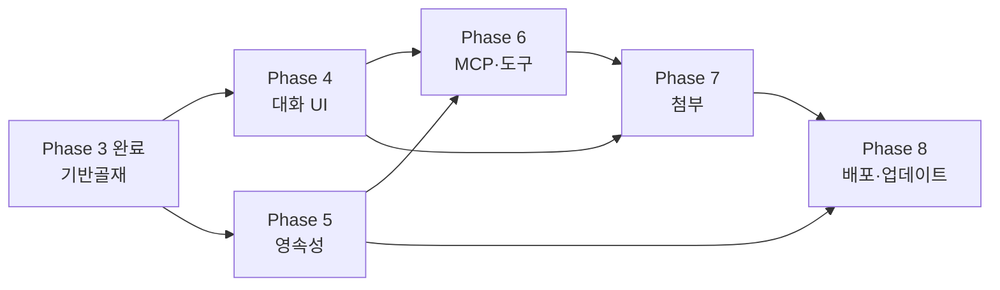

# oh-my-codex Windows 앱 — Claude Desktop 대비 갭 분석 및 향후 로드맵

작성일: 2026-05-23 · Phase 3 (WIN-021~WIN-023) 종료 시점 기준
참고:
- [change-winapp-phase1-분석.md](change-winapp-phase1-분석.md) (P0/P1/P2 분류 원전)
- [winapp-manual.md](winapp-manual.md) (현재 구현 사용설명서)
- [change-winapp-phase2-gate.md](change-winapp-phase2-gate.md), [change-winapp-phase3-tickets.md](change-winapp-phase3-tickets.md)

---

## 1. 원래 목표 — "Claude Desktop 유사 앱"

본 프로젝트의 출발점은 **Claude Desktop 스타일** 의 Windows 데스크톱 앱이었다.
여기서 "Claude Desktop 스타일" 이란 본 저장소에서 다음 7가지 특성을 의미한다.

| # | 특성 | 의도 |
|---|---|---|
| C1 | **설치형 단일 `.exe`** — 사용자가 zip 압축해제·CLI 빌드 없이 NSIS 설치만으로 실행 | 비개발자 운영자도 사용 가능 |
| C2 | **자연어 대화 중심 UI** — 좌측 대화 목록 + 중앙 채팅 영역 + 우측 컨텍스트 패널 | 명령어 암기 불필요 |
| C3 | **로컬 도구 호출(MCP)** — 외부 도구·MCP 서버를 안전한 권한 모델로 호출 | 파일 시스템·검색·외부 API 통합 |
| C4 | **첨부/드래그-앤-드롭** — 파일·이미지·코드 조각을 끌어놓아 컨텍스트 주입 | 입력 마찰 최소화 |
| C5 | **세션/대화 영속성** — 종료해도 대화·설정이 `%APPDATA%` 에 보존, 재시작 시 복원 | 일상 도구화 |
| C6 | **자동 업데이트** — 백그라운드 다운로드 + 재시작 시 적용, 코드서명 포함 | 비개발자 배포 안전성 |
| C7 | **권한·보안 UX** — 도구 호출 시 명시적 동의 다이얼로그, 거부/허용 기록 | 외부 부작용을 사용자가 통제 |

## 2. 현재 구현 — 무엇이 되어 있나 (Phase 3 종료)

본 앱은 위 7가지 중 **C1 의 부분 충족 + 보안/IPC 기반골재** 까지 진행되었고,
대화 UI·MCP·첨부·영속·자동 업데이트는 **아직 없다**.

| 영역 | 구현 상태 | 핵심 산출물 |
|---|---|---|
| Electron 3-프로세스 셸 | ✅ Main / Preload / Renderer 분리 + `contextIsolation:true` + `nodeIntegration:false` | [desktop/main/](../../desktop/main/), [desktop/preload/](../../desktop/preload/), [desktop/renderer/](../../desktop/renderer/) |
| IPC 명령 게이트웨이 | ✅ 15종 화이트리스트 + 명령별 zod 검증 + EventBus 페어(`started`/`completed`/`failed`) | [desktop/ipc/commands.ts](../../desktop/ipc/commands.ts) |
| Transport 추상화 | ✅ `WorkerTransport` + `LocalProcessTransport`(allowedCommands/allowedCwdRoots/envAllowList) + tmux 격리 | [src/core/local-process-transport.ts](../../src/core/local-process-transport.ts) |
| 명령 입력/히스토리/Question 모달 | ✅ 입력 패널, 50건 ring buffer, 모달 브로커 | WIN-014, WIN-015 |
| HUD/Sidecar 패널 | ✅ ViewModel 기반, ANSI 비의존 | WIN-016, WIN-017 |
| 외부 CLI 트리거(omx_*) | ✅ 3종 + `process.execPath` 고정 + 고정 인자 매트릭스 + 30s 워치독 + 8KB 절단 + `OMX_DESKTOP_ALLOW_EXEC` 스위치 | WIN-023 |
| NSIS 설치형 `.exe` | ⚠️ 빌드 성공 (Windows 개발자 모드 필요), 코드서명·자동업데이트 미적용 | WIN-019 |
| 회귀 테스트 OS 프로파일 분리 | ✅ `test:phase2:windows:compiled` 19+1 | WIN-018 |
| Phase 게이트 문서화 | ✅ Phase 1/2 게이트, Phase 3 티켓 정리 | WIN-020 |

## 3. 갭 분석 — Claude Desktop 7대 특성 대비

| # | 특성 | 현재 상태 | 갭 요약 |
|---|---|---|---|
| C1 | 설치형 `.exe` | ⚠️ 부분 충족 | NSIS 산출은 가능하지만 (a) Authenticode 코드서명 미적용, (b) 사용자 친화적 설치 마법사 UX(언어 선택·바로가기 옵션) 미정리, (c) 첫 실행 마법사 없음 |
| C2 | 자연어 대화 UI | ❌ 없음 | 현재 UI 는 "명령 + args" 입력 패널 — 명령어 화이트리스트(15종) 를 사용자가 알고 있어야 함. 좌측 대화 목록 / 채팅 버블 / 스트리밍 응답 UI 부재 |
| C3 | 로컬 도구(MCP) 호출 | ❌ 없음 | `LocalProcessTransport`/`omx_*` 가 토대지만 (a) MCP 클라이언트 미구현, (b) 도구 매니페스트/카탈로그 UI 없음, (c) 도구별 권한 모델 없음 |
| C4 | 첨부/드래그-앤-드롭 | ❌ 없음 | Renderer 가 파일 드롭 핸들러를 구현하지 않음. IPC 도 binary/path 안전 전송 채널 없음 |
| C5 | 세션/대화 영속성 | ❌ 없음 | `%APPDATA%/oh-my-codex/` 저장 경로 미정의, 히스토리는 in-memory ring buffer 50건만 유지 → 앱 재시작 시 휘발 |
| C6 | 자동 업데이트 | ❌ 없음 | electron-updater / 업데이트 채널(stable/beta) / private feed or GitHub Releases 통합 미적용 |
| C7 | 권한·보안 UX | ⚠️ 정책만 존재 | `allowedCommands` / `OMX_DESKTOP_ALLOW_EXEC` / `omxCliMatrix` 같은 **코드 레벨** 정책은 있으나, 사용자 동의 다이얼로그·허용/거부 이력 UI 없음 |

**총평**: 본 앱은 Claude Desktop 의 **"보안 기반골재"** 단계까지 도달했다.
도메인 코어 + IPC + Transport + 외부 CLI 트리거의 4계층이 안전하게 분리되어 있어,
대화 UI / MCP / 첨부 / 영속 / 업데이트 / 권한 UX 5개 축은 **부가 기능**으로 위에 얹을 수 있다.
즉 **잘못 만든 것이 아니라 1/3 정도 만든 것** 이며, 나머지 2/3 가 사용자가 인식하는 "Claude Desktop 다움" 이다.

## 4. 다음 단계 로드맵 (Phase 4 ~ Phase 6 제안)

### Phase 4 — 대화 UI 셸 (가장 큰 사용자 체감 변화)
**목표**: 명령 패널 → 채팅 UI 로 1차 전환. 기존 15종 명령은 "도구(tool)" 로 흡수.

> ⚠️ **선행 필수 — WIN-030**: 본 Phase 의 채팅 UI(WIN-031~034) 는 TUI/색상/raw-input 을 지원하는 워커 transport 가 있어야 사용자가 기대하는 "터미널이 살아 있는" 경험을 제공한다. 따라서 [stage2-win12-tmux대체구현.md §4.2 옵션 B (node-pty)](stage2-win12-tmux대체구현.md#42-옵션-b-node-pty-2차-확장-후보) 를 WIN-030 으로 격상하여 **WIN-031 보다 먼저** 진행한다.

- **WIN-030 `PtyLocalTransport` 도입 (node-pty / 옵션 B, WIN-031 선행)** — Phase 2 WIN-012 의 옵션 A(`child_process.spawn`, non-TTY)를 보완.
   - 신규 `src/core/pty-local-transport.ts` — `node-pty.spawn` 기반 `WorkerTransport` 구현
   - 의존성 추가: `node-pty` + Electron ABI 매칭(`@electron/rebuild`), prebuilt x64/arm64 양쪽 electron-builder 처리
   - `WorkerTransport` 확장 인터페이스에 `resize(cols, rows)` 노출
   - `desktop/main/index.ts` 에서 capability 기반 선택(PTY 가능 시 PTY, 아니면 LocalProcess fallback)
   - 보안: 기존 `allowedCommands`/`allowedCwdRoots`/`envAllowList`/30s 워치독/8KB 절단 정책 그대로 승계
   - 회귀: ipc-contract 19 + Pty 전용 smoke (TUI 워커 1종 기동 → 색상/리사이즈/raw-input 검증)
   - 산출물 예: [stage2-win12-tmux대체구현.md §5.2 2단계](stage2-win12-tmux대체구현.md#52-2단계-별도-후속-티켓-필요-시-ptylocaltransport-옵션-b) 의 책임 5항목 그대로
   - 완료 기준: claude-code / codex 같은 TUI 워커가 Renderer 의 `xterm.js` 위에서 깨지지 않고 동작
- WIN-031 채팅 영역 ViewModel (메시지 버블, 스트리밍 텍스트, 마크다운/코드 렌더) — **WIN-030 의 PTY 출력 채널을 채팅 버블 스트림으로 흡수**
- WIN-032 좌측 세션 목록 + 신규/삭제/이름변경 (영속은 Phase 5 에서)
- WIN-033 슬래시 명령(`/hud`, `/omx doctor`) → 기존 IPC 명령으로 매핑 (자연어 1차 진입점)
- WIN-034 응답 스트리밍 채널 — 기존 `command.progress` + WIN-030 `onData` 이벤트를 채팅 버블 토큰 추가에 사용
- 회귀: ipc-contract 19 + 신규 5 (채팅 라우터 zod 검증) + WIN-030 PTY smoke

> 비채택 fallback: WIN-030 의 `node-pty` 네이티브 빌드가 패키징 환경에서 실패 시, [stage2-win12-tmux대체구현.md §5.2](stage2-win12-tmux대체구현.md#52-2단계-별도-후속-티켓-필요-시-ptylocaltransport-옵션-b) 비채택 대안대로 TUI 워커는 `--print`/`-p` non-TTY 모드로 우회하고 WIN-031 을 옵션 A 위에서 착수한다.

### Phase 5 — 영속성 + 설정 저장소
**목표**: 앱 종료/재시작에도 대화·설정 유지. `%APPDATA%/oh-my-codex/` 표준화.

- WIN-041 설정 저장소 (`config.json`) + 마이그레이션 훅
- WIN-042 세션/대화 SQLite (better-sqlite3) — 메시지·도구 호출 로그 저장
- WIN-043 명령 히스토리 ring buffer → SQLite 백엔드 (Phase 3 의 in-memory 50건 대체)
- WIN-044 기존 `.omx/state/*` 와의 호환 어댑터 (CLI 와 같은 상태 파일 공유)
- 보안: `allowedCwdRoots` 에 `%APPDATA%/oh-my-codex/` 자동 등록

### Phase 6 — 도구(Tool) 호출 + MCP 클라이언트
**목표**: 외부 도구를 권한 모델 아래에서 호출. `omx_*` 의 일반화.

- WIN-051 MCP 클라이언트 (stdio transport, 서버 매니페스트 로드)
- WIN-052 도구 카탈로그 UI (좌측/우측 패널) + 활성/비활성 토글
- WIN-053 도구 호출 권한 다이얼로그 (1회/세션/영구 허용) — Question 모달 재사용
- WIN-054 도구 호출 이력 패널 — `command.started`/`completed`/`failed` 페어를 도구 호출 로그로 일반화
- 보안: 도구별 cwd/env allowlist, 호출 인자 zod 스키마, 결과 stdout 절단(omx_* 8KB 정책 재사용)

### Phase 7 — 첨부/드래그-앤-드롭 + 멀티모달
**목표**: 파일·이미지·코드 조각을 드롭으로 컨텍스트 주입.

- WIN-061 Renderer 드롭 영역 + 파일 메타데이터(name/size/mime) 추출
- WIN-062 IPC 안전 전송 — 임시 디렉터리 복사 후 path-only 전달 (binary blob 전송 금지)
- WIN-063 이미지/PDF/텍스트 프리뷰
- WIN-064 채팅 메시지 첨부 슬롯 — 도구 호출 시 첨부 path 를 인자로 전달

### Phase 8 — 배포·자동업데이트·코드서명
**목표**: 비개발자에게 안전하게 배포.

- WIN-071 electron-updater 통합 (GitHub Releases or private feed)
- WIN-072 업데이트 채널 (stable/beta) + UI 토글
- WIN-073 Authenticode 코드서명 (EV 또는 OV 인증서)
- WIN-074 첫 실행 마법사 (작업 디렉터리·기본 설정·옵트인 텔레메트리)
- WIN-075 진단 번들 내보내기 (`main.log`/`renderer.log`/`config.json` 압축)

## 5. 단계 간 의존성

권장 동시 진행: **Phase 4 와 Phase 5 는 병렬 진행 가능** (UI 셸과 저장소가 거의 독립).
Phase 6 (MCP) 은 Phase 4+5 가 모두 안정화된 후 착수해야 도구 호출 이력의 저장 경로가 명확해진다.

## 6. 위험 요소 및 결정 필요 항목

| 항목 | 결정 필요 | 비고 |
|---|---|---|
| LLM 추론 엔진 | 로컬(llama.cpp 등) vs 원격 API vs 양쪽 모두 | 본 저장소는 CLI 단계에서 외부 모델 호출이 도메인 코어에 내장되어 있지 않음 — 어디서 LLM 을 호출할지 결정 필요 |
| 대화 저장 포맷 | SQLite vs JSONL vs `.omx/state` 확장 | CLI 와의 호환을 깰지 여부 |
| MCP 표준 채택 시점 | Phase 6 일괄 vs Phase 4 에서 슬래시 명령부터 부분 채택 | 도구 매니페스트 스키마 동결 시점 |
| 코드서명 비용 | EV 인증서(연 ~$300+) vs unsigned + Defender 우회 안내 | 비개발자 배포 시 필수, 사내 한정이면 보류 가능 |
| 업데이트 인프라 | GitHub Releases (공개) vs 사내 S3/MinIO (비공개) | 라이선스/공개 범위 결정 |
| MCP 권한 모델 UX | 1회/세션/영구 허용 3단계 vs 단순 on/off | UX 복잡도 vs 안전성 trade-off |

## 7. 결론

- 본 앱은 Claude Desktop 의 **외형(대화 UI·MCP·첨부·영속·자동 업데이트·권한 UX)** 이 아닌
  **내부 골격(IPC 보안 경계·Transport 추상·외부 프로세스 인젝션 방어)** 부터 우선 구축한 결과물이다.
- 이는 분석서가 정한 **"보안 설정 선적용"** 원칙(P0 우선)에 부합하며,
  뒤집어 말하면 사용자 체감 UX 는 **Phase 4 (대화 UI)** 가 들어오기 전까지는 Claude Desktop 과 본질적으로 다르게 보인다.
- 우선 권장: **Phase 4 + Phase 5 병렬 착수** → Phase 6 (MCP) → Phase 7 (첨부) → Phase 8 (배포 강화).
- 이미 갖춘 자산(`allowedCommands`/`omxCliMatrix`/`EventBus`/`question_ask`)을 Phase 6 권한 다이얼로그·도구 라우터에 재사용하면 중복 구현을 피할 수 있다.
