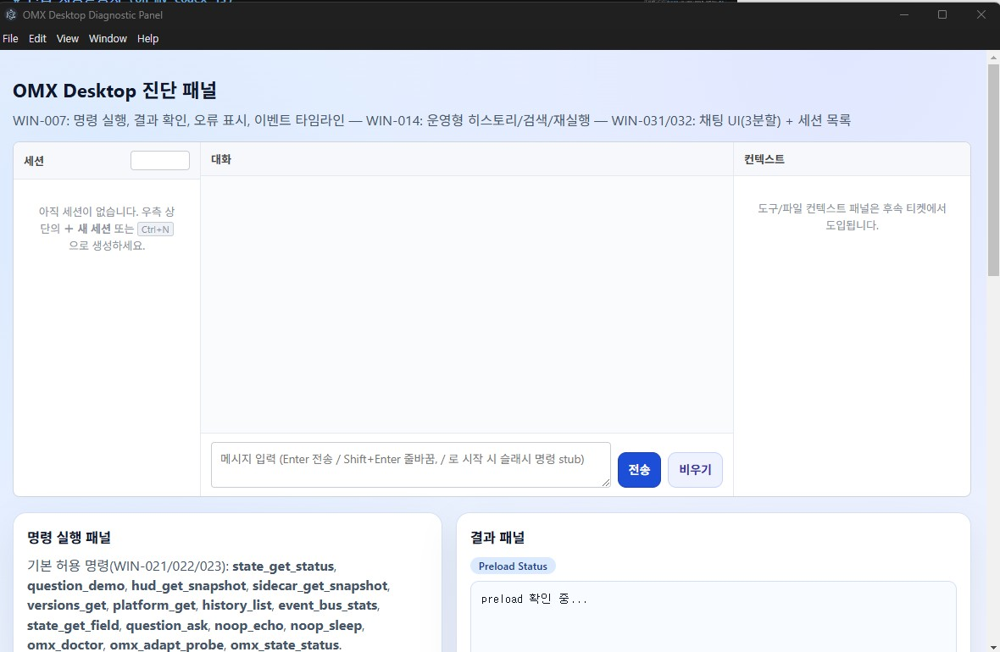

# 윈앱 사용설명서 (oh-my-codex-js)

이 문서는 Windows 환경에서 oh-my-codex-js 데스크톱 앱(Electron 기반)을 실행하고
기본 동작을 확인하는 절차를 설명한다. Phase 2 완료(2026-05-23) 기준으로
명령 히스토리·Question 모달·HUD·Sidecar 패널과 설치형 패키징(NSIS)이 포함되어 있다.

관련 게이트 문서:
- Phase 1 게이트: `winapp만들기/stage1/change-winapp-phase1-gate.md`
- Phase 2 게이트: `winapp만들기/stage1/change-winapp-phase2-gate.md`

---

## 정의

**oh-my-codex Windows 데스크톱 앱** (`oh-my-codex-js`, 이하 "본 앱") 은 기존 `oh-my-codex-js` CLI 의 도메인 코어(팀 오케스트레이션 · HUD · Sidecar · Question 루프) 를 그대로 재사용하면서, **Claude Desktop 스타일의 설치형 Windows 앱** 으로 노출하는 Electron 기반 어댑터 산출물이다.

- **아키텍처**: Electron 3-프로세스(Main / Preload / Renderer) + `desktop/ipc/` IPC 계약 계층. Renderer 는 `contextIsolation:true` + `nodeIntegration:false` 격리, preload 가 화이트리스트 API 만 노출.
- **도메인 코어 공유**: CLI 와 Desktop 이 동일한 `executeCommand({ command, args, context })` 를 호출한다. `process.exit*` 등 CLI 종속 동작은 CLI 어댑터에서만 처리.
- **OS 정책**: Windows 10/11 (x64) 1급 타깃. tmux/TTY 의존을 `LocalProcessTransport` / `PtyLocalTransport` (ConPTY) 로 대체하고, `TmuxTransport` 는 호환용으로 격리 유지.
- **보안 기본값**: 모든 IPC 가 `zod` 사전 검증, `allowedCommands` 화이트리스트, 외부 프로세스는 `process.execPath` + `omxCliMatrix` 고정 인자만 허용 (`OMX_DESKTOP_ALLOW_EXEC=0` 으로 차단 가능).
- **저장 표면**: 사용자 데이터는 `app.getPath('userData')` (Windows 기본 `%APPDATA%/oh-my-codex/`) 하위에 격리 저장 — `config.json` (v1) / `omx.sqlite` (Phase 5 이후) / `attachments/` / `diag/` / `first-run.json`.
- **stage2 범위**: 본 매뉴얼은 **Phase 1 ~ Phase 8 누적 산출물** 을 기술한다. 분석서 P0/P1/P2 항목이 모두 구현 완료된 시점이며, Phase 8 종료(2026-05-24) 의 게이트 베이스라인은 `tests=287 / pass=228 / fail=0 / skipped=59` 다.

상세 전환 근거와 파일 단위 변경 계획은 [change-winapp-phase1-분석.md](change-winapp-phase1-분석.md) 와 [stage2-roadmap-winapp.md](stage2-roadmap-winapp.md) 를 참조한다.

| 구분 | 기존 CLI | Windows 앱 (stage2) |
|---|---|---|
| 진입점 | `omx <subcommand>` | 설치된 `.exe` (NSIS) · `npm run desktop:dev` · `npm run desktop:start` |
| UI 컨테이너 | tmux pane / TTY | Electron 창 (대화 셸 + HUD + Sidecar + 도구 패널 + 첨부 컨텍스트) |
| 입력 모달 | readline 블로킹 | Renderer 모달 (`question_ask`, 슬래시 라우터, 첫 실행 마법사) |
| 출력 | `console.log` + ANSI | 구조화 IPC 이벤트 (`command.started/progress/completed/failed`) + 채팅 ViewModel |
| 영속 저장 | OS 셸 환경에 의존 | `ConfigStore` (v1 atomic write) + `SQLite` (history / tool_calls / permissions / attachments) |
| MCP / 도구 | (외부 통합) | MCP 서버 매니페스트 + 도구 카탈로그 + 권한 동의 + 호출 이력 |
| 첨부 | (없음) | 드롭/붙여넣기 → 안전 저장소 → 프리뷰 → 도구 인자 자동 주입 |
| 업데이트 | 수동 재설치 | 자동 업데이트 + 채널(stable/beta) + 코드서명 검증 + 진단 번들 공유 |
| 보안 경계 | OS 셸 | `contextIsolation:true` + `nodeIntegration:false` + preload allowlist + zod 입력 검증 + `OMX_DESKTOP_ALLOW_EXEC` 스위치 |

## 역할

### 1) 모노레포 안에서의 역할

`oh-my-codex-js` 모노레포에서 본 앱은 **CLI 와 동등한 1급 어댑터** 다. 도메인 코어(`src/team`, `src/hud`, `src/sidecar`, `src/question`, `src/cli/index.ts` 의 `executeCommand`) 는 양쪽 어댑터가 공유한다.

| 역할 | 위임 / 책임 | 비고 |
|---|---|---|
| **GUI 진입점** | Electron 창 표시 + 대화 셸 / HUD / Sidecar / 도구 / 첨부 패널 렌더 | tmux/TTY 대체 |
| **IPC 중재자** | Renderer 요청 → preload 화이트리스트 → Main `handleRunCommand` 라우팅 + zod 검증 | 보안 경계 단일화. 누적 IPC 명령 **37종** |
| **워커 트랜스포트 선택자** | Windows 기본 `LocalProcessTransport`, ANSI/TUI 호환 `PtyLocalTransport`(ConPTY, optional), 격리 `TmuxTransport` | OS 분기 단일 지점 (WIN-030) |
| **외부 CLI 트리거** | `omx_*` 그룹 (`omx_doctor`/`omx_adapt_probe`/`omx_state_status`) — `process.execPath` 고정, `omxCliMatrix` 고정 인자, 30s 워치독, 8KB 절단, allow-exec 스위치 | 인젝션 / 권한 상승 / 무한 hang 차단 |
| **영속 저장 관리자** | `<userData>/config.json` (`ConfigStore` v1) + `<userData>/omx.sqlite` (`SqliteStore` migrations 001~005) + `<userData>/attachments/` + `<userData>/diag/` + `<userData>/first-run.json` | atomic write, FK CASCADE, sha256 검증 |
| **업데이트 / 진단 운영자** | `electron-updater` 채널(`stable`/`beta`) + 코드서명 검증 + `diag_bundle_*` 진단 번들(zip + 마스킹 + sanity) | 자동 업로드 없음(수동 트리거만) |

### 2) 프로세스별 역할 (Electron 3-프로세스 모델)

| 프로세스 | 디렉터리 | 책임 | 보안 정책 |
|---|---|---|---|
| **Main** | `desktop/main/` | 앱 수명주기, 창 생성, IPC 디스패치(`desktop/ipc/commands.ts`), EventBus 게시, 명령 히스토리, 외부 프로세스 spawn, SQLite / ConfigStore / 첨부 / 업데이터 / 진단 번들 / 첫 실행 마법사 부트스트랩. | Node 전권 보유 — Renderer 가 직접 닿을 수 없음. |
| **Preload** | `desktop/preload/` | `contextBridge` 로 `window.omx.runCommand` / `subscribeEvents` / `requestQuestion` 같은 화이트리스트 API 만 노출. | `contextIsolation:true`, `nodeIntegration:false`. |
| **Renderer** | `desktop/renderer/` | HTML/CSS/TS UI — 대화 셸, 명령 입력, 히스토리, 결과/로그, HUD/Sidecar 패널, Question 모달, MCP/도구 카탈로그, 권한 다이얼로그, 첨부 dropzone / 프리뷰, 첫 실행 마법사. | preload 가 노출한 API 외 Node 호출 불가. innerHTML 미사용(DOM-light). |
| **IPC 계약** | `desktop/ipc/` | `commands.ts` (요청 계약 + zod + 핸들러 + Backend hook), `events.ts` (이벤트 타입), `event-bus.ts` (pub/sub), `question.ts` (모달 브로커). | 모든 채널 zod 사전 검증, 위반 시 `INVALID_REQUEST` + `command.failed` 페어 마감. |

### 3) 사용자 역할 (RACI 관점)

| 역할 | 본 앱 사용 방식 |
|---|---|
| **운영자 (Operator)** | 채팅 셸에서 슬래시 명령 / `omx_*` / `hud_*` / `sidecar_*` 실행, MCP 서버 등록 + 도구 권한 동의, 진단 번들 수집 후 공유. |
| **개발자 (Developer)** | `npm run desktop:dev` 로 빠른 반복, `npm run test:phase2:windows:compiled` 회귀로 PR 검증, MCP 매니페스트 / 도구 카탈로그 / 첨부 파이프라인 확장. |
| **릴리스 담당 (Releaser)** | `npm run desktop:package` 로 NSIS `.exe` 산출, 코드서명, GitHub Releases 발행 → 채널별 자동 업데이트 발사. |
| **보안 검토자 (Reviewer)** | preload allowlist · `allowedCommands` 37종 · `omxCliMatrix` · `OMX_DESKTOP_ALLOW_EXEC` · 첨부 sourcePath/sha256 검증 · 진단 번들 마스킹 + sanity · 첫 실행 마법사 작업 디렉터리 거부 규칙 감사. |

## 기능

stage2 의 누적 기능을 Phase 별로 정리한다. 각 항목의 "사용법" 컬럼은 본 문서 §4 ~ §9 의 절 번호를 가리킨다.

### 1) 코어 실행 / IPC 게이트웨이 (Phase 1)

| 기능 | 설명 | 구현 | 사용법 |
|---|---|---|---|
| 실행 코어 분리 | `executeCommand({ command, args, context })` 형태로 CLI / Desktop 공통 호출 경로 확보. `process.exit*` 는 CLI 어댑터만 처리. | WIN-011 | (내부) |
| IPC 게이트웨이 | Renderer → preload → Main 단방향 호출 + 응답. 허용 명령 `allowedCommands` 화이트리스트(누적 37종) + 명령별 zod 인자 검증. | WIN-013, WIN-021/022/023, WIN-051~054, WIN-061~064, WIN-071/072/074/075 | §4 ~ §9 |
| 실시간 이벤트 스트리밍 | Main → Renderer 방향 IPC 구독 채널 (`command.started`/`progress`/`completed`/`failed`). | WIN-013 | §4.6 |
| 보안 브리지(preload) | `contextIsolation:true`, `nodeIntegration:false`. preload 가 `window.omx.*` 화이트리스트 API 만 노출. | WIN-011, WIN-013 | (내부) |

### 2) Transport 추상화 (Phase 2 + WIN-030)

| 기능 | 설명 | 구현 | 사용법 |
|---|---|---|---|
| `WorkerTransport` 인터페이스 | 워커 실행 경로 추상화. `resize?(cols, rows)` 옵션 메서드로 PTY 계열 transport 확장. | WIN-011, WIN-030 | (내부) |
| `LocalProcessTransport` (옵션 A) | Windows 기본 fallback. `child_process.spawn` + `allowedCommands` / `allowedCwdRoots` / `envAllowList` / `killGracePeriodMs` 보안 옵션. | WIN-012 | (내부) |
| `PtyLocalTransport` (옵션 B) | ConPTY 기반. TUI/ANSI/raw input/`resize` 지원. `node-pty` 는 **optionalDependency** — 미설치 시 옵션 A 로 자동 fallback. `OMX_DESKTOP_FORCE_LOCAL_PROCESS=1` 로 강제 우회. | WIN-030 | (내부) |
| OS 회귀 프로파일 분리 | Windows / Linux / common 게이트 npm script 분리. `test:phase2:common:compiled` / `test:phase2:windows:compiled` / `test:phase2:linux:compiled`. | WIN-018, WIN-030 | §5 |

### 3) 운영형 UI 셸 + 진단 명령군 (Phase 2 ~ Phase 3)

| 기능 | 설명 | 구현 | 사용법 |
|---|---|---|---|
| Electron 데스크탑 셸 | `desktop/main/`, `desktop/preload/`, `desktop/renderer/`, `desktop/ipc/` 4-디렉토리 구조. | (전반) | §3.1 ~ §3.2 |
| 명령 입력 / 히스토리 / 검색 | 명령 + 인자(최대 10개, 각 200자). Main 측 in-memory ring buffer 50건 + 키워드 필터. | WIN-014, WIN-021(`history_list`) | §4.1 ~ §4.2 |
| Question 모달 | CLI readline 블로킹을 모달로 대체. 모달 표시 중 입력 비활성. | WIN-015 | §4.3 |
| HUD / Sidecar 패널 | `.codex/` 기반 실시간 상태 + 보조 워커 출력 누적. 자동 스크롤 + 일시정지. | WIN-016, WIN-017, WIN-021 | §4.4 ~ §4.5 |
| 진단 명령군 A / B / C | Group A 무인자(6) + Group B parameterized(4) + Group C omx CLI 트리거(3, `process.execPath` + 고정 인자 + 30s 워치독 + 8KB 절단 + `OMX_DESKTOP_ALLOW_EXEC` 스위치). | WIN-021, WIN-022, WIN-023 | §4.7 ~ §4.9 |

### 4) 대화 셸 / 슬래시 / 세션 (Phase 4)

| 기능 | 설명 | 구현 | 사용법 |
|---|---|---|---|
| 채팅 ViewModel + ring buffer | role 별(`user`/`assistant`/`tool`/`system`) 메시지 누적, 스트리밍 lifecycle, onChange 이벤트, 메시지 한도 보호. | WIN-031 ~ WIN-035 | §4 / §7 / §8 |
| 슬래시 라우터 | 입력창의 `/<command>` 를 IPC 명령 + 인자로 변환. 미허용 명령 차단. | (Phase 4) | §4.1 |
| 세션 저장소 | 세션 단위 history 직렬화 / 재로드. | (Phase 4) | §4.2 |
| Markdown 안전 렌더 | inline code / fenced code / 헤딩 / 안전 URL(`http`/`https`/`mailto`) 만 허용. `<script>` / `` / raw HTML escape. | (Phase 4) | §4.6 |

### 5) 영속 저장 — ConfigStore / SQLite (Phase 5)

| 기능 | 설명 | 구현 | 사용법 |
|---|---|---|---|
| `ConfigStore` v1 | `<userData>/config.json` atomic write(tmp+rename). 스키마 검증 / 마이그레이션 / 백업 + 기본값 복원. | WIN-041 | §4 / §9.5 |
| `SqliteStore` | `<userData>/omx.sqlite` better-sqlite3, migrations 001~005 (init / command_history / tool_permissions / tool_calls_v2 / attachments). 미설치 시 Phase 4 이전 동작으로 폴백. | WIN-042 | (내부) |
| `CommandHistoryRepo` | 명령 히스토리 + 인자 마스킹 + LRU 한도 + 시간 범위 검색 + injection 방어 prepared statement. | WIN-043 | §4.2 / §9.5 |

### 6) MCP / 도구 카탈로그 / 권한 (Phase 6)

| 기능 | 설명 | 구현 | 사용법 |
|---|---|---|---|
| MCP 서버 등록 | 매니페스트 검증 + `WorkerTransport` 결합 + 헬스 스냅샷 + backoff. | WIN-051 | §7.1 |
| 도구 카탈로그 UI | 등록된 도구 목록 + 입력 스키마 / 호출 버튼 / 권한 상태 뱃지. | WIN-052 | §7.2 |
| 권한 동의 UX | 도구 호출 전 권한 다이얼로그 — 1회 / 세션 / 영구 옵션 + 거부 사유 안내. `tool_permissions` 영속화. | WIN-053 | §7.3 |
| 호출 이력 패널 | `tool_calls_v2` dump + 인자 / 결과 / 권한 결정 / 첨부 표시. | WIN-054 | §7.4 |

### 7) 첨부 / 멀티모달 (Phase 7)

| 기능 | 설명 | 구현 | 사용법 |
|---|---|---|---|
| 드롭 / 붙여넣기 | 채팅 영역에 파일 드래그 또는 클립보드 이미지 붙여넣기 → 미확정 첨부 칩. | WIN-061 | §8.1 |
| 안전 저장소 | sourcePath(절대 경로) 우선 + base64 폴백 5MB 상한. binary 가 IPC 페이로드로 전달되지 않음. sha256 검증 + UUID 디렉터리. | WIN-062 | §8.2 |
| 프리뷰 | 이미지 / PDF / 텍스트 인라인 프리뷰(`#attachment-preview`). | WIN-063 | §8.3 |
| 도구 인자 자동 주입 | 메시지 전송 시 `attachment_link_message(id, messageId)` 로 확정, tool-router 가 권한 다이얼로그 + 호출 이력에 `attachments (N): …` 행 추가. FK `ON DELETE CASCADE`. | WIN-064 | §8.4 |

### 8) 배포 · 업데이트 · 진단 (Phase 2 + Phase 8)

| 기능 | 설명 | 구현 | 사용법 |
|---|---|---|---|
| 설치형 NSIS `.exe` | `electron-builder` 패키징. winCodeSign 캐시 macOS .dylib 심링크 추출을 위해 Windows 개발자 모드 필요. | WIN-019 | §3.4 |
| 자동 업데이트 | `electron-updater` 통합 + `update_*` IPC. 백오프 / 진행률 / 사용자 확인. | WIN-071 | §9.1 |
| 업데이트 채널 | `stable` / `beta` 채널 분리. ConfigStore `updater.channel` 영속화 + `update_channel_*` IPC. | WIN-072 | §9.2 |
| 코드서명 | electron-builder 서명 설정 + 환경변수 기반 키 주입 + 검증 스크립트. 운영지침 별도 문서. | WIN-073 | §9.3 / `codesign-운영지침.md` |
| 첫 실행 마법사 | 4단계 마법사(workspace / updates / telemetry / done). 시스템 디렉터리 / UNC / 드라이브 루트 / 상대 경로 거부. 텔레메트리 화이트리스트(`appVersion` / `os` / `commandCount`) + 명시 옵트인. | WIN-074 | §9.4 |
| 진단 번들 | `diag_bundle_create` / `diag_bundle_open_folder` IPC. STORED zip 8 entry + 5 카테고리 마스킹 + sanity 재스캔(`BundleSanityError`). 첨부 본문 미포함 / 자동 업로드 없음. | WIN-075 | §9.5 |
| Phase 게이트 문서 | Phase 1 / 2 / 8 의 객관 완료 기준을 정리한 게이트 문서. | WIN-020, WIN-076 | §5.3 |
| 회귀 자동화 | Phase 1 IPC/CLI 계약 + Phase 2 OS 프로파일 + Phase 4~8 신규 모듈 회귀. 게이트 베이스라인 287/228/0/59. | WIN-018, WIN-020, WIN-075 | §5 |

## 설치

요약: ① Node 20 + npm 10 준비 → ② `npm ci` → ③ `npm run build:desktop` → ④ `npm run desktop:dev` 로 즉시 사용 가능. 운영 배포는 `npm run desktop:package` 로 NSIS `.exe` 산출.

| 단계 | 명령 / 절차 | 상세 |
|---|---|---|
| 1. 사전 요구 | Windows 10/11 (x64), Node.js ≥ 20, npm ≥ 10, Windows 개발자 모드 활성화 (NSIS 패키징 시 심링크 추출용) | [§1. 준비 사항](#1-준비-사항) |
| 2. 의존성 설치 | `npm ci` | 잠금 파일 기준 결정적 설치. `node-pty` 는 optional — 빌드 실패 시 자동 옵션 A fallback. |
| 3. 데스크톱 빌드 | `npm run build:desktop` | `tsc -p tsconfig.desktop.json` + `copy-assets.mjs` (renderer HTML/CSS / SQLite migrations 복사). |
| 4. 개발 모드 실행 | `npm run desktop:dev` | DevTools 자동 오픈. [§3.1](#31-개발-모드로-실행-권장) |
| 5. CLI 전체 빌드 검증 | `npm run build` | CLI / sidecar / desktop 모든 어댑터 컴파일. [§3.3](#33-cli-전체-빌드-확인) |
| 6. NSIS `.exe` 산출 | `npm run desktop:package` | electron-builder NSIS 설치 마법사. 출력 — `release/oh-my-codex-*.exe`. [§3.4](#34-설치형-exe-패키징-선택) |
| 7. 코드서명 적용 (운영) | [codesign-운영지침.md](codesign-운영지침.md) | WIN-073. EV 인증서 / 환경변수 키 주입 / SignTool 검증 절차. |

상세 절차는 본 문서 [§1. 준비 사항](#1-준비-사항) → [§2. 최초 1회 설치](#2-최초-1회-설치) → [§3. 윈앱 실행 명령어](#3-윈앱-실행-명령어) 를 순서대로 따른다.

## 사용법



요약: 앱 실행 → 첫 실행 마법사 4단계 → 채팅 셸에서 슬래시 명령 / 일반 IPC 명령 / MCP 도구 호출 / 첨부 드롭 / HUD·Sidecar 관찰. 진단 / 업데이트 / 채널 / 코드서명 / 진단 번들 운영은 §9.

| 시나리오 | 진입점 | 매뉴얼 절 |
|---|---|---|
| 첫 설치 후 초기 설정 | 첫 실행 마법사 (workspace → updates → telemetry → done) | [§9.4 첫 실행 마법사 (WIN-074)](#94-첫-실행-마법사-win-074) |
| 명령 실행 + 결과 확인 | 채팅 셸 입력란에 명령 입력 또는 슬래시 `/<command>` | [§4.1 기본 명령 실행](#41-기본-명령-실행) |
| 명령 히스토리 / 검색 | 좌측 히스토리 패널 + 즉시 필터 | [§4.2 명령 히스토리 (WIN-014)](#42-명령-히스토리-win-014) |
| Question 모달 | `question_ask` / `question_demo` 호출 시 자동 표시 | [§4.3 Question 모달 (WIN-015)](#43-question-모달-win-015) |
| HUD / Sidecar 상태 관찰 | 우측 패널 — 자동 스크롤 + 일시정지 | [§4.4](#44-hud-패널-win-016) / [§4.5](#45-sidecar-패널-win-017) |
| 실시간 이벤트 추적 | 결과 패널의 `command.started/progress/completed/failed` 스트림 | [§4.6 실시간 이벤트 스트리밍 (WIN-013)](#46-실시간-이벤트-스트리밍-win-013) |
| 진단 명령 (Group A/B/C) | 명령 패널 + omx CLI 트리거 3종 | [§4.7 ~ §4.9](#47-진단-명령군-a--무인자단순-인자-win-021) |
| MCP 서버 등록 / 도구 호출 | `#tool-catalog-mount` 카탈로그 + 권한 동의 다이얼로그 | [§7 도구 호출 / MCP](#7-도구-호출--mcp) |
| 첨부 (드롭 / 붙여넣기) | 채팅 영역에 파일 드래그 또는 클립보드 이미지 붙여넣기 | [§8 첨부 / 멀티모달](#8-첨부--멀티모달) |
| 자동 업데이트 / 채널 | `update_*` / `update_channel_*` IPC 또는 자동 알림 | [§9.1 ~ §9.2](#91-자동-업데이트-win-071) |
| 코드서명 검증 | 설치 후 `signtool verify /pa /v <path>.exe` | [§9.3 코드서명 (WIN-073)](#93-코드서명-win-073) |
| 진단 번들 수집 / 공유 | `diag_bundle_create` → `diag_bundle_open_folder` | [§9.5 진단 번들 (WIN-075)](#95-진단-번들-win-075) |
| 회귀 / 게이트 검증 | `npm run test:phase2:windows:compiled` (또는 common/linux) | [§5 회귀/계약 테스트 명령어](#5-회귀계약-테스트-명령어) |
| 트러블슈팅 | 자주 발생하는 6대 문제 + 해결 절차 | [§6 자주 발생하는 문제](#6-자주-발생하는-문제) |

> ℹ️ stage2 종료(Phase 8) 시점에 분석서 P0/P1/P2 항목이 모두 구현 완료되었다. 자동 업데이트 채널 · 코드서명 · 진단 번들 내보내기 · 설정 저장소(`%APPDATA%/oh-my-codex/`) 운영 정책은 각각 WIN-071/072 · WIN-073 · WIN-075 · WIN-041/042 로 매핑되어 매뉴얼 §9 / §4 에 반영되어 있다.

---

## 1. 준비 사항

- 운영체제: Windows 10/11 (x64)
- Node.js: 20 이상
- npm 사용 가능 환경
- 프로젝트 루트 예시: `C:\Workspace\Isaki\oh-my-codex-js` 또는 `D:\workspace\ite-ai-codex-js`
- (설치형 패키징 시 한정) Windows **개발자 모드** 활성화 또는 관리자 PowerShell
  - 사유: electron-builder 가 winCodeSign 캐시에 포함된 macOS .dylib 심볼릭 링크를 풀 때
    Windows 일반 사용자 권한으로는 심링크 생성이 거부됨
  - 활성화: 설정 → 시스템 → 개발자용 → 개발자 모드 On

## 2. 최초 1회 설치

PowerShell에서 아래 순서대로 실행한다.

```powershell
cd C:\Workspace\Isaki\oh-my-codex-js
npm install
```

## 3. 윈앱 실행 명령어

### 3.1 개발 모드로 실행 (권장)

아래 명령은 데스크톱 빌드 후 Electron 앱을 바로 실행한다.

```powershell
npm run desktop:dev
```

실행 성공 기준:
- 앱 창이 열림
- 진단 패널(UI) 표시
- 명령 실행 영역과 결과/로그 패널이 보임

### 3.2 데스크톱 빌드만 수행

앱 실행 없이 데스크톱 산출물만 빌드한다.

```powershell
npm run desktop:build
```

산출 경로:
- `dist-desktop/main`
- `dist-desktop/preload`
- `dist-desktop/renderer`

### 3.3 CLI 전체 빌드 확인

코어/CLI 타입스크립트 전체 빌드를 확인한다.

```powershell
npm run build
```

### 3.4 설치형 .exe 패키징 (선택)

설치형 산출물을 만들 때만 사용한다. 개발자 모드/관리자 권한이 필요하다(§1 참고).

```powershell
# 디렉터리 형태 산출 (서명 없음, 빠른 검증용)
npm run desktop:pack

# NSIS 설치 마법사 .exe 생성
npm run desktop:package
```

산출 경로: `release/` 아래 `win-unpacked/` 또는 `*-Setup-*.exe`.

## 4. 기본 동작 확인 (수동 테스트)

### 4.1 기본 명령 실행

1. 앱 실행 후 명령 입력란에서 `state_get_status` 실행
2. 결과 패널에서 JSON 응답 확인
3. 허용되지 않은 명령을 입력해 에러 UI 표시 확인

기대 결과:
- 정상 명령: `ok: true` 계열 응답
- 비허용 명령: `UNKNOWN_COMMAND` 또는 입력 검증 에러

**현재 허용된 명령 (allow-list, [desktop/ipc/commands.ts](../../desktop/ipc/commands.ts) 참조):**

| 명령 | 설명 | 응답 데이터 형태 |
|---|---|---|
| `state_get_status` | 런타임 상태 조회 — 플랫폼, Electron/Node/Chrome 버전, 타임스탬프 반환 | `{ command, status: "ok", runtime, timestamp, platform, versions: { chrome, electron, node } }` |
| `question_demo` | WIN-015 Question 모달 데모 — 모달을 띄워 사용자의 단일선택/직접입력 응답을 받아 반환 | `{ command: "question_demo", answer: { kind, value } }` |
| `hud_get_snapshot` | WIN-021 HUD 1회 스냅샷 — `process.cwd()` 기준 `.codex/` 상태를 읽어 반환 (없으면 `warning` 필드) | `{ command: "hud_get_snapshot", snapshot, warning? }` |
| `sidecar_get_snapshot` | WIN-021 Sidecar 1회 스냅샷 — `args[0]=teamName` (선택, 기본 `default`, 패턴 `^[A-Za-z0-9_-]{1,64}$`) | `{ command: "sidecar_get_snapshot", teamName, snapshot, warning? }` |
| `versions_get` | WIN-021 경량 버전 정보 — node/electron/chrome/v8 | `{ command, node, electron, chrome, v8 }` |
| `platform_get` | WIN-021 플랫폼/호스트 정보 — `platform`, `arch`, `cwd`, `hostname`, `release`, `uptimeSec` | `{ command, platform, arch, cwd, hostname, release, uptimeSec }` |
| `history_list` | WIN-021 최근 명령 이력 — `args[0]=limit` (1~200, 기본 20). Main 측 in-memory ring buffer(최대 50건). | `{ command, limit, total, entries: [{ command, args, status, exitCode, startedAt, durationMs, commandId }, …] }` |
| `event_bus_stats` | WIN-021 EventBus 통계 — 현재 구독자 수 + 이벤트 타입별 누적 카운트 | `{ command, subscriberCount, counts: { "command.started": n, "command.completed": n, "command.failed": n } }` |
| `state_get_field` | WIN-022 `state_get_status` 의 단일 필드만 반환. `args[0]=field` (enum: `platform`/`runtime`/`versions`/`timestamp`/`status`/`command`) | `{ command, field, value }` |
| `question_ask` | WIN-022 임의 질문 모달 열기. `args[0]=question`(1~200자), `args[1..5]=options`(각 1~40자, `[\p{L}\p{N} _-]`) | `{ command, question, answer: { kind, value } }` |
| `noop_echo` | WIN-022 IPC 왕복 진단용 — args 반향. 인자 최대 10개, 각 마다 최대 200자 | `{ command, args, count }` |
| `noop_sleep` | WIN-022 스트리밍 이벤트 페어 검증용 — `args[0]=ms` (0~5000) | `{ command, requestedMs, actualMs }` |
| `omx_doctor` | WIN-023 omx CLI `doctor` 트리거 (외부 프로세스 호출). 사용자 args 무시. | `{ command, argv, exitCode, signal, durationMs, stdout, stderr, stdoutTruncated, stderrTruncated }` |
| `omx_adapt_probe` | WIN-023 omx CLI `adapt openclaw probe --json` 트리거 (read-only). 사용자 args 무시. | (동일) |
| `omx_state_status` | WIN-023 omx CLI `state list-active --json` 트리거 (read-only). 사용자 args 무시. | (동일) |

규칙:
- 입력란이 비어 있으면 자동으로 `state_get_status` 가 채워진다.
- 위 목록에 없는 문자열은 모두 `UNKNOWN_COMMAND` 로 거부된다(예: `state_get_status_invalid`).
- 인자(args)는 최대 10개, 각 항목 문자열만 허용된다(zod 스키마 검증).
- 새 명령을 추가하려면 `allowedCommands` 배열과 `switch` 분기 두 곳을 모두 갱신해야 한다.

> ⚠️ **WIN-023 omx CLI 트리거 보안 정책 ([desktop/ipc/commands.ts](../../desktop/ipc/commands.ts) `runOmxSubcommand`)**
>
> - 실행 파일은 `process.execPath`(현재 Node 바이너리)로 **고정**. 임의 프로그램 실행 불가.
> - 인자는 `omxCliMatrix` 코드 상수로 **고정** — 사용자 args 는 **완전히 무시** 된다 (인젝션 차단).
> - `cwd` 는 `process.cwd()` 고정, `shell: false`, `windowsHide: true`.
> - **30초 watchdog** — 초과 시 `SIGKILL` 후 `COMMAND_FAILED { reason: "timeout" }`.
> - **stdout/stderr 8KB 절단** — 초과분은 버려지고 `stdoutTruncated`/`stderrTruncated` 플래그가 `true`.
> - 환경변수 `OMX_DESKTOP_ALLOW_EXEC=0` (또는 `false`) 설정 시 3개 명령은 **즉시 거부**(`COMMAND_FAILED { exec-disabled }`).
> - `dist/cli/omx.js` 존재가 전제 — 누락 시 `exitCode != 0` 으로 응답. 빌드(`npm run build`)가 선행되어야 한다.

### 4.2 명령 히스토리 (WIN-014)

- 좌측 패널의 히스토리 목록에 최근 실행한 명령이 시간 역순으로 표시된다.
- 검색창에 키워드를 입력하면 즉시 필터링된다.
- 항목을 클릭하면 입력란에 명령이 복원된다.

### 4.3 Question 모달 (WIN-015)

- 워커가 상호작용 질문을 요구하면 모달이 표시된다.
- 응답을 입력하면 CLI 블로킹 루프 대신 IPC 채널로 답이 전달된다.
- 모달이 떠 있는 동안 명령 입력은 비활성화된다.

### 4.4 HUD 패널 (WIN-016)

- 우상단 HUD 영역에 실시간 상태(현재 단계, 진행률, 마지막 이벤트)가 표시된다.
- tmux 환경이 없어도 동일한 정보가 패널 ViewModel로 렌더된다.

### 4.5 Sidecar 패널 (WIN-017)

- 우하단 Sidecar 영역에 보조 워커/감시자 출력이 누적된다.
- 자동 스크롤 및 일시 정지 토글을 제공한다.

### 4.6 실시간 이벤트 스트리밍 (WIN-013)

- 명령 실행 중 진행 로그가 결과 패널에 단계적으로 누적된다(완료 응답 일괄 출력이 아님).
- 내부적으로 Main → Renderer 방향 IPC 구독 채널을 사용한다.

### 4.7 진단 명령군 A — 무인자/단순 인자 (WIN-021)

명령 패널에 명령 이름만 입력해 즉시 결과를 확인할 수 있는 6종. 모두 부작용 없음(read-only).

| 입력 예시 | 설명 | 응답 핵심 |
|---|---|---|
| `hud_get_snapshot` | `process.cwd()` 기준 `.codex/` 상태를 1회 스냅샷. | `snapshot`(없으면 `warning`) |
| `sidecar_get_snapshot` | 기본 팀(`default`)의 sidecar 상태 1회 스냅샷. | `teamName`, `snapshot` |
| `sidecar_get_snapshot my-team` | 팀 이름을 지정(패턴 `^[A-Za-z0-9_-]{1,64}$`, 위배 시 `INVALID_REQUEST`). | `teamName='my-team'`, `snapshot` |
| `versions_get` | Node/Electron/Chrome/V8 버전. | `{ node, electron, chrome, v8 }` |
| `platform_get` | 플랫폼/호스트(`platform`, `arch`, `cwd`, `hostname`, `release`, `uptimeSec`). | (좌측 동일) |
| `history_list` | 최근 실행 명령 20건(기본). | `entries: [{ command, status, exitCode, durationMs, … }]` |
| `history_list 5` | 최근 5건만(`args[0]=limit`, 1~200). | (limit 반영) |
| `event_bus_stats` | 구독자 수 + `command.started/completed/failed` 누적 카운트. | `{ subscriberCount, counts }` |

수동 검증 절차 예:
1. 앱 실행 직후 `event_bus_stats` → `counts."command.started"` 가 점진적으로 증가하는지 확인.
2. `history_list 3` → 최근 3건이 시간 역순으로 반환되는지 확인.
3. `sidecar_get_snapshot ../../etc` → `INVALID_REQUEST`(팀명 패턴 위배) 응답 확인.

### 4.8 진단 명령군 B — Parameterized (WIN-022)

인자 기반 진단 4종. 모든 인자는 zod 스키마로 사전 검증되며, 실패 시 즉시 `INVALID_REQUEST` + `command.failed` 페어로 마감된다.

| 입력 예시 | 설명 | 응답 핵심 |
|---|---|---|
| `state_get_field platform` | `state_get_status` 의 단일 필드 반환. enum: `platform`/`runtime`/`versions`/`timestamp`/`status`/`command`. | `{ field, value }` |
| `state_get_field bogus_field` | enum 외 입력은 거부. | `INVALID_REQUEST` |
| `question_ask "계속 진행할까요?" 예 아니오 나중에` | Question 모달을 임의 질문/옵션으로 연다. `args[0]`=질문(1~200자), `args[1..5]`=옵션(각 1~40자, 패턴 `[\p{L}\p{N} _-]`). | `{ question, answer: { kind, value } }` |
| `noop_echo a b c` | 인자 그대로 반향(최대 10개, 각 200자). IPC 왕복/입력 정규화 진단용. | `{ args, count }` |
| `noop_sleep 120` | 지정 ms 만큼 대기 후 응답(0~5000). `command.started`→`command.completed` 간 Δt 가 ≥ 요청 ms 인지 확인용. | `{ requestedMs, actualMs }` |
| `noop_sleep 99999` | 범위 초과 거부. | `INVALID_REQUEST` |

수동 검증 절차 예:
1. `noop_sleep 200` 실행 → 결과 패널에 약 200ms 후 완료 + 결과 패널의 이벤트 타임라인이 두 줄(started, completed)로 보이는지 확인.
2. `question_ask "테스트?" yes no` → 모달이 열리고, 답변 후 입력란에 `answer.kind` / `answer.value` 가 반환되는지 확인.
3. `state_get_field versions` → `value` 가 `versions_get` 의 동일 필드와 일치하는지 확인.

### 4.9 omx CLI 트리거군 C — 외부 프로세스 호출 (WIN-023)

데스크탑에서 `omx` CLI 서브커맨드 3종을 **고정 인자**로 트리거한다. 사용자가 입력한 args 는 보안상 **완전히 무시**되며, 매트릭스에 정의된 코드 상수 인자만 사용된다.

| 입력 예시 | 실제 실행 명령 | 비고 |
|---|---|---|
| `omx_doctor` | `node dist/cli/omx.js doctor` | 환경 진단 |
| `omx_adapt_probe` | `node dist/cli/omx.js adapt openclaw probe --json` | read-only, openclaw 타깃 고정 |
| `omx_adapt_probe --rm -rf /` | (위와 동일 — args 무시) | 인젝션 시도가 차단됨을 직접 확인 |
| `omx_state_status` | `node dist/cli/omx.js state list-active --json` | read-only 상태 조회 |

공통 응답 스키마:
```jsonc
{
  "command": "omx_doctor",
  "argv": ["dist/cli/omx.js", "doctor"],
  "exitCode": 0,
  "signal": null,
  "durationMs": 312,
  "stdout": "...",
  "stderr": "",
  "stdoutTruncated": false,
  "stderrTruncated": false
}
```

수동 검증 절차 예:
1. (필수 선행) `npm run build` — `dist/cli/omx.js` 가 존재해야 한다. 누락 시 `exitCode != 0` 으로 응답된다.
2. `omx_doctor` 실행 → 결과 패널의 `stdout` 에 omx 진단 텍스트 일부가 보이는지 확인.
3. `omx_state_status` 실행 → `stdout` 이 JSON 형태(`[]` 또는 객체)로 시작하는지 확인.
4. 비활성 빌드 모드 검증:
   - 앱 종료 후 PowerShell 에서 `$env:OMX_DESKTOP_ALLOW_EXEC = '0'; npm run desktop:dev` 로 재실행.
   - `omx_doctor` 입력 → 응답이 `COMMAND_FAILED` + `message` 에 `exec-disabled` 포함됨을 확인.
5. 인젝션 방어 검증:
   - `omx_adapt_probe junk --rm -rf /` 입력 → 응답의 `argv` 가 `["dist/cli/omx.js","adapt","openclaw","probe","--json"]` 로 고정됨을 확인.

> ⚠️ §4.1 표 아래의 **WIN-023 보안 정책 경고 블록**(실행 파일·cwd·30s 타임아웃·8KB 절단·환경변수 스위치)도 함께 참조.

## 5. 회귀/계약 테스트 명령어

### 5.1 Phase 1 회귀 (기본 IPC/CLI 계약)

```powershell
npm run test:phase1:ipc-contract
npm run test:phase1:cli-smoke:compiled
npm run test:phase1:regression
```

### 5.2 Phase 2 회귀 (OS 프로파일 분리, WIN-018)

Windows 에서는 Windows 프로파일만 실행한다.

```powershell
# 빌드까지 포함 (전체 사이클)
npm run test:phase2:windows

# 빌드 산출물이 이미 있는 경우 (빠른 검증)
npm run test:phase2:windows:compiled
```

기대 출력 (2026-05-23 기준):
- common 묶음: `tests 19 / pass 19 / fail 0`
- win-smoke: `tests 1 / pass 1 / fail 0`

Linux/CI 측 검증은 `npm run test:phase2:linux` 를 사용한다(Windows 호스트에서는 실행 대상이 아님).

### 5.3 게이트 문서 구조 회귀 (WIN-020)

게이트 문서 자체의 섹션/티켓 참조 무결성을 점검한다.

```powershell
node --test dist-desktop/desktop/__tests__/release-gate.test.js
```

## 6. 자주 발생하는 문제

### 6.1 창이 뜨지 않을 때

- `npm run desktop:build`를 먼저 실행한 뒤 `npm run desktop:dev` 재실행
- Node.js 버전이 20 이상인지 확인

### 6.2 빌드 권한/파일 잠금 오류(Windows)

- 실행 중인 Electron/Node 프로세스 종료 후 재시도
- 백신/인덱서가 `dist`, `dist-desktop`를 잠그는지 확인

### 6.3 의존성 오류

```powershell
npm install
npm run build
npm run desktop:build
```

### 6.4 패키징 실패 (`Cannot create symbolic link` / winCodeSign)

증상:
- `npm run desktop:pack` 또는 `desktop:package` 실행 시
  `ERROR: Cannot create symbolic link ... A required privilege is not held by the client.`

원인:
- electron-builder 가 winCodeSign 캐시 안의 macOS `.dylib` 심볼릭 링크를 풀어내는 단계에서
  Windows 일반 사용자 권한으로는 심링크 생성이 거부됨.

해결 (택1):
1. 설정 → 시스템 → 개발자용 → **개발자 모드** 활성화 후 재실행 (권장)
2. **관리자 권한 PowerShell** 에서 재실행
3. CI: GitHub Actions `windows-latest` 러너는 기본적으로 개발자 모드가 켜져 있어 별도 조치 불필요

### 6.5 "Bridge unavailable" 오류

증상 예시:

```json
{
    "shell": "unavailable",
    "preloadLoaded": false,
    "versions": null
}
```

```json
{
    "ok": false,
    "error": {
        "message": "Bridge unavailable"
    }
}
```

원인:
- preload 스크립트가 로드되지 않았거나, preload 실행 중 예외로 브리지 노출이 실패한 상태

복구 순서:

1) 기존 앱 프로세스 종료
- 실행 중인 Electron 창/프로세스를 모두 종료

2) 데스크톱 산출물 재생성

```powershell
npm run desktop:build
```

3) 앱 재실행

```powershell
npm run desktop:dev
```

4) 상태 패널 확인
- `Preload Status`에서 `preloadLoaded: true` 확인
- `shell: "electron"` 및 `versions` 값이 채워졌는지 확인

5) 명령 재실행
- `state_get_status` 실행 후 정상 응답 확인

재발 시 추가 점검:
- Node.js 버전이 20 이상인지 확인
- `dist-desktop/preload/index.js` 파일이 생성되었는지 확인
- 보안 소프트웨어가 `dist-desktop` 파일 접근을 차단하지 않는지 확인

## 7. 도구 호출 / MCP

> Phase 6 (WIN-051 ~ WIN-055) 에서 추가된 MCP 서버 / 도구 카탈로그 / 권한 / 호출 이력 UX 운영 절차. SQLite 가 초기화되어야 활성화되며, SQLite 가 없으면 데스크톱은 자동으로 기존 (Phase 5 이전) 동작으로 폴백된다.

### 7.1 MCP 서버 등록 절차 (WIN-051)

1) `desktop_main_config_set` 또는 설정 화면에서 `mcp.servers[]` 항목 추가
   - 필수 키: `id`(고유), `command`, `args[]`
   - 선택 키: `cwd`, `env`, `disabled`, `transport`(`stdio` 기본)
2) 데스크톱 재시작 → 메인 프로세스가 `McpServerRegistry.start()` 로 stdio 서브프로세스 spawn
3) 정상 시: `state.mcp.servers[].status = "ready"`, `tools[]` 목록이 채워짐
4) 실패 시: `status = "error"`, `lastError` 에 사유 기록 — 타임라인에 토스트로 통지

검증 명령:
- `tool_catalog_list { source: "mcp" }` → 등록된 MCP 도구 노출 여부 확인
- 로그: `desktop/main/mcp/mcp-server-registry.ts` 의 stderr 패스스루

### 7.2 도구 카탈로그 UI (WIN-052)

- 위치: 채팅 패널 좌측 사이드바 → "도구 카탈로그" 섹션
- 표시 정보: 도구 id, `enabled` 토글, source(`builtin` / `mcp:<serverId>`), 설명
- 토글 동작:
  - 사용자가 OFF → `ToolEnabledStore` 가 `mcp-tools.json` 에 영구 저장
  - 메인 프로세스는 `tool.catalog.changed` 이벤트 발행 → 렌더러 자동 새로고침
- 비활성 도구는 `PermissionBroker` 단계에서 **store/prompt 진입 전** 즉시 `deny(override-deny)` 처리됨
  - 회귀 테스트: `desktop/__tests__/permission-broker-catalog-gate.test.ts`

### 7.3 권한 동의 UX (WIN-053)

권한 결정 우선순위 (높음 → 낮음):
1) 카탈로그 비활성 → 즉시 deny (override-deny)
2) `omxAllowExecOverride` env 가 false → 즉시 deny (override-deny)
3) `PermissionStore` 영구 deny → deny (permanent)
4) `PermissionStore` 영구 allow → allow (permanent)
5) 세션 deny / allow → deny|allow (session)
6) 미존재 → `prompt` 콜백 (사용자 동의 다이얼로그) → 결과를 scope(`permanent`/`session`/`once`) 으로 영속

이벤트 통지: 모든 grant/deny 전환은 `tool.permission.changed` 로 발행되며, 페이로드는 `{ kind: "granted"|"denied", toolId, scope }`. 렌더러는 이를 구독하여 카탈로그 배지 / 타임라인 상태를 즉시 갱신한다.

> **참고**: 현재 prompt 콜백은 Phase 7 다이얼로그 UI 완성 전까지 deny-once 폴백으로 동작 (로그 경고 1회). 즉, 미허용 도구는 영구 거부되지 않고 매 호출마다 deny 처리되어 안전 측 디폴트를 유지한다.

### 7.4 호출 이력 패널 (WIN-054)

- 위치: 채팅 패널 우측 "도구 호출 이력" 카드 (`#tool-history-mount`, `data-win="WIN-054"`)
- 데이터 소스: `ToolCallHistoryRepo` (SQLite migration 004) → `tool_history_list` IPC
- 표시 컬럼: 시각, toolId, exitCode, durationMs, stdout/stderr 미리보기 (잘림 표시 포함)
- 액션:
  - **재실행**: `tool_history_replay { historyId, overrides? }` → `ToolRouter.replay()` 가 동일 인자(혹은 override) 로 재호출하고, 결과는 `command.progress` 스트리밍으로 전달
  - **상세 보기**: stdout/stderr 전체 + truncated 플래그 + 메타(server, sessionId, messageId)
- 스트리밍: 도구 호출 중 stdout/stderr 청크는 `command.progress` 이벤트(`stream`, `chunk`, `messageId`, `truncated`) 로 실시간 전달되어 채팅 메시지에 누적된다.

## 8. 첨부 / 멀티모달

### 8.1 드롭 사용법 (WIN-061)

채팅 영역(`#chat-pane-body` / `.chat-center`) 안으로 파일을 드래그-앤-드롭하거나, 입력창에 클립보드 이미지를 붙여넣어 첨부 후보 칩으로 등록한다. 본 단계는 **렌더러 전용 pending(미확정) 상태**이며, IPC 전송 및 본문 인라인은 WIN-062/064 에서 이어진다.

- **활성화 시각 피드백**: 드래그가 채팅 영역 위에 들어오면 점선 outline + 옅은 파란 배경(`.drop-active`) 가 표시된다.
- **첨부 칩 UI**: 입력창 위 `#attachment-chips` 영역에 `이름 / 크기 / × 제거 버튼` 형태의 칩으로 누적된다. 칩은 `tabindex=0` 로 포커스 이동 가능하며, 칩에 포커스가 있을 때 `Backspace` 또는 `Delete` 로 제거할 수 있다.
- **paste 이미지**: 입력창에서 `Ctrl+V` 로 클립보드 이미지를 붙여넣으면 `paste-<timestamp>.<ext>` 이름으로 자동 등록되고, 텍스트 paste 와 충돌하지 않도록 이미지가 1건 이상 수용된 경우에만 기본 paste 가 차단된다.

**허용 확장자 (20종, 화이트리스트)**

| 분류 | 확장자 |
|---|---|
| 텍스트/문서 | `txt`, `md`, `json`, `csv`, `log`, `pdf`, `yaml`, `yml`, `html`, `xml` |
| 코드 | `ts`, `js`, `mjs`, `cjs` |
| 이미지 | `png`, `jpg`, `jpeg`, `gif`, `webp`, `svg` |

**상한**

| 항목 | 값 |
|---|---|
| 단일 파일 최대 크기 | 50MB |
| 누적 첨부 총 크기 | 200MB |
| 동시 첨부 파일 수 | 10개 |

**거부 사유 및 메시지** — 위 정책에 위배되는 입력은 항목이 **추가되지 않으며**, 채팅 패널에 `system` 역할 메시지로 사유가 안내된다.

| 사유 코드 | 표시 메시지 예 |
|---|---|
| `extension-not-allowed` | `첨부 거부: evil.exe — 허용되지 않은 확장자(.exe). 허용 화이트리스트만 첨부할 수 있습니다.` |
| `size-exceeded` | `첨부 거부: big.png — 단일 파일 크기가 상한(50.0MB) 을 초과합니다.` |
| `total-exceeded` | `첨부 거부: <이름> — 누적 첨부 크기가 상한을 초과합니다.` |
| `count-exceeded` | `첨부 거부: 동시 첨부 파일 수가 상한(10개) 을 초과합니다.` |
| `non-file` | `첨부 거부: 파일이 아닌 항목(text/uri-list 등) 은 드롭할 수 없습니다.` |
| `empty-name` / `empty-size` | `첨부 거부: 이름이 없거나 크기가 0 인 항목은 첨부할 수 없습니다.` |

**보안/UX 가드**

- `text/uri-list`, `text/html` 등 외부 URL/HTML 드롭은 파일 없이 들어오면 즉시 거부한다(`non-file`).
- 모든 검증은 순수 함수 `validateAttachmentCandidate()` 가 담당하며 IPC/메인 호출 없이 렌더러에서 1차 차단된다.
- 파일 절대 경로는 Electron `File.path` 만 사용하고, paste 이미지는 `sourcePath=null` + `blob` 으로만 보관되어 외부로 노출되지 않는다.

**관련 소스**

- 검증/저장: [desktop/renderer/attachments/attachment-store.ts](../../desktop/renderer/attachments/attachment-store.ts)
- DOM 이벤트/칩 UI: [desktop/renderer/attachments/DropZone.ts](../../desktop/renderer/attachments/DropZone.ts)
- 스타일: [desktop/renderer/attachments.css](../../desktop/renderer/attachments.css)
- 테스트: [desktop/__tests__/dropzone.test.ts](../../desktop/__tests__/dropzone.test.ts)

### 8.2 첨부 저장 경로 / 보존 정책 (WIN-062)

WIN-061 의 렌더러 pending 첨부는 본 단계에서 **main 프로세스 안전 저장소**로 옮겨진다. binary 는 IPC 페이로드로 절대 전달되지 않으며, sourcePath(절대 경로) 우선 + base64 폴백 5MB 상한으로 차단된다.

**저장 경로**

- 루트: `%APPDATA%/oh-my-codex/attachments/` (Electron `app.getPath("userData")` 기반)
- 개별 항목: `<root>/<id>/<safe-basename>` 형식. `id` 는 `att-<base36-timestamp>-<hex8>` 패턴.
- 메타데이터: SQLite `attachments` 테이블 (마이그레이션 `005_attachments.sql`).
  - 컬럼: `id, message_id, name, mime, size, path, sha256, created_at, expires_at`.
  - 메시지 삭제 시 `ON DELETE CASCADE` 로 메타+파일 함께 정리.

> ⚠️ **마이그레이션 슬롯 안내**: 기획 문서(W062 티켓) 는 `004_attachments.sql` 로 명기했으나, 실제 슬롯 `004` 는 WIN-054(`004_tool_calls_v2.sql`) 가 점유 중이므로 **`005_attachments.sql`** 로 충돌 회피했다.

**보존 정책 (TTL)**

| 항목 | 값 |
|---|---|
| 기본 만료 | 생성 후 7일 (`createdAt + 7d`) |
| 정리 시점 | Electron `app.whenReady` 부트 시 `cleanupExpired()` + `cleanupOrphans()` |
| 만료 처리 | DB row 삭제 + FS `<root>/<id>/` 디렉터리 강제 제거 |
| 고아 디렉터리 | FS 에는 있으나 DB row 가 없는 `<root>/<id>/` 도 부트 시 제거 |

**Sanitize 규칙**

| 입력 패턴 | 처리 결과 |
|---|---|
| `../../etc/passwd` | 마지막 segment(`passwd`) 만 사용 |
| `C:\Users\bob\foo.txt` | 드라이브/경로 strip → `foo.txt` |
| `foo\u0000bar.png` | NUL strip → `foobar.png` |
| `[^\w.\-]` 외 문자 | `_` 로 치환 |
| 길이 > 100자 | 확장자 보존하며 100자로 절단 |
| 빈 이름 / `.` / `..` | `file` 폴백 |

**무결성 / 보안 가드**

- **SHA-256 무결성**: caller 가 `sha256` 을 함께 보내면 main 이 재계산해 비교. 불일치 시 등록 거부 + FS/DB 모두 미생성.
- **size 검증**: caller 가 선언한 `size` 와 실 buffer 길이가 다르면 거부.
- **sourcePath 가드**:
  - 절대 경로만 허용 (상대 경로 거부).
  - `fs.realpath` 와 원경로 비교 → **symlink 우회 거부**.
- **path traversal 재검증**: 최종 path 는 `path.relative(root, target)` 로 prefix 안인지 한번 더 검증. 결과 path 가 root 바깥이면 즉시 fail.
- **LocalProcessTransport read-only intent**: 첨부 디렉터리는 `allowedCwdRoots` 에 추가하지 않는다 — 외부 도구의 cwd 로 사용되지 못해 탈출 차단.

**IPC 명령 (4종)**

| 명령 | args (zod) | 응답 |
|---|---|---|
| `attachment_register` | `[JSON of { name, mime, size, sourcePath?, base64?, sha256?, messageId? }]` (페이로드 ≤ 5MB) | `{ id, path, sha256, size, name }` |
| `attachment_get` | `[id]` (regex: `^att-[0-9a-z]{6,16}-[0-9a-f]{4,32}$`) | `{ row }` (메타만, binary 미반환) |
| `attachment_delete` | `[id]` | `{ id, removed }` |
| `attachment_list` | `[messageId?, limit?, offset?]` (limit 1..200, offset 0..100000) | `{ rows, limit, offset }` |

**부팅 시 동작**

- `bootstrapAttachmentStack()` 가 SQLite 가용 시 `AttachmentRepo` 인스턴스 + `setAttachmentBackend(...)` 주입.
- `cleanupExpired(Date.now())` + `cleanupOrphans()` 실행 후 로그: `[attachments] bootstrap ok (expired=N, orphans=M)`.
- SQLite 부재 시 silently skip + 모든 `attachment_*` IPC 는 `COMMAND_FAILED` 로 거부 (fail-fast).

**관련 소스**

- 마이그레이션: [desktop/main/storage/migrations/005_attachments.sql](../../desktop/main/storage/migrations/005_attachments.sql)
- 저장소 본체: [desktop/main/attachments/attachment-repo.ts](../../desktop/main/attachments/attachment-repo.ts)
- 경로 가드: [desktop/main/attachments/sanitizer.ts](../../desktop/main/attachments/sanitizer.ts)
- IPC 결합: [desktop/ipc/commands.ts](../../desktop/ipc/commands.ts)
- 부트스트랩: [desktop/main/index.ts](../../desktop/main/index.ts)
- 테스트: [desktop/__tests__/attachment-store.test.ts](../../desktop/__tests__/attachment-store.test.ts)

### 8.3 이미지/PDF/텍스트 프리뷰 (WIN-063)

WIN-061/062 로 등록된 첨부(또는 pending 단계의 blob 첨부) 를 우측 컨텍스트 패널(`#attachment-preview`) 에 인라인 프리뷰로 표시한다. 첨부 칩을 마우스 클릭하거나 포커스 상태에서 `Enter`/`Space` 를 누르면 mime 에 따라 적절한 프리뷰가 열린다.

MIME 별 렌더링:
- **`image/*`** — `` 직접 표시. SVG 는 `svg-sanitizer.ts` 로 `<script>`, `on*` 핸들러, `<foreignObject>`, `<iframe>`, `javascript:` href, 외부 URL href 를 제거한 뒤에만 inline 한다.
- **`application/pdf`** — `<iframe sandbox="allow-same-origin">` 로 Electron 의 내장 PDF 뷰어 사용. 자바스크립트/popups/form 제출은 sandbox 가 차단하고, 외부 네트워크 호출은 main 의 file:// allowlist 가 차단한다.
- **텍스트** (text/* · application/json · yaml · xml · 텍스트 확장자) — `attachment_read_text` IPC 로 최대 **64KB** 까지 읽어 `<pre>` 로 표시. 디스플레이 시 추가로 첫 **200줄**까지만 보여주며, 둘 중 하나라도 잘렸으면 `truncated:true` 와 "잘린 본문입니다. 전체는 도구 호출로만 처리하세요." 안내를 함께 표시한다.
- **그 외** — `<name> · <mime> · <size>` 메타데이터만 표시.

보안 정책:
- 렌더러는 파일을 직접 `fs` 로 읽지 못한다. 텍스트는 `attachment_read_text` IPC 로만 접근.
- `attachment_read_text` 는 args[0] 에 `ATTACHMENT_ID_RE` 검증, args[1] 옵션 JSON 의 `maxBytes` 는 1..65536 외이면 거부.
- main 측 `AttachmentRepo.readText` 는 path-prefix + `fs.realpath` 로 attachment root 밖의 path 와 symlink 우회를 차단한다.
- BrowserWindow 의 `session.webRequest.onBeforeRequest` 가 `file://` 요청을 **attachments dir + dist-desktop/renderer dir** 외부면 cancel — 사용자가 임의 로컬 파일을 노출할 수 없다.
- `index.html` 의 CSP 메타: `default-src 'self'; img-src 'self' file: data: blob:; frame-src 'self' file: blob:; object-src 'none'; script-src 'self'; connect-src 'self';` — 외부 네트워크 호출 차단.
- 이미지 EXIF GPS 등 민감 메타데이터는 별도 reader 가 없으므로 노출되지 않는다(설계상 의도).
- 텍스트 인코딩 자동 감지: UTF-16LE BOM `0xff 0xfe` 우선, 외에는 UTF-8(BOM `0xef 0xbb 0xbf` 자동 제거).

캐시: 최근 **10개** 첨부의 프리뷰 노드를 `PreviewLruCache` 로 메모리 LRU 캐싱. 동일 첨부 재오픈 시 IPC 미발생.

IPC 추가: `attachment_read_text` (allowedCommands 27종으로 증가). 응답 형태:
```
{ command: "attachment_read_text", result: { id, text, encoding: "utf-8"|"utf-16le", bytesRead, totalBytes, truncated, mime, sha256 } | null }
```

UI 위치:
- 칩: `#attachment-chips` (입력창 위).
- 프리뷰: `#attachment-preview` (우측 컨텍스트 패널).

키보드/접근성:
- 칩 포커스 후 `Enter` 또는 `Space` 로 프리뷰 토글. `Backspace`/`Delete` 로 제거.
- 프리뷰 패널은 컨텐츠 변경 시 기존 노드의 `cleanup()`(blob URL revoke 등) 을 호출한 뒤 새 노드를 마운트.

관련 파일:
- 순수 인코딩 헬퍼: [desktop/main/attachments/text-reader.ts](../../desktop/main/attachments/text-reader.ts)
- repo readText: [desktop/main/attachments/attachment-repo.ts](../../desktop/main/attachments/attachment-repo.ts)
- IPC 스키마/스위치: [desktop/ipc/commands.ts](../../desktop/ipc/commands.ts)
- file:// 화이트리스트: [desktop/main/index.ts](../../desktop/main/index.ts)
- 프리뷰 패널: [desktop/renderer/attachments/PreviewPanel.ts](../../desktop/renderer/attachments/PreviewPanel.ts)
- 이미지 렌더러: [desktop/renderer/attachments/previewers/image.ts](../../desktop/renderer/attachments/previewers/image.ts)
- PDF 렌더러: [desktop/renderer/attachments/previewers/pdf.ts](../../desktop/renderer/attachments/previewers/pdf.ts)
- 텍스트 렌더러: [desktop/renderer/attachments/previewers/text.ts](../../desktop/renderer/attachments/previewers/text.ts)
- SVG sanitizer: [desktop/renderer/attachments/svg-sanitizer.ts](../../desktop/renderer/attachments/svg-sanitizer.ts)
- LRU 캐시: [desktop/renderer/attachments/preview-cache.ts](../../desktop/renderer/attachments/preview-cache.ts)
- 테스트: [desktop/__tests__/preview.test.ts](../../desktop/__tests__/preview.test.ts)

### 8.4 첨부 → 도구 호출 인자 전달 (WIN-064)

InputBox 에 부착한 첨부를 메시지로 확정하고 Phase 6 도구 호출(`tool_call`) 인자에 안전하게 전달합니다.

흐름:

1. 사용자가 InputBox 에 파일을 끌어다 놓고(WIN-061), 메시지를 전송하면 미확정 첨부(`attachments.message_id = NULL`)가 IPC `attachment_link_message(id, messageId)` 로 확정됩니다.
2. 메시지 본문/슬래시 인자에서 `@<attachmentId>` 토큰은 `tool-router` 가 첨부 메타로 해석합니다.
3. 도구 매니페스트 hint 에 따라:
   - `string` hint → 인자 자리에 절대 경로(`row.path`) 만 전달
   - `object` hint → `{ id, path, name, mime, size }` JSON 직렬화 전달
4. `tool-router` 가 권한 다이얼로그(WIN-053)에 호출 인자 요약과 함께 `첨부 N건: <파일명…>` 행을 추가 노출합니다.
5. 호출 이력(WIN-054) 패널 상세에서도 `attachments (N): <파일명…>` 행이 표시됩니다.

토큰 문법:

```
@att-<timestamp>-<hex>
```

- 잘못된 패턴(`@bad`, `@@att-…`) 또는 존재하지 않는 id → `denied` 결과 + `errorReason='attachment-token: …'` 기록 후 executor 미호출.
- 첨부의 `message_id` 가 현재 세션 화이트리스트에 없을 때 → `FOREIGN_SESSION` 거부.
- 미확정(`message_id IS NULL`) 첨부는 항상 허용.

메시지 삭제:

- WIN-062 마이그레이션 005 의 FK `ON DELETE CASCADE` 로 메시지 삭제 시 묶여 있는 첨부 행이 함께 삭제됩니다(트랜잭션 안전).

소스 위치:

- 토큰 해석기: [desktop/main/tools/attachment-token-resolver.ts](../../desktop/main/tools/attachment-token-resolver.ts)
- `linkToMessage`: [desktop/main/attachments/attachment-repo.ts](../../desktop/main/attachments/attachment-repo.ts)
- IPC `attachment_link_message`: [desktop/ipc/commands.ts](../../desktop/ipc/commands.ts)
- ToolRouter 통합: [desktop/main/tools/tool-router.ts](../../desktop/main/tools/tool-router.ts)
- 채팅 칩 렌더: [desktop/renderer/chat/chat-panel.ts](../../desktop/renderer/chat/chat-panel.ts), [desktop/renderer/chat/message-attachment-link.ts](../../desktop/renderer/chat/message-attachment-link.ts)
- 권한 다이얼로그 첨부 행: [desktop/renderer/permissions/PermissionDialog.ts](../../desktop/renderer/permissions/PermissionDialog.ts)
- 이력 패널 첨부 행: [desktop/renderer/tools/ToolHistoryPanel.ts](../../desktop/renderer/tools/ToolHistoryPanel.ts)
- 테스트: [desktop/__tests__/tool-call-attachment.test.ts](../../desktop/__tests__/tool-call-attachment.test.ts)

## 9. 배포 / 업데이트 / 진단

본 절은 Phase 8 (배포/품질 보증) 의 SSOT 요약이다. 상세 티켓 체크리스트는
[winapp만들기/stage2/change-winapp-phase8-tickets.md](change-winapp-phase8-tickets.md) 참조.

### 9.1 자동 업데이트 (WIN-071)

목적: 사용자가 별도 다운로드 페이지 방문 없이 백그라운드에서 신규 빌드를 받고, 다음 재시작
시 무중단으로 적용한다. 인프라는 `electron-updater` 의 좁은 추상화 위에 자체
`UpdaterService` 상태 머신을 얹어 구현되어 있으며, 모듈 의존이 비활성/누락된 환경에서는
모든 IPC 가 안전한 `idle` 응답으로 폴백한다.

**흐름**

1. 부트 직후 1회 자동 확인 (`autoCheck=true` 일 때) + `intervalMs` (기본 6시간) 주기 확인.
2. `checking` → 신규 발견 시 `available` → `autoDownload=false` 정책이지만
   UpdaterService 가 즉시 `downloadUpdate()` 호출 → `downloading`.
3. `update.progress` 이벤트(`command.progress` 채널 / `commandId='updater'`) 로
   `{state, version, percent, transferred, total, bytesPerSecond}` 가 JSON 직렬화되어 발행.
4. 완료 시 `downloaded`. 사용자가 명시적으로 `update_apply_on_restart` 를 호출하면
   `quitAndInstall()` 실행 (재시작 + 설치).
5. 다운로드 실패는 1초 / 2초 / 4초 exponential backoff 로 최대 3회 재시도 후
   `error` 상태로 전이.

**IPC 명령 (3종, 모두 args 빈 배열만 허용)**

| 명령 | 응답 | 비고 |
| --- | --- | --- |
| `update_check` | `{available, version?, releaseNotesUrl?, downloadSize?}` | 진행 중 호출 시 현재 스냅샷 반영 |
| `update_status` | `{state, version?, available?, progress?, error?}` | 얕은 복사된 스냅샷 |
| `update_apply_on_restart` | `{applied, error?}` | `downloaded` 상태에서만 ok=true |

**런타임 제어**

- 환경변수 `OMX_DESKTOP_UPDATE_PROVIDER=github|generic|none` 으로 provider 강제 전환.
  `none` 이면 UpdaterService 가 시작조차 되지 않으며 모든 IPC 는 `disabled:true` + `idle` 폴백.
- ConfigStore 의 `updater.{provider, autoCheck, intervalMs, genericUrl, channel}` 블록
  (env 이 우선). `generic` provider 의 `genericUrl` 은 `https://` 만 허용되며,
  미충족 시 자동으로 `none` 폴백 + warning 출력.
- `intervalMs` 는 5분..24시간 범위로 클램프 (DoS / 운영자 실수 방어).

**보안 메모**

- 매니페스트 서명/체크섬 검증은 `electron-updater` 가 수행. UpdaterService 는 검증된
  매니페스트만 신뢰한다.
- 코드서명(WIN-073) 적용 전까지는 GitHub Releases 의 publishAutoUpdate 가 발행한
  `latest.yml` + blockmap 무결성 검증으로 다운로드 변조를 차단.
- 사용자 입력은 사용하지 않는다 — provider/URL/채널은 env/config 만으로 결정.

**구성요소 파일**

- 상태 머신: [desktop/main/updater/updater.ts](../../desktop/main/updater/updater.ts)
- 타입/어댑터 계약: [desktop/main/updater/types.ts](../../desktop/main/updater/types.ts)
- 설정 파서: [desktop/main/updater/config.ts](../../desktop/main/updater/config.ts)
- electron-updater 어댑터(동적 로드): [desktop/main/updater/electron-updater-adapter.ts](../../desktop/main/updater/electron-updater-adapter.ts)
- 비활성 어댑터: [desktop/main/updater/null-adapter.ts](../../desktop/main/updater/null-adapter.ts)
- 부트스트랩 + 진행률 발행: [desktop/main/index.ts](../../desktop/main/index.ts)
- IPC 명령 + zod 스키마: [desktop/ipc/commands.ts](../../desktop/ipc/commands.ts)
- 패키징 publish: [electron-builder.yml](../../electron-builder.yml)
- 배포 스크립트: [package.json](../../package.json) (`desktop:publish`)
- 워크플로 stub: [.github/workflows/desktop-publish.yml](../../.github/workflows/desktop-publish.yml)
- 게이트 테스트: [desktop/__tests__/updater.test.ts](../../desktop/__tests__/updater.test.ts), [desktop/__tests__/ipc-contract.test.ts](../../desktop/__tests__/ipc-contract.test.ts)

### 9.2 업데이트 채널 (WIN-072)

목적: stable / beta / alpha 3개 채널을 분리하여 베타 테스터에게는 검증 빌드를, 운영자에게는
파괴적 변경이 포함된 alpha 빌드를 따로 배포한다. 사용자는 설정 UI 에서 채널을 즉시 전환할 수
있고, 전환 시 직전 채널의 미적용 다운로드는 자동 폐기된다.

**채널 매핑**

| 채널 | electron-builder 메타 | 노출 | 안정성 |
| --- | --- | --- | --- |
| `stable` | `latest.yml` | 기본값, 모든 사용자 | 정식 릴리스 |
| `beta` | `beta.yml` | 모든 사용자 (경고 후) | RC / 후보 빌드 |
| `alpha` | `alpha.yml` | `OMX_DESKTOP_UPDATE_ALPHA_ALLOWED=1` 환경에서만 | 일일 빌드 / 운영자 한정 |

**IPC 명령 (2종)**

| 명령 | 응답 | 검증 |
| --- | --- | --- |
| `update_channel_get` | `{current, available, disabled?}` | args 빈 배열만 허용 |
| `update_channel_set` | `{changed, channel, reason?}` | args=[channel] (zod enum) |

`update_channel_set` 의 `reason` 값:

- `no-change`: 동일 채널 재선택.
- `invalid-channel`: 화이트리스트 외 입력 (IPC zod 가 먼저 차단되므로 정상 경로에선 발생하지 않음).
- `alpha-disallowed`: alpha 환경 변수 미설정.
- `persist-failed`: 인메모리 전환은 성공했으나 ConfigStore 영속 실패 (다음 부팅 시 stable 폴백 가능).

**보안 메모**

- 채널 입력은 zod `z.enum(["stable","beta","alpha"])` 로 1차 거부 + ChannelStore 의 isUpdateChannel 로 2차 거부 (Defense-in-Depth).
- alpha 채널은 운영자 환경(`OMX_DESKTOP_UPDATE_ALPHA_ALLOWED=1`) 에서만 available 배열에 포함되어, 일반 사용자 UI 에 노출되지 않는다.
- 채널 전환 시 `UpdaterService.discardPendingDownload()` 가 즉시 호출되어 직전 채널의 미적용 다운로드 (downloading/available/downloaded 상태)는 폐기되고 상태가 `idle` 로 리셋된다 (다음 `update_check` 가 새 매니페스트 조회).

**Renderer UI**

설정 패널: [desktop/renderer/settings/UpdateSettingsPanel.ts](../../desktop/renderer/settings/UpdateSettingsPanel.ts)
- `select` 드롭다운으로 현재 채널 표시 + 변경.
- `beta` / `alpha` 선택 시 확인 다이얼로그 (불안정 경고) 호출.
- IPC 응답 결과를 상태 라인 (`aria-live="polite"`) 으로 표시.

**구성요소 파일**

- 채널 SSOT: [desktop/main/updater/channel.ts](../../desktop/main/updater/channel.ts)
- UpdaterService 폐기 메서드: [desktop/main/updater/updater.ts](../../desktop/main/updater/updater.ts) (`discardPendingDownload`)
- IPC 스키마 + 백엔드 훅: [desktop/ipc/commands.ts](../../desktop/ipc/commands.ts)
- 부트스트랩 와이어: [desktop/main/index.ts](../../desktop/main/index.ts) (`bootstrapUpdater`)
- 패키징 메타: [electron-builder.yml](../../electron-builder.yml) (`publish.channel`)
- 게이트 테스트: [desktop/__tests__/update-channel.test.ts](../../desktop/__tests__/update-channel.test.ts), [desktop/__tests__/ipc-contract.test.ts](../../desktop/__tests__/ipc-contract.test.ts) (`update_channel_* commands (WIN-072)`)

### 9.3 코드서명 (WIN-073)

목적: Windows Authenticode 서명을 도입하여 SmartScreen 경고를 완화하고, electron-updater 의
`verifyUpdateCodeSignature: true` 와 결합해 다운로드된 업데이트의 publisherName 매칭이 실패하면
**자동 적용을 거부**한다 (변조된 업데이트 방어). 인증서/패스프레이즈는 환경 변수로만 주입한다.

**서명 정책 표**

| 항목 | 값 | 비고 |
| --- | --- | --- |
| 해시 알고리즘 | SHA-256 만 허용 | SHA-1 차단 — SmartScreen 신뢰 대상 외 |
| Timestamp 서버 | `http://timestamp.digicert.com` (RFC3161) | 인증서 만료 후에도 과거 산출물 서명 유효 |
| Publisher | `oh-my-codex contributors` | latest.yml 임베드 + 클라이언트 검증 |
| `verifyUpdateCodeSignature` | `true` | electron-updater 다운로드 후 publisherName 매칭, 실패 시 적용 거부 |
| Self-signed | 운영자 PoC 전용 | `WIN_CSC_ALLOW_SELF_SIGNED=1` 명시 + release notes 안내 |

**환경 변수 (env-only 계약)**

| 변수 | 필수 | 형식 |
| --- | --- | --- |
| `WIN_CSC_LINK` | ✔ | `.pfx` 로컬 경로 또는 `https://` URL (또는 base64-PFX) |
| `WIN_CSC_KEY_PASSWORD` | ✔ | 패스프레이즈 평문 (Secrets 저장소에서만 주입) |
| `WIN_CSC_PUBLISHER_NAME` | ☐ | latest.yml 의 publisherName override |
| `WIN_CSC_SUBJECT_NAME` | ☐ | signtool 추가 검증용 (CN 매칭) |
| `WIN_CSC_TIMESTAMP_URL` | ☐ | 기본 DigiCert. http(s) 만 허용 |
| `WIN_CSC_VERIFY_UPDATE_SIGNATURE` | ☐ | 기본 `true`. `0/false` 로 끄려면 명시 |
| `WIN_CSC_ALLOW_SELF_SIGNED` | ☐ | `1` 일 때 self-signed 통과 (PoC) |

**electron-updater 거부 동작**

`verifyUpdateCodeSignature: true` + `publisherName: ["oh-my-codex contributors"]` 조합으로
다음 시나리오에서 업데이트 적용이 거부된다:

- 다운로드된 setup.exe 가 서명되지 않은 경우 → `error` 이벤트 발화, 적용 안 됨.
- 서명되어 있으나 publisherName 이 매칭되지 않는 경우 → 동일.
- 인증서 chain 검증 실패 (CRL/OCSP revoke 포함) → 동일.

`update_apply` IPC 가 호출되어도 electron-updater 내부에서 거부되어 사용자에게는 `update_status`
스트림으로 error 가 전파된다.

**Self-signed 사용자 안내 (PoC 한정)**

운영자 빌드를 self-signed 로 배포할 경우 release notes 에 다음 절차를 명시:

1. 설치 파일 우클릭 → 속성 → 보안 → "차단 해제" 체크 → 적용.
2. SmartScreen 경고 다이얼로그 → "추가 정보" → "실행" 선택.
3. 발행자가 "알 수 없는 게시자" 로 표시되는 것이 정상이며, 정식 인증서 배포 전 임시 절차임을 안내.

**CI 보호 단계**

`desktop-publish.yml` 의 워크플로 순서:

1. `node desktop/scripts/check-codesign-secrets.mjs` — `.pfx` / 패스워드 평문 커밋 차단.
2. `npm run desktop:publish` — electron-builder 가 `WIN_CSC_*` 를 자동 인식하여 서명.
3. `desktop/scripts/sign-windows.ps1 -Path <setup.exe> -Verify` — `signtool verify /pa /v` 강제 통과.

**구성요소 파일**

- 코드서명 런타임 파서: [desktop/main/updater/codesign.ts](../../desktop/main/updater/codesign.ts)
- signtool wrapper: [desktop/scripts/sign-windows.ps1](../../desktop/scripts/sign-windows.ps1)
- 평문 비밀 lint: [desktop/scripts/check-codesign-secrets.mjs](../../desktop/scripts/check-codesign-secrets.mjs)
- 패키징 메타: [electron-builder.yml](../../electron-builder.yml) (`win.signtoolOptions` / `verifyUpdateCodeSignature`)
- 배포 워크플로: [.github/workflows/desktop-publish.yml](../../.github/workflows/desktop-publish.yml)
- 운영지침: [codesign-운영지침.md](./codesign-운영지침.md)
- 게이트 테스트: [desktop/__tests__/codesign.test.ts](../../desktop/__tests__/codesign.test.ts)

### 9.4 첫 실행 마법사 (WIN-074)

목적: 신규 설치 후 첫 실행 시 4단계 마법사(작업 디렉터리 / 업데이트 / 텔레메트리 / 완료)로 안전한 기본값을 강제하고, **시스템 디렉터리 / UNC / 드라이브 루트** 같은 위험한 작업 디렉터리를 차단하며, 텔레메트리는 **명시 옵트인 + 화이트리스트** 외에는 어떤 정보도 송신되지 않도록 게이트한다. 상태는 `<userData>/first-run.json` 에 분리 저장되어 ConfigStore schema v1 무결성을 유지한다 (schema v2 마이그레이션 회피).

**단계 표**

| 순서 | stepId | 페이로드 | 건너뛰기 |
| --- | --- | --- | --- |
| 1 | `welcome` | `{}` | 불가 |
| 2 | `workspace` | `{ path: string }` | 불가 |
| 3 | `updates` | `{ enabled: boolean, channel: "stable"\|"beta" }` 또는 `{ skipped: true }` | 허용 |
| 4 | `telemetry` | `{ optIn: boolean, endpoint?: string(https://) }` 또는 `{ skipped: true }` | 허용 (기본 거부) |
| 5 | `done` | `{}` | — (`completed=true` 트리거) |

**IPC 명령**

| 명령 | args | 응답 (data) |
| --- | --- | --- |
| `wizard_state_get` | `[]` | `{ completed, currentStep, data, disabled? }` |
| `wizard_step_complete` | `[stepId, jsonPayload]` | `{ applied: boolean, reason?, state? }` |

- zod 1차 검증: stepId 화이트리스트 + `jsonPayload` ≤ 4 KB + JSON object 형식.
- 백엔드 미초기화 시 `wizard_state_get` 은 `disabled=true` + 기본값, `wizard_step_complete` 는
  `ok=false, applied=false, reason="wizard backend not initialised"`.

**보안 가드 — 작업 디렉터리 거부 규칙**

| 패턴 | 거부 사유 |
| --- | --- |
| `\\\\server\\share\\...` | `UNC network share not allowed` |
| `C:\\` / `D:/` | `drive root not allowed` |
| `C:\\Windows\\...` | `system directory not allowed` |
| `C:\\Program Files\\...` / `Program Files (x86)` | `system directory not allowed` |
| `*\\ProgramData\\...` | `system directory not allowed` |
| 상대 경로 (`./foo`) | `workspace path must be absolute` |
| 존재하지 않는 디렉터리 | `workspace path does not exist` |
| 쓰기 권한 없음 | `workspace path is not writable` |

**보안 가드 — 텔레메트리 화이트리스트**

| 키 | 형식 | 비고 |
| --- | --- | --- |
| `appVersion` | string | 빌드 버전. 예: `0.16.3` |
| `os` | string | `process.platform` (예: `win32`) |
| `commandCount` | finite number | 누적 명령 횟수 |

- 그 외 키는 `FirstRunStore.sanitizeTelemetryPayload` 가 제거 후 송신.
- `isTelemetryAllowed()` 가 false 면 `sanitizeTelemetryPayload` 는 `null` 을 반환하여 네트워크
  호출을 게이트한다 (다음 모두 false 사유): 마법사 미완료 / `optIn=false` / `skipped=true`.
- `endpoint` 는 `https://` 만 허용 (http 거부).

**구성요소 파일**

- 상태 저장소: [desktop/main/first-run/state.ts](../../desktop/main/first-run/state.ts)
- IPC 스키마 + 백엔드 훅: [desktop/ipc/commands.ts](../../desktop/ipc/commands.ts) (`wizard_state_get` / `wizard_step_complete` / `WizardBackend`)
- 부트스트랩 와이어: [desktop/main/index.ts](../../desktop/main/index.ts) (`bootstrapFirstRun`)
- 마법사 컨테이너: [desktop/renderer/first-run/Wizard.ts](../../desktop/renderer/first-run/Wizard.ts)
- 단계 컴포넌트: [Welcome.ts](../../desktop/renderer/first-run/steps/Welcome.ts) / [Workspace.ts](../../desktop/renderer/first-run/steps/Workspace.ts) / [Updates.ts](../../desktop/renderer/first-run/steps/Updates.ts) / [Telemetry.ts](../../desktop/renderer/first-run/steps/Telemetry.ts) / [Done.ts](../../desktop/renderer/first-run/steps/Done.ts)
- 게이트 테스트: [desktop/__tests__/first-run-wizard.test.ts](../../desktop/__tests__/first-run-wizard.test.ts) (FirstRunStore / validateWorkspacePath / 텔레메트리 게이트), [desktop/__tests__/ipc-contract.test.ts](../../desktop/__tests__/ipc-contract.test.ts) (`wizard_* commands (WIN-074)`)

### 9.5 진단 번들 (WIN-075)

사용자가 한 번 호출로 진단 번들(zip)을 생성·저장·공유 가능. 비밀번호/토큰/이메일/사용자 경로는 자동 마스킹되며 **첨부 파일 본문은 절대 포함되지 않는다**. 생성 후 zip 텍스트 항목 전체에 sanity 스캔을 수행하고 누출이 감지되면 `BundleSanityError` 로 실패한다.

**zip 구성 (8 entries)**

| 경로 | 출처 | 마스킹 |
| --- | --- | --- |
| `meta.json` | 앱 버전 / Electron / Node / OS / arch / 생성 시각 / `firstRun.completed` / 업데이트 채널 | 해당 없음 |
| `config.json` | `ConfigStore.getAll()` | `applyMasksDeep` (env / 비밀 키 / 경로) |
| `logs/main.log` | `<logs>/main.log` 꼬리 최대 `includeLogsBytes` (기본 5MB) | `applyMasks` 전체 텍스트 |
| `logs/renderer.log` | `<logs>/renderer.log` 꼬리 (동일 한도) | `applyMasks` 전체 텍스트 |
| `history.json` | `CommandHistoryRepo.list(includeHistory)` (기본 200) | `applyMasksDeep` |
| `mcp-servers.json` | `mcpRegistry.list()` 정규화(env/args 비공개) | `applyMasksDeep` (env → `***`) |
| `tool-permissions.json` | `PermissionStore.list()` dump | `applyMasksDeep` |
| `attachments-meta.json` | `attachmentRepo.list({limit:200})` — **id / name / size / mime / sha256 / createdAt 만** | 화이트리스트 통과분 외 모든 필드 차단 |

**IPC 명령 (2종)**

| 명령 | args | 동작 | 응답 |
| --- | --- | --- | --- |
| `diag_bundle_create` | `[optionsJson?]` (≤1024자 JSON 객체, includeLogsBytes 0..50MB / includeHistory 0..2000 / includeAttachmentsMeta boolean) | `<userData>/diag/oh-my-codex-diag-yyyyMMdd-HHmmss.zip` 생성 + sanity 스캔 | `{ ok, path, filename, sizeBytes, entries, warnings }` |
| `diag_bundle_open_folder` | `[zipPath]` (절대 경로, `..` / UNC 금지) | `shell.showItemInFolder(zipPath)` (outDir 외부 / 미존재 / 파일 아님 거부) | `{ command, applied, reason }` |

**마스킹 정책 (`desktop/main/diag/maskers.ts`)**

| 카테고리 | 패턴 | 치환 |
| --- | --- | --- |
| 시크릿 KV | `(password\|passwd\|token\|secret\|api[_-]?key\|access[_-]?key\|client[_-]?secret\|private[_-]?key\|bearer\|authorization)` + 구분자(`:`/`=`/공백) + 선택적 `Bearer\|Basic\|Token\|Digest` + 값 | `<key><sep>***` |
| 이메일 | `[\w.+-]+@[\w.-]+\.[A-Za-z]{2,}` | `***@***` |
| Windows 사용자 경로 | `([A-Za-z]):([\\/])Users\2(<name>)` | `<drive>:<sep>Users<sep>***` |
| POSIX 사용자 경로 | `(/(?:home\|Users)/)(<name>)` | `<prefix>***` |
| 객체 키(deep) | `password`/`token`/`secret`/`api_key`/`access_key`/`client_secret`/`private_key`/`bearer`/`authorization`/`env` (key 명) | 값은 형식 무관 `***` (env 는 모든 값 `***`) |

**보안 보장**

| 항목 | 보장 방식 |
| --- | --- |
| 첨부 본문 미포함 | `buildBundle` 의 explicit 화이트리스트(`{id,name,size,mime,sha256,createdAt}`) — `AttachmentRow` 에 `body`/`content` 가 추가돼도 zip 에 절대 노출되지 않음. `desktop/__tests__/diag-bundle.test.ts` 의 *attachment body NEVER included* 테스트가 zip 전체 바이트를 스캔. |
| 자동 업로드 없음 | 마법사(WIN-074) 의 텔레메트리 옵트인과 무관하게 **수동 트리거만** — `diag_bundle_create` 는 사용자 명령 외 호출 경로 없음. |
| Sanity check | 모든 텍스트 entry 를 `findSensitiveLeaks`(secret KV + `(?!\*\*\*)` 음수 lookahead) 로 재스캔. 누출 1건 이상이면 `BundleSanityError`(`DIAG_BUNDLE_SANITY_FAILED`) 로 실패하고 zip 미저장. |
| Path-traversal 방지 | `diag_bundle_open_folder` zod 가 `..` / UNC(`\\\\`) / 상대 경로 거부. 런타임은 `isPathInside(outDir, resolved)` 가드 + `fs.stat().isFile()` 확인. |
| 마스킹 멱등 | `applyMasks` 는 이미 `***` 로 치환된 값은 재치환하지 않음(`(?!\*\*\*)` lookahead). 회귀 테스트 *idempotent on already-masked text* 보호. |

**구성요소 파일**

- 마스킹 정책 SSOT: [desktop/main/diag/maskers.ts](../../desktop/main/diag/maskers.ts)
- 번들 생성(STORED zip + sanity): [desktop/main/diag/bundle.ts](../../desktop/main/diag/bundle.ts)
- Electron 측 런타임(파일 시스템 / `shell.showItemInFolder`): [desktop/main/diag/runtime.ts](../../desktop/main/diag/runtime.ts)
- IPC 스키마 + 백엔드 훅: [desktop/ipc/commands.ts](../../desktop/ipc/commands.ts) (`diag_bundle_create` / `diag_bundle_open_folder` / `DiagBundleBackend`)
- 부트스트랩 와이어: [desktop/main/index.ts](../../desktop/main/index.ts) (`bootstrapDiagBundle`)
- 게이트 테스트: [desktop/__tests__/diag-bundle.test.ts](../../desktop/__tests__/diag-bundle.test.ts) (maskers / ZipWriter / buildBundle / sanity), [desktop/__tests__/ipc-contract.test.ts](../../desktop/__tests__/ipc-contract.test.ts) (`diag_bundle_* commands (WIN-075)`)

## 10. 참고

게이트/티켓 문서:
- Phase 1 게이트 판정: `winapp만들기/stage1/change-winapp-phase1-gate.md`
- Phase 1 리뷰어 요약: `winapp만들기/stage1/change-winapp-phase1-gate-reviewer-summary.md`
- Phase 2 게이트 판정: `winapp만들기/stage1/change-winapp-phase2-gate.md`
- Phase 2 티켓 체크리스트: `winapp만들기/stage1/change-winapp-phase2-tickets.md`

작업내역 (Phase 2 WIN-011 ~ WIN-020):
- `winapp만들기/stage1/result/작업내역-W011.md` ~ `작업내역-W020.md`

빠른 명령 요약:

| 목적 | 명령 |
|---|---|
| 앱 실행 (개발) | `npm run desktop:dev` |
| 데스크톱 빌드만 | `npm run desktop:build` |
| Phase 1 회귀 | `npm run test:phase1:regression` |
| Phase 2 회귀(Windows) | `npm run test:phase2:windows:compiled` |
| 설치형 .exe | `npm run desktop:package` (개발자 모드 필요) |
