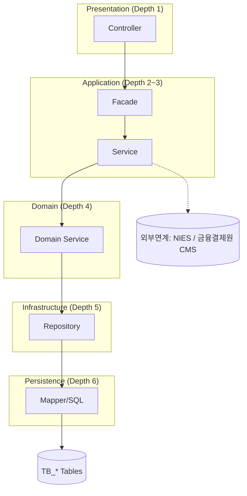

# As-Is 현황분석 _ 어플리케이션 아키텍처 구조도

> 📊 **작성 양식(필수): `AsIs-Application-Architecture_표준양식.xlsx`**
> 이 문서는 형식·구조 설명서이다. **실제 산출물은 반드시 같은 폴더의 엑셀 양식 파일 `AsIs-Application-Architecture_표준양식.xlsx`을 열어 작성한다.**
> 계층/물리배포/이슈 표는 엑셀로, 구조도(Mermaid)는 별도 작도 후 이미지로 첨부한다.
> 아래 표는 채울 항목과 예시를 보여주기 위한 참조이며, 데이터 입력은 엑셀 양식에서 수행한다.

> 참조 산출물: ISP 분석 [14] 현황분석_어플리케이션아키텍처 (PPT/다이어그램)  
> 역공학 호출 구조(Presentation→Persistence)와 외부 연계를 계층 구조도로 표현한다.

## 1. 문서 정보
- 프로젝트명:
- 작성자 / 작성일:
- 검토자 / 승인자:
- 기준 버전:

## 2. 계층형 어플리케이션 아키텍처 (역공학 기반)

## 3. 계층별 구성 요소
| 계층(Layer) | Depth | 구성 요소 | 기술 스택 | 책임 | DB Access |
|---|---|---|---|---|---|
| Presentation | 1 | Controller | Spring MVC | 요청 진입/응답 매핑 | N |
| Application | 2 | Facade | Spring | 트랜잭션 경계/유스케이스 조합 | N |
| Application | 3 | Service | Spring | 도메인 조합/집계 | N |
| Domain | 4 | Domain Service | Spring | 도메인 규칙/오케스트레이션 | N |
| Infrastructure | 5 | Repository | Spring Data JPA | 영속성 추상화 | Y |
| Persistence | 6 | Mapper/SQL | JPA/MyBatis | SQL 실행 | Y |

## 4. 물리 배포 / 외부 연계
| 구분 | 시스템/노드 | 역할 | 연계 방식 | 비고 |
|---|---|---|---|---|
| 기간계 | WAS/배치 | 핵심 업무 처리 | - |  |
| 대외 | NIES | 신분증 진위확인 | HTTP |  |
| 대외 | 금융결제원[CMS] | 자동이체 | SFTP |  |

## 5. As-Is 아키텍처 이슈
| 구분 | 이슈 | 영향도(상/중/하) | 개선 방향 |
|---|---|---|---|
| 구조 | 절차형 소스코드 가능성(Cobol→Java 단순 전환) | 상 | DAO 분리/계층 정비 |
| 성능 |  |  |  |
| 유지보수성 |  |  |  |

> **참고:** 전건이 Cobol to Java 단순 전환된 경우, 객체지향이 아닌 절차형 소스코드일 가능성이 높음. 프로젝트 기간을 고려해 DAO만 분리하는 방안도 검토 필요.

## 6. 완료 체크리스트
- [ ] Presentation~Persistence 계층 구조가 도식화되었는가
- [ ] 계층별 책임/기술/DB Access가 식별되었는가
- [ ] 외부 연계(대외 인터페이스)가 표기되었는가
- [ ] As-Is 구조 이슈 및 TO-BE 개선 방향이 도출되었는가
