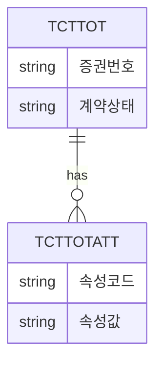

# As-Is 현황분석 _ 테이블 명세 (목록)

> 📊 **작성 양식(필수): `AsIs-Table-Spec_표준양식.xlsx`**
> 이 문서는 형식·구조 설명서이다. **실제 산출물은 반드시 같은 폴더의 엑셀 양식 파일 `AsIs-Table-Spec_표준양식.xlsx`을 열어 작성한다.**
> 테이블 목록은 엑셀로 작성한다.
> 아래 표는 채울 항목과 예시를 보여주기 위한 참조이며, 데이터 입력은 엑셀 양식에서 수행한다.

> 참조 산출물: ISP 분석 [10] 현황분석_테이블명세  
> 주제영역(데이터베이스/업무영역) 단위로 테이블을 식별하고 설명을 기술한다.

## 1. 문서 정보
- 프로젝트명:
- 작성자 / 작성일:
- DBMS / 데이터베이스명:
- 기준 버전:

## 2. 테이블 명세
| 구분(데이터베이스명) | 주제영역 | 테이블 ID | 테이블명 | 개선유형 | 설명 |
|---|---|---|---|---|---|
| KF_0000 | 보험계약 | TCTTOT | 계약 | 유지 | 고객(계약자)과 체결한 보험계약을 관리. 증권번호 단위로 기록. 한 계약에 여러 증권번호가 발생할 경우 각 증권번호 단위로 데이터 기록 |
| KF_0000 | 보험계약 | TCTTOTATT | 계약업무속성 | 변경 | 계약관련 업무에서 사용하는 다양한 속성에 대한 실제 값을 표현하는 Entry |

> **개선유형:** 신규 / 변경 / 유지 / 삭제

## 3. 엔터티 관계(ERD 개요)

## 4. 집계
| 구분 | 마스터 | 트랜잭션 | 코드 | 이력 | 합계 |
|---|---|---|---|---|---|
| 수량 |  |  |  |  |  |

## 5. 완료 체크리스트
- [ ] 주제영역 단위로 테이블이 분류되었는가
- [ ] 테이블 ID/명/설명이 기술되었는가
- [ ] 테이블 상세 명세(컬럼)와 ID가 매핑되는가
- [ ] 모든 테이블에 개선유형이 부여되었는가
